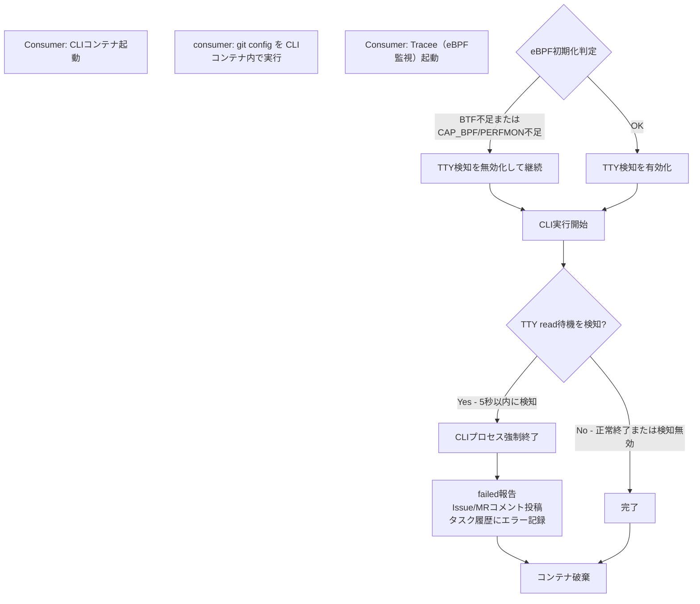
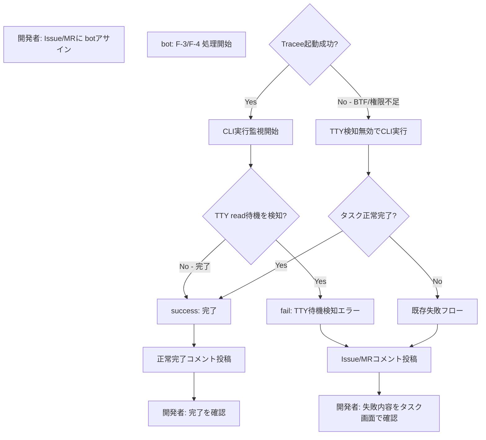
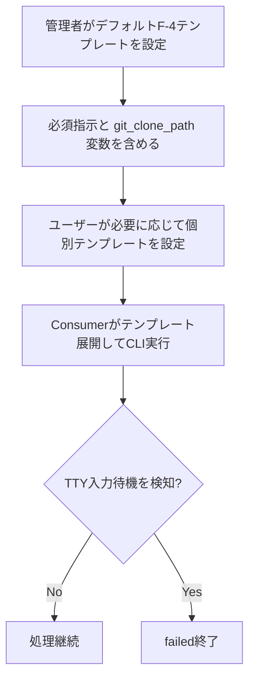
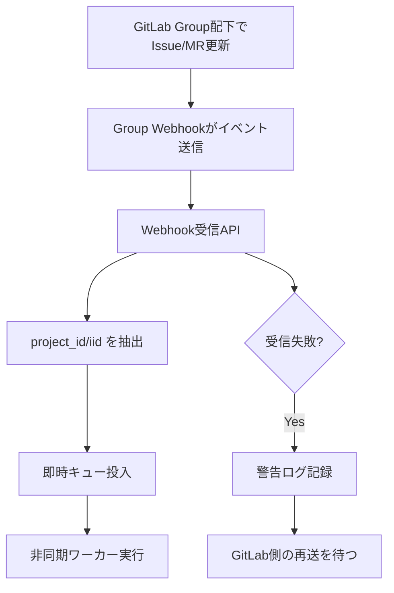
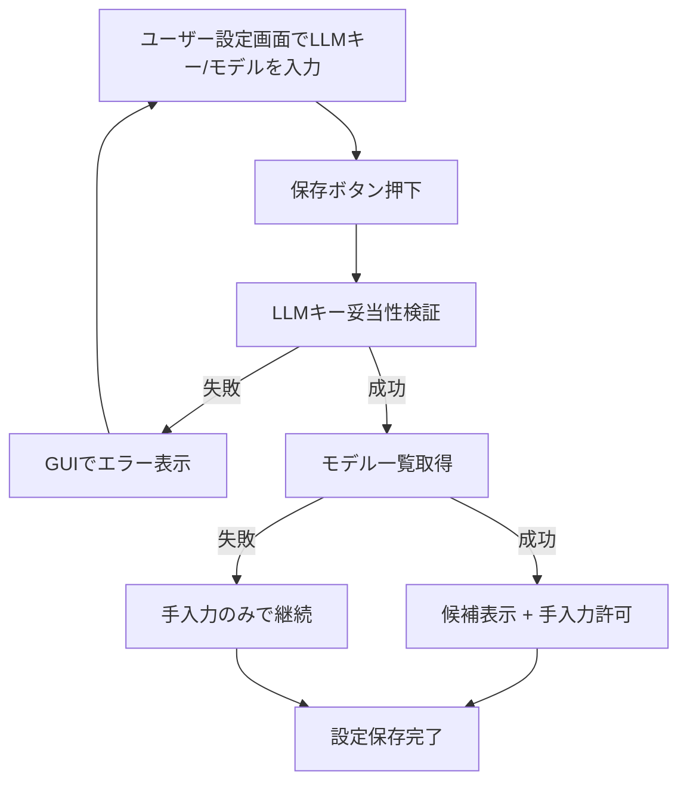

# TTY入力待機検知機能 変更要件定義書

---

## 1. 要件変更1（TTY入力待機検知機能）

> 実装時は `docs/ebpf-dind-investigation.md` を必ず参照し、本章の要件と矛盾がないことを確認してから実装すること。

### 1.0 技術詳細

#### 1.0.1 実装前提

TTY入力待機検知機能は、CLI実行コンテナ内で eBPF を利用できる実行条件を満たすことを前提とする。  
この前提を満たすため、実装時は consumer の実行環境を DinD イメージへ変更し、consumer が DinD 上で CLI 実行コンテナを起動する構成を採用する。

#### 1.0.2 採用する実行構成

| 項目 | 技術方針 |
|---|---|
| consumer 実行環境 | eBPF 利用に必要な前提を満たすため、DinD イメージ上で稼働させる |
| CLI 実行コンテナ起動方式 | consumer が DinD 上で CLI 実行コンテナを起動する |
| TTY入力待機検知の実行位置 | CLI 実行コンテナ内で発生する入力待機を対象に検知する |
| 目的 | CLI 実行コンテナ内で eBPF を利用可能にし、TTY 入力待機状態を即時検知できるようにする |

#### 1.0.3 この構成を採用する理由

- 既存の consumer 実行形態のままでは、CLI 実行コンテナ内で eBPF 利用条件を安定して満たせない
- consumer を DinD 化し、その配下で CLI 実行コンテナを起動することで、TTY入力待機検知機能が前提とする監視実行条件を統一できる
- TTY入力待機検知は CLI 実行時に必ず成立すべき要件であるため、実装時の裁量ではなく構成要件として固定する

#### 1.0.4 実装時の扱い

- consumer のコンテナイメージ変更は、本機能を成立させるための必須前提として扱う
- CLI 実行コンテナは、consumer が DinD 上で起動する方式を前提とする
- eBPF 利用可否、DinD 上での実行条件、必要な制約事項は調査結果に従って設計書へ転記する
- 調査結果と矛盾する実装判断は行わない

> 実装時は `docs/ebpf-dind-investigation.md` を必ず参照し、本章の要件と矛盾がないことを確認してから実装すること。

### 1.1 目的・前提

#### 1.1.1 目的

CLIエージェント（Claude Code CLI、opencode等）が実行時に対話的な入力待機状態に陥る問題を検知し、自動化処理として不適切な状態を即座に検出して処理を中断する機能を実装する。

#### 1.1.2 解決すべき業務課題

- **課題**: CLIエージェントが対話入力を要求する状態に入ると、タスクは無限に待機してタイムアウトまで動作を止める
- **影響**: 以下の問題が発生している
  - タスク完了予時間が延長（最悪: 3時間タイムアウトまで待機）
  - システムリソース（コンテナ）が長時間占有される
  - ユーザーへの失敗報告が遅延する
- **解決方針**: eBPF（拡張バークレーフィルタ）を使用してOSレベルのシステムコール（read(2) on TTY）を監視し、CLIが対話入力待機状態になった時点で即座に検知・終了する

#### 1.1.3 用語集

| 用語 | 説明 |
|---|---|
| eBPF | 拡張バークレーフィルタ。Linuxカーネル内で実行される小規模プログラムで、システムコール・カーネルイベントを効率的に監視可能 |
| Tracee | aquasec社の公開eBPFツール。プロセスのシステムコール実行を監視し、イベント情報をJSON形式で出力 |
| TTY | Teletypeの略。対話式ターミナルの入出力を指す。read(2) on TTY = ユーザー入力待ちの状態 |
| BTF | BPF Type Format。カーネル内のデータ型情報を記述するメタデータ。eBPFプログラムの動作に必須 |
| DinD | Docker-in-Docker。Dockerコンテナ内でDockerデーモンを動作させる方式。本システムのCLI実行環境で採用 |
| CAP_BPF / CAP_PERFMON | Linuxケーパビリティ。eBPFプログラムとパフォーマンス監視を実行するための権限 |
| クリーンアップ処理 | ConsumerがCLIコンテナ起動後、即座に必要な環境設定を行うフェーズ |

#### 1.1.4 既存要件との関係

- 既存の F-3（Issue→MR変換）・F-4（MR処理）の実行フロー内での適用
- 既存の failed 報告フロー（IssueコメントまたはMRコメント投稿）に統合
- 既存のタスク履歴DB保存に統合

---

### 1.2 業務

#### 1.2.1 対象業務

本変更により、以下の業務に新たなコントロール機構が追加される。

| No. | 業務 | 変更内容 |
|---|---|---|
| B-2 | MRコード実装処理 | CLIプロセス実行中にTTY入力待機を検知した場合、即座に処理を中断して failed で報告する |
| B-3（補助） | エラーレポーティング | 入力待機検知によるfailed時の報告内容が拡張される |

#### 1.2.2 業務フロー（変更部分）

#### 1.2.3 業務範囲・担当者

| 担当 | 実施内容 |
|---|---|
| Consumer（バックエンド） | CLIコンテナ起動時のeBPF初期化チェック、利用可能時のみTracee起動・監視、TTY待機検知時の即座中断実行 |
| GitLab（外部） | Issue/MRコメント投稿（失敗報告）、MRブランチ・コミット保存（既存動作） |
| DB（既存） | タスク履歴のエラー情報保存（既存動作） |

#### 1.2.4 業務課題・KPI

| 項目 | 現状 | 目標 |
|---|---|---|
| 対話入力検知時の対応時間 | 最悪3時間（タイムアウト待ち） | eBPF利用可能環境では検知時点で即座に終了（秒単位） |
| タスク失敗の可視性 | ユーザーがMRコメントを確認して初めて把握 | MRコメント + タスク履歴で明確に原因表示 |
| システムリソース占有時間 | 検知対象外のため対話待機コンテナが長時間存続 | eBPF利用可能環境では検知時点でコンテナ破棄 |

#### 1.2.5 解決方針と期待効果

| 課題 | 解決方針 | 期待効果 |
|---|---|---|
| CLIの対話入力待機が放置される | eBPF + Tracee でOSレベルのread(2)イベント監視 | eBPF利用可能環境で秒単位の即座検知・終了 |
| システムリソース長時間占有 | 検知時点で即座にプロセス・コンテナ強制終了 | 不要なコンテナが数分以上占有されない |
| 失敗原因の不明瞭性 | 「対話入力状態検知」の固定メッセージ + TTYイベント詳細を記録 | ユーザーが原因を把握しやすい |
| 本番環境でのeBPF利用可否判断の遅延 | 起動時に即座にBTF/権限チェック（5秒タイムアウト） | 環境不適合時は検知無効化の上で警告記録し、継続可否を早期判断できる |

#### 1.2.6 見込み経営効果

**Soft Saving（人件費削減）**
- TTY入力待機時の監視・対応人力削減: 月間3-5件のタスク失敗時対応が不要になる（1件あたり30分の調査時間削減）

**Cost Avoidance（コスト回避）**
- 不要なコンテナ長時間占有によるクラウドコンピュート費削減: 1コンテナあたり月間3-5時間の不要占有回避

---

### 1.3 機能要件

#### 1.3.1 機能一覧

| No. | 機能名 | 種別 | 関連業務課題 | 説明 |
|---|---|---|---|---|
| F-5.1 | eBPF環境判定 | 新規 | TTY検知環境の確保 | タスク起動時にBTF存在・必要権限の有無を確認し、未充足時はTTY検知を無効化して継続する |
| F-5.2 | Tracee起動・管理 | 新規 | TTY待機状態検知 | DinD内でTraceeを起動し、プロセスイベント監視 |
| F-5.3 | TTY read待機検知 | 新規 | 入力待機即座検知 | read(2)イベントでTTY fd への read 待機を検知 |
| F-5.4 | CLIプロセス強制終了 | 新規 | 待機状態からの脱出 | 検知時点でCLIプロセスをシグナル送信で即座終了 |
| F-5.5 | TTY検知失敗報告 | 新規 | ユーザーへの失敗通知 | Issue/MRコメントに検知・終了を報告 |
| F-5.6 | TTY検知ログ記録 | 新規 | 検知履歴の追跡性 | 通常アプリログ + タスク詳細にイベント・根拠情報を記録 |
| F-5.7 | git config自動設定 | 変更 | git commit/push前の準備 | CLIコンテナ起動直後にgit user.name/emailを設定 |

#### 1.3.2 入力データ

| データ | 出所 | 説明 |
|---|---|---|
| タスク情報（project_id, mr_iid, issue_iid等） | RabbitMQ（既存） | Consumer がタスク取得時に受け取る |
| git config設定値（ユーザー名・メール） | system_settings（既存） | GITLAB_BOT_NAME は既存設定から取得、メールはBOT_NAME + "@localhost" で生成 |
| Traceeイベントストリーム | Tracee標準出力 | DinD内Traceeプロセスから JSON 形式で受信 |
| eBPF環境情報 | /sys/kernel/btf/vmlinux, /proc/self/status | BTF 存在確認、CAP_BPF/PERFMON の有無確認 |

#### 1.3.3 出力データ

| データ | 出先 | 説明 |
|---|---|---|
| TTY検知報告コメント | GitLab Issue/MR | Markdown 形式で「対話入力が必要な状態を検知したため自動処理を停止しました」+ Task ID + Issue/MR番号 |
| error_message | tasks DB テーブル | 「検知種別（tty_read_wait）+ 固定詳細文」 |
| TTY検知ログ | アプリケーションログ | 通常ログレベル (WARNING/ERROR) で記録 |
| cli_log（詳細根拠） | tasks DB テーブル | Tracee JSON イベント + 判定根拠情報を記録 |
| eBPF利用不可警告 | アプリケーションログ | BTF不足または権限不足によりTTY検知を無効化した事実を WARNING で記録 |

#### 1.3.4 外部連携

| 連携先 | インターフェース | 用途 |
|---|---|---|
| GitLab API | POST /projects/:id/issues/:iid/notes | Issue コメント投稿。TTY検知失敗報告は既存のコメント投稿機能を流用する |
| GitLab API | POST /projects/:id/merge_requests/:iid/notes | MR コメント投稿。TTY検知失敗報告は既存のコメント投稿機能を流用する |
| PostgreSQL | UPDATE tasks SET error_message, cli_log | エラー情報記録 |
| Linux カーネル（eBPF） | /sys/kernel/btf/vmlinux、syscall 監視 | eBPF プログラム実行環境 |

#### 1.3.5 CUI 引数仕様・環境変数

eBPF検判定とgit config実行は consumer によって自動実行されるため、ユーザー向けの新規CUI引数は不要。  
ただし、以下の既存環境変数が関連する。

| 環境変数 | 説明 |
|---|---|
| GITLAB_BOT_NAME | git user.name に使用 |
| ENCRYPTION_KEY | Virtual Key 暗号化用（既存） |

git user.email は consumer 内で「`GITLAB_BOT_NAME@localhost`」の形式で自動生成。

#### 1.3.6 機能フロー（ユーザー視点）

#### 1.3.7 機能と画面・ユーザーフローの対応

| 機能 | 画面 | 対応フロー | ユーザー操作 |
|---|---|---|---|
| F-5.5（TTY検知失敗報告） | Issue/MR コメント欄 | Issue または MR を開く | コメント確認のみ（管理者の操作不要） |
| F-5.6（TTY検判ログ） | タスク実行履歴 詳細画面 | /tasks/:task_uuid | 詳細画面でエラー内容を確認 |

#### 1.3.8 ログ要否と内容・保存期間

**ログが必要** であり、以下を記録する。

| ログ種別 | 出力先 | レベル | 内容 | 保存期間 |
|---|---|---|---|---|
| アプリケーション通常ログ | consumer ログ | WARNING | eBPF初期化チェック失敗、Tracee起動失敗、TTY待機検知イベント | 既存ログ運用に従う（30日程度） |
| タスク詳細ログ（error_message） | tasks.error_message | - | 固定詳細文 + 検知種別 + 判定根拠の簡要形 | 無期限（タスク履歴保存期間に従う） |
| タスク詳細ログ（cli_log） | tasks.cli_log | - | Tracee JSON イベント抜粋 + 検知時刻 + プロセス情報 | 無期限（タスク履歴保存期間に従う） |
| eBPF利用不可ログ | consumer ログ | WARNING | BTF不足または権限不足によりTTY検知を無効化して継続した事実 | 既存ログ運用に従う（30日程度） |

#### 1.3.9 監視・アラート

監視・アラートは必要ないため、監視・アラートの内容と対応方法の記述は行わない。

---

### 1.4 データ

#### 1.4.1 業務エンティティ一覧

本変更で新規作成するエンティティはない。既存の以下を利用・更新する。

| エンティティ | CRUD / 一覧 / 詳細 / 検索 / 状態 | 変更内容 |
|---|---|---|
| Task（tasks テーブル） | C / R / R / R / R | error_message にTTY検知エラー文言を保存、cli_log に詳細根拠を追記 |
| ユーザー設定情報 | C / R / U / - / - | ユーザー個別テンプレート上書き運用の対象として利用する |
| システム設定情報 | C / R / U / - / - | デフォルトテンプレートに必須指示と環境情報を反映 |

#### 1.4.2 内部データ / 外部データ

| データ | 種別 | 保持先 | 説明 |
|---|---|---|---|
| Tracee JSON イベント | 内部一時 | Consumer メモリ | TTY read待機イベント検知時のみ取得・保存 |
| eBPF環境判定結果 | 内部一時 | Consumer メモリ | 起動時1回のみチェック、結果をメモリ保持 |
| TTY検知ログ | 内部永続 | tasks.cli_log | タスク履歴に紐付けて保存 |

#### 1.4.3 データ保持期間

| データ | 保持期間 |
|---|---|
| tasks.error_message（TTY検知の場合） | タスク履歴保存期間と同一（無期限） |
| tasks.cli_log（TTY検知の場合） | タスク履歴保存期間と同一（無期限） |
| アプリケーションログ | 既存ログ運用に従う（30日程度） |

#### 1.4.4 外部DB接続先・接続方法

| 接続先 | 接続方式 | 用途 |
|---|---|---|
| GitLab API（既存） | HTTPS REST（PAT認証） | Issue/MRコメント投稿、git config 用ユーザー情報取得 |
| PostgreSQL（既存） | libpq | タスク履歴更新 |
| Linux eBPF インターフェース | ファイルシステム、システムコール | Tracee 実行、BTF 確認 |

#### 1.4.5 DB 必要性

**新規 DB は不要**。既存の tasks テーブルに error_message と cli_log の拡張記録のみ。

---

### 1.5 非機能要件

#### 1.5.1 性能（応答時間）

| 項目 | 要件 |
|---|---|
| eBPF環境判定実行時間 | 5秒以内（超過時はTTY検知を無効化して継続） |
| Tracee起動時間 | 特に要件なし（通常1-2秒程度） |
| TTY待機検知検出時間 | read(2) syscall が実行された時点で即座に検知（遅延なし） |

#### 1.5.2 利用人数（同時接続）

TTY検判定は consumer 側の処理であり、ユーザー向け UI ではないため、同時接続数への影響なし。  
Consumer の処理は非同期タスク単位であり、既存の同時実行制限に従う。

#### 1.5.3 セキュリティ

| 項目 | 要件 |
|---|---|
| eBPF 権限分離 | DinD 内 Tracee は container 内で実行、host 権限は使用しない |
| 検知ログの秘匿性 | TTY読み取り情報は Tracee JSON に含まれるが、CLI出力はマスク（既存 CLILogMasker を使用） |
| eBPF コード検証 | Aquasec 公式イメージ（tracee:latest）を使用。自作 eBPF コードは含まない |

---

### 1.6 テスト用利用シナリオ

#### 1.6.1 テストシナリオ一覧

以下のシナリオを表形式で記述する。

| シナリオ ID | テスト目的 | 前提条件 | テスト手順 | 期待される結果 | 対象 |
|---|---|---|---|---|---|
| TS-5.1 | eBPF環境判定: BTF存在確認 | DinD環境（正常環境） | タスク起動、eBPF初期化チェック実行 | BTF ファイル存在を確認、チェック成功、Tracee起動へ進む | Claude/opencode 両方 |
| TS-5.2 | eBPF環境判定: 権限確認 | DinD環境（正常環境） | タスク起動、CAP_BPF/PERFMON確認 | ケーパビリティ確認成功、Tracee起動へ進む | Claude/opencode 両方 |
| TS-5.3 | eBPF初期化失敗: BTF不足 | DinD環境（BTF 削除・シミュレート） | タスク起動、BTF ファイル存在チェック | BTF 不存在を検知し、TTY検知を無効化して処理継続、Warning ログを記録する | Claude/opencode 両方 |
| TS-5.4 | eBPF初期化失敗: 権限不足 | DinD環境（CAP_BPF 削除・シミュレート） | タスク起動、権限確認 | 必要権限不足を検知し、TTY検知を無効化して処理継続、Warning ログを記録する | Claude/opencode 両方 |
| TS-5.5 | eBPF初期化タイムアウト | DinD環境（判定遅延・シミュレート） | タスク起動、5秒以上判定が進行 | 5秒経過後にTTY検知を無効化して処理継続、Warning ログを記録する | Claude/opencode 両方 |
| TS-5.6 | TTY読み取り待機検知: 正常検知 | DinD環境、CLI実行中にTTY read で待機するスクリプト実行 | タスク起動、CLI が `input()` 等で待機 | Tracee が read(2) TTY イベント検知、CLIプロセス強制終了、Issue/MR コメント投稿（「対話入力が必要な状態を検知...」） | Claude/opencode 両方 |
| TS-5.7 | TTY検知: Task ID・MR/Issue番号併記 | 正常な TTY検知シナリオ | TTY検知報告メッセージ確認 | コメント内に Task ID と MR/Issue番号が併記されている | Claude/opencode 両方 |
| TS-5.8 | TTY検知ログ記録 | 正常な TTY検知シナリオ | タスク完了後、tasks.error_message と tasks.cli_log 確認 | error_message に検知種別（tty_read_wait）+ 詳細文、cli_log に Tracee イベント詳細と判定根拠が記録されている | Claude/opencode 両方 |
| TS-5.9 | git config自動設定 | DinD環境、任意のタスク実行 | CLIコンテナ起動直後にgit config確認 | `git config user.name` = GITLAB_BOT_NAME、`git config user.email` = "GITLAB_BOT_NAME@localhost" | Claude/opencode 両方 |
| TS-5.10 | git config設定失敗時 | DinD環境（git config実行不可・シミュレート） | CLIコンテナ起動、git config 失敗 | 既存エラー報告フロー（Issue/MRコメント投稿）で通知 | Claude/opencode 両方 |

#### 1.6.2 テストカバレッジ

| カテゴリ | カバレッジ |
|---|---|
| TTY入力待機検知機能 | 正常系・異常系・タイムアウト・ログ記録・通知確認を網羅 |
| プロンプトテンプレート要件変更 | クローンパス展開、問い合わせ禁止指示、個別上書き運用、TTY待機時方針を網羅 |
| 全体網羅性 | 要件変更1で追加・変更した要件に対して対応シナリオを配置済み |

---

### 1.7 要件網羅性チェック

#### 1.7.1 業務エンティティ完全列挙

本変更で扱う業務エンティティを以下に列挙する。

| エンティティ | 主な役割 | 変更内容 |
|---|---|---|
| Task | 処理結果・失敗理由・実行ログの保持 | TTY検知結果の記録と失敗根拠の保存を実施 |
| ユーザー設定情報 | ユーザー個別テンプレート設定の保持 | 個別テンプレート上書き運用を適用 |
| システム設定情報 | デフォルトテンプレート・運用ルールの保持 | 問い合わせ禁止指示、開発環境情報記載方針を適用 |

#### 1.7.2 機能カテゴリ網羅

| カテゴリ | 機能 | 説明 |
|---|---|---|
| 業務機能 | TTY入力待機検知、CLIプロセス強制終了、git config自動設定 | 実行継続可否判定とCLI実行前提の整備を行う |
| マスタ管理 | プロンプトテンプレート管理 | 設定変更で運用方針を反映する |
| 共通（認証・認可・ログ） | エラー通知、実行ログ記録 | 失敗時の追跡可能性を担保する |
| 運用 | eBPF環境判定、Tracee起動・管理 | TTY待機検知を成立させる実行条件を確保する |
| 外部連携 | GitLab API、PostgreSQL、Linux eBPF インターフェース | コメント投稿、履歴保存、eBPF実行環境を満たす |

#### 1.7.3 CRUD / 一覧 / 詳細 / 検索 / 状態 マトリックス

本変更で対象となる管理項目を含めてマトリックス化する。

| エンティティ | C | R | U | D | 一覧 | 詳細 | 検索 | 状態遷移 |
|---|---|---|---|---|---|---|---|---|
| Task | ○ | ○ | ○ | ○ | ○ | ○ | ○ | pending / processing / completed / failed |
| ユーザー設定情報 | ○ | ○ | ○ | - | - | ○ | - | 個別テンプレート未設定 / 個別テンプレート設定済み |
| システム設定情報 | ○ | ○ | ○ | - | ○ | ○ | ○ | デフォルトテンプレート未設定 / 設定済み |

#### 1.7.4 エンティティ状態遷移

| エンティティ | 状態遷移 |
|---|---|
| Task | pending → processing → completed / failed |
| ユーザー設定情報 | 個別テンプレート未設定 → 個別テンプレート設定済み → 更新 |
| システム設定情報 | デフォルトテンプレート未設定 → 設定済み → 更新 |

#### 1.7.5 機能と画面・ユーザーフロー対応検証

| 機能 | 画面 | フロー対応 | 検証 |
|---|---|---|---|
| TTY入力待機検知・終了 | タスク実行履歴 詳細、Issue/MRコメント欄 | 実行中に待機検知した場合に failed へ遷移 | ✅ 対応 |
| プロンプトテンプレート運用 | システム設定画面、ユーザー設定画面 | 必須指示を含むテンプレート適用 | ✅ 対応 |
| git config自動設定 | なし（バックエンド処理） | CLIコンテナ起動直後に設定を適用 | ✅ 対応 |
| 実行ログ・エラー通知 | タスク実行履歴 詳細、Issue/MRコメント欄 | 失敗理由と根拠の可視化 | ✅ 対応 |

#### 1.7.6 削除可能な要件

本変更では以下を検討した結果、削除対象なし。

- TTY入力待機検知・終了: 自動化停止要因の即時解消に必須
- eBPF環境判定・Tracee起動管理: 検知機能を成立させる前提に必須
- git config自動設定: CLI実行後のコミット・プッシュを成立させる前提に必須
- プロンプトテンプレート必須指示: 問い合わせ禁止運用の徹底に必須

#### 1.7.7 MVPの最小必要要件確認

以下が MVP に必須で、これ以上削減不可と判断する。

| 要件 | 理由 |
|---|---|
| TTY入力待機検知・終了 | 自動化処理のハングを防ぐ中核要件 |
| eBPF環境判定・Tracee起動管理 | TTY待機検知を実行する前提条件を満たすため |
| git config自動設定 | 既存のコミット・プッシュ処理を成立させるため |
| プロンプトテンプレート必須指示 | 問い合わせ禁止運用を一貫適用する |

### 1.8 プロンプトテンプレート要件変更

#### 1.8.1 対象範囲

- 本セクションでは A（プロンプトテンプレート関連）の変更要件を定義する
- 対象は F-4 プロンプトを中心とした、CLI実行前提情報と運用指示の明確化である

#### 1.8.2 要件一覧

| 要件ID | 要件名 | 追加/変更/削除 | 必須/任意 | 内容 |
|---|---|---|---|---|
| A-1 | git cloneパス明示 | 変更 | 必須 | F-4プロンプトで `{git_clone_path}` を使用し、作業ディレクトリを明示する |
| A-2 | TTY待機時ポリシー明示 | 変更 | 必須 | TTY入力待機を検知した場合は自動応答せず failed として中断する方針を明記する |
| A-3 | ユーザー問い合わせ禁止指示 | 追加 | 必須 | 「ユーザーに問い合わせない」指示文を固定文としてプロンプトに含める |
| A-4 | ユーザー個別上書き運用 | 変更 | 必須 | ユーザー個別テンプレート上書きを許可しつつ、必須指示を含める運用ルールを定義する |

#### 1.8.3 業務ルール

1. F-4プロンプトにはクローン先パス（`{git_clone_path}`）を必ず含める
2. 開発環境情報（例: docker compose 利用可能）はデフォルトプロンプト本文に明記する
3. 入力待機時は「自動入力して継続」ではなく「検知して失敗終了」を採用する
4. ユーザー個別テンプレートを使用する場合も、問い合わせ禁止などの必須指示を含める

#### 1.8.4 テンプレート記載例

本要件で追加・変更するテンプレートの具体例は、以下の記載内容を含むものとする。

| 対象 | 記載例 |
|---|---|
| F-3用テンプレート | 「Issue本文とコメントをもとに、作業ブランチ名とDraft MRタイトルを生成すること」「ユーザーに追加確認を行わないこと」「必要な情報が不足する場合は推測で補完せず、既存情報の範囲で生成すること」 |
| F-3用テンプレート | 「作業結果は Issue から MR 作成につながる最小限の内容に限定すること」「CLI実行環境が DinD 上で動作していることを前提に処理すること」 |
| F-4用テンプレート | 「作業ディレクトリは `{git_clone_path}` とすること」「MR本文、関連Issue、既存コメントを参照して変更方針を決定すること」「ユーザーに問い合わせないこと」 |
| F-4用テンプレート | 「TTY入力待機が必要な状況になった場合は自動応答せず failed として終了すること」「開発環境情報として docker compose 利用可能である前提を明記すること」 |

上記はあくまで要件として含めるべき記載例であり、実際のテンプレート文面は管理者設定時に日本語で具体化する。

#### 1.8.5 ユーザーフロー

#### 1.8.6 テストシナリオ

| シナリオID | テスト目的 | 前提条件 | 手順 | 期待結果 |
|---|---|---|---|---|
| TS-A-1 | git_clone_path 展開確認 | F-4処理タスクが存在 | プロンプト生成結果を確認 | `{git_clone_path}` が実パスで展開される |
| TS-A-2 | 問い合わせ禁止指示の反映確認 | デフォルトF-4テンプレート設定済み | 生成プロンプト本文を確認 | 固定の問い合わせ禁止指示が含まれる |
| TS-A-3 | ユーザー個別上書き運用確認 | ユーザー個別テンプレート設定済み | F-4実行前プロンプトを確認 | 必須指示を含む運用ルールに従っている |
| TS-A-4 | TTY待機時の失敗終了確認 | TTY待機を発生させるタスク | 実行して待機検知を発火 | 自動応答せず failed で終了する |
| TS-A-5 | F-3用テンプレート記載例反映確認 | デフォルトF-3テンプレート設定済み | テンプレート本文を確認 | Issue起点のブランチ名・Draft MRタイトル生成、問い合わせ禁止の記載例が含まれる |
| TS-A-6 | F-4用テンプレート記載例反映確認 | デフォルトF-4テンプレート設定済み | テンプレート本文を確認 | `{git_clone_path}`、問い合わせ禁止、TTY待機時 failed の記載例が含まれる |

---

## 2. 要件変更2（Webhook運用要件（GitLab CE））

### 2.0 技術詳細

#### 2.0.1 事前調査で確認した事実

- GitLab の Group Webhook は、グループ配下・サブグループ配下プロジェクトのイベントを集約して受信できる
- Issue / MR イベントは Project Webhook と Group Webhook の共通イベントとして扱える
- Group Webhook API は作成・更新・削除・イベント再送・テスト実行を提供する
- Group Hook イベント履歴には `Idempotency-Key` が含まれ、受信側の冪等処理キーに利用できる
- System Hook は管理者権限が前提で、MRイベントは対象にできるが Issue イベント中心の運用には単独で不足しやすい

#### 2.0.2 現行運用との差分

- 現行は Project Webhook 前提で、プロジェクト単位の設定に依存している
- この構成ではプロジェクト増減時に設定漏れリスクが発生しやすい
- 本変更は「Webhook起点をプロジェクト固定からグループ単位へ変更すること」を主目的とする

#### 2.0.3 本変更で採用する構成

- 受信起点は Group Webhook を標準とする
- 受信イベントから `project_id` と `iid` を取得し、対象 Issue/MR を特定する
- 受信処理は即時応答し、後続処理は **RabbitMQ（tasksキュー）** 経由で非同期実行する
- 非同期実行は Consumer プロセス側で実施し、Webhook受信API内で重い処理を別スレッド実行しない
- 受信失敗時は GitLab 側の再送機能を利用し、本システム側でWebhook再送制御を追加しない

#### 2.0.4 運用上の注意

- Group Webhook の作成・更新・削除を行うため、botユーザーは対象グループの **Owner権限** を持つことを前提とする
- Hook URL 変更時のトークン再設定漏れを防ぐ運用ルールが必要である
- 受信側は `Idempotency-Key` を利用して重複受信に備える

### 2.1 目的・前提

#### 2.1.1 目的

GitLab CE の Webhook 起点を「プロジェクト固定」から「グループフック」へ変更し、グループ配下プロジェクトの Issue / MR イベントを単一運用で受信できる状態にする。

#### 2.1.2 解決すべき業務課題

- プロジェクトごとにWebhook設定が必要なため、設定漏れ・更新漏れが発生しやすい
- 新規プロジェクト追加や移管のたびにWebhook設定作業が必要で、運用負荷が高い
- プロジェクト固定Webhookのままでは「グループ単位で bot アサインされた Issue/MR を処理する」という運用要件に一致しない

#### 2.1.3 用語集

| 用語 | 説明 |
|---|---|
| Group Webhook | GitLab グループ単位で設定するイベント通知機能 |
| Project Webhook | GitLab プロジェクト単位で設定するイベント通知機能 |
| 即時キュー投入 | Webhook受信後、重い処理を行わずに処理要求を内部キューへ渡すこと |
| 非同期ワーカー | キュー投入後の本処理を担当するバックグラウンド処理 |
| Idempotency-Key | Webhookイベントの重複判定に利用する識別キー |

#### 2.1.4 CUI / GUI 前提

本要件はバックグラウンド処理を対象とする CUI 要件であり、GUI への変更は行わない。

#### 2.1.5 前提

- 運用環境は **GitLab CE（Community Edition）** とする
- botユーザーは Group Webhook 運用対象グループに対して **Owner権限** を持つものとする
- 本変更の主目的は、Webhook起点を Project Webhook から Group Webhook に変更すること
- 受信後の即時キュー投入・非同期処理分離は既存方針を維持する
- ポーリング要件の詳細変更は本変更の主対象外だが、Webhook側のプロジェクト固定依存は解消対象とする

### 2.2 業務

#### 2.2.1 対象業務

本変更により、以下の業務の運用ルールを明確化する。

| No. | 業務 | 変更内容 |
|---|---|---|
| B-1（補助） | Issue / MR 検出起点処理 | 受信起点を Project Webhook から Group Webhook に変更する |
| B-2（補助） | Webhook設定運用 | プロジェクトごとの個別設定を廃止し、グループ単位で一元運用する |
| B-3（補助） | 運用監視・障害切り分け | 受信失敗は欠陥扱いにせず、警告ログとGitLab再送で追跡する |

#### 2.2.2 業務フロー

#### 2.2.3 業務範囲・担当者

| 担当 | 実施内容 |
|---|---|
| GitLab | Group Webhook の送信、再送機能の提供 |
| Webhook受信API | 受信内容の検証、即時応答、キュー投入 |
| 非同期ワーカー | キュー投入後の本処理を実行 |
| 運用担当 | グループ単位Webhook設定維持、Warningログ追跡、再送確認を行う |

#### 2.2.4 業務課題・KPI

| 項目 | 現状 | 目標 |
|---|---|---|
| Webhook設定作業量 | プロジェクト単位で増加する | グループ単位で一元化する |
| Webhook設定漏れ率 | プロジェクト追加時に発生しうる | グループフック運用で低減する |
| Webhook受信遅延 | 受信処理負荷で遅延しうる | 受信APIは短時間で 2xx を返却する |

#### 2.2.5 解決方針と期待効果

| 課題 | 解決方針 | 期待効果 |
|---|---|---|
| 設定漏れ・運用負荷 | Group Webhook へ移行し、Webhook設定をグループ単位に統一する | プロジェクト増減時の設定漏れを抑制する |
| 受信遅延 | 受信処理と本処理を分離し、受信後は即時キュー投入する | タイムアウトを避けやすくなる |
| 再送と重複対応 | GitLab再送を利用し、Idempotency-Keyで重複受信に備える | 再送時の二重処理リスクを低減する |

#### 2.2.6 見込み経営効果

**Soft Saving（人件費削減）**
- プロジェクト単位Webhook管理作業を削減し、運用作業工数を抑制する

**Cost Avoidance（コスト回避）**
- 設定漏れ起因の障害対応、手戻り設定、再実行の運用コストを抑制する

### 2.3 機能要件

#### 2.3.1 機能一覧

| 要件ID | 要件名 | 追加/変更/削除 | 必須/任意 | 内容 |
|---|---|---|---|---|
| WB-1 | Group Webhook受信へ変更 | 変更 | 必須 | 受信起点を Project Webhook から Group Webhook へ変更する |
| WB-2 | 非同期処理分離 | 変更 | 必須 | 受信時は即時 2xx 応答し、重い処理は非同期ワーカーに委譲する |
| WB-3 | 重複受信対応 | 追加 | 必須 | `Idempotency-Key` を利用し、同一イベント重複受信に備える |
| WB-4 | 受信失敗時の運用方針 | 追加 | 必須 | 受信失敗は警告ログ記録とし、再送はGitLab側に委ねる |
| WB-5 | 既存Project Webhook依存の廃止 | 削除 | 必須 | プロジェクト固定Webhook運用を廃止する |

#### 2.3.2 入力データ

| データ | 出所 | 説明 |
|---|---|---|
| Webhookペイロード | GitLab Group Webhook | Issue / MR イベント情報 |
| Webhookヘッダー情報 | GitLab Group Webhook | 受信検証と重複判定に必要なヘッダー情報 |
| Webhookシークレット | システム設定 | GitLab からの正当な通知かを判定するための設定値 |

#### 2.3.3 出力データ

| データ | 出先 | 説明 |
|---|---|---|
| キュー投入要求 | 内部キュー | Webhook受信イベントを後続処理へ引き渡す |
| 重複判定結果 | 受信処理内部 | 同一 `Idempotency-Key` の重複受信制御に利用する |
| Warningログ | アプリケーションログ | Webhook受信失敗時の追跡情報 |
| HTTP応答 | GitLab | 受信APIの受付結果 |

#### 2.3.4 外部連携

| 連携先 | インターフェース | 用途 |
|---|---|---|
| GitLab Group Webhook | HTTPS POST | グループ配下プロジェクトの Issue / MR イベント受信 |
| 内部キュー | メッセージ投入 | 後続の非同期処理へ引き渡す |

#### 2.3.5 CUI 引数仕様・環境変数

Webhook受信はバックグラウンド処理であり、ユーザー向けの新規CUI引数は不要。  
関連する既存設定は以下とする。

| 環境変数 | 説明 |
|---|---|
| GITLAB_WEBHOOK_SECRET | Webhook受信の検証に使用する |

#### 2.3.6 機能フロー（ユーザー視点）

1. WB-1 Group Webhook受信へ変更
- 受信イベントは少なくとも Issue/MR に関するイベントを対象とする
- 受信payloadの `project_id` と `iid` をキーに処理対象を特定する

2. WB-2 非同期処理分離
- Webhook受信ハンドラでは重い外部通信・LLM処理を行わない
- 受信後は即時にキューへ投入し、ワーカーで本処理を実行する

3. WB-3 重複受信対応
- 受信ヘッダーの `Idempotency-Key` を利用して重複受信判定を行う
- 重複イベントは再処理せず、既存処理結果を優先する

4. WB-4 受信失敗時の運用方針
- Webhook受信失敗時の再送はGitLab Webhook再送機能に委ねる
- 本システム側でWebhook受信再試行処理は追加しない

5. WB-5 既存Project Webhook依存の廃止
- プロジェクト単位でのWebhook作成・更新を本要件の運用対象から除外する
- Group Webhook のみを正式運用対象とする

#### 2.3.7 機能と画面・ユーザーフローの対応

| 機能 | 画面 | 対応フロー | ユーザー操作 |
|---|---|---|---|
| WB-1 Group Webhook受信へ変更 | なし（バックエンド処理） | GitLabイベント受信からキュー投入まで | ユーザー操作なし |
| WB-2 非同期処理分離 | なし（バックエンド処理） | 受信と本処理の分離 | ユーザー操作なし |
| WB-3 重複受信対応 | なし（バックエンド処理） | 重複受信時の再処理抑止 | ユーザー操作なし |
| WB-4 受信失敗時の運用方針 | なし（バックエンド処理） | 受信失敗時の Warning 記録 | ユーザー操作なし |

#### 2.3.8 ログ要否と内容・保存期間

**ログが必要** であり、以下を記録する。

| ログ種別 | 出力先 | レベル | 内容 | 保存期間 |
|---|---|---|---|---|
| Webhook受信失敗ログ | アプリケーションログ | WARNING | 受信失敗時刻、対象種別、失敗理由 | 既存ログ運用に従う |
| Webhook重複受信ログ | アプリケーションログ | INFO | 重複判定キー、再処理抑止結果 | 既存ログ運用に従う |
| 受信API動作ログ | アプリケーションログ | INFO | 受信受付、キュー投入結果 | 既存ログ運用に従う |

#### 2.3.9 監視・アラート

監視・アラートは必要ないため、監視・アラートの内容と対応方法の記述は行わない。

### 2.4 データ

#### 2.4.1 業務エンティティ一覧

本変更で新規作成する永続エンティティはない。既存の以下を利用する。

| エンティティ | CRUD / 一覧 / 詳細 / 検索 / 状態 | 変更内容 |
|---|---|---|
| Task（tasks テーブル） | C / R / R / R / R | Group Webhook受信を起点とする後続処理の作成対象として利用する |
| システム設定情報 | C / R / U / - / - | Webhookシークレット設定値を利用する |

#### 2.4.2 内部データ / 外部データ

| データ | 種別 | 保持先 | 説明 |
|---|---|---|---|
| Webhookペイロード | 外部一時 | Webhook受信API メモリ | 受信時のみ保持し、処理判定に使用する |
| Idempotency-Key | 外部一時 | Webhook受信API メモリ | 重複受信判定に使用する |
| キュー投入要求 | 内部一時 | 内部キュー | 後続ワーカーへ引き渡す処理要求 |
| Webhook受信失敗ログ | 内部永続 | アプリケーションログ | Warning として追跡する |

#### 2.4.3 データ保持期間

| データ | 保持期間 |
|---|---|
| Webhook受信失敗ログ | 既存ログ運用に従う |
| Idempotency-Key | 重複判定処理が完了するまで |
| キュー投入要求 | 後続処理へ引き渡されるまで |

#### 2.4.4 外部DB接続先・接続方法

| 接続先 | 接続方式 | 用途 |
|---|---|---|
| PostgreSQL（既存） | libpq | 後続タスク作成後の履歴管理に利用 |

#### 2.4.5 DB 必要性

**新規 DB は不要**。既存の Task 管理とシステム設定を利用する。

### 2.5 非機能要件

| 区分 | 要件 |
|---|---|
| 性能 | 受信エンドポイントは短時間で 2xx を返却し、タイムアウトを避けること |
| 利用人数 | Webhook受信はバックグラウンド処理であり、GUIの同時接続要件は発生しないこと |
| セキュリティ | Webhookシークレットを用いた受信検証を前提とすること |
| 可観測性 | Webhook受信失敗および重複受信をログで追跡可能であること |
| 信頼性 | 再送はGitLab Webhook再送に委ねる運用であること |

### 2.6 テスト用利用シナリオ

#### 2.6.1 テストシナリオ一覧

| シナリオID | テスト目的 | 前提条件 | 手順 | 期待結果 |
|---|---|---|---|---|
| TS-WB-1 | Group Webhook受信確認 | Group Webhook 設定済み | グループ配下プロジェクトのIssue更新を発生 | 受信APIがイベントを受信し、対象が特定される |
| TS-WB-2 | 複数プロジェクト一元受信確認 | グループ配下に複数プロジェクト存在 | 複数プロジェクトでIssue/MR更新を発生 | 単一の Group Webhook で全イベントを受信できる |
| TS-WB-3 | 非同期処理分離確認 | 通常イベント送信可能 | 受信APIへイベント送信し応答時間を測定 | 受信APIは短時間で2xxを返却する |
| TS-WB-4 | 重複受信抑止確認 | 同一イベント再送を再現可能 | 同じ `Idempotency-Key` のイベントを複数回送信 | 重複イベントが再処理されない |
| TS-WB-5 | 受信失敗時の記録確認 | 受信失敗を再現可能 | 受信API失敗ケースを発生させる | 警告ログを記録し、GitLab再送に委ねる |

#### 2.6.2 テストカバレッジ

| カテゴリ | カバレッジ |
|---|---|
| Group Webhook運用要件 | グループ単位受信、一元運用、非同期分離、重複受信抑止、受信失敗時運用を網羅 |

### 2.7 要件網羅性チェック

#### 2.7.1 業務エンティティ完全列挙

| エンティティ | 主な役割 | 変更内容 |
|---|---|---|
| Task | 後続処理要求の保持 | Group Webhook受信を起点とする処理作成対象として利用 |
| システム設定情報 | Webhook受信設定の保持 | Webhookシークレット参照に利用 |

#### 2.7.2 機能カテゴリ網羅

| カテゴリ | 機能 | 説明 |
|---|---|---|
| 業務機能 | Group Webhook受信、非同期処理分離、重複受信対応 | 受信と後続処理開始を制御する |
| マスタ管理 | システム設定参照 | Webhookシークレットを運用設定として利用する |
| 共通（認証・認可・ログ） | Warning/Infoログ記録 | 受信失敗と重複受信の追跡可能性を担保する |
| 運用 | 再送責務の分担 | GitLab再送に委ねる責務境界を明確化する |
| 外部連携 | GitLab Group Webhook | グループ配下プロジェクトの Issue / MR イベントを受信する |

#### 2.7.3 CRUD / 一覧 / 詳細 / 検索 / 状態 マトリックス

| エンティティ | C | R | U | D | 一覧 | 詳細 | 検索 | 状態遷移 |
|---|---|---|---|---|---|---|---|---|
| Task | ○ | ○ | ○ | ○ | ○ | ○ | ○ | pending / processing / completed / failed |
| システム設定情報 | ○ | ○ | ○ | - | ○ | ○ | ○ | 有効 / 無効 |

#### 2.7.4 エンティティ状態遷移

| エンティティ | 状態遷移 |
|---|---|
| Task | pending → processing → completed / failed |
| システム設定情報 | 有効 ↔ 無効 |

#### 2.7.5 機能と画面・ユーザーフロー対応検証

| 機能 | 画面 | フロー対応 | 検証 |
|---|---|---|---|
| Group Webhook受信へ変更 | なし（バックエンド処理） | GitLabイベント受信からキュー投入まで | ✅ 対応 |
| 非同期処理分離 | なし（バックエンド処理） | 受信と本処理を分離する | ✅ 対応 |
| 重複受信対応 | なし（バックエンド処理） | 同一イベント再処理を抑止する | ✅ 対応 |
| 受信失敗時の運用方針 | なし（バックエンド処理） | Warningログ記録で追跡する | ✅ 対応 |

#### 2.7.6 削除可能な要件

本変更で定義した要件のうち削除可能なものはない。
なお、WB-5 は既存の Project Webhook 依存を廃止する要件であり、新規に定義した要件の削除を意味しない。

- Group Webhook受信へ変更: プロジェクト固定依存を解消するために必須
- 非同期処理分離: 受信応答遅延を避けるために必須
- 重複受信対応: 再送時の二重処理回避に必須
- 受信失敗時の運用方針: 欠陥扱いを避ける運用統一に必須
- 再送責務の分担: GitLab側責務を明確にするために必須

#### 2.7.7 MVPの最小必要要件確認

| 要件 | 理由 |
|---|---|
| Group Webhook受信へ変更 | プロジェクト固定依存を解消するために必要 |
| 非同期処理分離 | 受信APIを短時間応答に保つために必要 |
| 重複受信対応 | 再送時の二重処理回避に必要 |
| 受信失敗時の運用方針 | 運用判断を統一するために必要 |
| 再送責務の分担 | 本システム側の責務を限定するために必要 |

---

## 3. 要件変更3（LLMキー・モデル設定）

### 3.1 目的・前提

#### 3.1.1 目的

ユーザー設定画面で保存する LLM キーとモデル設定について、保存時の妥当性確認と入力継続性を両立し、無効な設定保存と運用停止を防ぐ。

#### 3.1.2 解決すべき業務課題

- 無効な LLM キーが保存されると、後続の CLI 実行時に初めて失敗が発生し、原因切り分けが遅れる
- モデル一覧取得の成否に操作可否が左右されると、設定作業が途中で止まる
- GUI 上の設定エラーがバックエンド実行失敗と混同されると、利用者と運用担当の認識がずれる

#### 3.1.3 用語集

| 用語 | 説明 |
|---|---|
| LLMキー | LiteLLM Virtual Key を含む、LLM利用時の認証キー |
| モデル候補 | 設定画面上で選択補助として表示する利用可能モデル一覧 |
| 手入力許可 | 候補一覧にないモデル名でも直接入力して保存できること |

#### 3.1.4 CUI / GUI 前提

本要件はユーザー設定画面を対象とする GUI 要件であり、CUI への変更は行わない。

### 3.2 業務

#### 3.2.1 対象業務

本変更により、以下の業務が変更される。

| No. | 業務 | 変更内容 |
|---|---|---|
| B-3 | ユーザー・Virtual Key管理 | 保存時に LLM キーの妥当性を検証し、モデル候補表示と手入力継続を可能にする |

#### 3.2.2 業務フロー

#### 3.2.3 業務範囲・担当者

| 担当 | 実施内容 |
|---|---|
| ユーザー | LLMキーとモデル設定を入力・保存する |
| Web管理画面 | 入力値の表示、エラー通知、候補表示を行う |
| バックエンド | 保存時のキー妥当性検証とモデル候補取得を行う |

#### 3.2.4 業務課題・KPI

| 項目 | 現状 | 目標 |
|---|---|---|
| 無効キー保存の発見タイミング | 実行時まで遅延しうる | 保存時に即時検出する |
| モデル候補取得失敗時の継続性 | 操作継続可否が不明確 | 手入力で保存を継続可能にする |
| エラー認識の一貫性 | GUIエラーと実行失敗が混同される可能性 | GUIエラーとして明確に通知する |

#### 3.2.5 解決方針と期待効果

| 課題 | 解決方針 | 期待効果 |
|---|---|---|
| 無効キーが保存される | 保存操作にキー妥当性検証を必須化する | 実行前に設定不備を解消できる |
| モデル候補取得の失敗で操作が止まる | 候補表示と手入力許可を分離し、失敗時も継続可能にする | 設定作業の停止を避けられる |
| GUIエラーと実行失敗が混同される | 保存時エラーは GUI 上で完結させる | 運用上の切り分けが容易になる |

#### 3.2.6 見込み経営効果

**Soft Saving（人件費削減）**
- 無効な設定に起因する実行失敗の事後調査を減らし、運用問い合わせ対応を削減する

**Cost Avoidance（コスト回避）**
- 誤った LLM キーやモデル設定による再実行・調査コストを抑制する

### 3.3 機能要件

#### 3.3.1 要件一覧

| 要件ID | 要件名 | 追加/変更/削除 | 必須/任意 | 内容 |
|---|---|---|---|---|
| C-1 | LLMキー保存時バリデーション | 追加 | 必須 | GUIのユーザー設定画面で保存操作時にキー妥当性を検証する |
| C-2 | エラー通知方式 | 変更 | 必須 | バリデーション失敗はGUI上で通知し、バックエンドの実行失敗として扱わない |
| C-3 | モデル候補表示 | 追加 | 必須 | モデル一覧を取得して候補として表示する |
| C-4 | モデル手入力許可 | 追加 | 必須 | モデル一覧取得の成功/失敗に関係なく、モデル名の手入力を許可する |

#### 3.3.2 入力データ

| データ | 出所 | 説明 |
|---|---|---|
| LLMキー入力値 | ユーザー設定画面 | 保存対象の認証キー |
| モデル入力値 | ユーザー設定画面 | 保存対象のモデル名 |
| モデル候補一覧 | モデル一覧取得API | 候補表示用の一覧 |

#### 3.3.3 出力データ

| データ | 出先 | 説明 |
|---|---|---|
| キー検証結果 | ユーザー設定画面 | 保存可否とエラー内容を通知する |
| モデル候補一覧 | ユーザー設定画面 | 選択補助として表示する |
| 保存済み設定 | ユーザー設定情報 | LLMキーとモデル設定として保持する |

#### 3.3.4 外部連携

| 連携先 | インターフェース | 用途 |
|---|---|---|
| LiteLLM Proxy 等の認証先 | HTTP | LLMキー妥当性確認 |
| モデル一覧取得先 | HTTP | モデル候補一覧の取得 |

#### 3.3.5 GUI 画面仕様

対象画面は既存のユーザー設定画面とし、保存時にキー検証結果とモデル候補を表示する。画面追加は行わない。

#### 3.3.6 業務ルール

1. キー検証は「ユーザー設定の保存操作」に紐づけて実行する
2. キー検証失敗時は、GUIでユーザーが修正可能な形式でエラーを表示する
3. モデル選択UIは候補一覧を提示するが、候補外値の入力を禁止しない
4. モデル一覧取得失敗時でも設定操作を継続可能とする

#### 3.3.7 機能と画面・ユーザーフローの対応

| 機能 | 画面 | 対応フロー | ユーザー操作 |
|---|---|---|---|
| C-1 LLMキー保存時バリデーション | ユーザー設定画面 | 保存時に妥当性検証を実施 | キー入力後に保存 |
| C-2 エラー通知方式 | ユーザー設定画面 | 失敗時に画面内でエラー表示 | エラー内容を確認して再入力 |
| C-3 モデル候補表示 | ユーザー設定画面 | 検証成功後に候補を表示 | 候補から選択または確認 |
| C-4 モデル手入力許可 | ユーザー設定画面 | 候補取得失敗時も保存を継続 | モデル名を直接入力 |

#### 3.3.8 ログ要否と内容・保存期間

**ログが必要** であり、以下を記録する。

| ログ種別 | 出力先 | レベル | 内容 | 保存期間 |
|---|---|---|---|---|
| キー検証失敗ログ | アプリケーションログ | WARNING | 検証失敗時刻、失敗理由 | 既存ログ運用に従う |
| モデル候補取得失敗ログ | アプリケーションログ | WARNING | 候補取得失敗理由 | 既存ログ運用に従う |

#### 3.3.9 監視・アラート

監視・アラートは必要ないため、監視・アラートの内容と対応方法の記述は行わない。

### 3.4 データ

#### 3.4.1 業務エンティティ一覧

本変更で新規作成するエンティティはない。既存の以下を利用・更新する。

| エンティティ | CRUD / 一覧 / 詳細 / 検索 / 状態 | 変更内容 |
|---|---|---|
| ユーザー設定情報 | C / R / U / - / - | LLMキー妥当性検証結果を踏まえて保存し、モデル設定を更新する |
| システム設定情報 | C / R / U / - / - | デフォルトモデル設定との整合確認に利用する |

#### 3.4.2 内部データ / 外部データ

| データ | 種別 | 保持先 | 説明 |
|---|---|---|---|
| キー検証結果 | 内部一時 | バックエンド メモリ | 保存可否判定にのみ使用する |
| モデル候補一覧 | 外部一時 | 画面表示用レスポンス | 候補表示のみに使用する |
| 保存済みモデル設定 | 内部永続 | ユーザー設定情報 | 後続の CLI 実行時に使用する |

#### 3.4.3 データ保持期間

| データ | 保持期間 |
|---|---|
| 保存済み LLM キー / モデル設定 | ユーザー設定として継続保持 |
| キー検証失敗ログ | 既存ログ運用に従う |
| モデル候補取得失敗ログ | 既存ログ運用に従う |

#### 3.4.4 外部DB接続先・接続方法

| 接続先 | 接続方式 | 用途 |
|---|---|---|
| PostgreSQL（既存） | libpq | ユーザー設定情報の保存と更新 |

#### 3.4.5 DB 必要性

**新規 DB は不要**。既存のユーザー設定情報を利用する。

### 3.5 非機能要件

| 区分 | 要件 |
|---|---|
| 性能 | 保存時のキー検証とモデル候補取得は、画面操作を阻害しない時間で完了すること |
| 利用人数 | ユーザー設定画面の通常利用範囲で運用可能であること |
| セキュリティ | LLMキーは既存の保存方式に従い安全に保持し、画面上で平文露出を増やさないこと |

### 3.6 テスト用利用シナリオ

#### 3.6.1 テストシナリオ一覧

| シナリオID | テスト目的 | 前提条件 | 手順 | 期待結果 |
|---|---|---|---|---|
| TS-C-1 | キー正常値の保存 | 有効なLLMキーを入力可能 | 設定保存を実行 | バリデーション成功、設定保存成功 |
| TS-C-2 | キー異常値の保存拒否 | 無効なLLMキーを入力 | 設定保存を実行 | GUIにエラー表示、保存されない |
| TS-C-3 | モデル候補表示 | モデル一覧APIが利用可能 | 設定画面を開く | 候補一覧が表示され、手入力も可能 |
| TS-C-4 | モデル一覧取得失敗時継続 | モデル一覧APIが一時失敗 | 設定画面でモデル名を入力して保存 | 手入力で保存可能、バックエンド失敗にならない |

#### 3.6.2 テストカバレッジ

| カテゴリ | カバレッジ |
|---|---|
| LLMキー・モデル設定 | キー検証、GUIエラー通知、候補表示、候補取得失敗時の継続を網羅 |

### 3.7 要件網羅性チェック

#### 3.7.1 業務エンティティ完全列挙

| エンティティ | 主な役割 | 変更内容 |
|---|---|---|
| ユーザー設定情報 | LLMキー・モデル設定の保持 | 保存時バリデーションとモデル設定更新を適用 |
| システム設定情報 | デフォルトモデル方針の保持 | 既存設定との整合確認に利用 |

#### 3.7.2 機能カテゴリ網羅

| カテゴリ | 機能 | 説明 |
|---|---|---|
| 業務機能 | LLMキー保存時バリデーション、モデル候補表示、モデル手入力許可 | 設定保存の妥当性と継続性を担保する |
| マスタ管理 | ユーザー設定更新 | Web設定で LLM キーとモデルを管理する |
| 共通（認証・認可・ログ） | GUIエラー通知、検証失敗ログ | 保存失敗の追跡可能性を担保する |
| 運用 | 候補取得失敗時の継続運用 | 外部取得失敗時も設定を止めない |
| 外部連携 | キー検証先、モデル一覧取得先、PostgreSQL | 設定検証と保持を実現する |

#### 3.7.3 CRUD / 一覧 / 詳細 / 検索 / 状態 マトリックス

| エンティティ | C | R | U | D | 一覧 | 詳細 | 検索 | 状態遷移 |
|---|---|---|---|---|---|---|---|---|
| ユーザー設定情報 | ○ | ○ | ○ | - | - | ○ | - | 検証前 / 検証成功 / 検証失敗 |
| システム設定情報 | ○ | ○ | ○ | - | ○ | ○ | ○ | 有効 / 無効 |

#### 3.7.4 エンティティ状態遷移

| エンティティ | 状態遷移 |
|---|---|
| ユーザー設定情報 | 検証前 → 検証成功 / 検証失敗 |
| システム設定情報 | 有効 ↔ 無効 |

#### 3.7.5 機能と画面・ユーザーフロー対応検証

| 機能 | 画面 | フロー対応 | 検証 |
|---|---|---|---|
| LLMキー保存時バリデーション | ユーザー設定画面 | 保存時にキー妥当性を検証する | ✅ 対応 |
| エラー通知方式 | ユーザー設定画面 | 検証失敗時に GUI でエラー表示する | ✅ 対応 |
| モデル候補表示 | ユーザー設定画面 | 候補取得成功時に候補を表示する | ✅ 対応 |
| モデル手入力許可 | ユーザー設定画面 | 候補取得失敗時も入力継続可能にする | ✅ 対応 |

#### 3.7.6 削除可能な要件

本変更では以下を検討した結果、削除対象なし。

- LLMキー保存時バリデーション: 無効設定の保存防止に必須
- エラー通知方式: GUI 上での修正導線確保に必須
- モデル候補表示: 入力補助に必須
- モデル手入力許可: 候補取得失敗時の継続性確保に必須

#### 3.7.7 MVPの最小必要要件確認

| 要件 | 理由 |
|---|---|
| LLMキー保存時バリデーション | 実行前に設定不備を検出するため |
| エラー通知方式 | GUI 上で修正可能にするため |
| モデル候補表示 | 利用者の選択補助に必要なため |
| モデル手入力許可 | 候補取得失敗時も設定継続を可能にするため |

