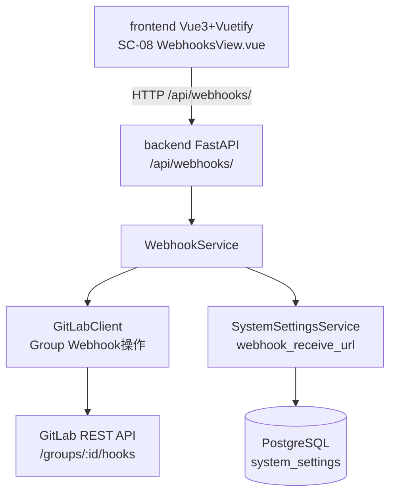
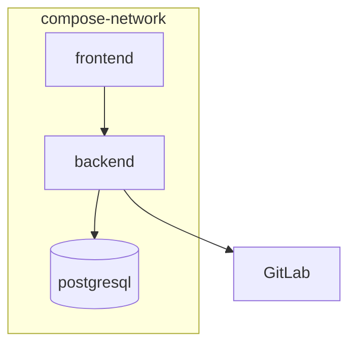
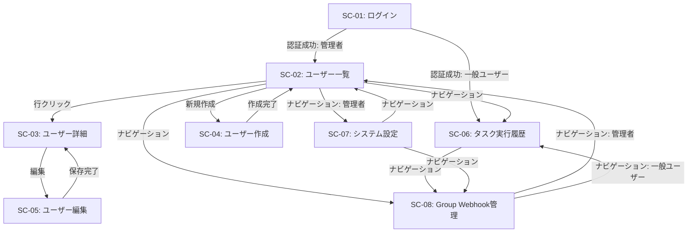
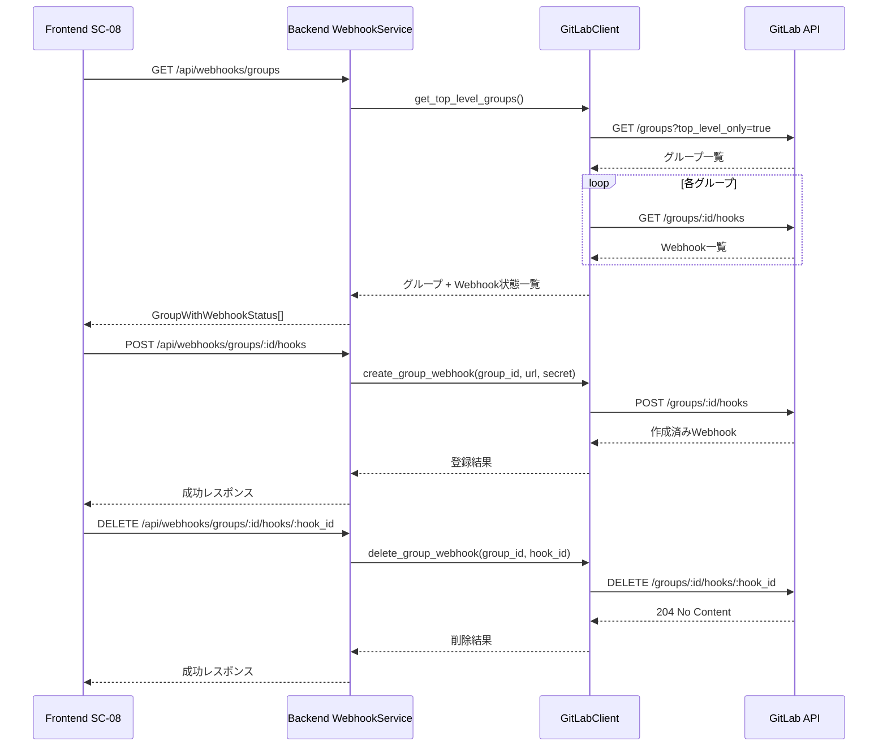
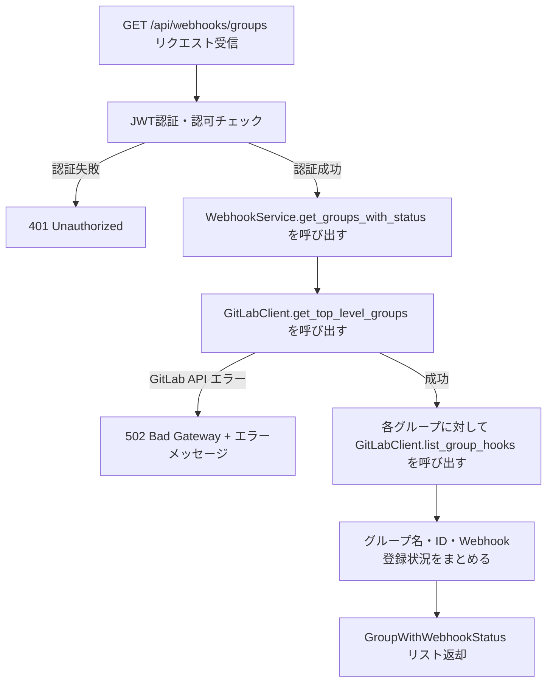
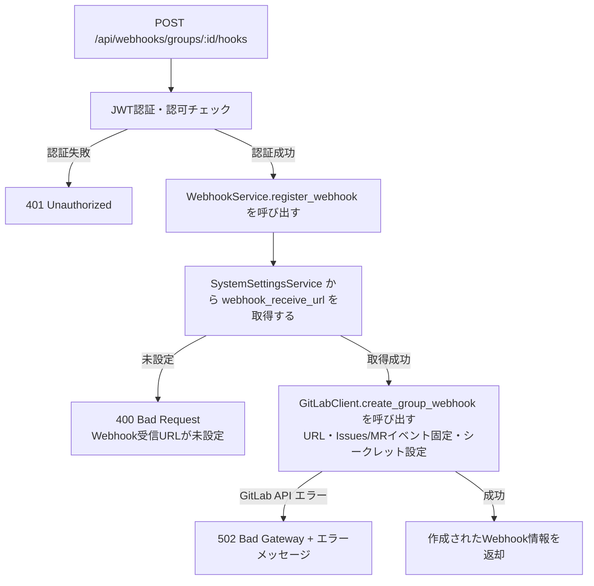
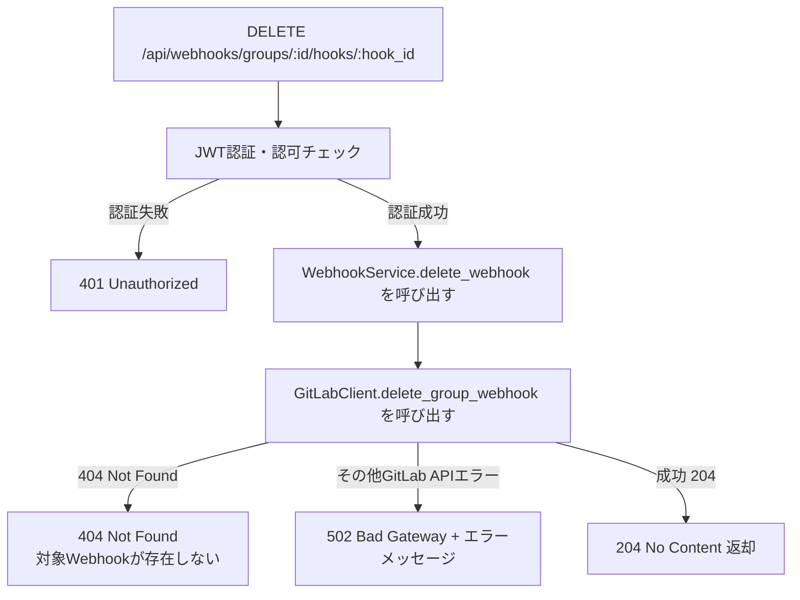
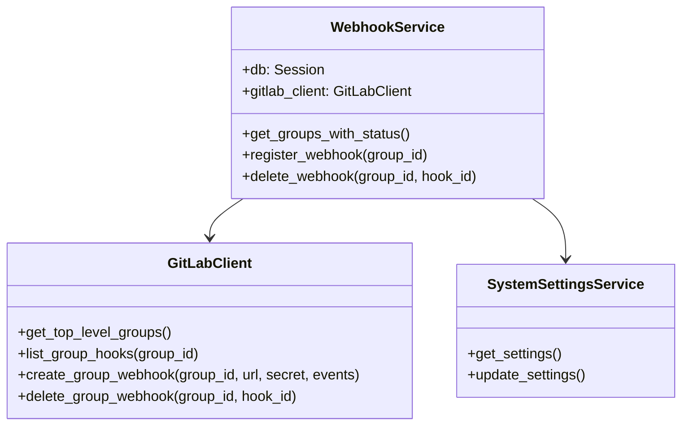
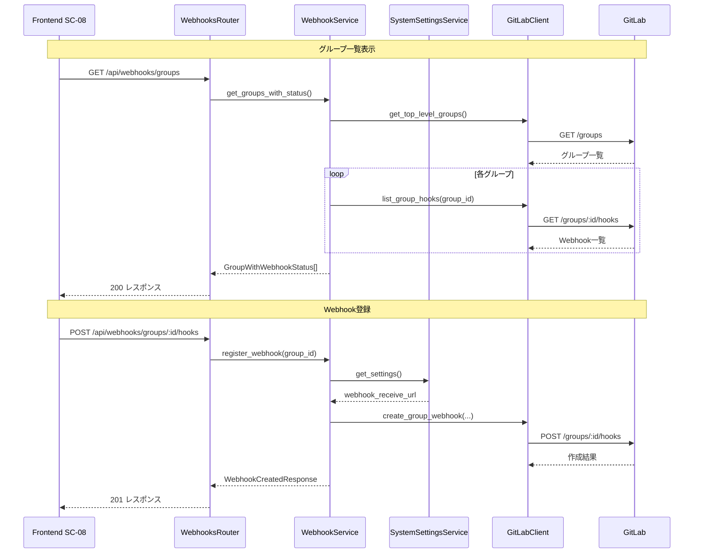

# Group Webhook GUI登録機能 変更詳細設計書

---

## 1. 言語・フレームワーク

### 1.1 変更方針

| 区分 | 変更前 | 変更後 | 理由 |
|---|---|---|---|
| バックエンド | Python 3.12 / FastAPI | 変更なし（エンドポイント追加） | 既存スタック継続で要件を満たせるため |
| フロントエンド | Vue3 + Vuetify | 変更なし（画面・コンポーネント追加） | 既存UIと統一するため |
| GitLabクライアント | shared/gitlab_client | Group Webhookメソッドを追加 | 新規API操作が必要なため |

### 1.2 フロント/バックの接続方式

既存設計を継続する。

- nginx でフロントエンドを配信する
- バックエンドAPIは `/api` 配下でnginxリバースプロキシ経由で提供する
- フロントエンドからは `/api/webhooks/` 配下へリクエストする

---

## 2. システム構成

### 2.1 変更対象コンポーネント一覧

| コンポーネント | 変更内容 | 変更種別 |
|---|---|---|
| backend/routers | webhooks.py（新規追加） | 追加 |
| backend/services | webhook_service.py（新規追加） | 追加 |
| backend/schemas | webhook.py（新規追加） | 追加 |
| backend/schemas/settings.py | webhook_receive_url フィールド追加 | 変更 |
| backend/services/system_settings_service.py | webhook_receive_url の取得・保存対応追加 | 変更 |
| backend/main.py | webhooks ルーター登録追加 | 変更 |
| shared/gitlab_client/gitlab_client.py | Group Webhook CRUD メソッド追加 | 変更 |
| frontend/src/views | WebhooksView.vue（新規追加） | 追加 |
| frontend/src/router | /webhooks ルート追加 | 変更 |
| frontend/src/api/client.ts | Webhook API 呼び出しメソッド追加 | 変更 |
| frontend/src/App.vue または ナビゲーション | Group Webhook管理へのナビリンク追加 | 変更 |
| frontend/src/views/SettingsView.vue | webhook_receive_url 入力フィールド追加 | 変更 |

### 2.2 全体構成図（追加分）



### 2.3 コンポーネント間インターフェース

| 送信元 | 送信先 | I/F | 主データ |
|---|---|---|---|
| Frontend SC-08 | Backend /api/webhooks/groups | HTTP GET | JWT Bearer トークン |
| Frontend SC-08 | Backend /api/webhooks/groups/{group_id}/hooks | HTTP POST | JWT Bearer トークン、group_id |
| Frontend SC-08 | Backend /api/webhooks/groups/{group_id}/hooks/{hook_id} | HTTP DELETE | JWT Bearer トークン、group_id、hook_id |
| Frontend SC-07 | Backend /api/settings | HTTP PUT | webhook_receive_url を含む設定値 |
| Backend WebhookService | GitLabClient | 関数呼び出し | group_id、hook_id、webhook_url、secret |
| GitLabClient | GitLab REST API | HTTP GET/POST/DELETE | Bearer botトークン |
| WebhookService | SystemSettingsService | 関数呼び出し | キー: webhook_receive_url |

### 2.4 ネットワーク構成図



---

## 3. データベース設計

### 3.1 DB要否

既存の PostgreSQL を継続利用する。`webhook_receive_url` 設定値を既存の `system_settings` テーブルにキーバリュー形式で1件追加する。新規テーブルの作成は不要。

### 3.2 スキーマ変更方針

| 項目 | 方針 |
|---|---|
| 新規テーブル | 追加しない |
| 新規カラム | system_settings テーブルへのカラム追加なし（キーバリュー形式で吸収） |
| 新規設定キー | `webhook_receive_url` を system_settings テーブルへ追加する |
| Group Webhook データ | GitLab側で管理するため本システムDBへの保存不要 |

### 3.3 system_settings テーブルの設定キー一覧（変更後）

| キー | 型 | 説明 | 変更種別 |
|---|---|---|---|
| f3_prompt_template | 文字列 | F-3プロンプトテンプレート | 既存 |
| f4_prompt_template | 文字列 | F-4プロンプトテンプレート | 既存 |
| system_mcp_config | JSON文字列 | システムMCP設定 | 既存 |
| webhook_receive_url | 文字列 | Group Webhook登録時に使用するWebhook受信URL | **追加** |

### 3.4 データ整合性

| 対象 | 制約 |
|---|---|
| webhook_receive_url | system_settings テーブルの PK（key）による一意性保証 |
| Group Webhook | GitLab側のAPIで管理。本システムでは読み取りと操作呼び出しのみ行う |

---

## 4. アーキテクチャ設計

### 4.1 外部設計（GUI）

#### 4.1.1 画面一覧（追加・変更分）

| 画面ID | 画面名 | パス | アクセス権 | 変更種別 |
|---|---|---|---|---|
| SC-08 | Group Webhook管理 | /webhooks | 全ログインユーザー | 追加 |
| SC-07 | システム設定 | /settings | 管理者のみ | 変更（Webhook受信URL項目追加） |

#### 4.1.2 画面遷移図（変更後）



#### 4.1.3 SC-08 Group Webhook管理画面 AAモックアップ

```
┌─────────────────────────────────────────────────────┐
│ [ナビゲーションバー]                                  │
│  タスク履歴 | Webhook管理 | (管理者: ユーザー管理)     │
├─────────────────────────────────────────────────────┤
│  Group Webhook管理                                   │
│                                                     │
│  [🔍 グループ名で検索 _________________ ]            │
│                                                     │
│  ┌─────────────────────────┬──────────┬──────────┐  │
│  │ グループ名               │ 状態     │ 操作     │  │
│  ├─────────────────────────┼──────────┼──────────┤  │
│  │ my-group-a              │ 登録済み │ [削除]   │  │
│  │ my-group-b              │ 未登録   │ [登録]   │  │
│  │ my-group-c              │ 未登録   │ [登録]   │  │
│  └─────────────────────────┴──────────┴──────────┘  │
│                                                     │
│  ※ Webhook受信URL が未設定の場合は登録ボタンを無効化  │
└─────────────────────────────────────────────────────┘
```

**登録確認ダイアログ:**

```
┌──────────────────────────────────────┐
│  Webhook 登録の確認                   │
│                                      │
│  以下のグループに Webhook を登録します│
│  グループ: my-group-b                │
│  Webhook URL:                        │
│    https://example.com/webhook       │
│                                      │
│  [キャンセル]    [登録する]           │
└──────────────────────────────────────┘
```

**削除確認ダイアログ:**

```
┌──────────────────────────────────────┐
│  Webhook 削除の確認                   │
│                                      │
│  以下の Webhook を削除します          │
│  グループ: my-group-a                │
│  Webhook URL:                        │
│    https://example.com/webhook       │
│                                      │
│  [キャンセル]    [削除する]           │
└──────────────────────────────────────┘
```

#### 4.1.4 SC-07 システム設定画面 変更部分

Webhook受信URL 設定項目を既存フォームの末尾に追加する。

```
┌────────────────────────────────────────────┐
│ ... 既存設定フォーム ...                     │
│                                            │
│ Webhook受信URL                             │
│  [ https://example.com/webhook _________] │
│  ※ Group Webhook登録時に使用するURLを設定   │
│                                            │
│ [保存]                                     │
└────────────────────────────────────────────┘
```

### 4.2 外部システム連携設計

#### 連携外部システム一覧（追加分）

| 外部システム | 連携内容 | 認証方式 |
|---|---|---|
| GitLab Groups API (`GET /groups`) | botトークンが権限を持つ最上位グループ一覧を取得する | Private-Token ヘッダー（GITLAB_PAT） |
| GitLab Group Hooks API (`GET /groups/:id/hooks`) | 指定グループに登録済みのWebhook一覧を取得する | Private-Token ヘッダー（GITLAB_PAT） |
| GitLab Group Hooks API (`POST /groups/:id/hooks`) | 指定グループにWebhookを新規登録する | Private-Token ヘッダー（GITLAB_PAT） |
| GitLab Group Hooks API (`DELETE /groups/:id/hooks/:hook_id`) | 指定グループの指定Webhookを削除する | Private-Token ヘッダー（GITLAB_PAT） |

#### 外部連携データフロー



### 4.3 外部DB連携設計

既存の PostgreSQL のみを利用する。新規の外部DB接続は発生しない。

### 4.4 内部設計（処理フロー）

#### 4.4.1 グループ一覧取得フロー



#### 4.4.2 Webhook登録フロー



#### 4.4.3 Webhook削除フロー



### 4.5 トランザクション境界・ロールバック条件

| 処理 | 境界 | ロールバック条件 |
|---|---|---|
| Webhook登録 | 1 GitLab API 呼び出し単位 | GitLab API 失敗時は本システムDB変更なしのため、ロールバック不要 |
| Webhook削除 | 1 GitLab API 呼び出し単位 | 同上 |
| webhook_receive_url 保存 | 1 DB upsert 単位 | DB書き込み失敗時は例外を上位に伝播してロールバック |

### 4.6 排他制御

| 対象 | 方式 | 内容 |
|---|---|---|
| Group Webhook 重複登録 | 楽観 | 登録操作はGitLab APIへ委譲。GitLab側が重複を許容するため、同一URLの二重登録は一覧取得時に複数件として表示される。UI側は一覧再取得で最新状態を反映する |
| webhook_receive_url | 楽観 | system_settings テーブルの upsert で自動的に最終更新値が保存される |

### 4.7 API入出力・バリデーション・エラー仕様

#### 追加APIエンドポイント一覧

| メソッド | パス | 説明 | 認証 |
|---|---|---|---|
| GET | /api/webhooks/groups | 最上位グループ一覧 + Webhook登録状況取得 | 全ログインユーザー |
| POST | /api/webhooks/groups/{group_id}/hooks | 指定グループへWebhook登録 | 全ログインユーザー |
| DELETE | /api/webhooks/groups/{group_id}/hooks/{hook_id} | 指定グループのWebhook削除 | 全ログインユーザー |

#### GET /api/webhooks/groups

| 項目 | 仕様 |
|---|---|
| 入力 | なし（クエリパラメータなし） |
| 成功レスポンス | 200 + GroupWithWebhookStatus[] |
| エラーレスポンス | 401（未認証）、502（GitLab API 呼び出し失敗） |
| バリデーション | JWT トークン検証のみ |

レスポンスの GroupWithWebhookStatus 構造:

| フィールド | 型 | 説明 |
|---|---|---|
| group_id | 整数 | GitLab グループID |
| group_name | 文字列 | グループ名 |
| group_path | 文字列 | グループのフルパス |
| webhook_id | 整数 または null | 登録済みWebhookのID（未登録時はnull） |
| webhook_url | 文字列 または null | 登録済みWebhookのURL（未登録時はnull） |
| is_registered | 真偽値 | Webhook登録済みかどうか |

#### POST /api/webhooks/groups/{group_id}/hooks

| 項目 | 仕様 |
|---|---|
| 入力 | パスパラメータ: group_id（整数） |
| 成功レスポンス | 201 + 作成されたWebhookの情報（hook_id、url） |
| エラーレスポンス | 400（webhook_receive_url 未設定）、401（未認証）、502（GitLab API 失敗） |
| バリデーション | group_id が正の整数であること。webhook_receive_url が設定済みであること |

#### DELETE /api/webhooks/groups/{group_id}/hooks/{hook_id}

| 項目 | 仕様 |
|---|---|
| 入力 | パスパラメータ: group_id（整数）、hook_id（整数） |
| 成功レスポンス | 204 No Content |
| エラーレスポンス | 401（未認証）、404（対象Webhookが存在しない）、502（GitLab API 失敗） |
| バリデーション | group_id・hook_id が正の整数であること |

---

## 5. クラス設計

### 5.1 変更クラス一覧（SOLID適用）

| クラス | 役割 | S | O | L | I | D |
|---|---|---|---|---|---|---|
| WebhookService（新規） | グループ一覧取得・Webhook登録・削除のビジネスロジックを担当する | ○ | ○ | ○ | ○ | ○ |
| GitLabClient（変更） | Group Webhook CRUD 操作メソッドを追加する | ○ | ○ | ○ | ○ | ○ |
| SystemSettingsService（変更） | webhook_receive_url の取得・保存対応を追加する | ○ | ○ | ○ | ○ | ○ |
| SystemSettingsResponse スキーマ（変更） | webhook_receive_url フィールドを追加する | ○ | ○ | ○ | ○ | ○ |
| SystemSettingsUpdate スキーマ（変更） | webhook_receive_url フィールドを追加する | ○ | ○ | ○ | ○ | ○ |
| GroupWithWebhookStatusResponse スキーマ（新規） | グループ + Webhook登録状況レスポンスを定義する | ○ | ○ | ○ | ○ | ○ |
| WebhookCreatedResponse スキーマ（新規） | Webhook作成成功レスポンスを定義する | ○ | ○ | ○ | ○ | ○ |

SOLID 原則の適用方針:
- **S（単一責任）**: WebhookService は Webhook CRUD のみ担当し、認証・設定取得は既存の専用クラスに委譲する
- **O（開放閉鎖）**: GitLabClient は既存メソッドを変更せず、Group Webhook メソッドを追加のみで拡張する
- **L（リスコフ置換）**: 新規クラスはインターフェースを変更しない
- **I（インターフェース分離）**: WebhookService は Group Webhook 操作のみのインターフェースを持ち、他のサービスと依存しない
- **D（依存性逆転）**: WebhookService は GitLabClient・SystemSettingsService に依存し、具象実装に直接依存しない

### 5.2 主要属性・メソッド

| クラス | 主な属性 | 主なメソッド |
|---|---|---|
| WebhookService | db: Session, gitlab_client: GitLabClient | get_groups_with_status()、register_webhook(group_id)、delete_webhook(group_id, hook_id) |
| GitLabClient（追加メソッド） | 既存属性継続 | get_top_level_groups()、list_group_hooks(group_id)、create_group_webhook(group_id, url, secret, events)、delete_group_webhook(group_id, hook_id) |
| SystemSettingsService（追加） | 既存属性継続 | get_webhook_receive_url()（既存 get_settings 拡張として実装） |

### 5.3 クラス図



### 5.4 メッセージ一覧

| メッセージ | 送信元 | 宛先 | 内容 |
|---|---|---|---|
| GET /api/webhooks/groups | Frontend SC-08 | Backend WebhooksRouter | グループ+Webhook状態一覧を要求する |
| POST /api/webhooks/groups/:id/hooks | Frontend SC-08 | Backend WebhooksRouter | 指定グループへのWebhook登録を要求する |
| DELETE /api/webhooks/groups/:id/hooks/:hook_id | Frontend SC-08 | Backend WebhooksRouter | 指定Webhookの削除を要求する |
| GitLab Groups 取得 | WebhookService | GitLabClient | 最上位グループ一覧の取得を要求する |
| GitLab GroupHooks 取得 | WebhookService | GitLabClient | 指定グループのWebhook一覧取得を要求する |
| GitLab GroupHook 作成 | WebhookService | GitLabClient | 指定グループへのWebhook作成を要求する |
| GitLab GroupHook 削除 | WebhookService | GitLabClient | 指定グループの指定Webhook削除を要求する |

### 5.5 メッセージフロー図



---

## 6. その他設計

### 6.1 エラーハンドリング一覧

| エラーID | 発生箇所 | 条件 | HTTPステータス | 対応 |
|---|---|---|---|---|
| E-WH-001 | GET /api/webhooks/groups | GitLab API 呼び出し失敗 | 502 | エラーメッセージをフロントエンドに返却し、画面でエラー表示する |
| E-WH-002 | POST /api/webhooks/groups/:id/hooks | webhook_receive_url が未設定 | 400 | 「Webhook受信URLが未設定です。システム設定で設定してください」メッセージを返却する |
| E-WH-003 | POST /api/webhooks/groups/:id/hooks | GitLab API 呼び出し失敗 | 502 | GitLab からのエラー内容を含むメッセージを返却する |
| E-WH-004 | DELETE /api/webhooks/groups/:id/hooks/:hook_id | 対象 Webhook が存在しない（GitLab 404） | 404 | 「対象のWebhookが見つかりません」メッセージを返却する |
| E-WH-005 | DELETE /api/webhooks/groups/:id/hooks/:hook_id | GitLab API 呼び出し失敗 | 502 | エラーメッセージをフロントエンドに返却する |
| E-WH-006 | WebhooksView.vue | バックエンドからエラーレスポンス受信 | - | Vuetify スナックバーでエラーメッセージを画面表示する |
| E-WH-007 | WebhooksView.vue | webhook_receive_url が未設定の場合 | - | 登録ボタンを無効化し、案内メッセージを表示する |

### 6.2 セキュリティ設計

| 項目 | 設計 |
|---|---|
| 認証 | 既存 JWT 認証を継続適用する（全ログインユーザーがアクセス可能） |
| 認可 | /api/webhooks/* は `require_current_user`（ログイン済みユーザー全員）で保護する |
| botトークン露出防止 | GitLab API 呼び出しはバックエンドサーバー内で完結させ、GITLAB_PAT をフロントエンドに返却しない |
| シークレットトークン | GITLAB_WEBHOOK_SECRET を環境変数から取得し、Webhook登録時に渡す。フロントエンドには返却しない |
| 入力バリデーション | group_id・hook_id はパスパラメータとして正の整数のみ受け付ける |
| 監査ログ | Webhook登録・削除操作をアプリケーションログに記録する（ユーザー名、操作内容、対象グループIDを含む） |

---

## 7. コード設計

### 7.1 変更後ディレクトリ構成

```
backend/
├── main.py                          （変更: webhooksルーター登録追加）
├── routers/
│   ├── __init__.py
│   └── webhooks.py                  （新規追加）
├── schemas/
│   ├── settings.py                  （変更: webhook_receive_url追加）
│   └── webhook.py                   （新規追加）
├── services/
│   ├── system_settings_service.py   （変更: webhook_receive_url対応追加）
│   └── webhook_service.py           （新規追加）

shared/
└── gitlab_client/
    └── gitlab_client.py             （変更: Group Webhookメソッド追加）

frontend/src/
├── api/
│   └── client.ts                    （変更: Webhook API メソッド追加）
├── router/
│   └── index.ts                     （変更: /webhooks ルート追加）
├── views/
│   ├── SettingsView.vue             （変更: webhook_receive_url フィールド追加）
│   └── WebhooksView.vue             （新規追加）
└── App.vue                          （変更: ナビゲーションリンク追加）
```

### 7.2 ファイル責務表（変更・追加分）

| ファイル | 役割 | 含まれる主要クラス/要素 |
|---|---|---|
| backend/routers/webhooks.py | /api/webhooks/* エンドポイントを定義する | WebhooksRouter |
| backend/schemas/webhook.py | Webhook関連レスポンス/リクエストスキーマを定義する | GroupWithWebhookStatusResponse、WebhookCreatedResponse |
| backend/services/webhook_service.py | Group Webhookビジネスロジックを担当する | WebhookService |
| shared/gitlab_client/gitlab_client.py | Group Webhook操作メソッドを追加する | GitLabClient（メソッド追加） |
| frontend/src/views/WebhooksView.vue | SC-08 Group Webhook管理画面コンポーネント | WebhooksView |

### 7.3 共通化設計（重複排除）

| 共通化対象 | 配置先 | 理由 |
|---|---|---|
| GitLab API 呼び出し処理（Group Webhook CRUD） | shared/gitlab_client/gitlab_client.py | 既存のGitLab API呼び出し共通化方針に従う |
| webhook_receive_url の取得 | backend/services/webhook_service.py 内で SystemSettingsService を呼び出す | システム設定アクセスは SystemSettingsService に集約する |
| バックエンドへの API 呼び出し | frontend/src/api/client.ts | 既存のAPI呼び出し共通化方針に従う |

### 7.4 コーディング規約

| 規約 | 適用内容 |
|---|---|
| Python | PEP8準拠、型ヒント必須、docstring必須 |
| Python バリデーション | Pydantic スキーマを使用し、ルーター層でのバリデーションを行う |
| TypeScript/Vue | 画面ロジックは Composition API（setup構文）を使用する。API呼び出しは client.ts に集約する |
| エラー表示 | バックエンドエラーは Vuetify スナックバーで表示する（既存ルールを継続） |

---

## 8. テスト設計

### 8.1 テスト種類

| 種類 | 目的 | 対象 |
|---|---|---|
| 単体テスト | 各メソッドの正常・異常パターンの検証 | WebhookService、GitLabClientの追加メソッド |
| 結合テスト | APIエンドポイントから GitLabClient までの連携検証 | GET/POST/DELETE /api/webhooks/* |
| E2Eテスト | ユーザー視点でのGUI操作検証 | SC-08 Group Webhook管理画面 |

### 8.2 実装すべきテストケース

#### 単体テスト

| テストID | 種類 | 対応要件 | 検証内容 |
|---|---|---|---|
| UT-WH-01 | 単体 | F-14 | WebhookService.get_groups_with_status が GitLab API のモックから正しく GroupWithWebhookStatus 一覧を生成する |
| UT-WH-02 | 単体 | F-14 | WebhookService.register_webhook が webhook_receive_url 未設定時に ValueError を送出する |
| UT-WH-03 | 単体 | F-14 | WebhookService.register_webhook が GitLab API 成功時に WebhookCreatedResponse を返す |
| UT-WH-04 | 単体 | F-14 | WebhookService.delete_webhook が GitLab API 成功時に正常終了する |
| UT-WH-05 | 単体 | F-14 | WebhookService.delete_webhook が GitLab 404 返却時に NotFoundError を送出する |
| UT-WH-06 | 単体 | F-15 | SystemSettingsService の get_settings が webhook_receive_url を返す |
| UT-WH-07 | 単体 | F-15 | SystemSettingsService の update_settings が webhook_receive_url を保存する |

#### 結合テスト

| テストID | 種類 | 対応要件 | 検証内容 |
|---|---|---|---|
| IT-WH-01 | 結合 | F-14 | GET /api/webhooks/groups が未認証で 401 を返す |
| IT-WH-02 | 結合 | F-14 | GET /api/webhooks/groups が認証済みで GitLab API モックから一覧を返す |
| IT-WH-03 | 結合 | F-14 | POST /api/webhooks/groups/:id/hooks が未認証で 401 を返す |
| IT-WH-04 | 結合 | F-14 | POST /api/webhooks/groups/:id/hooks が webhook_receive_url 未設定で 400 を返す |
| IT-WH-05 | 結合 | F-14 | POST /api/webhooks/groups/:id/hooks が成功時に 201 を返す |
| IT-WH-06 | 結合 | F-14 | DELETE /api/webhooks/groups/:id/hooks/:hook_id が未認証で 401 を返す |
| IT-WH-07 | 結合 | F-14 | DELETE /api/webhooks/groups/:id/hooks/:hook_id が成功時に 204 を返す |
| IT-WH-08 | 結合 | F-14 | DELETE /api/webhooks/groups/:id/hooks/:hook_id が GitLab 404 時に 404 を返す |

### 8.3 正常/異常網羅

| シナリオ種別 | 内容 |
|---|---|
| 正常: グループ一覧取得 | botトークンでグループ取得成功、各グループのWebhook状態を正しく反映する |
| 正常: Webhook登録 | webhook_receive_url 設定済みでGitLab APIへの登録成功 |
| 正常: Webhook削除 | 対象Webhookが存在しGitLab API削除成功 |
| 異常: 未認証アクセス | 全エンドポイントで 401 を返す |
| 異常: GitLab API失敗 | 全操作で 502 を返しエラーメッセージを返却する |
| 異常: webhook_receive_url未設定 | 登録操作で 400 を返す |
| 異常: 削除対象Webhook不存在 | 削除操作で 404 を返す |

---

## 9. 運用設計

### 9.1 起動・運用

| 項目 | 設計 |
|---|---|
| 起動方式 | 既存の docker compose を継続する。新規コンテナの追加なし |
| DBマイグレーション | system_settings テーブルへのカラム追加はないため Alembic マイグレーション不要。webhook_receive_url はキーバリューとして初回設定時に自動生成される |
| 初期設定 | システム初回起動後、管理者が SC-07 で webhook_receive_url を設定する |
| README反映 | SC-08 Group Webhook管理画面の操作手順と SC-07 での Webhook受信URL 設定手順を README.md に追記する |

---

## 10. ログ・監視・アラート設計

### 10.1 ログ設計

| ログ種別 | 必須 | 出力先 | 内容 |
|---|---|---|---|
| Webhook登録操作ログ | 必須 | backendログ | 操作ユーザー名・対象グループID・登録したWebhookID・タイムスタンプ |
| Webhook削除操作ログ | 必須 | backendログ | 操作ユーザー名・対象グループID・削除したWebhookID・タイムスタンプ |
| GitLab API エラーログ | 必須 | backendログ | GitLab API へのリクエスト内容・エラーステータス・エラーメッセージ |

### 10.2 監視・アラート設計

監視・アラートの専用基盤追加は必須ではないため、既存監視を継続する。以下の運用監視項目のみ追加する。

| 監視項目 | 方法 | 対応 |
|---|---|---|
| GitLab API 502 エラー発生 | backendログ監視 | GITLAB_PAT の権限・有効期限を確認する |

---

## 11. E2Eテスト設計

### 11.1 実装必須ルール

- E2Eテストは本章に定義する全パターン（TS-WB-1〜TS-WB-10）を絶対に実装する
- 一部のみ実装・代表ケースのみ実装・手動確認での代替は認めない
- 全パターンを自動実行し、全件成功するまで修正と再実行を繰り返す

### 11.2 Playwright 実行前提

- テストコードは既存の `e2e/` ディレクトリに配置する（`e2e/tests/group_webhook.spec.ts`）
- docker compose の `test` プロファイルで `test_playwright` サービスを起動する（既存設定を継続利用）
- `test_playwright` はテストコードをボリュームマウントし、変更を即時反映する
- 実行は test_playwright サービス内で行う
- コンテナ内実行のため baseURL は frontend サービス名を使用する

実行コマンド例:

```
docker compose run --rm test_playwright sh -c "cd /e2e && npm install --silent && npx playwright test tests/group_webhook.spec.ts --reporter=list"
```

### 11.3 E2Eシナリオ詳細

| シナリオID | テスト目的 | 前提条件 | テスト手順 | 期待される結果 |
|---|---|---|---|---|
| TS-WB-1 | SC-08 への全ユーザーアクセス確認 | admin・user それぞれのアカウントが存在する | admin でログインしてナビゲーションから「Group Webhook管理」を選択する。次に user でも同様に確認する | admin・user ともに SC-08 の画面が表示される |
| TS-WB-2 | グループ一覧表示・テキスト検索絞り込み確認 | ログイン済み / botトークンで見える最上位グループが1件以上存在する | SC-08 を開いてグループ一覧が表示されることを確認する。検索フィールドにグループ名の一部を入力してフィルタリングを確認する | グループ一覧が表示され、テキスト入力で一致するグループのみに絞り込まれる |
| TS-WB-3 | Webhook登録の正常完了確認 | ログイン済み / 対象グループに Webhook が未登録 / SC-07 に Webhook受信URL が設定済み | SC-08 で未登録グループの「登録」ボタンをクリックして確認ダイアログを確認後「登録する」をクリックする | 対象グループが「登録済み」バッジに変わり、GitLab 側に Webhook が登録されている |
| TS-WB-4 | 登録後の登録済みバッジ表示確認 | TS-WB-3 が完了している | SC-08 の一覧で TS-WB-3 で登録したグループ行を確認する | 「登録済み」バッジと「削除」ボタンが表示されている |
| TS-WB-5 | Webhook削除の正常完了確認 | ログイン済み / 対象グループに Webhook が登録済み | SC-08 で登録済みグループの「削除」ボタンをクリックして確認ダイアログを確認後「削除する」をクリックする | 対象グループが「未登録」状態に戻り、GitLab 側から Webhook が削除されている |
| TS-WB-6 | 削除後の未登録状態確認 | TS-WB-5 が完了している | SC-08 の一覧で TS-WB-5 で削除したグループ行を確認する | 「未登録」バッジと「登録」ボタンが表示されている |
| TS-WB-7 | 登録確認ダイアログ表示内容確認 | ログイン済み / 対象グループに Webhook が未登録 | SC-08 で未登録グループの「登録」ボタンをクリックしてダイアログ内容を確認する | グループ名と Webhook受信URL がダイアログに表示されている |
| TS-WB-8 | 削除確認ダイアログ表示内容確認 | ログイン済み / 対象グループに Webhook が登録済み | SC-08 で登録済みグループの「削除」ボタンをクリックしてダイアログ内容を確認する | グループ名と登録済み Webhook URL がダイアログに表示されている |
| TS-WB-9 | 確認ダイアログのキャンセル動作確認 | ログイン済み | SC-08 でいずれかの登録または削除ボタンをクリックしてダイアログで「キャンセル」をクリックする | ダイアログが閉じて一覧の状態が変化していない |
| TS-WB-10 | 未ログインアクセス制御確認 | ブラウザでログインしていない状態 | ブラウザで `/webhooks` に直接アクセスする | SC-01（ログイン画面）にリダイレクトされる |

### 11.4 実行・完了基準

| 判定 | 基準 |
|---|---|
| E2E完了 | TS-WB-1〜TS-WB-10 の全シナリオを自動テストとして実装済みで全件成功する |
| リグレッション | 既存の auth・users・tasks・gitlab_integration 系テストに失敗がない |
| 実装完了判定 | シナリオID単位の未実装・未実行・暫定 skip が 0 件である |

---

## 12. 不要な要素の整理

### 12.1 本設計から除外した要素

| 除外要素 | 理由 |
|---|---|
| Group Webhook の「編集」API・画面 | URL・イベント・シークレットがシステム固定値であり、ユーザーが変更できる項目がないため不要 |
| サブグループへの個別 Webhook 設定 | 最上位グループへの設定でサブグループのイベントも集約受信できるためスコープ外 |
| Webhook登録状況のDB永続化 | GitLab API からリアルタイム取得するため本システムDBへの保存は不要 |
| 新規 Alembic マイグレーション | system_settings テーブルのキーバリュー形式で吸収できるためスキーマ変更不要 |
| 新規 docker compose サービス | 既存コンポーネントの拡張のみで要件を実現できるため不要 |
