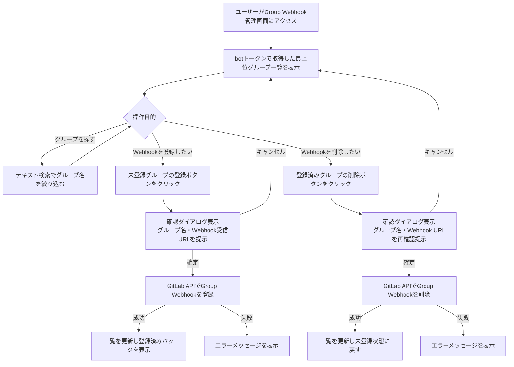
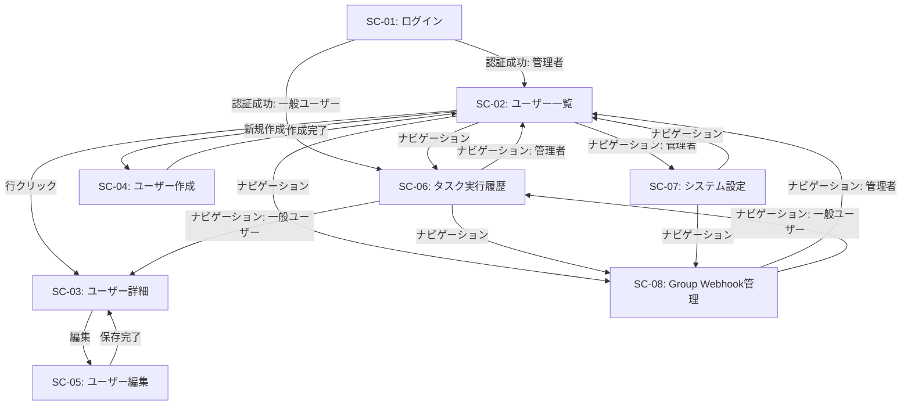
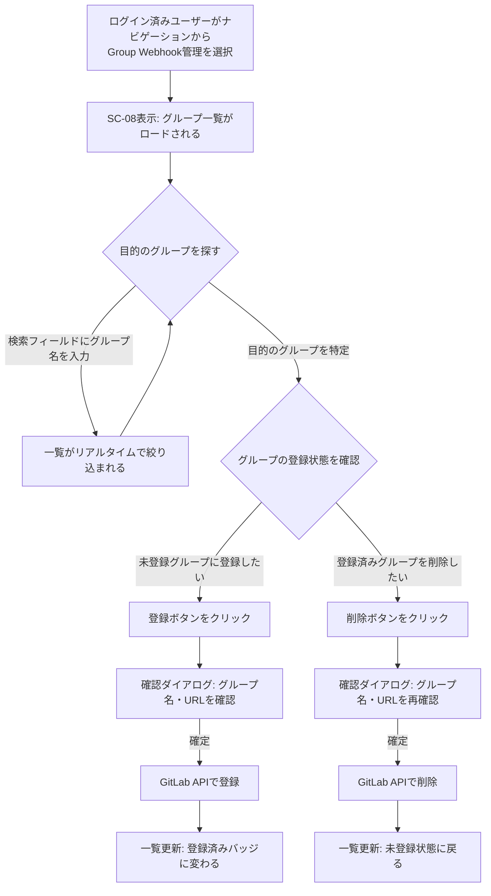

# Group Webhook GUI登録機能 変更要件定義書

---

## 1. 目的・前提

### 1.1 目的

GitLab の Group Webhook 登録・削除操作を、管理者だけでなく一般ユーザーも Web 管理画面から実施できるようにする。
これにより、CUI操作なしに botトークンが権限を持つグループへの Webhook 設定が完結する。

### 1.2 解決すべき業務課題

| 課題ID | 課題 | 影響 |
|---|---|---|
| P-WB-1 | Group Webhookの登録にはCUIでのGitLab API直接操作が必要であり、開発者が自分でWebhookを設定できない | 管理者への依頼が発生し、Webhook設定のリードタイムが長くなる |
| P-WB-2 | どのグループにWebhookが設定済みかをGUIで一覧確認する手段がない | 設定漏れ・重複設定の検知が困難 |

### 1.3 用語集（追加）

| 用語 | 説明 |
|---|---|
| Group Webhook | GitLabのグループに設定されるWebhook。グループ配下の全サブグループおよびプロジェクトで発生するイベントを、1つのエンドポイントで受信できる |
| 最上位グループ | 親グループを持たないGitLabグループ。本機能でWebhook登録対象とする単位 |
| Webhook受信URL | 本システムのProducerが公開するWebhook受信エンドポイントのURL。GitLab Group Webhookの送信先として登録する |

### 1.4 既存要件との関係

- 既存の F-12（Group Webhook標準化）は CUI要件として「GUI変更は行わない」と定義されていたが（`docs/request.md` 2.1.4節）、本変更でGUI機能を追加する
- 既存の SC-01〜SC-07 の構成・要件は変更しない
- 既存の F-1（Webhook受信）・F-2（ポーリング）の処理内容は変更しない

---

## 2. 業務

### 2.1 対象業務

本変更により以下の業務が追加される。

| No. | 業務名 | 説明 |
|---|---|---|
| B-4 | Group Webhook管理 | WebブラウザからGitLabの最上位グループに対してGroup Webhookを登録・削除する |

### 2.2 業務フロー

### 2.3 業務の範囲・担当者

| 担当者 | 役割 |
|---|---|
| 一般ユーザー（user） | Group Webhook管理画面からWebhookの登録・削除を実施する |
| 管理者（admin） | 同上。加えてシステム設定画面でWebhook受信URLを設定する |

### 2.4 業務課題・KPI

| 課題ID | KPI |
|---|---|
| P-WB-1 | Group Webhook登録操作が管理者依頼不要でセルフサービス化される |
| P-WB-2 | 登録済み・未登録の状態がGUI上で即時確認できる |

### 2.5 解決すべき課題と対応方針

| 課題ID | 対応方針 |
|---|---|
| P-WB-1 | Group Webhook管理画面（SC-08）を新設し、admin・user 問わず全ログインユーザーが Webhook の登録・削除を実行できるようにする |
| P-WB-2 | 最上位グループ一覧を画面表示時に GitLab API から取得し、各グループの Webhook 登録状況（登録済み / 未登録）をバッジで明示する |

### 2.6 見込み経営効果

| 効果種別 | 内容 |
|---|---|
| Soft Saving（人件費削減） | Webhook登録依頼・対応の管理者工数を排除し、ユーザーがセルフで完結できる |
| Cost Avoidance | 設定漏れによるWebhook未受信・ポーリング超過負荷の発生を防止する |

---

## 3. 機能要件

### 3.1 機能一覧

| 機能ID | 機能名 | 対応業務課題 | 追加/変更 |
|---|---|---|---|
| F-14 | Group Webhook管理画面 | P-WB-1, P-WB-2 | 追加 |
| F-15 | SC-07 Webhook受信URL設定 | P-WB-1 | 変更（SC-07に項目追加） |

### 3.2 入力データ

| データ | 種別 | 説明 |
|---|---|---|
| GitLab 最上位グループ一覧 | 外部（GitLab API） | botトークンが権限を持つ最上位グループの名前・IDの一覧 |
| GitLab Group Webhook一覧 | 外部（GitLab API） | 各最上位グループに登録済みのWebhookのURL・ID一覧 |
| Webhook受信URL | システム設定（SC-07） | Group Webhook登録時にGitLabへ送信先として渡すURL |
| ユーザー操作（登録・削除指示） | 人手 | グループ選択・登録ボタン・削除ボタン・確認ダイアログの確定操作 |

### 3.3 出力データ

| データ | 出力先 | 説明 |
|---|---|---|
| Group Webhook登録情報 | GitLab | 登録操作時にGitLab APIでGroup Webhookを作成する |
| Group Webhook削除 | GitLab | 削除操作時にGitLab APIでGroup Webhookを削除する |
| グループ一覧表示 | Web画面（SC-08） | 最上位グループ名・Webhook登録状況のバッジ・操作ボタン |

### 3.4 外部連携

| 連携先 | 連携方式 | 用途 |
|---|---|---|
| GitLab | REST API（botトークン認証） | 最上位グループ一覧取得・Group Webhook一覧取得・登録・削除 |

### 3.5 Web管理画面 一覧・仕様（追加・変更分）

#### 追加画面

| 画面ID | 画面名 | パス | アクセス権 |
|---|---|---|---|
| SC-08 | Group Webhook管理 | /webhooks | 全ログインユーザー（admin / user） |

#### 変更画面

| 画面ID | 変更内容 |
|---|---|
| SC-07 | Webhook受信URLの設定項目を追加する（管理者のみ編集可） |

### 3.6 SC-08 Group Webhook管理画面 詳細仕様

#### 表示仕様

- 画面表示時に GitLab API を呼び出し、botトークンで取得できる最上位グループ一覧と各グループのWebhook登録状況を取得して表示する
- 各グループを1行として表形式でフラット一覧表示する
- 表示項目: グループ名、登録状態バッジ（登録済み / 未登録）、操作ボタン
- テキスト入力フィールドで、グループ名によるフロントエンド絞り込みができる
- ロード中はローディング表示を行う
- GitLab API取得失敗時はエラーメッセージを表示する

#### 操作仕様

| 行の状態 | 表示ボタン | 動作 |
|---|---|---|
| 未登録 | 「登録」ボタン | 確認ダイアログを表示する |
| 登録済み | 「削除」ボタン | 確認ダイアログを表示する |

#### 確認ダイアログ仕様

| 操作 | ダイアログ表示内容 |
|---|---|
| 登録 | 対象グループ名・登録するWebhook受信URL・「登録する」「キャンセル」ボタン |
| 削除 | 対象グループ名・削除するWebhook URL・「削除する」「キャンセル」ボタン |

確定後に GitLab API を呼び出し、成功した場合は一覧を再取得して最新状態を表示する。失敗した場合はエラーメッセージを表示してダイアログを閉じる。

#### Webhook登録時の固定パラメータ

GitLab Group Webhook 登録時に本システムが自動設定するパラメータは以下の通りで、ユーザーによる変更は不可とする。

| パラメータ | 設定値 |
|---|---|
| URL | SC-07で設定したWebhook受信URL |
| イベント種別 | Issues events・Merge requests events（固定・変更不可） |
| シークレットトークン | 環境変数 `GITLAB_WEBHOOK_SECRET` の値（固定・変更不可） |
| SSL検証 | システムのデフォルト設定に従う |

### 3.7 画面遷移（変更後）

### 3.8 ユーザー利用フロー

### 3.9 ログ

一般的なアプリの動作ログ・エラーログのみ記録する。Group Webhook の登録・削除操作のアクション（誰が・いつ・どのグループに対して操作したか）をアプリケーションログに記録する。ログの保存期間は既存のシステム設定に準ずる。

### 3.10 監視・アラート

監視・アラートは既存の仕組みから追加不要とする。GitLab API 呼び出しの失敗はエラーログおよび画面エラーメッセージにより検知する。

---

## 4. データ

### 4.1 業務エンティティ一覧

| エンティティ | 内部/外部 | 説明 |
|---|---|---|
| Group Webhook | 外部（GitLab） | GitLabグループに登録されたWebhook。本システムのDBには保持しない |
| 最上位グループ | 外部（GitLab） | botトークンが権限を持つGitLabの最上位グループ。本システムのDBには保持しない |
| Webhook受信URL | 内部（システム設定） | SC-07に追加する設定値。既存のシステム設定テーブルに1件追加 |

### 4.2 エンティティ操作マトリクス

| エンティティ | 作成(C) | 参照(R) | 更新(U) | 削除(D) | 一覧 | 詳細 | 検索 | 状態 |
|---|---|---|---|---|---|---|---|---|
| Group Webhook | ○ | - | × | ○ | ○（GitLab API） | - | -（グループ名絞り込みで代替） | 登録済み / 未登録 |
| 最上位グループ | × | ○ | × | × | ○（GitLab API） | - | ○（グループ名絞り込み） | - |
| Webhook受信URL | - | ○ | ○ | - | - | - | - | - |

### 4.3 データ保持期間

Group Webhook・最上位グループのデータは GitLab 側で管理されるため、本システムでの保持期間定義は不要。
Webhook受信URLはシステム設定として、システム運用期間中保持する。

### 4.4 外部DB接続

既存の PostgreSQL 接続設定を使用する。新規の外部DB接続は発生しない。

### 4.5 DBの必要性

Group Webhook および最上位グループのデータは GitLab API からリアルタイムに取得するため、本システムのDBへの保存は不要。
Webhook受信URLは既存のシステム設定テーブルへ1件追加する。

---

## 5. 非機能要件

### 5.1 性能（応答時間）

- SC-08 の初期表示（グループ一覧取得）: GitLab API のレスポンス依存。表示中はローディング表示を行う
- 登録・削除操作のレスポンス: GitLab API のレスポンス依存

### 5.2 利用人数

既存システムの同時接続想定を変更しない。

### 5.3 セキュリティ

- SC-08 へのアクセスは JWT 認証済みユーザーのみ許可する（既存の認証機構を適用）
- GitLab API 呼び出しにはシステム共通の botトークン（`GITLAB_PAT`）を使用する。ユーザーのトークンは使用しない
- GitLab API 呼び出しはバックエンドサーバー経由で行い、botトークンをフロントエンドに露出させない

---

## 6. テスト用利用シナリオ

### 6.1 シナリオ一覧

| シナリオID | テスト目的 | 前提条件 |
|---|---|---|
| TS-WB-1 | SC-08が全ログインユーザーからアクセスできる | admin・userそれぞれでログイン済み |
| TS-WB-2 | グループ一覧が表示され、検索で絞り込みができる | botトークンで見える最上位グループが1件以上存在する |
| TS-WB-3 | 未登録グループへのWebhook登録ができる | 対象グループにWebhookが未登録 / SC-07にWebhook受信URLが設定済み |
| TS-WB-4 | 登録後に登録済みバッジが表示される | TS-WB-3完了後 |
| TS-WB-5 | 登録済みグループのWebhookを削除できる | 対象グループにWebhookが登録済み |
| TS-WB-6 | 削除後に未登録状態に戻る | TS-WB-5完了後 |
| TS-WB-7 | 登録時の確認ダイアログにグループ名とWebhook URLが表示される | 対象グループにWebhookが未登録 |
| TS-WB-8 | 削除時の確認ダイアログにグループ名とWebhook URLが表示される | 対象グループにWebhookが登録済み |
| TS-WB-9 | 確認ダイアログでキャンセルすると操作が中断される | 登録・削除いずれかの確認ダイアログ表示中 |
| TS-WB-10 | 未ログイン状態で /webhooks にアクセスするとログイン画面にリダイレクトされる | 未ログイン状態 |

### 6.2 シナリオ詳細

#### TS-WB-1: アクセス権確認

| 項目 | 内容 |
|---|---|
| テスト目的 | admin・user 両ロールで SC-08 にアクセスできることを確認する |
| 前提条件 | admin・user それぞれでログイン済み |
| テスト手順 | 1. admin でログインしてナビゲーションから「Group Webhook管理」を選択する / 2. SC-08 が表示されることを確認する / 3. ログアウトし user でログインしてナビゲーションから「Group Webhook管理」を選択する / 4. SC-08 が表示されることを確認する |
| 期待される結果 | admin・user ともに SC-08 が表示される |

#### TS-WB-2: グループ一覧表示・検索絞り込み

| 項目 | 内容 |
|---|---|
| テスト目的 | グループ一覧が表示され、テキスト検索で絞り込みができることを確認する |
| 前提条件 | ログイン済み / botトークンで見える最上位グループが1件以上存在する |
| テスト手順 | 1. SC-08 を開く / 2. グループ一覧が表示されることを確認する / 3. 検索フィールドにグループ名の一部を入力する / 4. 入力内容に一致するグループのみが表示されることを確認する |
| 期待される結果 | 最上位グループが一覧表示され、テキスト入力で絞り込みができる |

#### TS-WB-3: Webhook登録

| 項目 | 内容 |
|---|---|
| テスト目的 | 未登録グループへの Webhook 登録が正常に完了することを確認する |
| 前提条件 | ログイン済み / 対象グループに Webhook が未登録 / SC-07 に Webhook受信URLが設定済み |
| テスト手順 | 1. SC-08 で未登録グループの「登録」ボタンをクリックする / 2. 確認ダイアログにグループ名と Webhook 受信URL が表示されることを確認する / 3. 「登録する」ボタンをクリックする / 4. ダイアログが閉じて一覧が更新されることを確認する |
| 期待される結果 | 対象グループが「登録済み」バッジに変わり、GitLab 側に Webhook が登録されている |

#### TS-WB-4: 登録済みバッジ表示確認

| 項目 | 内容 |
|---|---|
| テスト目的 | 登録後に登録済みバッジが正しく表示されることを確認する |
| 前提条件 | TS-WB-3 が完了している |
| テスト手順 | 1. SC-08 の一覧で TS-WB-3 で登録したグループを確認する |
| 期待される結果 | 対象グループ行に「登録済み」バッジと「削除」ボタンが表示されている |

#### TS-WB-5: Webhook削除

| 項目 | 内容 |
|---|---|
| テスト目的 | 登録済みグループの Webhook 削除が正常に完了することを確認する |
| 前提条件 | ログイン済み / 対象グループに Webhook が登録済み |
| テスト手順 | 1. SC-08 で登録済みグループの「削除」ボタンをクリックする / 2. 確認ダイアログにグループ名と Webhook URL が表示されることを確認する / 3. 「削除する」ボタンをクリックする / 4. ダイアログが閉じて一覧が更新されることを確認する |
| 期待される結果 | 対象グループが「未登録」状態に戻り、GitLab 側から Webhook が削除されている |

#### TS-WB-6: 削除後の状態確認

| 項目 | 内容 |
|---|---|
| テスト目的 | 削除後に未登録状態に正しく戻ることを確認する |
| 前提条件 | TS-WB-5 が完了している |
| テスト手順 | 1. SC-08 の一覧で TS-WB-5 で削除したグループを確認する |
| 期待される結果 | 対象グループ行が「未登録」バッジと「登録」ボタンの表示に戻っている |

#### TS-WB-7: 登録確認ダイアログの表示内容確認

| 項目 | 内容 |
|---|---|
| テスト目的 | 登録時の確認ダイアログに必要な情報が表示されることを確認する |
| 前提条件 | ログイン済み / 対象グループに Webhook が未登録 |
| テスト手順 | 1. SC-08 で未登録グループの「登録」ボタンをクリックする / 2. 確認ダイアログの表示内容を確認する |
| 期待される結果 | ダイアログにグループ名と Webhook 受信URL が明示されている |

#### TS-WB-8: 削除確認ダイアログの表示内容確認

| 項目 | 内容 |
|---|---|
| テスト目的 | 削除時の確認ダイアログに必要な情報が表示されることを確認する |
| 前提条件 | ログイン済み / 対象グループに Webhook が登録済み |
| テスト手順 | 1. SC-08 で登録済みグループの「削除」ボタンをクリックする / 2. 確認ダイアログの表示内容を確認する |
| 期待される結果 | ダイアログにグループ名と登録済み Webhook URL が明示されている |

#### TS-WB-9: 確認ダイアログのキャンセル

| 項目 | 内容 |
|---|---|
| テスト目的 | 確認ダイアログでキャンセルすると操作が中断されることを確認する |
| 前提条件 | ログイン済み |
| テスト手順 | 1. SC-08 でいずれかのグループの登録または削除ボタンをクリックする / 2. 確認ダイアログで「キャンセル」ボタンをクリックする |
| 期待される結果 | ダイアログが閉じて一覧の状態が変化していない（GitLab 側も変更されていない） |

#### TS-WB-10: 未ログインアクセス制御

| 項目 | 内容 |
|---|---|
| テスト目的 | 未ログイン状態で /webhooks にアクセスした場合にログイン画面にリダイレクトされることを確認する |
| 前提条件 | ブラウザでログインしていない状態 |
| テスト手順 | 1. ブラウザで `/webhooks` に直接アクセスする |
| 期待される結果 | SC-01（ログイン画面）にリダイレクトされる |

---

## 7. 要件網羅性チェック

### 7.1 エンティティ操作網羅確認

| エンティティ | C | R | U | D | 一覧 | 詳細 | 検索 | 状態 |
|---|---|---|---|---|---|---|---|---|
| Group Webhook | ○ | ○ | - | ○ | ○ | - | - | 登録済み/未登録 |
| 最上位グループ | - | ○ | - | - | ○ | - | ○ | - |
| Webhook受信URL | - | ○ | ○ | - | - | - | - | - |

- **Update（U）が Group Webhook に存在しない理由**: URL・イベント・シークレットはすべてシステム固定値であり、ユーザーが変更できる項目がないため「編集」機能は不要

### 7.2 機能カテゴリ網羅確認

| カテゴリ | 対象機能 |
|---|---|
| 業務機能 | F-14（Group Webhook管理画面） |
| マスタ管理 | F-15（SC-07 Webhook受信URL設定項目追加） |
| 共通（認証・認可） | 既存 JWT 認証を適用（新規追加なし） |
| 運用 | 操作ログを既存ログ機構で記録 |
| 外部連携 | GitLab Groups API・Group Webhooks API |

### 7.3 削除可能要件の確認

本変更要件に含まれる要件はすべて業務課題（P-WB-1・P-WB-2）に直接紐づいており、削除可能な要件はない。

### 7.4 MVP確認

- Webhook の「編集」機能: URL・イベント・シークレットはすべてシステム固定のため不要 → 削除済み
- サブグループへの個別設定: 最上位グループへの設定でサブグループのイベントも集約受信できるため不要 → スコープ外
- Webhook登録状況の詳細表示: 登録済み/未登録バッジで十分 → 詳細画面なし
