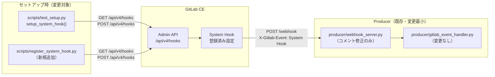
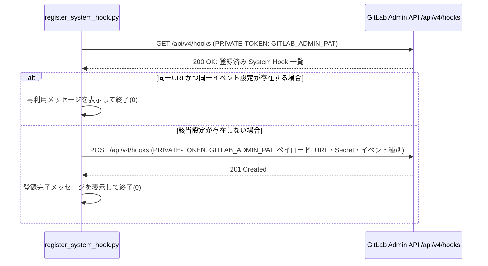
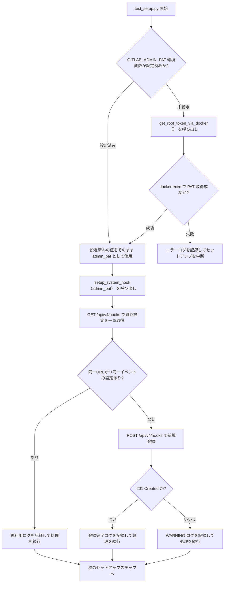
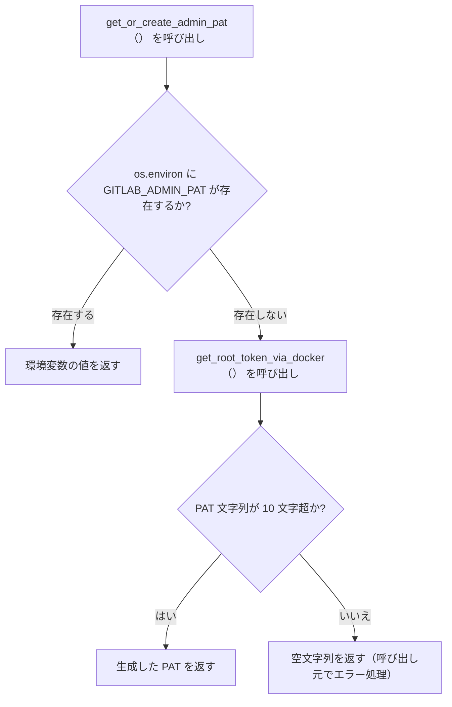
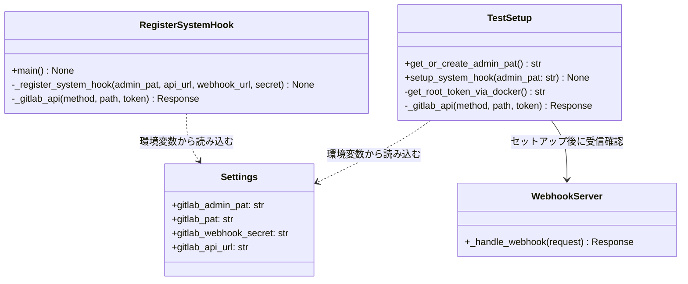

# GitLab System Hook 標準化 変更設計書

> 対応変更要件定義書: `.history/20260504-switch-to-system-hook/change_requirements.md`
> 既存設計書参照先: `docs/detail_design.md`
---

## 1. 言語・フレームワーク

変更の影響を受ける言語・フレームワークに変更はない。既存の Python 実装をそのまま維持し、追加ファイルも同様に Python で実装する。フレームワークの新規導入はない。

| 項目 | 既存 | 変更後 |
|---|---|---|
| 言語 | Python | 変更なし |
| スクリプト実行環境 | ホスト OS 上で直接実行 | 変更なし |
| Web フレームワーク (producer) | aiohttp | 変更なし |
| 設定管理 | pydantic-settings | 変更なし |

---

## 2. システム構成

### 2.1 変更対象コンポーネント一覧

| コンポーネント | ファイルパス | 区分 | 変更内容 |
|---|---|---|---|
| テスト環境セットアップスクリプト | `scripts/test_setup.py` | 変更 | `setup_group_webhook()` を `setup_system_hook()` に置き換え、`GITLAB_ADMIN_PAT` 環境変数対応を追加する |
| 手動登録コマンド | `scripts/register_system_hook.py` | 新規追加 | `GITLAB_ADMIN_PAT` を使って System Hook を冪等登録する独立スクリプトを追加する |
| 共通設定クラス | `shared/config/config.py` | 変更 | `gitlab_admin_pat` フィールドを追加する |
| 環境変数サンプルファイル | `.env.example` | 変更 | `GITLAB_ADMIN_PAT` の説明と記述例を追加する |
| Webhook 受信サーバー | `producer/webhook_server.py` | 変更 | ログコメントを Group Webhook から System Hook へ更新する（機能変更なし） |
| 導入手順書 | `README.md` | 変更 | CUI 手動登録手順・GUI 手順・接続確認・失敗時確認観点を追加する |

変更対象外コンポーネント:

| コンポーネント | 変更対象外の理由 |
|---|---|
| `producer/gitlab_event_handler.py` | System Hook の Issue・MR イベントペイロードは Group Webhook と同じ `object_kind` フィールドを持つため、イベント振り分けロジックに変更不要 |
| `shared/config/config.py` のうち既存フィールド | 既存フィールドへの影響なし |
| フロントエンド・バックエンド・Consumer | System Hook 登録・受信方式の変更はこれらのコンポーネントに影響しない |

### 2.2 システム全体構成図（変更部分のみ抜粋）



### 2.3 コンポーネント間インターフェース

| 送信元 | 受信先 | プロトコル | 内容 |
|---|---|---|---|
| `test_setup.py` / `register_system_hook.py` | GitLab 管理 API | HTTP REST | `GET /api/v4/hooks` で一覧取得、`POST /api/v4/hooks` で新規登録 |
| GitLab CE | `WebhookServer` | HTTP POST | `X-Gitlab-Event: System Hook` ヘッダーと Issue・MR イベントペイロード |

---

## 3. データベース設計

今回の変更で新規 DB は不要である。System Hook 設定は GitLab 上の外部データとして管理され、管理者用 PAT は環境変数設定として保持するため、PostgreSQL への追加テーブルや追加カラムは発生しない。既存の PostgreSQL をそのまま利用する。

---

## 4. アーキテクチャ設計

### 4.1 外部設計

#### 4.1.1 CUI 仕様（手動登録コマンド）

| 項目 | 内容 |
|---|---|
| コマンド実行方法 | `python scripts/register_system_hook.py` |
| 追加引数 | なし（全設定を環境変数から読み込む） |
| 必須環境変数 | `GITLAB_ADMIN_PAT`、`GITLAB_API_URL`、`GITLAB_WEBHOOK_SECRET` |
| 任意環境変数 | `WEBHOOK_URL`（省略時は `http://localhost:8080/webhook`） |
| 成功終了コード | 0（登録または再利用に成功した場合） |
| 失敗終了コード | 1（`GITLAB_ADMIN_PAT` 未設定または API 呼び出し失敗） |

#### 4.1.2 外部システムとの連携

| 連携先 | インターフェース | 認証方式 |
|---|---|---|
| GitLab 管理 API `/api/v4/hooks` | HTTP REST | `PRIVATE-TOKEN` ヘッダーに管理者用 PAT を付与 |
| GitLab 管理画面 | GUI（手順書案内のみ） | GitLab 管理者アカウントでログイン |

#### 4.1.3 GitLab 管理 API データフロー



### 4.2 内部設計

#### 4.2.1 テスト環境セットアップ時の System Hook 自動登録フロー



#### 4.2.2 管理者用 PAT 取得ロジック（test_setup.py 内）



#### 4.2.3 冪等判定ロジック

System Hook の冪等判定は以下の両条件が一致する場合に既存設定を再利用し、新規登録を行わない。

| 照合対象フィールド | 照合方法 |
|---|---|
| `url` フィールド | 完全一致 |
| `issues_events` フィールド | 真偽値一致 |
| `merge_requests_events` フィールド | 真偽値一致 |

---

## 5. クラス設計

### 5.1 変更・新規クラス／関数一覧

| ファイル | 関数・クラス名 | 区分 | 役割 | SRP | OCP | LSP | ISP | DIP |
|---|---|---|---|---|---|---|---|---|
| `scripts/test_setup.py` | `setup_system_hook(admin_pat)` | 変更（置換） | 管理者用 PAT を受け取り、GitLab 管理 API で System Hook の照合と冪等登録を行う | ○ | ○ | - | - | ○ |
| `scripts/test_setup.py` | `get_or_create_admin_pat()` | 変更（修正） | `GITLAB_ADMIN_PAT` 環境変数を優先し、未設定の場合は `get_root_token_via_docker()` を呼び出す | ○ | ○ | - | - | ○ |
| `scripts/register_system_hook.py` | `main()` | 新規 | 手動登録コマンドのエントリーポイント。環境変数を検証し、`_register_system_hook()` を呼び出す | ○ | ○ | - | - | ○ |
| `scripts/register_system_hook.py` | `_register_system_hook(admin_pat, api_url, webhook_url, secret)` | 新規 | System Hook の照合と冪等登録を行う。`test_setup.py` の `setup_system_hook()` と同一アルゴリズムを共有するが、引数で設定を受け取る形式とし独立して実行可能にする | ○ | ○ | - | - | ○ |
| `scripts/register_system_hook.py` | `_gitlab_api(method, path, token, **kwargs)` | 新規 | `test_setup.py` と同等の GitLab API 呼び出しラッパー。同一ロジックの再実装を避けるため、共通モジュール化を今後検討すべき箇所として明記する | ○ | ○ | - | - | ○ |
| `shared/config/config.py` | `Settings.gitlab_admin_pat` | 変更（追加） | 管理者用 PAT を環境変数から読み込むフィールドを追加する | ○ | ○ | - | - | ○ |
| `producer/webhook_server.py` | `WebhookServer._handle_webhook()` | 変更（コメント修正） | ログコメントの「Group Webhook 標準化」を「System Hook」に更新する（機能変更なし） | - | - | - | - | - |

> 注意: `scripts/test_setup.py` の `_gitlab_api()` ヘルパーと `scripts/register_system_hook.py` の `_gitlab_api()` ヘルパーは現時点では別ファイルに独立して配置するが、同一ロジックである。将来的に共通モジュール化できる箇所として設計上マークする。今回は最小変更の方針に従い共通化は行わない。

### 5.2 削除する関数

| ファイル | 関数名 | 削除理由 |
|---|---|---|
| `scripts/test_setup.py` | `setup_group_webhook(root_token, group_id)` | Group Webhook を廃止して System Hook を標準方式に置き換えるため不要になる。グループ ID を受け取る設計が System Hook の API に適合しない |

### 5.3 各クラス・関数の詳細

#### `setup_system_hook(admin_pat: str) → None`

- **ファイル**: `scripts/test_setup.py`
- **役割**: System Hook 照合・冪等登録（テスト環境セットアップ内部用）
- **主な処理の流れ**:
  1. 管理 API `GET /api/v4/hooks` で現在の System Hook 一覧を取得する
  2. 一覧取得失敗の場合は WARNING ログを出力して処理を終了する
  3. 一覧の中から `url`、`issues_events`、`merge_requests_events` が全て一致する設定を検索する
  4. 一致する設定が存在する場合は再利用ログを出力して処理を終了する
  5. 一致する設定が存在しない場合は `POST /api/v4/hooks` で新規登録する
  6. 登録成功（201）でログを出力し、失敗の場合は WARNING ログを出力する

#### `get_or_create_admin_pat() → str`

- **ファイル**: `scripts/test_setup.py`
- **役割**: 管理者用 PAT の取得（環境変数優先・自動生成フォールバック）
- **主な処理の流れ**:
  1. `GITLAB_ADMIN_PAT` 環境変数が設定済みか確認する
  2. 設定済みの場合はその値を返す
  3. 未設定の場合は既存の `get_root_token_via_docker()` を呼び出して PAT を取得する
  4. 取得できなかった場合（空文字列）は空文字列を返す（呼び出し元でエラー処理を行う）
- **後方互換性**: 既存の `GITLAB_ADMIN_TOKEN` 環境変数も `GITLAB_ADMIN_PAT` の次の優先順位でフォールバックとして参照し、既存環境での動作を維持する

#### `main() → None` および `_register_system_hook(admin_pat, api_url, webhook_url, secret) → None`

- **ファイル**: `scripts/register_system_hook.py`（新規）
- **役割**: 手動登録コマンドのエントリーポイントとコア登録処理
- **`main()` の主な処理の流れ**:
  1. `GITLAB_ADMIN_PAT` 環境変数を読み込む
  2. 未設定の場合はエラーメッセージを出力して終了コード 1 で終了する
  3. `GITLAB_API_URL`、`GITLAB_WEBHOOK_SECRET`、`WEBHOOK_URL` を読み込む
  4. `_register_system_hook()` を呼び出す
  5. 成功した場合は終了コード 0 で終了する
- **`_register_system_hook()` の主な処理の流れ**:
  1. `GET /api/v4/hooks` で既存 System Hook 一覧を取得する
  2. `url`・`issues_events`・`merge_requests_events` の三条件で照合する
  3. 一致する設定があれば「再利用」メッセージを出力して終了する
  4. 一致する設定がなければ `POST /api/v4/hooks` で登録する
  5. 登録成功（201）で「登録完了」メッセージを出力する
  6. 登録失敗の場合は失敗内容を出力して終了コード 1 で終了する

### 5.4 クラス図



### 5.5 メッセージ一覧

| メッセージID | 送信元 | 受信先 | 内容 | 形式 |
|---|---|---|---|---|
| M-SH-01 | `test_setup.py` | GitLab Admin API | System Hook 一覧取得リクエスト | `GET /api/v4/hooks` + `PRIVATE-TOKEN` ヘッダー |
| M-SH-02 | `test_setup.py` | GitLab Admin API | System Hook 新規登録リクエスト | `POST /api/v4/hooks` + 登録ペイロード |
| M-SH-03 | `register_system_hook.py` | GitLab Admin API | System Hook 一覧取得リクエスト | `GET /api/v4/hooks` + `PRIVATE-TOKEN` ヘッダー |
| M-SH-04 | `register_system_hook.py` | GitLab Admin API | System Hook 新規登録リクエスト | `POST /api/v4/hooks` + 登録ペイロード |
| M-SH-05 | GitLab CE | `WebhookServer` | Issue または MR 更新通知 | `POST /webhook` + `X-Gitlab-Event: System Hook` + ペイロード |

---

## 6. その他設計

### 6.1 エラーハンドリング

| エラーID | 発生箇所 | 条件 | 対応方針 |
|---|---|---|---|
| E-SH-001 | `test_setup.py` / `get_or_create_admin_pat()` | `GITLAB_ADMIN_PAT` 未設定かつ `docker exec` 経由の PAT 取得も失敗した場合 | エラーログを記録してセットアップを中断する。`scripts/test_setup.py` の既存セットアップ中断ロジックに従う |
| E-SH-002 | `test_setup.py` / `setup_system_hook()` | System Hook 一覧取得 API（`GET /api/v4/hooks`）が 200 以外を返した場合 | WARNING ログを記録し、セットアップを継続する（Webhook なしで他の手順を完了できるため）|
| E-SH-003 | `test_setup.py` / `setup_system_hook()` | System Hook 登録 API（`POST /api/v4/hooks`）が 201 以外を返した場合 | WARNING ログにステータスコードとレスポンスを記録し、セットアップを継続する |
| E-SH-004 | `register_system_hook.py` / `main()` | `GITLAB_ADMIN_PAT` が環境変数設定に存在しない場合 | エラーメッセージを標準エラーに出力して終了コード 1 で終了する |
| E-SH-005 | `register_system_hook.py` / `_register_system_hook()` | System Hook 一覧取得 API が失敗した場合 | エラーメッセージを標準エラーに出力して終了コード 1 で終了する |
| E-SH-006 | `register_system_hook.py` / `_register_system_hook()` | System Hook 登録 API が 201 以外を返した場合 | エラーメッセージとレスポンス内容を標準エラーに出力して終了コード 1 で終了する |

### 6.2 セキュリティ設計

| 項目 | 設計内容 |
|---|---|
| PAT 分離 | bot 操作用 `GITLAB_PAT` と管理者用 `GITLAB_ADMIN_PAT` を別の環境変数設定として分離し、System Hook 登録には管理者用のみ使用する |
| PAT のログ出力制限 | PAT の値はログに出力しない。デバッグ目的で先頭10文字のみ出力する場合は既存実装と同様の取り扱いとする |
| Secret Token 共用 | 既存 `GITLAB_WEBHOOK_SECRET` を System Hook の Secret Token として使用する。新規シークレットの追加は行わない |
| 権限最小化 | `GITLAB_ADMIN_PAT` に必要なスコープは `api` のみとする（`sudo`、`write_repository` は不要） |
| HTTP 通信 | テスト環境の GitLab CE は HTTP で通信するため SSL 検証は無効とする。本番環境では HTTPS を推奨する旨を導入手順書に記載する |

---

## 7. コード設計

### 7.1 ソースコード構成

```
scripts/
├── test_setup.py          (変更: setup_system_hook(), get_or_create_admin_pat() を修正・追加)
├── register_system_hook.py (新規追加: 手動登録コマンド)
├── setup.py               (変更なし)
├── setup.sh               (変更なし)
└── test_setup.sh          (変更なし: test_setup.py の変更により間接的に対応)
shared/
└── config/
    └── config.py          (変更: gitlab_admin_pat フィールドを追加)
producer/
└── webhook_server.py      (変更: ログコメントのみ)
.env.example               (変更: GITLAB_ADMIN_PAT 追記)
README.md                  (変更: 手動登録手順・GUI 手順・接続確認・失敗時確認観点を追記)
```

### 7.2 ファイルと役割

| ファイルパス | 変更区分 | 含まれる関数・クラス | 役割 |
|---|---|---|---|
| `scripts/test_setup.py` | 変更 | `setup_system_hook()`、`get_or_create_admin_pat()` | テスト環境セットアップ時の System Hook 自動登録を担う |
| `scripts/register_system_hook.py` | 新規 | `main()`、`_register_system_hook()`、`_gitlab_api()` | 手動登録コマンドとして独立実行できる |
| `shared/config/config.py` | 変更 | `Settings.gitlab_admin_pat` | 管理者用 PAT を環境変数から読み込む設定フィールド |
| `producer/webhook_server.py` | 変更 | `WebhookServer._handle_webhook()` | ログコメントの文言修正のみ |
| `.env.example` | 変更 | — | `GITLAB_ADMIN_PAT` の説明と入力例を追加する |
| `README.md` | 変更 | — | 手動登録手順・GUI 手順・接続確認・失敗時確認観点を追加する |

### 7.3 コーディング規約

| 項目 | 規約 |
|---|---|
| スタイル | PEP8 準拠 |
| 型ヒント | 全関数の引数と戻り値に型ヒントを付与する |
| docstring | Google スタイルの docstring を全関数に付与する |
| コメント | 日本語でコメントを付与する |
| 定数 | モジュールトップレベルで大文字スネークケースで定義する |
| ログ | `logging` モジュールを使用し、`INFO` / `WARNING` / `ERROR` を使い分ける |

---

## 8. テスト設計

### 8.1 テスト種別と内容

| テスト種別 | 内容 |
|---|---|
| 単体テスト | `setup_system_hook()`、`get_or_create_admin_pat()`、`_register_system_hook()` の各関数を GitLab API のモックを使ってテストする |
| 結合テスト | `test_setup.py` の全体フローで System Hook が正しく登録または再利用されることを確認する |
| E2E テスト | テスト環境（`docker compose --profile test`）でシナリオ TS-SH-01〜TS-SH-06 を実行する |

### 8.2 テストケース一覧

#### 単体テスト

| テストID | テスト対象 | テスト内容 | 正常/異常 | 期待結果 |
|---|---|---|---|---|
| UT-SH-01 | `setup_system_hook()` | GitLab API が空のリストを返す場合に `POST /api/v4/hooks` が呼び出されることを確認する | 正常 | `POST /api/v4/hooks` が 1 回呼び出される |
| UT-SH-02 | `setup_system_hook()` | 同一 URL・同一イベントの既存設定がある場合に `POST` が呼び出されないことを確認する | 正常 | `POST /api/v4/hooks` が呼び出されない |
| UT-SH-03 | `setup_system_hook()` | 一覧取得 API が失敗した場合に WARNING ログが出力されることを確認する | 異常 | WARNING ログが出力されて関数が終了する |
| UT-SH-04 | `setup_system_hook()` | 登録 API が 201 以外を返した場合に WARNING ログが出力されることを確認する | 異常 | WARNING ログが出力される |
| UT-SH-05 | `get_or_create_admin_pat()` | `GITLAB_ADMIN_PAT` が設定済みの場合にその値が返されることを確認する | 正常 | 環境変数の値がそのまま返る |
| UT-SH-06 | `get_or_create_admin_pat()` | `GITLAB_ADMIN_PAT` 未設定かつ `get_root_token_via_docker()` が有効なトークンを返す場合の動作を確認する | 正常 | docker exec で取得した PAT が返る |
| UT-SH-07 | `get_or_create_admin_pat()` | `GITLAB_ADMIN_PAT` 未設定かつ `get_root_token_via_docker()` が空文字を返す場合に空文字が返されることを確認する | 異常 | 空文字が返る |
| UT-SH-08 | `_register_system_hook()` | 正常登録フローで終了コード 0 になることを確認する | 正常 | `_register_system_hook()` が正常終了する |
| UT-SH-09 | `_register_system_hook()` | 再利用判定フローで `POST` が呼び出されないことを確認する | 正常 | `POST /api/v4/hooks` が呼び出されない |
| UT-SH-10 | `main()` （`register_system_hook.py`） | `GITLAB_ADMIN_PAT` 未設定時にシステム終了コード 1 になることを確認する | 異常 | `sys.exit(1)` が呼び出される |

#### 結合テスト

| テストID | テスト対象 | テスト内容 | 期待結果 |
|---|---|---|---|
| IT-SH-01 | `test_setup.py` 全体フロー | 既存 `test_setup.py` のフローに System Hook 自動登録が組み込まれ、セットアップが最後まで完了することを確認する | セットアップが正常終了し `.env.test` が生成される |
| IT-SH-02 | `register_system_hook.py` 単体実行 | コマンドを 2 回実行した場合、2 回目は「再利用」となることを確認する | 2 回目の実行で `POST /api/v4/hooks` が呼び出されない |

### 8.3 E2E テスト（詳細は第 11 章参照）

E2E テストは要件書のテスト用利用シナリオ TS-SH-01〜TS-SH-06 に対して第 11 章で定義する。

---

## 9. 運用設計

### 9.1 起動・運用

システム起動方法は既存の `docker compose` を使用する。変更はない。

| 操作 | コマンド |
|---|---|
| テスト環境起動（System Hook 自動登録含む） | `docker compose --profile test up -d && python scripts/test_setup.py` |
| 手動登録コマンド実行 | `GITLAB_ADMIN_PAT=<PAT> python scripts/register_system_hook.py` |

### 9.2 README.md への追記内容

以下の内容を `README.md` に追記する。

| セクション | 追記内容 |
|---|---|
| System Hook 設定（CUI 手動登録） | `GITLAB_ADMIN_PAT` の環境変数設定と `register_system_hook.py` の実行手順 |
| System Hook 設定（GUI） | GitLab 管理画面で URL・Secret Token・Issue 更新・MR 更新を設定する手順 |
| 接続確認 | 設定後に Issue または MR を更新して本システムがイベントを受信できることを確認する手順 |
| 失敗時確認観点 | URL 誤り・Secret Token 不一致・対象イベント未選択・管理者権限不足の四点を記載する |

### 9.3 `.env.example` への追記内容

GitLab 設定セクションに以下を追記する。

| 追記箇所 | 追記内容 |
|---|---|
| `# GitLab 接続設定` セクション | `GITLAB_ADMIN_PAT` の説明コメントと入力例（`GITLAB_ADMIN_PAT=your_admin_pat_here`） |

---

## 10. ログ・監視・アラート設計

### 10.1 ログ設計

本変更で追加する処理のログは既存の `logging` モジュールによる標準ログ出力を使用する。新規専用ログは不要であるため、ログの種類と内容の詳細設計は行わない。

追加ログ出力箇所の一覧:

| 出力箇所 | ログレベル | メッセージ内容 |
|---|---|---|
| `get_or_create_admin_pat()`: 環境変数使用時 | INFO | `GITLAB_ADMIN_PAT` を使用する旨 |
| `get_or_create_admin_pat()`: docker exec 使用時 | INFO | `GITLAB_ADMIN_PAT` 未設定のため docker exec で PAT を取得する旨 |
| `setup_system_hook()`: 再利用時 | INFO | 既存 System Hook を再利用する旨と対象 URL |
| `setup_system_hook()`: 新規登録成功時 | INFO | System Hook を新規登録した旨と対象 URL |
| `setup_system_hook()`: 一覧取得失敗時 | WARNING | API レスポンスコードとレスポンス本文先頭 200 文字 |
| `setup_system_hook()`: 登録失敗時 | WARNING | API レスポンスコードとレスポンス本文先頭 200 文字 |

### 10.2 監視・アラート設計

監視・アラートの設計は必須ではないため、監視・アラートの内容と対応方法の記述は行わない。

---

## 11. E2E テスト設計

E2E テストはシナリオ TS-SH-01〜TS-SH-06 に対して設計する。テスト環境は `docker compose --profile test` で起動し、`scripts/test_setup.py` でセットアップ済みの状態で実施する。

### 11.1 E2E テストシナリオ一覧

| シナリオID | テスト目的 |
|---|---|
| TS-SH-01 | テスト環境セットアップ時に管理者用 PAT を自動生成し System Hook を自動登録できることを確認する |
| TS-SH-02 | 手動登録コマンドが冪等であることを確認する |
| TS-SH-03 | GUI 手順で System Hook を設定できることを確認する |
| TS-SH-04 | 接続確認手順が成立することを確認する |
| TS-SH-05 | 管理者用 PAT 未設定時の失敗導線を確認する（手動登録コマンドのみ対象） |
| TS-SH-06 | GUI 設定失敗時の確認観点が導入手順書で不足なく案内されることを確認する |

### 11.2 各シナリオの詳細

#### TS-SH-01: テスト環境 PAT 自動生成 + System Hook 自動登録

| 項目 | 内容 |
|---|---|
| 目的 | テスト環境セットアップ時に `GITLAB_ADMIN_PAT` が未設定でも管理者用 PAT が自動生成され System Hook が登録されることを確認する |
| 前提条件 | `docker compose --profile test up -d` でコンテナが起動済みである。`.env.test` が存在しない、または `GITLAB_ADMIN_PAT` が設定されていない |
| テスト手順 | 1. `GITLAB_ADMIN_PAT` を設定せずに `python scripts/test_setup.py` を実行する 2. スクリプトが `GITLAB_ADMIN_PAT` 未設定を検知し docker exec 経由で PAT を自動生成することをログで確認する 3. `GET /api/v4/hooks` が成功し System Hook が登録されることをログで確認する 4. スクリプトが正常終了（終了コード 0）することを確認する |
| 期待される結果 | 管理者用 PAT が自動生成され、System Hook が GitLab に登録され、セットアップが最後まで完了する |

#### TS-SH-02: 手動登録コマンドの冪等性確認

| 項目 | 内容 |
|---|---|
| 目的 | 手動登録コマンドを 2 回実行した場合に 2 回目が「再利用」となり重複登録が発生しないことを確認する |
| 前提条件 | `GITLAB_ADMIN_PAT` が環境変数設定に設定されている。同一条件の System Hook が未登録である |
| テスト手順 | 1. `GITLAB_ADMIN_PAT=<PAT> python scripts/register_system_hook.py` を 1 回目実行する 2. 「登録完了」メッセージと終了コード 0 を確認する 3. 同コマンドを 2 回目実行する 4. 「再利用」メッセージと終了コード 0 を確認する 5. GitLab 管理 API `GET /api/v4/hooks` で System Hook が 1 件のみ存在することを確認する |
| 期待される結果 | 1 回目は登録、2 回目は再利用となり重複登録が発生しない |

#### TS-SH-03: GUI 手順による System Hook 設定

| 項目 | 内容 |
|---|---|
| 目的 | GitLab 管理画面の操作だけで System Hook が設定できることを確認する |
| 前提条件 | GitLab 管理者アカウントでログイン済みである |
| テスト手順 | 1. `http://localhost:8929/-/admin/hooks` にアクセスする 2. 「Add new webhook」から新規追加フォームを開く 3. `WEBHOOK_URL` の値を URL フィールドに入力する 4. `GITLAB_WEBHOOK_SECRET` の値を Secret Token フィールドに入力する 5. 「Issues events」と「Merge requests events」チェックボックスを有効にする 6. 「Add system hook」ボタンを押して保存する 7. 一覧に設定が表示されることを確認する |
| 期待される結果 | System Hook の設定が GitLab 管理画面に保存される |

#### TS-SH-04: 接続確認

| 項目 | 内容 |
|---|---|
| 目的 | System Hook 登録後にイベントが本システムの受信口に届くことを確認する |
| 前提条件 | TS-SH-01 または TS-SH-02 または TS-SH-03 によって System Hook が登録済みである |
| テスト手順 | 1. テスト用プロジェクトで Issue または MR に対してアサイニー変更またはラベル変更を行う 2. `producer` コンテナのログに `WebhookServer: Webhook 受信 event=System Hook` が出力されることを確認する |
| 期待される結果 | 本システムが System Hook イベントを正常に受信できる |

#### TS-SH-05: 管理者用 PAT 未設定時のエラー（手動登録コマンド対象）

| 項目 | 内容 |
|---|---|
| 目的 | 手動登録コマンドで `GITLAB_ADMIN_PAT` が未設定の場合に分かりやすい失敗メッセージが出ることを確認する |
| 前提条件 | `GITLAB_ADMIN_PAT` が環境変数設定に設定されていない |
| テスト手順 | 1. `GITLAB_ADMIN_PAT` を設定せずに `python scripts/register_system_hook.py` を実行する 2. 標準エラー出力に `GITLAB_ADMIN_PAT` が未設定であることを示すメッセージが出力されることを確認する 3. 終了コードが 1 であることを確認する |
| 期待される結果 | エラーメッセージが出力されて終了コード 1 で終了する |

#### TS-SH-06: GUI 設定失敗時の確認観点が手順書で案内されることを確認する

| 項目 | 内容 |
|---|---|
| 目的 | 導入手順書（README.md）に GUI 設定失敗時の確認観点が不足なく記載されていることを確認する |
| 前提条件 | README.md が変更済みである |
| テスト手順 | 1. `README.md` の「失敗時確認観点」セクションを確認する 2. 以下の四点が記載されていることを確認する: URL 誤り、Secret Token 不一致、対象イベント未選択、管理者権限不足 |
| 期待される結果 | URL・Secret Token・対象イベント・管理者権限の四つの確認観点が記載されている |

---

## 12. 完全性チェック

本設計書は CHANGE_DESIGN_SPEC_AGENT の完全性制約に対して以下の状態である。

| 完全性制約項目 | 対応状況 |
|---|---|
| 業務エンティティ一覧・CRUD | 変更要件定義書 4.1〜4.2 を参照。DB 設計は不要のため本設計書では既存 DB をそのまま利用する旨を記載した |
| エンティティと画面・API・クラスの対応 | 第 5 章のクラス一覧・第 4 章の API データフローで対応 |
| トランザクション・ロールバック | 今回の変更で DB トランザクションの追加はない。GitLab API 呼び出しは冪等設計により再試行に対応する |
| 排他制御 | 手動登録コマンドの冪等判定は GitLab 側の一意制約に委ね、本システム側での排他制御は不要 |
| API 入出力・バリデーション | 第 4.1.1 章の CUI 仕様および第 4.1.3 章の API フローで定義 |
| データ整合性 | System Hook 設定は GitLab 側で管理。本システム側の DB に変更なし |
| 認証・認可 | 第 6.2 章のセキュリティ設計で定義。PAT 分離と管理者権限を明記した |
| ログ・監視・アラート・障害対応 | 第 10 章で定義。監視・アラートは不要 |
| 状態遷移 | 変更要件定義書 4.3 を参照。System Hook 設定の状態遷移（未登録→登録済み→再利用）を第 4.2.1 章の処理フローで表現した |
| 全機能テスト（正常/異常） | 第 8 章単体テスト UT-SH-01〜10、第 11 章 E2E TS-SH-01〜06 で正常・異常の両ケースを定義 |
| 重複コード排除 | `_gitlab_api()` ヘルパーは `test_setup.py` と `register_system_hook.py` の両方に存在するが、今回は最小変更方針に従いファイルを分離した。同一ロジックの共通化が今後検討すべき技術的負債として明記した |
| 削除する不要な要素 | `test_setup.py` の `setup_group_webhook()` を削除する（削除理由は第 5.2 章に記載）。`docs/requirements.md` の `F-12 Group Webhook 標準化` を廃止機能として扱う（既存設計書は変更しない）|

---

## 13. レビュー結果

本設計書の自己レビューを実施した。

### 矛盾チェック

- `get_or_create_admin_pat()` が返す PAT を `setup_system_hook()` に渡す流れは第 4.2.1 章のフロー図と第 5.1 章のクラス一覧で一致している
- 手動登録コマンド（`register_system_hook.py`）と自動登録（`test_setup.py`）は同一の冪等判定ロジックを持ち、照合条件（`url`・`issues_events`・`merge_requests_events`）が第 4.2.3 章で一元定義されている
- TS-SH-01 がテスト環境セットアップ時の PAT 自動生成を対象とし、TS-SH-05 が手動登録コマンドのみを対象とする設計は変更要件定義書の要件と一致している
- `producer/gitlab_event_handler.py` を変更対象外とした根拠（`object_kind` フィールドが System Hook でも同じ）が第 2.1 章で明記されている

### 冗長チェック

- 第 11 章の E2E テストは変更要件定義書の TS-SH-01〜TS-SH-06 と 1 対 1 で対応しており、重複シナリオはない
- 手動登録コマンドと自動登録の処理フローを第 4.2.1 章と第 4.1.3 章に分けて記述しているが、それぞれ異なる視点（テスト環境自動 vs 手動）であり重複ではない

### 不足チェック

- `GITLAB_ADMIN_TOKEN` の後方互換性対応（`get_or_create_admin_pat()` でのフォールバック参照）を第 5.3 章に明記した
- `.env.example` への追記内容と `README.md` への追記内容を第 9 章で具体的に記載した

### レビュー結論

矛盾・冗長・不足はないと判断した。
