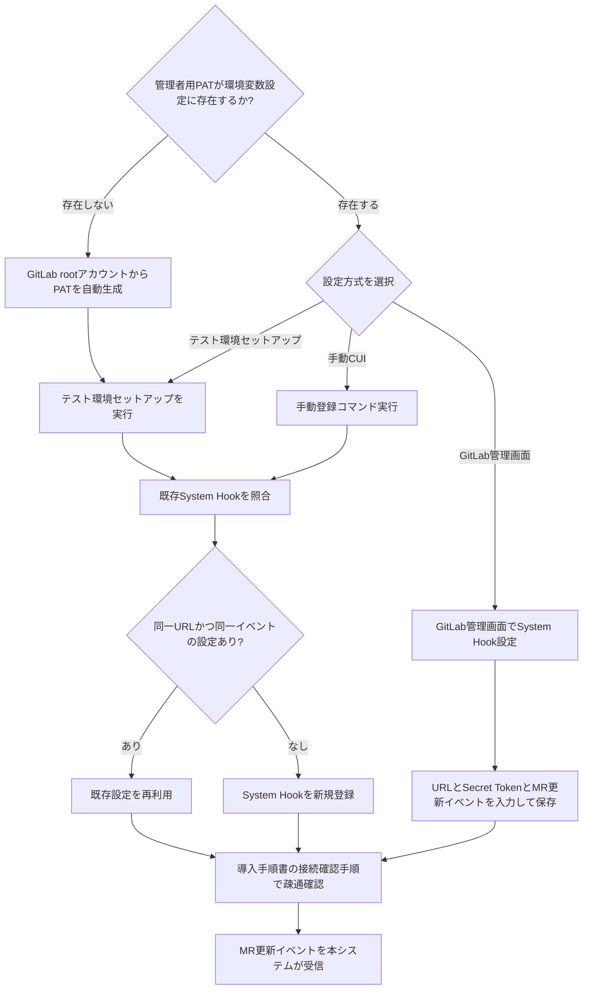
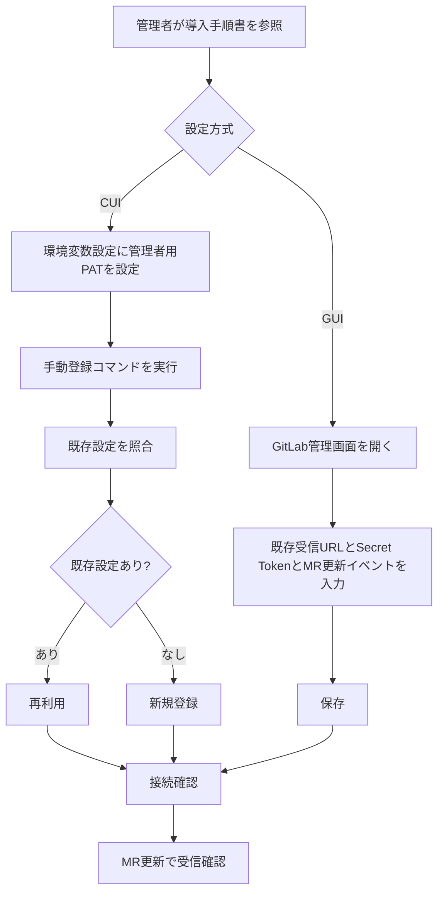

# GitLab System Hook標準化 変更要求仕様書

---

## 1. 目的・前提

### 1.1 変更の目的

本変更の目的は以下の2点を同じ重みで実現することである。

- GitLab CE で利用できない Group Webhook 前提を廃止し、GitLab CE で確実に運用できる連携方式へ切り替える
- Hook 設定をプロジェクト単位運用から管理者単位運用へ寄せ、設定漏れと運用負荷を低減する

### 1.2 解決すべき課題

| 課題ID | 課題 | 影響 | 解決方針 |
| --- | --- | --- | --- |
| CHG-SH-01 | Group Webhook を前提にした運用が GitLab CE では成立しない | GitLab CE 環境でリアルタイム連携方式を標準手順として案内できない | Group Webhook を正式に廃止し、MR 更新の検出に System Hook を標準方式として置き換える |
| CHG-SH-02 | プロジェクト単位 Hook 設定は対象追加時の設定漏れを誘発する | 対象プロジェクト追加時にイベント検知漏れが発生する | GitLab 管理者が一度設定する System Hook を標準運用にする |
| CHG-SH-03 | 管理者向けの登録方法が整理されていない | 初回導入時に設定担当者が手順を再調査する必要がある | 環境変数設定と CUI と GUI の両方で設定可能な手順を導入手順書に追加する |

### 1.3 前提

- 本変更は導入手順書全体の正式な導入手順に適用する
- 既存の `GITLAB_PAT` は bot 操作用のままとし、System Hook 登録には別の管理者用 PAT を用いる
- System Hook の受信先は既存の Webhook 受信エンドポイントを使用する
- System Hook の Secret Token は既存の `GITLAB_WEBHOOK_SECRET` を使用する
- System Hook で有効化するイベントは **Merge Request 更新イベントのみ**とする
- **Issue の検出は既存のポーリング方式を継続して使用する**。System Hook による Issue イベント受信は行わない
- テスト環境セットアップ実行時には System Hook 登録まで自動化する
- テスト環境セットアップ実行時、管理者用 PAT が環境変数設定に存在しない場合は GitLab root アカウントから PAT を自動生成して使用する
- 自動化とは別に、環境変数設定済みの管理者用 PAT を用いて専用コマンドで単独登録できるようにする
- 専用コマンドは冪等とし、同一 URL と同一対象イベントの既存設定がある場合は再利用し、存在しない場合のみ新規作成する

### 1.4 用語集

| 用語 | 説明 |
| --- | --- |
| System Hook | GitLab 管理者がインスタンス全体に対して設定するイベント通知機構 |
| 管理者用 PAT | GitLab 管理者権限で System Hook を登録するための Personal Access Token |
| 手動登録コマンド | 環境変数設定済みの管理者用 PAT を使用して System Hook の存在確認と登録を行う CUI 操作 |
| 自動登録 | テスト環境セットアップ時に System Hook 登録を自動で実行する方式 |
| PAT 自動生成 | テスト環境セットアップ時に管理者用 PAT が未設定の場合、GitLab root アカウントから PAT を生成して使用する処理 |
| ポーリング | 一定間隔で GitLab API を呼び出して Issue の更新を検出する既存方式 |

### 1.5 インターフェース形式

- System Hook 登録: CUI
- System Hook 設定ガイドの参照: 導入手順書
- GitLab 管理画面での設定作業: 外部 GUI

---

## 2. 業務

### 2.1 対象業務の変更

| No. | 業務名 | 区分 | 変更内容 |
| --- | --- | --- | --- |
| B-1 | MR 検出運用 | 変更 | MR 検出の Group Webhook 前提を廃止し、System Hook を標準方式に変更する |
| B-2 | Issue 検出運用 | 変更なし | Issue 検出は既存のポーリング方式を継続する |
| B-4 | テスト環境初期化運用 | 変更 | テスト環境セットアップ時に System Hook 自動登録を行う |
| B-5 | 導入時 GitLab 管理者設定運用 | 追加 | 管理者が CUI または GitLab 管理画面で System Hook を設定する |
| B-6 | Group Webhook 標準運用 | 削除 | Group Webhook を標準方式として案内する業務を廃止する |

### 2.2 業務フロー

### 2.3 業務の範囲・担当者

| 担当者 | 役割 |
| --- | --- |
| GitLab 管理者 | 管理者用 PAT を準備し、CUI または GitLab 管理画面で System Hook を設定する |
| テスト環境利用者 | テスト環境セットアップ実行時の自動登録結果を確認する |
| 本システム | 既存 Webhook 受信口で System Hook の MR イベントを受信し、MR 処理に引き渡す。Issue 検出はポーリングで継続する |

### 2.4 業務課題・KPI

| 課題ID | 業務課題 | KPI |
| --- | --- | --- |
| CHG-SH-01 | GitLab CE で標準導入手順が成立しない | 導入手順書の正式導入手順が GitLab CE 上で実施可能であること |
| CHG-SH-02 | Hook 設定漏れによるイベント未検知が発生しうる | 対象追加時の Hook 個別設定件数を 0 件にする |
| CHG-SH-03 | 設定担当者の導入負荷が高い | 管理者が導入手順書だけで設定完了できること |

### 2.5 今回解決すべき課題と対応方針

| 課題ID | 対応方針 | 機能区分 |
| --- | --- | --- |
| CHG-SH-01 | Group Webhook を削除し、MR 更新に System Hook を標準連携方式として扱う | 変更 |
| CHG-SH-02 | 管理者用 PAT を用いた冪等な登録処理を追加し、テスト環境では自動実行する | 追加 |
| CHG-SH-03 | 導入手順書に CUI 手順と GUI 手順、接続確認方法、失敗時確認観点を追加する | 追加 |

今回の変更で追加・変更される機能はすべて上記課題に紐づいており、課題に紐づかない機能は含めない。

### 2.6 見込み経営効果

| 効果種別 | 内容 |
| --- | --- |
| Soft Saving | プロジェクト単位 Hook 設定と導入時再調査の手作業を削減する |
| Cost Avoidance | Hook 設定漏れによる未処理タスクの再調査・再実行コストを抑制する |
| TCO Savings | GitLab CE を前提にした標準手順へ統一し、環境差異対応の保守コストを下げる |

---

## 3. 機能要件

### 3.1 機能一覧

| 機能ID | 機能名 | 区分 | 対応業務課題 | 説明 |
| --- | --- | --- | --- | --- |
| F-SH-01 | System Hook 標準化 | 変更 | CHG-SH-01, CHG-SH-02 | Group Webhook 標準化を廃止し、MR 更新の検出に System Hook を標準方式として扱う。Issue 検出はポーリング方式を継続する |
| F-SH-02 | 管理者用 PAT 設定 | 追加 | CHG-SH-02, CHG-SH-03 | bot 用 PAT と分離した管理者用 PAT を環境変数設定で受け取る |
| F-SH-03 | 手動登録コマンド | 追加 | CHG-SH-02, CHG-SH-03 | 管理者用 PAT で既存 System Hook を照合し、必要時のみ登録する |
| F-SH-04 | テスト環境自動登録 | 追加 | CHG-SH-02 | テスト環境セットアップ中に System Hook 登録を自動実行する |
| F-SH-05 | 導入ガイド更新 | 追加 | CHG-SH-01, CHG-SH-03 | 本番向けを含む導入手順書全体に CUI と GUI の設定手順を追加する |
| F-SH-06 | Group Webhook 標準手順削除 | 削除 | CHG-SH-01 | Group Webhook を標準方式として案内する記述と要件を削除する |

### 3.2 入力データ

| データ | 種別 | 説明 |
| --- | --- | --- |
| 管理者用 PAT | 人手 | GitLab 管理者が環境変数設定に登録する System Hook 登録用トークン |
| 既存 Webhook 受信 URL | 内部設定 | 本システムが既に公開している受信先 URL |
| 既存 Webhook Secret Token | 内部設定 | `GITLAB_WEBHOOK_SECRET` として保持する共有トークン |
| GitLab 上の既存 System Hook 一覧 | 外部 | 冪等判定に使用する現在の登録状態 |
| 導入手順書参照者の入力 | 人手 | GitLab 管理画面で URL、Secret Token、対象イベントを入力する |

### 3.3 出力データ

| データ | 出力先 | 説明 |
| --- | --- | --- |
| 登録済み System Hook 設定 | GitLab | 既存 URL と MR 更新イベントを持つ System Hook |
| 再利用判定結果 | CUI 実行結果 | 既存設定を再利用したか、新規登録したかを示す結果 |
| 導入手順 | ドキュメント | CUI 手順、GUI 手順、接続確認方法、失敗時確認観点 |

### 3.4 外部連携

| 連携先 | 連携方式 | 用途 |
| --- | --- | --- |
| GitLab 管理 API | REST API | System Hook 一覧取得と登録 |
| GitLab 管理画面 | GUI | 管理者による手動設定 |
| GitLab から本システム | System Hook | **Merge Request 更新イベントの通知のみ** |

### 3.5 CUI 仕様

#### 3.5.1 環境変数

| 項目 | 内容 |
| --- | --- |
| `GITLAB_PAT` | bot 操作用 PAT。System Hook 登録用途には使用しない |
| `GITLAB_ADMIN_PAT` | 管理者用 PAT。System Hook 登録用途で使用する。テスト環境セットアップ時は未設定の場合に自動生成される |
| `GITLAB_API_URL` | GitLab のベース URL |
| `GITLAB_WEBHOOK_SECRET` | 既存 Webhook 受信口と共用する Secret Token |

#### 3.5.2 手動登録コマンドの引数仕様

| 引数 | 必須 | 内容 |
| --- | --- | --- |
| 追加引数なし | はい | 環境変数設定だけで実行できること |

#### 3.5.3 自動登録の実行仕様

| 実行契機 | 内容 |
| --- | --- |
| テスト環境セットアップ | サービス起動と初期化の途中で System Hook 照合と必要時の登録を実行する |

| PAT 取得仕様 | 内容 |
| --- | --- |
| `GITLAB_ADMIN_PAT` が設定済みの場合 | 設定済みの値をそのまま使用する |
| `GITLAB_ADMIN_PAT` が未設定の場合 | GitLab root アカウントから管理者用 PAT を自動生成して使用する |

### 3.6 ユーザー利用フロー

### 3.7 業務フローとの対応関係

| 機能ID | 対応業務 |
| --- | --- |
| F-SH-01 | B-1 |
| F-SH-02 | B-5 |
| F-SH-03 | B-5 |
| F-SH-04 | B-4 |
| F-SH-05 | B-5 |
| F-SH-06 | B-6 |

### 3.8 ログ要否と内容、保存期間

追加の専用ログは必要ないため、通常のアプリ動作ログとエラーログの既存運用をそのまま利用する。追加のログ内容と保存期間の記述は行わない。

### 3.9 監視・アラート

監視・アラートは必要ないため、監視・アラートの内容と対応方法の記述は行わない。

---

## 4. データ

### 4.1 業務エンティティ一覧

| エンティティ | 種別 | 説明 |
| --- | --- | --- |
| System Hook 設定 | 外部データ | GitLab に登録されるインスタンス全体向け Hook 設定 |
| 管理者用 PAT | 内部データ | System Hook 登録時に使用する認証情報 |
| Webhook 受信共通設定 | 内部データ | 既存受信 URL と Secret Token の組 |
| 導入手順 | 内部データ | CUI 手順と GUI 手順を記載した運用文書 |

### 4.2 エンティティ別管理要件

| エンティティ | CRUD | 一覧 | 詳細 | 検索 | 状態 |
| --- | --- | --- | --- | --- | --- |
| System Hook 設定 | C:必要 / R:必要 / U:不要 / D:不要 | 必要 | 必要 | 必要 | 未登録 / 再利用 / 登録済み |
| 管理者用 PAT | C:必要 / R:必要 / U:必要 / D:不要 | 不要 | 必要 | 不要 | 未設定 / 設定済み |
| Webhook 受信共通設定 | C:既存 / R:必要 / U:既存 / D:不要 | 不要 | 必要 | 不要 | 有効 |
| 導入手順 | C:必要 / R:必要 / U:必要 / D:不要 | 不要 | 必要 | 必要 | 未反映 / 反映済み |

マスタに相当する管理者用 PAT と Webhook 受信共通設定は、導入時設定として管理対象に含める。

### 4.3 状態遷移

| エンティティ | 状態遷移 |
| --- | --- |
| System Hook 設定 | 未登録 → 登録済み、未登録 → 再利用、登録済み → 再利用 |
| 管理者用 PAT | 未設定 → 設定済み |
| 導入手順 | 未反映 → 反映済み |

### 4.4 内部データ／外部データ

| データ | 区分 | 保持期間 |
| --- | --- | --- |
| System Hook 設定 | 外部データ | GitLab 上で削除されるまで |
| 管理者用 PAT | 内部データ | 環境変数設定の管理期間に従う |
| Webhook 受信共通設定 | 内部データ | 既存設定の保持期間に従う |
| 導入手順 | 内部データ | ドキュメントが更新されるまで |

### 4.5 外部 DB 接続先、接続方法の一覧

| 接続先 | 接続方法 | 用途 |
| --- | --- | --- |
| GitLab 管理 API | HTTPS REST | System Hook 一覧取得と新規登録 |

### 4.6 DB の必要性の有無と理由

新規 DB は不要である。今回の変更で扱う情報は既存設定、GitLab 上の System Hook、導入手順文書で完結するためである。

---

## 5. 非機能要件

### 5.1 性能

| 項目 | 要件 |
| --- | --- |
| 手動登録コマンド | 同一条件の既存設定がある場合は再利用判定を返し、重複登録を行わない |
| テスト環境セットアップ | 既存のセットアップ完了条件を維持した上で System Hook 登録可否が判定できる |

### 5.2 利用人数

同時接続要件の変更はない。設定作業は管理者が個別に実施する前提とする。

### 5.3 セキュリティ

| 項目 | 要件 |
| --- | --- |
| PAT 分離 | bot 操作用 PAT と管理者用 PAT を分離する |
| Secret Token | 既存 `GITLAB_WEBHOOK_SECRET` を System Hook でも使用する |
| 権限 | System Hook 登録は管理者権限でのみ実行可能とする |
