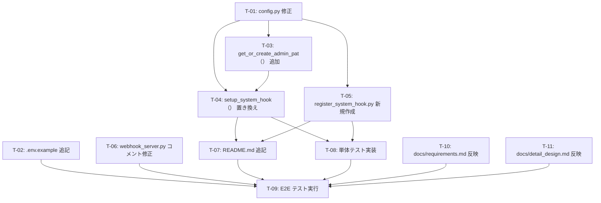

# GitLab System Hook 標準化 実装タスクリスト

> 対応変更設計書: `.history/20260504-switch-to-system-hook/change_detail_design.md`

---

## タスク一覧

### T-01: `shared/config/config.py` に `gitlab_admin_pat` フィールドを追加する

- **ファイル**: `shared/config/config.py`
- **変更内容**: `Settings` クラスの GitLab 接続設定セクションに `gitlab_admin_pat: str = ""` フィールドを追加する
- **完了条件**: `Settings` インスタンス生成時に `GITLAB_ADMIN_PAT` 環境変数から値が読み込まれること

---

### T-02: `.env.example` に `GITLAB_ADMIN_PAT` を追記する

- **ファイル**: `.env.example`
- **変更内容**: GitLab 接続設定セクションに `GITLAB_ADMIN_PAT` の説明コメントと入力例を追記する
- **完了条件**: `.env.example` をコピーして `.env` を作成した際に `GITLAB_ADMIN_PAT` の存在が分かること

---

### T-03: `scripts/test_setup.py` に `get_or_create_admin_pat()` を追加する

- **ファイル**: `scripts/test_setup.py`
- **変更内容**: `GITLAB_ADMIN_PAT` 環境変数を優先し、未設定時は既存の `get_root_token_via_docker()` を呼び出す `get_or_create_admin_pat()` 関数を追加する。`GITLAB_ADMIN_TOKEN` も後方互換として次の優先順位でフォールバックする
- **完了条件**: 環境変数未設定時に docker exec 経由で PAT が取得されること

---

### T-04: `scripts/test_setup.py` の `setup_group_webhook()` を `setup_system_hook()` に置き換える

- **ファイル**: `scripts/test_setup.py`
- **変更内容**:
  - `setup_group_webhook(root_token, group_id)` を削除する
  - `setup_system_hook(admin_pat: str) -> None` を追加する
  - `setup_system_hook()` は `GET /api/v4/hooks` で一覧取得後、`url`・`merge_requests_events` を照合し、一致がなければ `POST /api/v4/hooks` で登録する
  - メインフロー内で `setup_group_webhook()` を呼び出していた箇所を `setup_system_hook()` に置き換える
  - メインフロー内で `get_or_create_admin_pat()` を呼び出して admin_pat を取得してから `setup_system_hook()` に渡す
- **完了条件**: テスト環境セットアップ実行時に System Hook が登録または再利用されること

---

### T-05: `scripts/register_system_hook.py` を新規作成する

- **ファイル**: `scripts/register_system_hook.py`（新規）
- **変更内容**:
  - `_gitlab_api(method, path, token, **kwargs)` ヘルパーを追加する
  - `_register_system_hook(admin_pat, api_url, webhook_url, secret)` を追加する（`url`・`merge_requests_events` の照合と冪等登録）
  - `main()` を追加する（`GITLAB_ADMIN_PAT` 未設定時は標準エラー出力にメッセージを出力して終了コード 1 で終了する）
  - `if __name__ == "__main__":` でエントリーポイントを定義する
- **完了条件**: `GITLAB_ADMIN_PAT=<PAT> python scripts/register_system_hook.py` で System Hook が冪等登録できること

---

### T-06: `producer/webhook_server.py` のログコメントを更新する

- **ファイル**: `producer/webhook_server.py`
- **変更内容**: `_handle_webhook()` 内のコメント `# X-Gitlab-Event ヘッダーを取得してログに記録する（Group Webhook 標準化）` を `# X-Gitlab-Event ヘッダーを取得してログに記録する（System Hook）` に変更する
- **完了条件**: コメントが System Hook を指していること（機能変更なし）

---

### T-07: `README.md` に System Hook 設定手順を追記する

- **ファイル**: `README.md`
- **変更内容**:
  - CUI 手動登録手順（`GITLAB_ADMIN_PAT` の設定方法と `register_system_hook.py` の実行手順）
  - GUI 手順（GitLab 管理画面での URL・Secret Token・MR 更新イベントの設定手順）
  - 接続確認手順（Issue または MR を更新してログを確認する手順）
  - 失敗時確認観点（URL 誤り・Secret Token 不一致・対象イベント未選択・管理者権限不足の四点）
  - Group Webhook に関する既存記述を System Hook の記述に置き換える
- **完了条件**: 管理者が README.md だけで System Hook 設定を完了できること

---

### T-08: 単体テストを実装する

- **対象**: `scripts/test_setup.py` の `setup_system_hook()`・`get_or_create_admin_pat()` および `scripts/register_system_hook.py` の `_register_system_hook()`・`main()`
- **変更内容**: 設計書の UT-SH-01〜UT-SH-10 に対応する単体テストを実装する。GitLab API 呼び出しは `unittest.mock` でモックする
- **完了条件**: UT-SH-01〜UT-SH-10 が全て pass すること

---

### T-09: E2E テストを実行して確認する

- **対象**: シナリオ TS-SH-01〜TS-SH-06
- **手順**:
  1. `docker compose --profile test up -d` でテスト環境を起動する
  2. TS-SH-01: `GITLAB_ADMIN_PAT` を設定せずに `python scripts/test_setup.py` を実行し、PAT 自動生成と System Hook 登録をログで確認する
  3. TS-SH-02: `python scripts/register_system_hook.py` を 2 回実行し、2 回目が再利用になることを確認する
  4. TS-SH-03: GitLab 管理画面で手動設定を行い保存できることを確認する
  5. TS-SH-04: MR を更新して producer のログで `X-Gitlab-Event: System Hook` の受信を確認する
  6. TS-SH-05: `GITLAB_ADMIN_PAT` なしで `register_system_hook.py` を実行し、終了コード 1 とエラーメッセージを確認する
  7. TS-SH-06: `README.md` の失敗時確認観点セクションに四点が記載されていることを確認する
- **完了条件**: TS-SH-01〜TS-SH-06 が全て期待結果を満たすこと

---

### T-10: `docs/requirements.md` の変更点を反映する

- **ファイル**: `docs/requirements.md`
- **変更内容**: ドキュメント全体として整合性を保つよう、以下の箇所を更新する
  - `F-12 Group Webhook 標準化` を `F-12 System Hook 標準化` に置き換え、説明文を GitLab CE での System Hook 運用に対応した内容に更新する
  - `GITLAB_ADMIN_PAT` 環境変数の説明を GitLab 接続設定の一覧に追加する
  - Group Webhook を前提とした記述（連携方式の説明・外部連携一覧・セキュリティ要件など）を System Hook の記述に置き換える
- **完了条件**: `docs/requirements.md` 内に Group Webhook を標準方式として案内する記述が残っていないこと

---

### T-11: `docs/detail_design.md` の変更点を反映する

- **ファイル**: `docs/detail_design.md`
- **変更内容**: ドキュメント全体として整合性を保つよう、以下の箇所を更新する
  - 変更方針の記述（「Group Webhook 標準へ統一」など）を System Hook 標準化の方針に置き換える
  - Group Webhook 処理フロー（`4.4.2` などの該当セクション）を System Hook 処理フローに置き換える
  - `GITLAB_ADMIN_PAT` 環境変数の説明を環境変数一覧に追加する
  - Group Webhook を前提とした設定手順・セキュリティ設計・テスト設計の記述を System Hook に対応した内容に更新する
- **完了条件**: `docs/detail_design.md` 内に Group Webhook を標準方式として案内する記述が残っていないこと

---

## 実装順序

