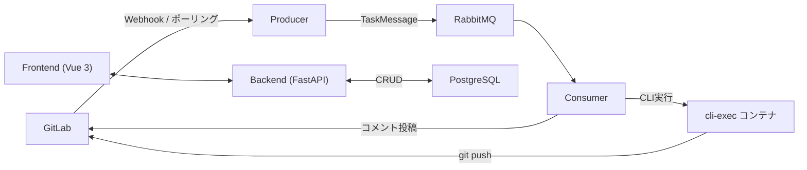

# CodingAgentAutomata

GitLab の Issue／MR を検出し、Claude Code や opencode などの CLI エージェントを自動実行するシステムです。

## システム概要



### 主な機能

| 機能 | 説明 |
|---|---|
| F-1 Webhook受信 | GitLab Webhook を受信してタスクをキューに投入 |
| F-2 ポーリング | 定期的に GitLab API をポーリングしてタスクを検出 |
| F-3 Issue→MR変換 | Issue を分析して作業ブランチと Draft MR を自動作成 |
| F-4 MR処理 | MR の指示に従い CLI エージェントがコードを実装・プッシュ |
| F-5 CLI実行環境管理 | Docker コンテナ上で CLI エージェントを隔離実行 |
| F-8 進捗報告 | CLI 実行中の標準出力を定期的に MR コメントに更新 |
| F-9 Web管理画面 | ユーザー管理・タスク履歴・CLI アダプタ設定 |
| F-10 重複処理防止 | DB ユニーク制約による二重処理防止 |

---

## 前提条件

- Docker 26 以上
- Docker Compose v2 以上

---

## 起動方法

### 本番環境起動

```bash
docker compose up -d --build
```

GitLab・LiteLLM Proxy を含まず、本システムコンポーネント（producer / consumer / backend / frontend / postgresql / rabbitmq）のみが起動します。

### テスト環境起動

```bash
docker compose --profile test up -d --build
```

GitLab CE・LiteLLM Proxy を含む全コンポーネントが起動します。

### cli-exec コンテナイメージのビルド

```bash
docker compose --profile build-only build
```

Claude Code 用・opencode 用の cli-exec コンテナイメージをビルドします。

---

## システムセットアップ手順

`docker compose up -d --build` 実行後に **初回のみ** 以下のコマンドを実行してください。

```bash
./scripts/setup.sh \
  --username admin \
  --email admin@example.com \
  --password 'Admin@123456' \
  --virtual-key 'sk-your-litellm-key' \
  --default-cli claude \
  --default-model claude-opus-4-5
```

このコマンドにより以下が自動実行されます:

- 初期管理者ユーザーの作成
- F-3 / F-4 初期プロンプトテンプレートの DB 投入
- 組み込み CLI アダプタ（`claude`・`opencode`）の登録

---

## テスト環境セットアップ手順

`docker compose --profile test up -d --build` およびシステムセットアップ後に実行してください。

テスト環境固有の変数を `.env` に追記してからスクリプトを実行します。

```bash
# .env に以下を追記
# GITLAB_ADMIN_TOKEN=<GitLab管理者PAT>
# LITELLM_MASTER_KEY=<LiteLLMマスターキー>
# WEBHOOK_URL=http://producer:8080/webhook
# BACKEND_URL=http://localhost:8000

./scripts/test_setup.sh
```

このコマンドにより以下が自動実行されます:

- GitLab botアカウント作成・PAT 発行
- テスト用プロジェクト作成・Webhook 設定
- テストユーザー（`testuser-claude`・`testuser-opencode`）作成
- LiteLLM Proxy でテスト用 Virtual Key 発行
- Backend API にテストユーザー登録

---

## 環境変数

`.env` ファイルを作成して設定してください。`.env.example` に全変数の説明があります。

```bash
cp .env.example .env
# .env を編集して各値を設定
```

### 必須環境変数（最小構成）

| 変数名 | 説明 |
|---|---|
| `GITLAB_PAT` | GitLab bot アカウントの Personal Access Token |
| `GITLAB_API_URL` | GitLab の API URL（例: `http://gitlab:80`） |
| `GITLAB_BOT_NAME` | bot アカウントのユーザー名 |
| `DATABASE_URL` | PostgreSQL 接続文字列 |
| `RABBITMQ_URL` | RabbitMQ AMQP 接続 URL |
| `ENCRYPTION_KEY` | AES-256-GCM 鍵（base64エンコード, 32バイト） |
| `JWT_SECRET_KEY` | JWT 署名鍵 |
| `GITLAB_WEBHOOK_SECRET` | Webhook 受信トークン |
| `GITLAB_PROJECT_IDS` | ポーリング対象 GitLab プロジェクト ID（カンマ区切り） |

### テスト環境追加変数

| 変数名 | 説明 |
|---|---|
| `OPENAI_API_KEY` | OpenAI API キー（LiteLLM Proxy で使用） |
| `ANTHROPIC_API_KEY` | Anthropic API キー（LiteLLM Proxy で使用） |
| `LITELLM_MASTER_KEY` | LiteLLM Proxy マスターキー |

---

## Web 管理画面

- **URL**: `http://localhost:80`
- ログイン後の遷移先:
  - 管理者 → `/users`（ユーザー一覧）
  - 一般ユーザー → `/tasks`（タスク実行履歴）

| 画面 | URL | 権限 |
|---|---|---|
| SC-01 ログイン | `/login` | 全員 |
| SC-02 ユーザー一覧 | `/users` | admin |
| SC-03 ユーザー詳細 | `/users/:username` | admin / 自分のみ |
| SC-04 ユーザー作成 | `/users/new` | admin |
| SC-05 ユーザー編集 | `/users/:username/edit` | admin / 自分のみ |
| SC-06 タスク履歴 | `/tasks` | admin: 全件 / user: 自分のみ |
| SC-07 システム設定 | `/settings` | admin |

---

## E2E テスト実行方法

テスト環境（`docker compose --profile test up`）とシステムセットアップ・テスト用セットアップが完了した状態で以下を実行してください。

```bash
docker compose run --rm test_playwright sh -c "npm install && npx playwright test"
```

### テスト結果確認

```bash
# レポートを生成してブラウザで確認
docker compose run --rm test_playwright sh -c "npm install && npx playwright test --reporter=html"
```

### テストシナリオ一覧

| テストファイル | 対象シナリオ |
|---|---|
| `e2e/tests/auth.spec.ts` | T-01（ログイン）・T-19〜T-21（権限制御）・T-27 |
| `e2e/tests/users.spec.ts` | T-01〜T-03（ユーザーCRUD）・T-15（削除）・T-17〜T-18・T-22 |
| `e2e/tests/tasks.spec.ts` | T-14（タスク履歴）・T-23（一般ユーザー権限）・T-25 |

---

## アーキテクチャ

### コンポーネント一覧

| コンポーネント | 役割 |
|---|---|
| `producer/` | Webhook受信・ポーリング・タスクキュー投入 |
| `consumer/` | タスクデキュー・CLI コンテナ管理・F-3/F-4処理 |
| `backend/` | FastAPI REST API・認証・ユーザー/タスク管理 |
| `frontend/` | Vue 3 + Vuetify 3 管理画面 |
| `shared/` | GitLabClient・RabbitMQClient・DBモデル・設定 |
| `cli-exec/claude/` | Claude Code 実行コンテナ（DinD） |
| `cli-exec/opencode/` | opencode 実行コンテナ（DinD） |

### セキュリティ

- **Virtual Key**: AES-256-GCM で暗号化保存。復号はタスク実行直前のみ
- **パスワード**: bcrypt（コストファクタ12）でハッシュ化
- **JWT 認証**: HS256、有効期限24時間
- **Webhook**: `X-Gitlab-Token` ヘッダーで検証
- **CLI ログ**: PostgreSQL 保存前に GitLab PAT をマスク処理
