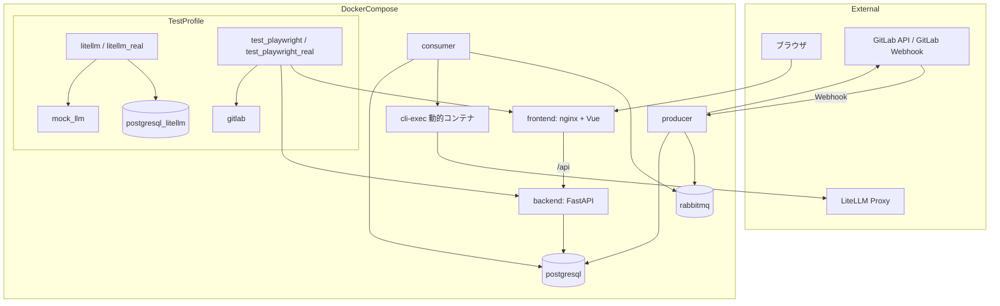
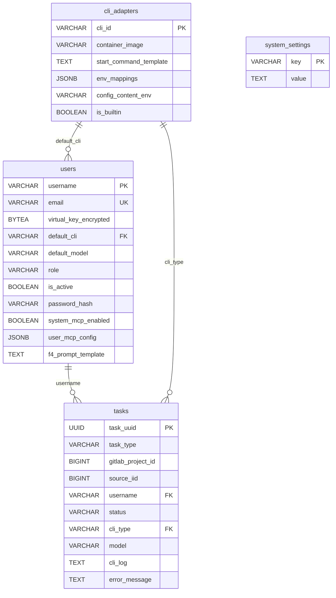
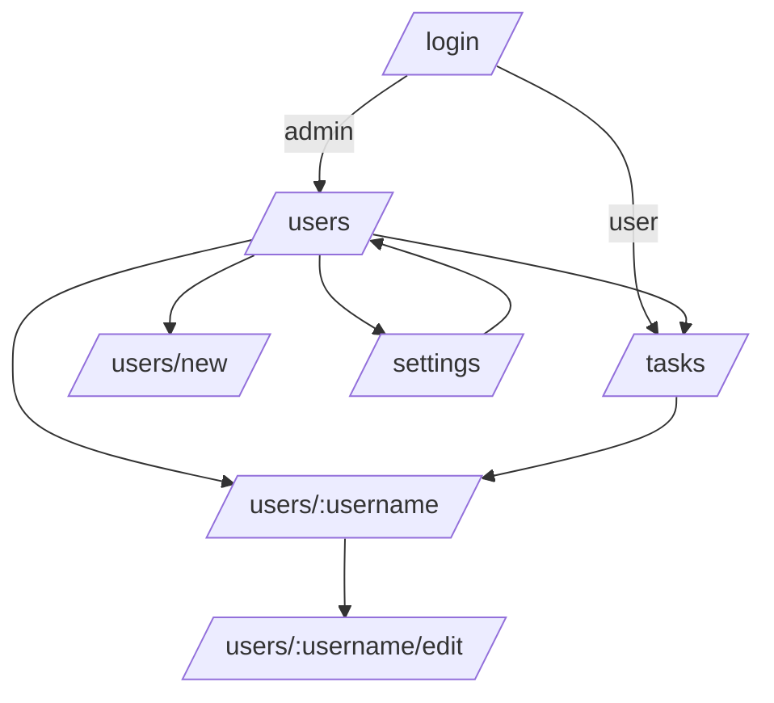
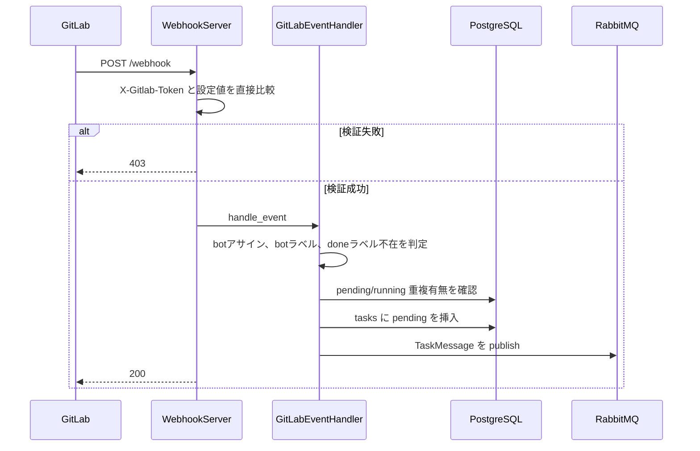
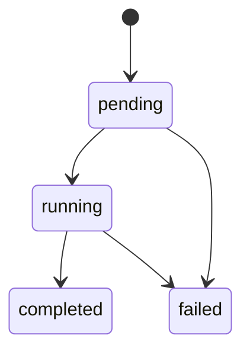
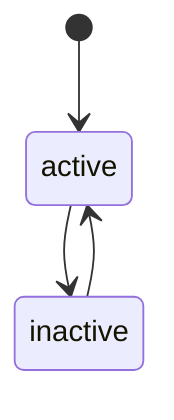
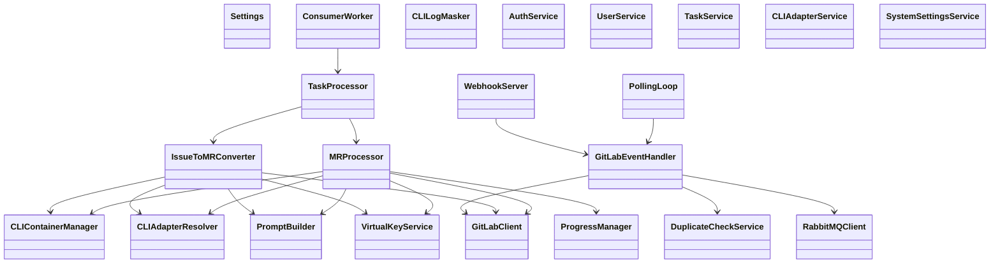

# CodingAgentAutomata 詳細設計書

この文書は、現行リポジトリ実装に基づく詳細設計書である。要件上の理想形ではなく、2026年4月24日時点でリポジトリに存在する実装内容と運用前提を記載する。

## 1. 言語・フレームワーク

| 対象 | 採用技術 | 補足 |
| --- | --- | --- |
| バックエンドAPI | Python 3.12 / FastAPI | 管理API、認証、設定管理を担当する |
| Producer | Python 3.12 / aiohttp | Webhook受信とポーリングを担当する |
| Consumer | Python 3.12 / asyncio | RabbitMQからのタスク処理を担当する |
| フロントエンド | Vue 3 / TypeScript / Vuetify / Pinia | 管理画面を担当する |
| フロント配信 | nginx | Vueビルド成果物の配信と /api 逆プロキシを担当する |
| データベース | PostgreSQL 16 | アプリケーションデータ永続化を担当する |
| メッセージキュー | RabbitMQ 3.13 | ProducerとConsumerの疎通を担当する |
| E2Eテスト | Playwright | docker compose上でGUI操作を行う |

### 1.1 フロントエンドとAPIの接続

- フロントエンドは nginx 配下で配信される
- APIリクエストは /api 配下へ送信する
- FastAPI 側は各ルーターを /api プレフィックスで登録する
- フロントエンドの axios クライアントは /api を baseURL とする

## 2. システム構成

### 2.1 コンポーネント一覧

| コンポーネント | 役割 | 常時利用 |
| --- | --- | --- |
| frontend | 管理画面配信、/api 逆プロキシ | はい |
| backend | 認証、ユーザー管理、タスク一覧、設定管理API | はい |
| producer | GitLab Webhook受信、GitLabポーリング、タスク投入 | はい |
| consumer | タスク処理、CLIコンテナ管理、進捗報告 | はい |
| postgresql | users、tasks、cli_adapters、system_settings の保持 | はい |
| rabbitmq | tasks キューの保持 | はい |
| postgresql_litellm | LiteLLM 用DB | テスト系のみ |
| mock_llm | モックLLMサーバー | test プロファイル |
| gitlab | GitLab CE テスト環境 | test / test-real プロファイル |
| litellm | モックLLMを背後に持つ LiteLLM Proxy | test プロファイル |
| litellm_real | 実LLMを背後に持つ LiteLLM Proxy | test-real プロファイル |
| test_playwright | Playwright 実行コンテナ | test プロファイル |
| test_playwright_real | Playwright 実行コンテナ | test-real プロファイル |
| cli_exec_claude | Claude系 CLI イメージビルド用サービス | build-only プロファイル |
| cli_exec_opencode | opencode CLI イメージビルド用サービス | build-only プロファイル |

### 2.2 全体構成図



### 2.3 ネットワーク構成

- すべてのサービスは codingagent_net 上で接続する
- frontend は 80 番ポートを公開する
- backend は 8000 番ポートを公開する
- producer は GitLab Webhook を受けるため 8080 番相当のHTTP待受を行う
- rabbitmq は 5672 と 15672 を公開する
- postgresql は 5432 を公開する
- consumer は docker.sock をマウントし、動的に CLI コンテナを起動する

## 3. データベース設計

### 3.1 アプリケーションDBの対象

アプリケーション本体では PostgreSQL を使用する。永続化対象は users、cli_adapters、tasks、system_settings の4テーブルである。

LiteLLM 用の postgresql_litellm は本体DBとは独立したテスト系補助DBであり、本節の業務データ設計対象には含めない。

### 3.2 テーブル一覧

| テーブル名 | 役割 |
| --- | --- |
| users | システム利用者、認証情報、Virtual Key、既定CLI設定を保持する |
| cli_adapters | 利用可能なCLIアダプタ設定を保持する |
| tasks | Issue/MR処理の状態と実行ログを保持する |
| system_settings | F-3/F-4テンプレートと system_mcp_config を保持する |

### 3.3 users

| カラム名 | 型 | 制約 | 説明 |
| --- | --- | --- | --- |
| username | VARCHAR(255) | PK | ユーザー名 |
| email | VARCHAR(255) | UNIQUE, NOT NULL | メールアドレス |
| virtual_key_encrypted | BYTEA | NOT NULL | 暗号化済み Virtual Key |
| default_cli | VARCHAR(255) | FK cli_adapters.cli_id, NOT NULL | 既定CLI |
| default_model | VARCHAR(255) | NOT NULL | 既定モデル |
| role | VARCHAR(20) | CHECK admin/user, NOT NULL | 権限 |
| is_active | BOOLEAN | NOT NULL | 有効フラグ |
| password_hash | VARCHAR(255) | NOT NULL | bcrypt ハッシュ |
| system_mcp_enabled | BOOLEAN | NOT NULL | システムMCP適用フラグ |
| user_mcp_config | JSONB | NULL | ユーザー個別MCP設定 |
| f4_prompt_template | TEXT | NULL | ユーザー個別F-4テンプレート |
| created_at | TIMESTAMPTZ | NOT NULL | 作成日時 |
| updated_at | TIMESTAMPTZ | NOT NULL | 更新日時 |

### 3.4 cli_adapters

| カラム名 | 型 | 制約 | 説明 |
| --- | --- | --- | --- |
| cli_id | VARCHAR(255) | PK | CLI識別子 |
| container_image | VARCHAR(512) | NOT NULL | 実行イメージ |
| start_command_template | TEXT | NOT NULL | 起動コマンドテンプレート |
| env_mappings | JSONB | NOT NULL | 環境変数マッピング |
| config_content_env | VARCHAR(255) | NULL | 設定JSONを渡す環境変数名 |
| is_builtin | BOOLEAN | NOT NULL | 組み込みフラグ |
| created_at | TIMESTAMPTZ | NOT NULL | 作成日時 |
| updated_at | TIMESTAMPTZ | NOT NULL | 更新日時 |

### 3.5 tasks

| カラム名 | 型 | 制約 | 説明 |
| --- | --- | --- | --- |
| task_uuid | UUID | PK | タスク識別子 |
| task_type | VARCHAR(50) | CHECK issue/merge_request, NOT NULL | タスク種別 |
| gitlab_project_id | BIGINT | NOT NULL | GitLabプロジェクトID |
| source_iid | BIGINT | NOT NULL | Issue IID または MR IID |
| username | VARCHAR(255) | FK users.username, NOT NULL | 処理対象ユーザー |
| status | VARCHAR(20) | CHECK pending/running/completed/failed, NOT NULL | 状態 |
| cli_type | VARCHAR(255) | FK cli_adapters.cli_id, NULL | 実行CLI |
| model | VARCHAR(255) | NULL | 実行モデル |
| cli_log | TEXT | NULL | 実行ログ |
| error_message | TEXT | NULL | エラー内容 |
| created_at | TIMESTAMPTZ | NOT NULL | 作成日時 |
| started_at | TIMESTAMPTZ | NULL | 開始日時 |
| completed_at | TIMESTAMPTZ | NULL | 完了日時 |

同一の gitlab_project_id、source_iid、task_type に対して、status が pending または running の行が複数存在しないように部分ユニークインデックスを作成する。

### 3.6 system_settings

| カラム名 | 型 | 制約 | 説明 |
| --- | --- | --- | --- |
| key | VARCHAR(255) | PK | 設定キー |
| value | TEXT | NOT NULL | 設定値 |
| updated_at | TIMESTAMPTZ | NOT NULL | 更新日時 |

管理対象キーは以下の3件である。

| キー | 用途 |
| --- | --- |
| f3_prompt_template | Issue から MR を生成するプロンプトテンプレート |
| f4_prompt_template | MR 処理の既定テンプレート |
| system_mcp_config | システム共通 MCP 設定 |

### 3.7 ER図



### 3.8 業務エンティティ一覧

| エンティティ | 一覧 | 詳細 | 作成 | 更新 | 削除 | 検索 | 状態管理 |
| --- | --- | --- | --- | --- | --- | --- | --- |
| users | あり | あり | あり | あり | あり | username 前方一致 | is_active による有効/無効 |
| cli_adapters | あり | 一覧ベース | あり | あり | あり | cli_id 単位 | is_builtin は保護属性であり業務状態ではない |
| tasks | あり | 専用詳細APIなし | Producer が作成 | Consumer が更新 | なし | username, status, task_type | pending, running, completed, failed |
| system_settings | なし | 一括取得 | 初期化時に投入 | あり | なし | キー単位 | 業務状態は持たない |

### 3.9 エンティティ対応関係

| エンティティ | 画面 | API | 主担当クラス |
| --- | --- | --- | --- |
| users | /users, /users/new, /users/:username, /users/:username/edit | /api/users, /api/users/{username}, /api/users/{username}/me | UserService, UserRepository |
| cli_adapters | /settings | /api/cli-adapters, /api/cli-adapters/{cli_id} | CLIAdapterService, CLIAdapterRepository |
| tasks | /tasks | /api/tasks | TaskService, TaskRepository, TaskProcessor |
| system_settings | /settings | /api/settings | SystemSettingsService, SystemSettingsRepository |

## 4. 外部設計

### 4.1 画面一覧

| 画面 | パス | 権限 | 説明 |
| --- | --- | --- | --- |
| ログイン | /login | 未認証可 | JWTログインを行う |
| ユーザー一覧 | /users | admin | ユーザー検索と一覧表示を行う |
| ユーザー作成 | /users/new | admin | 新規ユーザーを作成する |
| ユーザー詳細 | /users/:username | admin または本人 | ユーザー詳細を表示する |
| ユーザー編集 | /users/:username/edit | admin または本人 | ユーザー情報を編集する |
| タスク一覧 | /tasks | 認証済み | タスク履歴を表示する |
| システム設定 | /settings | admin | F-3/F-4テンプレートとCLI設定を扱う |

### 4.2 画面遷移



### 4.3 フロントエンドの認可制御

- 未認証で認証必須画面へ遷移した場合は /login へリダイレクトする
- 認証済みで /login に遷移した場合は admin は /users、一般ユーザーは /tasks にリダイレクトする
- 一般ユーザーが管理者専用画面へ遷移した場合は /tasks にリダイレクトする
- 一般ユーザーが他ユーザーの詳細画面または編集画面へ遷移した場合は /tasks にリダイレクトする

### 4.4 API一覧

| メソッド | パス | 権限 | 説明 |
| --- | --- | --- | --- |
| POST | /api/auth/login | 認証不要 | JWTトークンを発行する |
| GET | /api/users | admin | ユーザー一覧を取得する |
| POST | /api/users | admin | ユーザーを作成する |
| GET | /api/users/{username} | admin または本人 | ユーザー詳細を取得する |
| PUT | /api/users/{username} | admin | 管理者権限でユーザーを更新する |
| PUT | /api/users/{username}/me | 本人 | 一般ユーザーが自分を更新する |
| DELETE | /api/users/{username} | admin | ユーザーを削除する |
| GET | /api/tasks | 認証済み | タスク一覧を取得する |
| GET | /api/cli-adapters | admin | CLIアダプタ一覧を取得する |
| POST | /api/cli-adapters | admin | CLIアダプタを作成する |
| PUT | /api/cli-adapters/{cli_id} | admin | CLIアダプタを更新する |
| DELETE | /api/cli-adapters/{cli_id} | admin | CLIアダプタを削除する |
| GET | /api/settings | admin | システム設定を取得する |
| PUT | /api/settings | admin | システム設定を更新する |
| GET | /health | 認証不要 | backend ヘルスチェック |

### 4.5 外部システム連携

| 外部システム | 連携方法 | 目的 |
| --- | --- | --- |
| GitLab REST API | HTTPS REST API | Issue/MR取得、コメント投稿、ブランチ作成、MR作成 |
| GitLab Webhook | HTTP POST | Issue/MRイベント受信 |
| LiteLLM Proxy | HTTP API | CLI実行時のモデル呼び出し先 |

### 4.6 外部データベース連携

外部データベースとの直接連携は行わない。アプリケーションが利用する永続化先は PostgreSQL のみであり、外部DB連携設計は不要とする。

### 4.7 APIバリデーション・エラー仕様

| 区分 | 内容 |
| --- | --- |
| 共通入力検証 | FastAPI と Pydantic スキーマで型、必須項目、制約を検証する |
| 400 | ロール値不正、現在パスワード不足、組み込みCLI削除、参照中CLI削除などの業務エラー |
| 401 | ログイン失敗、JWT不正、JWT期限切れ |
| 403 | admin 権限不足、本人以外の参照更新 |
| 404 | 対象ユーザー、CLIアダプタ、タスク、GitLabリソース不在 |
| 409 | email 重複、cli_id 重複、タスク重複挿入 |
| 422 | リクエストボディやクエリのバリデーション不正 |

## 5. 内部設計

### 5.1 Webhook受信フロー



### 5.2 ポーリングフロー

- producer は polling_interval_seconds ごとに対象プロジェクトを巡回する
- Issue と Merge Request を GitLab API から取得する
- GitLabEventHandler に共通処理を集約し、Webhook経由と同じ投入判定を行う

### 5.3 F-3 Issue から MR 生成

- 対象ユーザーを users から取得する
- 無効ユーザーまたは未登録ユーザーの場合は Issue にエラーコメントを投稿して tasks を failed にする
- system_settings と users の設定をマージして MCP 設定文字列を構築する
- default_cli と default_model を使って CLI アダプタを解決する
- CLI コンテナを起動し、/tmp/prompt.txt にプロンプトを書き込む
- CLI標準出力の最終行JSONから branch_name と mr_title を取得する
- GitLab にブランチを作成し、Draft MR を作成する
- Issueコメントを MR にコピーし、Issue 側に完了コメントを投稿する
- タスクを completed に更新する

### 5.4 F-4 MR 処理

- 最初の reviewer を優先し、未設定時は author を処理ユーザーとする
- MR description から agent: 行を解析し、CLI と model の上書きを行う
- CLI コンテナを起動し、GitLab PAT を埋め込んだ clone URL でリポジトリを取得する
- ProgressManager が一定間隔で1件の MR コメントを作成または更新する
- monitor_assignees が一定間隔で bot のアサイン解除を監視する
- 正常終了時はラベル更新、完了コメント投稿、tasks completed を行う
- 失敗時はエラーコメント投稿、tasks failed を行う

### 5.5 トランザクション境界

| 処理 | 境界 | 備考 |
| --- | --- | --- |
| タスク投入 | tasks insert 単位 | 部分ユニーク制約で重複を防ぐ |
| ユーザー作成・更新・削除 | 1API呼び出し単位 | Repository 経由で commit する |
| タスク状態更新 | 1更新単位 | running、completed、failed を都度反映する |
| システム設定更新 | 1API呼び出し単位 | 指定されたキーのみ更新する |

### 5.6 排他制御

| 対象 | 方式 | 内容 |
| --- | --- | --- |
| タスク重複 | DB制約 | tasks_no_duplicate_active により pending/running の重複を防ぐ |
| email 重複 | DB制約 | users.email の UNIQUE 制約 |
| cli_id 重複 | PK制約 | cli_adapters.cli_id の主キー制約 |

### 5.7 状態遷移

#### tasks の状態遷移



#### users の状態管理



cli_adapters と system_settings は業務ワークフロー上の状態遷移を持たない。

## 6. クラス・モジュール設計

### 6.1 主要クラス一覧

| 配置 | クラスまたは実体 | 役割 |
| --- | --- | --- |
| shared/config/config.py | Settings | 環境変数設定を保持する |
| shared/gitlab_client/gitlab_client.py | GitLabClient | GitLab API 操作を担当する |
| shared/messaging/rabbitmq_client.py | RabbitMQClient | RabbitMQ publish/consume を担当する |
| shared/models/db.py | User, Task, CLIAdapter, SystemSetting | ORMモデルを表す |
| producer/gitlab_event_handler.py | GitLabEventHandler | イベント判定とタスク投入を担当する |
| producer/gitlab_event_handler.py | DuplicateCheckService | タスク重複を確認する |
| producer/webhook_server.py | WebhookServer | Webhook受信とトークン検証を担当する |
| producer/polling_loop.py | PollingLoop | GitLabポーリングを担当する |
| producer/producer.py | main | Producer全体起動を担当する |
| consumer/consumer.py | ConsumerWorker | RabbitMQのデキューとディスパッチを担当する |
| consumer/task_processor.py | TaskProcessor | task_type に応じて処理を振り分ける |
| consumer/issue_to_mr_converter.py | IssueToMRConverter | F-3処理を担当する |
| consumer/mr_processor.py | MRProcessor | F-4処理を担当する |
| consumer/cli_container_manager.py | CLIContainerManager | CLIコンテナ操作を担当する |
| consumer/cli_adapter_resolver.py | CLIAdapterResolver | CLI起動情報を解決する |
| consumer/progress_manager.py | ProgressManager | 進捗コメント更新を担当する |
| consumer/prompt_builder.py | PromptBuilder | F-3/F-4プロンプトを構築する |
| consumer/virtual_key_service.py | VirtualKeyService | Virtual Key の暗号化と復号を担当する |
| consumer/cli_log_masker.py | CLILogMasker | ログ中の機密値マスクを担当する |
| backend/services/auth_service.py | AuthService | JWT とパスワード認証を担当する |
| backend/services/user_service.py | UserService | ユーザー業務ロジックを担当する |
| backend/services/task_service.py | TaskService | タスク一覧取得を担当する |
| backend/services/cli_adapter_service.py | CLIAdapterService | CLIアダプタ管理を担当する |
| backend/services/system_settings_service.py | SystemSettingsService | システム設定管理を担当する |
| backend/repositories/*.py | 各Repository | 永続化操作を担当する |
| backend/routers/*.py | router | APIエンドポイント定義を担当する |

### 6.2 モジュール関係図



## 7. ソースコード構成

### 7.1 ディレクトリ構成

```text
CodingAgentAutomata/
├── .env.example
├── docker-compose.yml
├── backend/
│   ├── alembic/
│   ├── repositories/
│   ├── routers/
│   ├── schemas/
│   ├── services/
│   ├── Dockerfile
│   ├── main.py
│   └── pyproject.toml
├── consumer/
│   ├── Dockerfile
│   ├── consumer.py
│   ├── task_processor.py
│   ├── issue_to_mr_converter.py
│   ├── mr_processor.py
│   ├── cli_container_manager.py
│   ├── cli_adapter_resolver.py
│   ├── progress_manager.py
│   ├── prompt_builder.py
│   ├── cli_log_masker.py
│   ├── virtual_key_service.py
│   └── pyproject.toml
├── producer/
│   ├── Dockerfile
│   ├── producer.py
│   ├── webhook_server.py
│   ├── polling_loop.py
│   ├── gitlab_event_handler.py
│   └── pyproject.toml
├── shared/
│   ├── config/
│   ├── database/
│   ├── gitlab_client/
│   ├── messaging/
│   └── models/
├── frontend/
│   ├── src/
│   │   ├── api/
│   │   ├── plugins/
│   │   ├── router/
│   │   ├── stores/
│   │   ├── views/
│   │   ├── App.vue
│   │   └── main.ts
│   ├── Dockerfile
│   ├── nginx.conf
│   ├── package.json
│   └── vite.config.ts
├── e2e/
│   ├── tests/
│   ├── global-setup.ts
│   ├── package.json
│   └── playwright.config.ts
├── scripts/
│   ├── setup.py
│   ├── setup.sh
│   ├── test_setup.py
│   ├── test_setup.sh
│   └── gitlab_setup.py
└── cli-exec/
    ├── claude/
    └── opencode/
```

### 7.2 主要ファイル対応表

| ファイル | 役割 |
| --- | --- |
| backend/main.py | FastAPI起動、Alembic自動実行、router登録 |
| backend/routers/auth.py | ログインAPI |
| backend/routers/users.py | ユーザーAPI |
| backend/routers/tasks.py | タスク一覧API |
| backend/routers/cli_adapters.py | CLIアダプタAPI |
| backend/routers/settings.py | システム設定API |
| producer/producer.py | Producer起動 |
| producer/webhook_server.py | Webhook受信 |
| producer/polling_loop.py | GitLabポーリング |
| producer/gitlab_event_handler.py | イベント判定とタスク投入 |
| consumer/consumer.py | Consumer起動 |
| consumer/task_processor.py | タスク種別ディスパッチ |
| consumer/issue_to_mr_converter.py | F-3実装 |
| consumer/mr_processor.py | F-4実装 |
| consumer/cli_container_manager.py | コンテナ制御 |
| consumer/progress_manager.py | 進捗コメント更新 |
| shared/config/config.py | 設定読み込み |
| shared/database/database.py | DB接続と SessionLocal |
| shared/gitlab_client/gitlab_client.py | GitLab API ラッパー |
| shared/messaging/rabbitmq_client.py | RabbitMQ ラッパー |
| shared/models/db.py | ORM定義 |
| frontend/src/router/index.ts | 画面ルーティングとガード |
| frontend/src/api/client.ts | APIクライアント |
| e2e/tests/auth.spec.ts | 認証と認可のE2E |
| e2e/tests/users.spec.ts | ユーザー管理のE2E |
| e2e/tests/tasks.spec.ts | タスク一覧と画面遷移のE2E |
| e2e/tests/gitlab_integration.spec.ts | GitLab連携のE2E |

## 8. テスト設計

### 8.1 現在リポジトリに存在するテスト

| 種別 | 配置 | 内容 |
| --- | --- | --- |
| E2E | e2e/tests/auth.spec.ts | ログイン、認可、ログアウト |
| E2E | e2e/tests/users.spec.ts | ユーザー作成、編集、削除、重複エラー |
| E2E | e2e/tests/tasks.spec.ts | タスク画面表示、フィルタ、ナビゲーション |
| E2E | e2e/tests/gitlab_integration.spec.ts | Webhook、ポーリング、MR処理、進捗更新、重複防止 |

### 8.2 E2E実行方式

- Playwright は docker compose 上の test_playwright または test_playwright_real で実行する
- ベースURLは frontend サービス名を使う
- GitLab 統合テストは GitLab CE と LiteLLM 系サービスを含むプロファイル起動が前提である
- Playwright は workers を 1 に固定し、Consumer の単一処理前提に合わせる

### 8.3 テスト設計上の現状

- リポジトリには Python 側の単体テストおよび結合テストは配置されていない
- 現在の自動検証の中心は Playwright E2E である
- GitLab 統合テストはタスク状態を backend API から取得して補助判定する

## 9. 運用設計

### 9.1 起動プロファイル

| プロファイル | 用途 |
| --- | --- |
| 通常起動 | frontend、backend、producer、consumer、postgresql、rabbitmq を起動する |
| test | GitLab CE、mock_llm、litellm、test_playwright を追加する |
| test-real | GitLab CE、litellm_real、test_playwright_real を追加する |
| build-only | cli-exec 向けイメージだけをビルドする |

### 9.2 初期化とセットアップ

- backend は起動時に Alembic の head まで自動適用する
- scripts/setup.sh と scripts/setup.py は通常環境の初期設定を担当する
- scripts/test_setup.sh と scripts/test_setup.py は GitLab テスト環境とテストユーザー準備を担当する
- README.md に起動方法、環境変数、E2Eテスト実行方法を記載する

## 10. ログ・セキュリティ・監視

### 10.1 セキュリティ設計

| 項目 | 内容 |
| --- | --- |
| Virtual Key保存 | AES-256-GCM で暗号化して users.virtual_key_encrypted に保存する |
| パスワード保存 | bcrypt ハッシュで保存する |
| API認証 | JWT Bearer 認証を使用する |
| API認可 | admin 権限判定と本人判定を使い分ける |
| Webhook検証 | X-Gitlab-Token と設定値を直接比較する |
| CLIログ保護 | CLILogMasker で PAT 等をマスクして保存する |
| CLI秘密情報 | Virtual Key と GitLab PAT は実行時のみ使用し、コンテナ破棄で消去する |

### 10.2 ログ設計

| ログ対象 | 出力先 | 説明 |
| --- | --- | --- |
| アプリケーションログ | 各コンテナ標準出力 | producer、consumer、backend の動作ログ |
| CLI実行ログ | tasks.cli_log | Issue/MR 処理時のCLI出力 |
| エラー情報 | tasks.error_message および標準出力 | タスク失敗理由 |

### 10.2.1 監査ログ

認証・認可に紐づく専用の監査ログは、現行実装には存在しない。ユーザー更新や設定更新の履歴保持は未実装であり、必要になった場合は別途追加実装が必要である。

### 10.3 監視設計

| 対象 | 方法 | 備考 |
| --- | --- | --- |
| backend | /health | FastAPI 健康確認 |
| producer | /health | WebhookServer 健康確認 |
| 各コンテナ | restart: always | compose の自動再起動に依存 |
| postgresql | healthcheck | pg_isready を使用 |
| rabbitmq | コンテナ死活監視 | 管理UIの疎通確認は別運用 |

専用のアラート基盤や永続監視基盤は、このリポジトリ内には実装されていない。
