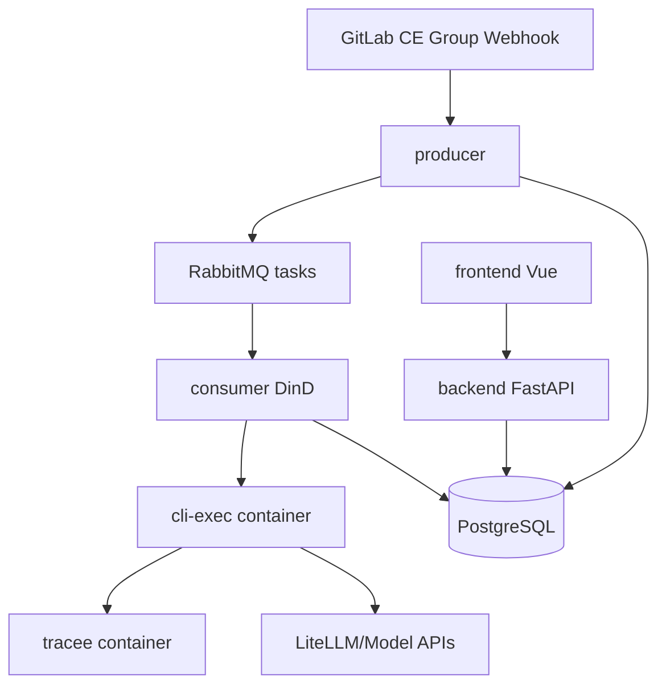
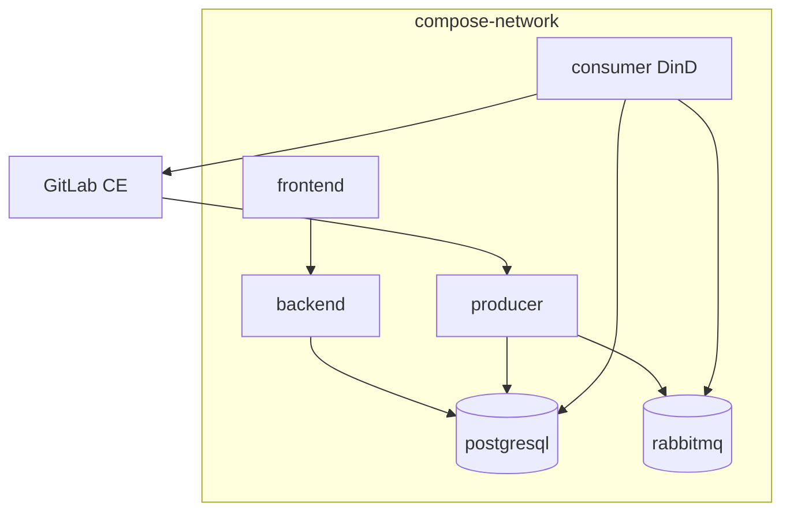
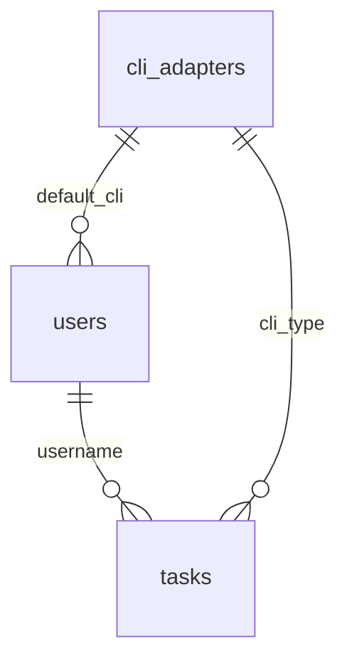
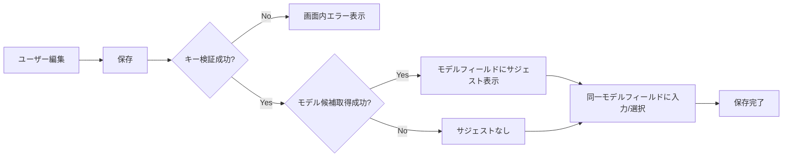
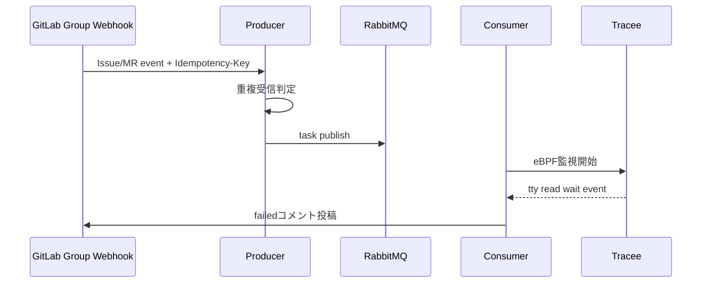
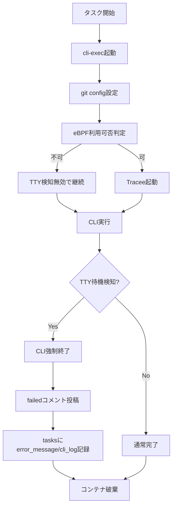
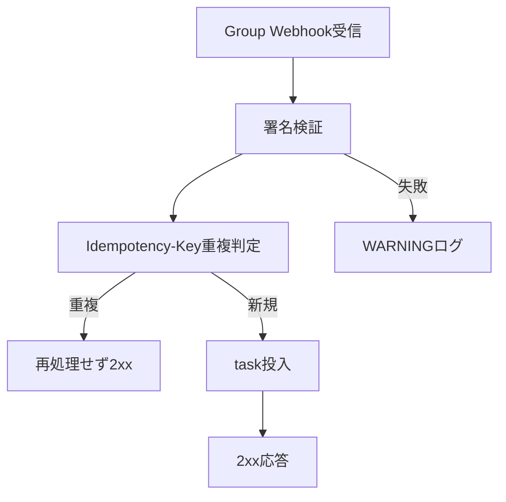
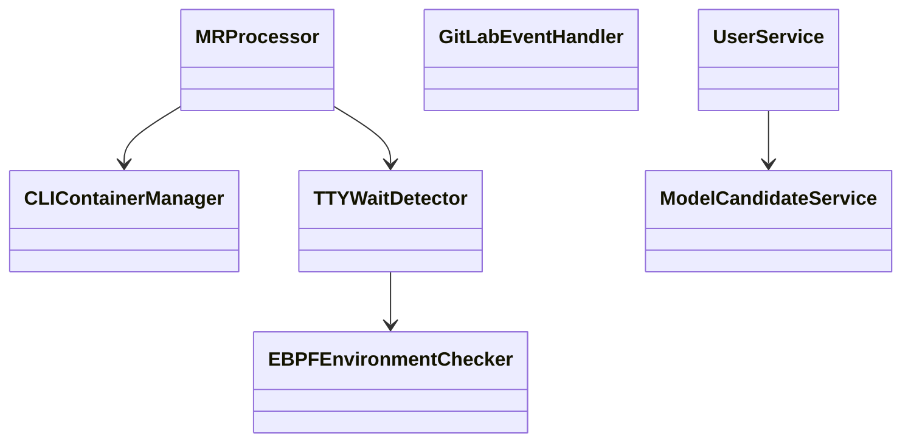
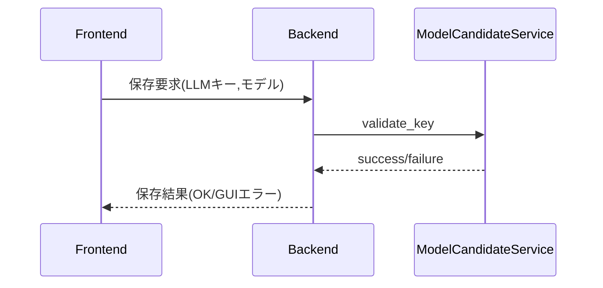

# CodingAgentAutomata 変更詳細設計書（TTY入力待機検知 / Group Webhook運用 / LLM設定検証）

## 1. 言語・フレームワーク

### 1.1 変更方針

| 区分 | 変更前 | 変更後 | 理由 |
|---|---|---|---|
| バックエンド | Python 3.12 / FastAPI | 変更なし | 既存資産を維持し、機能追加のみで要件を満たせるため |
| Consumer 実行形態 | 通常コンテナ | DinDベースコンテナへ変更（eBPF利用条件を満たす） | TTY待機検知を成立させる必須前提 |
| Webhook運用 | Project Webhook前提が混在 | Group Webhook標準へ統一 | 運用集約と設定漏れ低減 |
| フロントエンド | Vue3 + Vuetify | 変更なし（設定画面に検証UIを追加） | GUI追加不要で既存画面拡張で対応可能 |

### 1.2 フロント/バックの接続

既存設計を継続する。

- nginx でフロント配信
- API は /api 配下
- フロントから /api 配下へリクエスト

## 2. システム構成

### 2.1 変更対象コンポーネント一覧

| コンポーネント | 変更内容 | 変更種別 |
|---|---|---|
| consumer | DinD実行前提、eBPF初期化判定、Tracee監視、TTY待機時強制終了 | 変更 |
| consumer/CLIContainerManager | cli-exec起動後にgit config実行、Tracee管理APIを追加 | 変更 |
| consumer/MRProcessor | TTY検知イベント統合、失敗報告拡張 | 変更 |
| producer/WebhookServer | Group Webhookイベント取り込みを標準化 | 変更 |
| producer/GitLabEventHandler | Idempotency-Keyによる重複受信防御 | 変更 |
| backend/users settings API | LLMキー保存時バリデーション導入 | 変更 |
| frontend 設定画面 | モデル候補表示 + 手入力許可 + 保存時エラー表示 | 変更 |
| postgresql | 新規テーブルなし | 変更なし |
| rabbitmq | キュー利用方式は維持 | 変更なし |

### 2.2 全体構成図（変更後）

### 2.3 コンポーネント間インターフェース

| 送信元 | 送信先 | I/F | 主データ |
|---|---|---|---|
| GitLab | producer | HTTPS POST (Group Webhook) | イベント payload + Idempotency-Key |
| producer | RabbitMQ | AMQP | task message |
| consumer | cli-exec | Docker API | 起動コマンド、環境変数、prompt |
| consumer | tracee | Docker API | tracee起動/停止、イベント取得 |
| consumer | GitLab | REST API | コメント投稿、MR/Issue情報 |
| backend | LiteLLM等 | HTTP | キー妥当性検証、モデル候補取得 |

### 2.4 ネットワーク構成図

---

## 3. データベース設計

### 3.1 DB要否

既存要件どおり PostgreSQL は必須であり継続利用する。新規DBは追加しない。

### 3.2 スキーマ変更方針

| 項目 | 方針 |
|---|---|
| 新規テーブル | 追加しない |
| 既存カラム | 追加しない |
| 利用カラム | tasks.error_message / tasks.cli_log をTTY検知詳細で活用 |
| 既存制約 | tasks の重複防止制約を継続利用 |

### 3.3 データ整合性（PK/FK/業務制約）

| 対象 | 制約 |
|---|---|
| users | username PK、email UNIQUE |
| tasks | task_uuid PK、username FK、cli_type FK |
| tasks重複防止 | gitlab_project_id + source_iid + task_type + status(pending/running) の部分ユニーク |
| Webhook重複 | Idempotency-Key を処理単位で判定し再処理抑止（永続化なし、受信処理内で防御） |

### 3.4 ER関係（変更後）

---

## 4. アーキテクチャ設計

### 4.1 外部設計（GUI/CUI）

#### 4.1.1 GUI変更（ユーザー設定画面）

- 画面追加は行わず、既存ユーザー設定画面を拡張する
- 保存時にLLMキー妥当性チェックを実行する
- モデル入力は単一フィールドとし、モデル候補取得成功時のみサジェストを表示する
- モデル候補取得失敗時はサジェストを表示せず、同一フィールドへの直接入力で継続可能とする
- エラーはGUIで完結表示し、バックエンド処理失敗と混同させない

#### 4.1.2 画面一覧（変更対象のみ）

| 画面 | 変更内容 |
|---|---|
| ユーザー編集 | LLMキー検証結果表示、単一モデル入力フィールド、候補サジェスト表示 |
| システム設定 | F-3/F-4テンプレートに必須指示を含める運用を明示 |
| タスク履歴 | TTY検知エラー理由の可視化（error_message/cli_log） |

#### 4.1.3 画面遷移図（変更影響）

#### 4.1.4 AAモックアップ

ユーザー編集画面（LLM設定領域）

| 表示要素 | 内容 |
|---|---|
| 画面タイトル | ユーザー編集 |
| LLMキー入力欄 | マスク表示で入力し、同一領域に検証結果を表示 |
| 検証結果表示 | OK またはエラー理由を表示 |
| モデル入力欄 | 単一入力欄を使用し、候補取得成功時のみサジェストを表示 |
| 保存操作 | 保存ボタンとキャンセルボタンを表示 |

### 4.2 外部システム連携設計

| 外部システム | 連携内容 | 変更点 |
|---|---|---|
| GitLab Group Webhook | Issue/MRイベント受信 | Project固定依存を廃止 |
| GitLab REST API | コメント投稿、MR/Issue取得 | TTY検知失敗文言を追加 |
| LiteLLM/Model APIs | キー検証、モデル候補取得 | 保存時検証導入 |
| Linuxカーネル(eBPF) | Traceeでread(2)監視 | DinD前提で導入 |

#### 外部連携データフロー

### 4.3 外部DB連携設計

外部DB連携は追加しない。既存どおり PostgreSQL のみ利用する。

### 4.4 内部設計（処理フロー）

#### 4.4.1 TTY検知処理フロー

#### 4.4.2 Group Webhook処理フロー

#### 4.4.3 バッチ/定期処理

- 既存ポーリング処理は継続
- Webhook運用を主とし、ポーリングは補助（障害時補完）

### 4.5 トランザクション境界・ロールバック条件

| 処理 | 境界 | ロールバック条件 |
|---|---|---|
| Webhook受信からtask投入 | 1イベント単位 | DB挿入失敗・キュー投入失敗時は投入中止、WARNING記録 |
| タスク状態更新 | 1状態遷移単位 | 更新失敗時は再実行せずfailed化して記録 |
| ユーザー設定保存 | 1API呼び出し単位 | キー検証失敗時は保存ロールバック |
| TTY検知失敗反映 | コメント投稿 + DB更新単位 | 片系失敗時は残りを継続実行し最終的にfailedで確定 |

### 4.6 排他制御

| 対象 | 方式 | 内容 |
|---|---|---|
| タスク重複 | 楽観 + DB制約 | 部分ユニーク制約違反で二重起動を防止 |
| Webhook再送 | 楽観 | Idempotency-Key で同一イベント再処理抑止 |
| ユーザー設定 | 楽観 | 更新時の入力検証で不正値保存を拒否 |

### 4.7 API入出力・バリデーション・エラー仕様（変更分）

| API | 入力 | 成功 | エラー |
|---|---|---|---|
| PUT /api/users/{username} | LLMキー、モデル | 200 + 保存済み設定 | 400(検証失敗), 403, 404, 422 |
| GET /api/users/{username}/model-candidates | LLMキー | 200 + 候補一覧 | 400(キー不正), 502(外部取得失敗) |
| POST /webhook | Group Webhook payload | 200/202 | 403(署名不正), 400(payload不備) |

エラー仕様の追加方針:

- GUI入力エラーはユーザー修正可能な文言で返却
- TTY待機検知は業務エラーとして failed に分類
- eBPF利用不可は処理継続可能な WARNING とする

---

## 5. クラス設計

### 5.1 変更クラス一覧（SOLID適用）

| クラス | 役割 | S | O | L | I | D |
|---|---|---|---|---|---|---|
| TTYWaitDetector（新規） | Tracee起動・監視・判定 | ○ | ○ | ○ | ○ | ○ |
| EBPFEnvironmentChecker（新規） | BTF/CAP判定 | ○ | ○ | ○ | ○ | ○ |
| CLIContainerManager（変更） | git config設定、TTY監視開始/停止連携 | ○ | ○ | ○ | ○ | ○ |
| MRProcessor（変更） | TTY検知失敗時の制御統合 | ○ | ○ | ○ | ○ | ○ |
| GitLabEventHandler（変更） | Group Webhook + Idempotency判定 | ○ | ○ | ○ | ○ | ○ |
| UserService（変更） | LLMキー保存時検証 | ○ | ○ | ○ | ○ | ○ |
| ModelCandidateService（新規） | モデル候補取得 | ○ | ○ | ○ | ○ | ○ |

### 5.2 主要属性・メソッド

| クラス | 主な属性 | 主なメソッド |
|---|---|---|
| TTYWaitDetector | tracee_image, timeout_sec | start(), poll_event(), stop(), is_tty_wait() |
| EBPFEnvironmentChecker | btf_path, cap_mask | check_btf(), check_caps(), evaluate() |
| ModelCandidateService | endpoint, timeout | validate_key(), fetch_models() |

### 5.3 クラス図

### 5.4 メッセージ一覧

| メッセージ | 送信元 | 宛先 | 内容 |
|---|---|---|---|
| WebhookReceived | GitLab | Producer | Group Webhookイベント |
| TaskQueued | Producer | RabbitMQ | 非同期実行要求 |
| TTYWaitDetected | TTYWaitDetector | MRProcessor | tty_read_wait 検知通知 |
| TaskFailedReported | MRProcessor | GitLab | 失敗コメント投稿 |
| LLMKeyValidationResult | Backend | Frontend | 保存可否と理由 |

### 5.5 メッセージフロー図

---

## 6. その他設計

### 6.1 エラーハンドリング一覧

| エラーID | 発生箇所 | 条件 | 対応 |
|---|---|---|---|
| E-TTY-001 | eBPF初期化 | BTF不足 | WARNING記録、TTY検知無効で継続 |
| E-TTY-002 | eBPF初期化 | CAP不足 | WARNING記録、TTY検知無効で継続 |
| E-TTY-003 | Tracee監視 | TTY待機検知 | CLI強制終了、failed報告 |
| E-WB-001 | Webhook受信 | 署名不正 | 403応答、WARNING記録 |
| E-WB-002 | Webhook処理 | 重複受信 | 再処理せず2xx |
| E-LLM-001 | 設定保存 | キー妥当性失敗 | GUIエラー返却、保存中止 |
| E-LLM-002 | 候補取得 | 外部取得失敗 | 手入力継続、WARNING記録 |

### 6.2 セキュリティ設計

| 項目 | 設計 |
|---|---|
| 認証 | 既存JWT継続 |
| 認可 | 既存ロール制御継続 |
| Webhook検証 | Secretトークン検証を維持 |
| 監査ログ | タスク失敗記録にTTY検知根拠を追加 |
| 機密情報保護 | CLILogMaskerを継続適用 |
| DinD権限 | --privileged前提で運用し、利用者を信頼境界内に限定 |

---

## 7. コード設計

### 7.1 変更後ディレクトリ設計（差分のみ）

| 配置 | 変更対象 |
|---|---|
| consumer | tty_wait_detector.py（新規）、ebpf_environment_checker.py（新規）、mr_processor.py（変更）、cli_container_manager.py（変更） |
| producer | webhook_server.py（変更）、gitlab_event_handler.py（変更） |
| backend/services | user_service.py（変更）、model_candidate_service.py（新規） |
| backend/routers | users.py（変更） |
| frontend/src/views | UserEditView.vue（変更） |
| frontend/src/api | client.ts（変更） |

### 7.2 ファイル責務表（変更分）

| ファイル | 役割 | 含まれる主要クラス |
|---|---|---|
| consumer/tty_wait_detector.py | Tracee監視管理 | TTYWaitDetector |
| consumer/ebpf_environment_checker.py | eBPF前提条件判定 | EBPFEnvironmentChecker |
| backend/services/model_candidate_service.py | 候補取得とキー検証 | ModelCandidateService |

### 7.3 共通化設計（重複排除）

同一コード重複禁止のため、以下を共通化する。

| 共通化対象 | 配置先 |
|---|---|
| eBPF可否判定 | consumer/ebpf_environment_checker.py |
| TTY待機判定ロジック | consumer/tty_wait_detector.py |
| LLMキー検証ロジック | backend/services/model_candidate_service.py |
| Webhook重複判定 | producer/gitlab_event_handler.py 内専用メソッド |

### 7.4 コーディング規約（変更適用）

| 規約 | 適用内容 |
|---|---|
| Python | PEP8、型ヒント必須、副作用処理はサービス層へ集約 |
| TypeScript/Vue | 画面ロジックは composable/store を優先、API呼び出しは client.ts 集約 |
| ログ | 機密値マスクを必須適用 |

---

## 8. テスト設計

### 8.1 テスト種類

| 種類 | 目的 | 対象 |
|---|---|---|
| 単体テスト | 判定ロジックの正確性 | eBPF判定、TTY検知、キー検証、重複判定 |
| 結合テスト | サービス間連携検証 | producer-consumer、consumer-gitlab、backend-frontend |
| 総合テスト | 要件達成確認 | F-5系、WB系、C系 |
| E2Eテスト | ユーザー視点GUI/運用確認 | 設定画面、タスク履歴、GitLab連携 |

### 8.2 実装すべきテストケース（要件対応）

| テストID | 種類 | 対応要件 | 検証内容 |
|---|---|---|---|
| UT-TTY-01 | 単体 | F-5.1 | BTF不足で無効化 |
| UT-TTY-02 | 単体 | F-5.3 | tty_read_wait判定 |
| UT-TTY-03 | 単体 | F-5.4 | 検知時強制終了呼び出し |
| IT-TTY-01 | 結合 | F-5.5/F-5.6 | failedコメント + tasks更新 |
| IT-WB-01 | 結合 | WB-1 | Group Webhook受信 |
| IT-WB-02 | 結合 | WB-3 | Idempotency-Key重複抑止 |
| UT-LLM-01 | 単体 | C-1 | 無効キー保存拒否 |
| IT-LLM-01 | 結合 | C-3/C-4 | 候補取得失敗時手入力継続 |
| E2E-C-01 | E2E | C-1〜C-4 | ユーザー設定画面操作 |
| E2E-TTY-01 | E2E | TS-5.6 | TTY待機検知でfailed |
| E2E-WB-01 | E2E | TS-WB-1 | Group Webhook経由処理 |

### 8.3 正常/異常網羅

- 正常: 検知有効で通常完了、Group Webhook通常処理、LLM設定正常保存
- 異常: eBPF無効、TTY待機検知、署名不正、重複受信、キー不正、候補取得失敗

---

## 9. 運用設計

### 9.1 起動・運用

| 項目 | 設計 |
|---|---|
| 起動方式 | docker compose を継続 |
| 初期化 | backend起動時マイグレーション継続 |
| consumer前提 | DinD実行条件を満たすイメージ/権限で起動 |
| README反映 | 起動手順、TTY検知前提、Group Webhook設定手順を記載する |

### 9.2 運用ルール

| ルール | 内容 |
|---|---|
| Group Webhook | 対象グループにOwner権限で設定管理 |
| 再送方針 | 受信失敗時はGitLab再送を利用 |
| TTY検知運用 | eBPF不可時は無効化継続しWARNING監視 |

---

## 10. ログ・監視・アラート設計

### 10.1 ログ設計

| ログ種別 | 必須 | 出力先 | 内容 |
|---|---|---|---|
| TTY検知ログ | 必須 | consumerログ + tasks.cli_log | 検知時刻、根拠イベント |
| eBPF初期化ログ | 必須 | consumerログ | BTF/CAP判定結果 |
| Webhook受信ログ | 必須 | producerログ | 受信成功/失敗、重複判定結果 |
| LLM設定検証ログ | 必須 | backendログ | 検証失敗理由、候補取得失敗 |

### 10.2 監視・アラート設計

監視・アラートの専用基盤追加は必須ではないため、既存監視を継続し、以下の運用監視項目のみ追加する。

| 監視項目 | 方法 | 対応 |
|---|---|---|
| TTY検知失敗発生頻度 | ログ集計 | 多発時にテンプレート/入力要件を見直し |
| Webhook 403率 | producerログ監視 | Secret設定を確認 |
| LLM検証失敗率 | backendログ監視 | ユーザー入力案内を改善 |

### 10.3 障害対応

| 障害 | 一次対応 |
|---|---|
| eBPF起動不可 | 無効化継続を確認し、DinD権限/BTFを点検 |
| Webhook受信失敗 | GitLab再送実施、署名設定点検 |
| LLM検証失敗多発 | キー発行元・有効期限・入力形式を点検 |

---

## 11. E2Eテスト設計

### 11.1 実装必須ルール（省略不可）

- E2Eテストは本章に定義する全パターン（TS-5.1〜TS-5.10、TS-A-1〜TS-A-6、TS-WB-1〜TS-WB-5、TS-C-1〜TS-C-4）を絶対に実装する。
- 一部のみ実装、代表ケースのみ実装、手動確認での代替は認めない。
- 全パターンを自動実行し、全件成功するまで修正と再実行を繰り返す。

### 11.2 Playwright実行前提

- e2e ディレクトリにテストコードを配置する。
- docker compose の test profile で test_playwright を起動する。
- test_playwright はテストコードをマウントし、変更を即時反映する。
- 実行は test_playwright サービス内で実施する。
- コンテナ内実行のため baseURL は frontend サービス名を使用する。

### 11.3 E2Eシナリオ詳細（TTY入力待機検知）

| シナリオID | テスト目的 | 前提条件 | テスト手順 | 期待される結果 |
|---|---|---|---|---|
| TS-5.1 | eBPF環境判定: BTF存在確認 | DinD環境（正常） | タスク起動後にeBPF初期化チェックを実行する | BTF存在を確認し、Tracee起動へ進む |
| TS-5.2 | eBPF環境判定: 権限確認 | DinD環境（正常） | タスク起動後にCAP_BPF/CAP_PERFMON確認を行う | 権限確認成功でTracee起動へ進む |
| TS-5.3 | eBPF初期化失敗: BTF不足 | DinD環境（BTF不足を再現） | タスク起動後にBTF存在チェックを行う | BTF不足を検知し、TTY検知無効で継続しWARNING記録 |
| TS-5.4 | eBPF初期化失敗: 権限不足 | DinD環境（CAP不足を再現） | タスク起動後に権限確認を行う | 権限不足を検知し、TTY検知無効で継続しWARNING記録 |
| TS-5.5 | eBPF初期化タイムアウト | DinD環境（判定遅延を再現） | タスク起動後、判定を5秒超にする | 5秒経過でTTY検知無効化し、処理継続とWARNING記録 |
| TS-5.6 | TTY待機検知の正常検知 | DinD環境、CLIで入力待機を発生 | タスク起動後、CLIを入力待機状態にする | TraceeがTTY read待機を検知しCLI強制終了、Issue/MRに失敗コメント投稿 |
| TS-5.7 | 失敗報告本文の識別子確認 | TS-5.6成立後 | 投稿された失敗コメントを確認する | Task ID と MR/Issue番号が本文に併記される |
| TS-5.8 | タスク履歴ログ記録確認 | TS-5.6成立後 | tasks.error_message と tasks.cli_log を確認する | 検知種別と詳細文、判定根拠が保存される |
| TS-5.9 | git config自動設定 | DinD環境、任意タスク実行 | CLIコンテナ起動直後にgit config値を確認する | user.name=GITLAB_BOT_NAME、user.email=GITLAB_BOT_NAME@localhost |
| TS-5.10 | git config設定失敗時の通知 | git config失敗再現環境 | CLIコンテナ起動後にgit config失敗を発生させる | 既存エラー報告フローでIssue/MRへ通知される |

### 11.4 E2Eシナリオ詳細（プロンプトテンプレート）

| シナリオID | テスト目的 | 前提条件 | テスト手順 | 期待される結果 |
|---|---|---|---|---|
| TS-A-1 | git_clone_path展開確認 | F-4処理タスクが存在 | プロンプト生成結果を確認する | {git_clone_path} が実パスへ展開される |
| TS-A-2 | 問い合わせ禁止指示反映確認 | デフォルトF-4テンプレート設定済み | 生成プロンプト本文を確認する | 問い合わせ禁止の固定指示が含まれる |
| TS-A-3 | ユーザー個別上書き運用確認 | 個別テンプレート設定済み | F-4実行前プロンプトを確認する | 必須指示を維持した上で個別上書きが適用される |
| TS-A-4 | TTY待機時failed方針確認 | TTY待機再現可能 | タスクを実行し待機検知を発火させる | 自動入力せず failed 終了する |
| TS-A-5 | F-3テンプレート記載例反映確認 | F-3テンプレート設定済み | テンプレート本文を確認する | Issue起点生成と問い合わせ禁止の記載が含まれる |
| TS-A-6 | F-4テンプレート記載例反映確認 | F-4テンプレート設定済み | テンプレート本文を確認する | git_clone_path、問い合わせ禁止、TTY待機時failedが含まれる |

### 11.5 E2Eシナリオ詳細（Group Webhook運用）

| シナリオID | テスト目的 | 前提条件 | テスト手順 | 期待される結果 |
|---|---|---|---|---|
| TS-WB-1 | Group Webhook受信確認 | Group Webhook設定済み | グループ配下プロジェクトでIssue更新を発生させる | 受信APIがイベント受信し対象を特定する |
| TS-WB-2 | 複数プロジェクト一元受信確認 | グループ配下に複数プロジェクト | 複数プロジェクトでIssue/MR更新を発生させる | 単一Group Webhookで全イベントを受信する |
| TS-WB-3 | 非同期処理分離確認 | 通常イベント送信可能 | 受信APIへイベント送信し応答時間を測定する | 受信APIは短時間で2xxを返却する |
| TS-WB-4 | 重複受信抑止確認 | 同一イベント再送を再現可能 | 同一Idempotency-Keyイベントを複数回送信する | 重複イベントが再処理されない |
| TS-WB-5 | 受信失敗時記録確認 | 受信失敗再現可能 | 受信失敗ケースを発生させる | WARNINGログを記録し、再送はGitLab側へ委譲する |

### 11.6 E2Eシナリオ詳細（LLMキー・モデル設定）

| シナリオID | テスト目的 | 前提条件 | テスト手順 | 期待される結果 |
|---|---|---|---|---|
| TS-C-1 | キー正常値保存確認 | 有効なLLMキーを入力可能 | 設定保存を実行する | バリデーション成功で保存される |
| TS-C-2 | キー異常値保存拒否確認 | 無効なLLMキーを入力 | 設定保存を実行する | GUIエラー表示され保存されない |
| TS-C-3 | モデルサジェスト表示確認 | モデル一覧API利用可能 | 設定画面でモデルフィールド入力を開始する | 単一モデルフィールドにサジェストが表示される |
| TS-C-4 | 候補取得失敗時継続確認 | モデル一覧API失敗を再現 | 設定画面でモデル入力して保存する | サジェスト非表示でも同一フィールドで保存継続できる |

### 11.7 実行・完了基準

| 判定 | 基準 |
|---|---|
| E2E完了 | 本章の全シナリオIDを自動テストとして実装済みで、全件成功 |
| リグレッション | 既存主要シナリオ（auth/users/tasks/gitlab連携）に失敗がない |
| 実装完了判定 | シナリオID単位の未実装・未実行・暫定skipが0件 |

---

