# GitLab自律コーディングエージェントシステム 詳細設計書

---

## 1. 言語・フレームワーク

### 1.1 選定理由と技術スタック

| 対象 | 採用技術 | 選定理由 |
|---|---|---|
| バックエンド | Python 3.12 / FastAPI | Python標準、非同期処理対応、型安全なAPIフレームワーク |
| フロントエンド | Vue 3 + Vuetify 3 | 複数画面・ナビゲーション・管理画面などの複雑なUIが必要なため |
| フロントサーバー | nginx | Vueビルド成果物の配信・バックエンドへのリバースプロキシ |
| データベース | PostgreSQL 16 | マルチユーザー・複数エンティティ・暗号化データの永続管理が必要なため |
| メッセージキュー | RabbitMQ 3.13 | ProducerとConsumer間の非同期タスク分散処理が必要なため |
| コンテナ実行 | Docker (docker-compose) | 各コンポーネントの独立デプロイ・cli-execコンテナの動的起動に必要なため |

### 1.2 Vue + FastAPI構成

- フロントエンド（Vue 3）はマルチステージビルドで `npm run build` によりNginxイメージに組み込む
- NginxはVue成果物を静的配信し、`/api/` プレフィックスのリクエストをバックエンドFastAPIにリバースプロキシする
- フロントエンドは全てのAPIリクエストを `/api/` 以下に送信する（例：`/api/users`、`/api/tasks`）
- バックエンドFastAPIのルーターはすべて `/api/` プレフィックスを持つ

---

## 2. システム構成

### 2.1 コンポーネント一覧

| コンポーネント | 役割 |
|---|---|
| Producer | GitLab Webhook受信・ポーリングによるIssue/MR検出・RabbitMQへのタスク投入 |
| Consumer | RabbitMQからタスクをデキュー・cli-execコンテナの起動・CLIの実行監視・進捗報告・タスク結果記録 |
| Backend（FastAPI） | Web管理画面のAPI提供・ユーザーCRUD・タスク履歴閲覧・システム設定管理・認証 |
| Frontend（Vue + nginx） | Web管理画面のUI配信・バックエンドへのリバースプロキシ |
| PostgreSQL | ユーザー情報・Virtual Key（暗号化）・CLIアダプタ設定・タスク実行履歴の永続管理 |
| RabbitMQ | ProducerとConsumer間の非同期タスクキュー |
| cli-execコンテナ | CLIエージェントの実行環境。Consumerが動的に起動・破棄する |

### 2.2 システム全体構成図

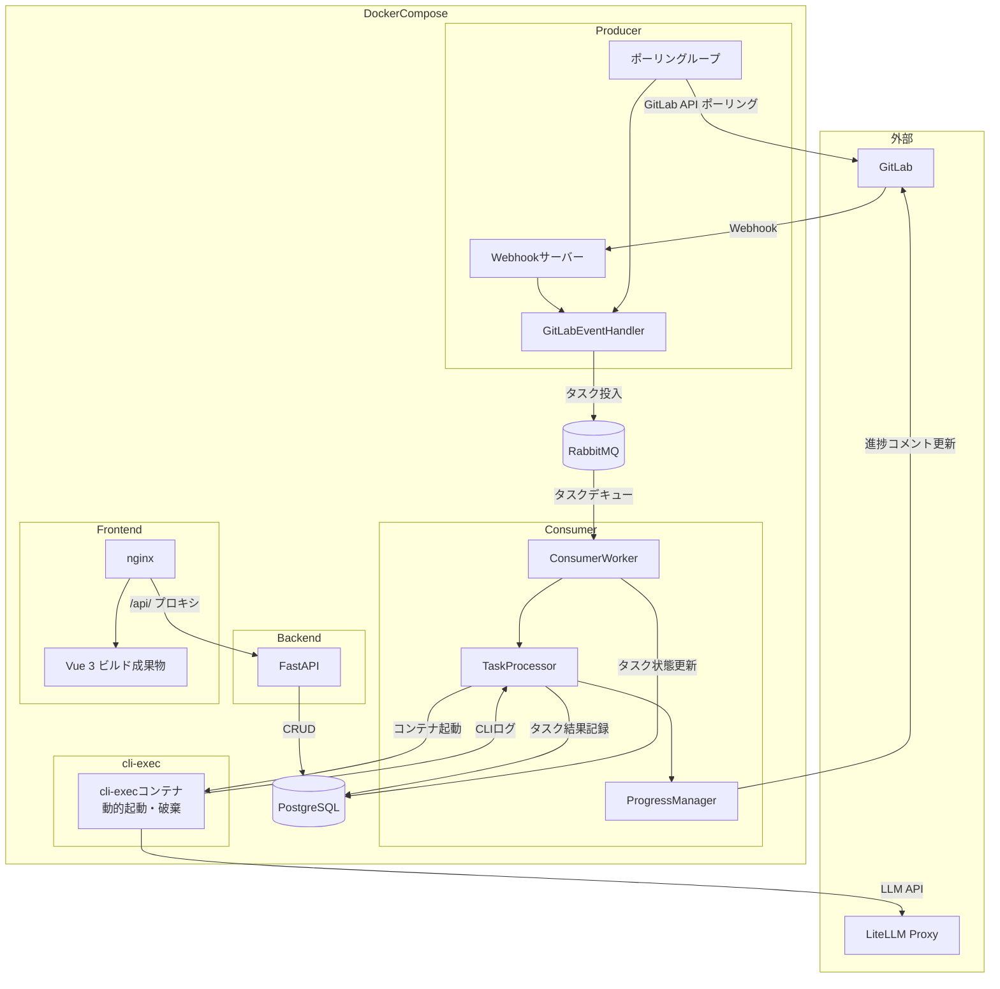

### 2.3 コンポーネント間データフロー

| フロー | 送信元 | 送信先 | 内容 |
|---|---|---|---|
| Webhookイベント | GitLab | Producer（WH） | Issue/MR操作イベント（JSON） |
| タスクメッセージ | Producer | RabbitMQ | task_type, project_id, iid, username（JSON） |
| タスクデキュー | RabbitMQ | Consumer | タスクメッセージ（JSON） |
| コンテナ起動指示 | Consumer（TP） | Docker daemon | コンテナ名・イメージ・環境変数・起動コマンド |
| CLI標準出力 | cli-execコンテナ | Consumer（TP） | CLIの処理ログ |
| 進捗コメント更新 | Consumer（PM） | GitLab API | MRコメント本文（Markdown） |
| タスク記録 | Consumer | PostgreSQL | タスク状態・ログ |
| APIリクエスト | Frontend | Backend（/api/） | CRUD操作（JSON） |
| DB読み書き | Backend（FA） | PostgreSQL | ユーザー・タスク・設定データ |

### 2.4 ネットワーク構成図

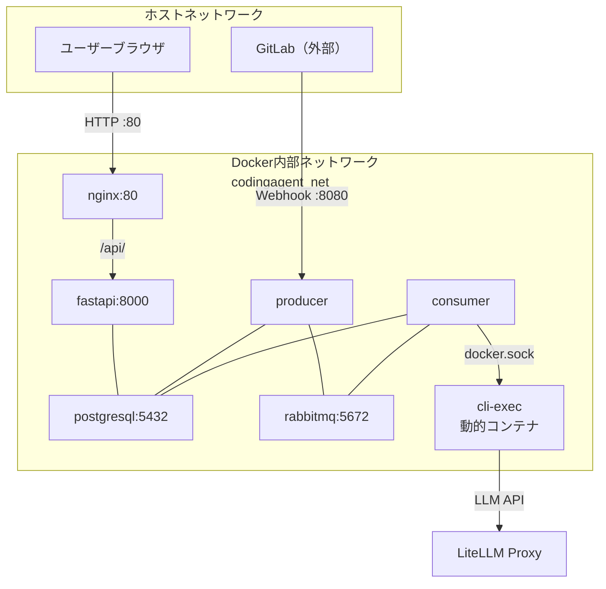

---

## 3. データベース設計

### 3.1 テーブル一覧

PostgreSQLを使用する。ユーザー情報・Virtual Key（暗号化）・CLIアダプタ設定・タスク実行履歴の永続管理が必要なため。

| テーブル名 | 説明 |
|---|---|
| users | システムユーザー情報・Virtual Key（AES-256-GCM暗号化）・CLI設定 |
| cli_adapters | CLIアダプタ設定（起動コマンドテンプレート・環境変数マッピング等） |
| tasks | タスク実行履歴・CLIログ・状態管理 |
| system_settings | F-3/F-4プロンプトテンプレート・システムMCP設定等のシステム設定 |

### 3.2 usersテーブル

| カラム名 | 型 | 制約 | 説明 |
|---|---|---|---|
| username | VARCHAR(255) | PRIMARY KEY, NOT NULL | GitLabユーザー名（本システムユーザー名） |
| email | VARCHAR(255) | UNIQUE, NOT NULL | メールアドレス |
| virtual_key_encrypted | BYTEA | NOT NULL | AES-256-GCM暗号化済みVirtual Key |
| default_cli | VARCHAR(255) | NOT NULL, FK→cli_adapters.cli_id | デフォルトCLIエージェントID |
| default_model | VARCHAR(255) | NOT NULL | デフォルトLLMモデル名 |
| role | VARCHAR(20) | NOT NULL, CHECK(admin/user) | 権限ロール |
| is_active | BOOLEAN | NOT NULL, DEFAULT TRUE | 有効/無効フラグ |
| password_hash | VARCHAR(255) | NOT NULL | bcryptハッシュ化パスワード |
| system_mcp_enabled | BOOLEAN | NOT NULL, DEFAULT TRUE | システムMCP設定の適用オン/オフ |
| user_mcp_config | JSONB | NULL | ユーザー個別MCP設定（NULL=適用なし） |
| f4_prompt_template | TEXT | NULL | ユーザー個別F-4プロンプトテンプレート（NULL=システム設定使用） |
| created_at | TIMESTAMPTZ | NOT NULL, DEFAULT NOW() | 登録日時 |
| updated_at | TIMESTAMPTZ | NOT NULL, DEFAULT NOW() | 最終更新日時 |

### 3.3 cli_adaptersテーブル

| カラム名 | 型 | 制約 | 説明 |
|---|---|---|---|
| cli_id | VARCHAR(255) | PRIMARY KEY, NOT NULL | CLIエージェント識別子（例: claude, opencode） |
| container_image | VARCHAR(512) | NOT NULL | cli-execコンテナイメージ名・タグ |
| start_command_template | TEXT | NOT NULL | 起動コマンドテンプレート（{prompt}/{model}/{mcp_config}変数含む） |
| env_mappings | JSONB | NOT NULL | 情報名→環境変数名マッピング |
| config_content_env | VARCHAR(255) | NULL | 設定内容をJSON環境変数で渡す場合の環境変数名 |
| is_builtin | BOOLEAN | NOT NULL, DEFAULT FALSE | 組み込みアダプタフラグ（TRUEは削除不可） |
| created_at | TIMESTAMPTZ | NOT NULL, DEFAULT NOW() | 登録日時 |
| updated_at | TIMESTAMPTZ | NOT NULL, DEFAULT NOW() | 最終更新日時 |

### 3.4 tasksテーブル

| カラム名 | 型 | 制約 | 説明 |
|---|---|---|---|
| task_uuid | UUID | PRIMARY KEY, NOT NULL | タスク一意識別子 |
| task_type | VARCHAR(50) | NOT NULL, CHECK(issue/merge_request) | タスク種別 |
| gitlab_project_id | BIGINT | NOT NULL | GitLabプロジェクトID |
| source_iid | BIGINT | NOT NULL | Issue IIDまたはMR IID |
| username | VARCHAR(255) | NOT NULL, FK→users.username | 実行対象ユーザー名 |
| status | VARCHAR(20) | NOT NULL, CHECK(pending/running/completed/failed) | ステータス |
| cli_type | VARCHAR(255) | NULL, FK→cli_adapters.cli_id | 使用したCLIエージェントID |
| model | VARCHAR(255) | NULL | 使用したモデル名 |
| cli_log | TEXT | NULL | CLIの実行ログ（標準出力・エラー出力） |
| error_message | TEXT | NULL | エラー内容（失敗時のみ） |
| created_at | TIMESTAMPTZ | NOT NULL, DEFAULT NOW() | タスク作成日時 |
| started_at | TIMESTAMPTZ | NULL | 処理開始日時 |
| completed_at | TIMESTAMPTZ | NULL | 処理完了日時 |

**ユニーク制約（重複処理防止 F-10）**:  
`gitlab_project_id`・`source_iid`・`task_type` の組み合わせで `status IN ('pending', 'running')` の行が1件のみ存在できる部分ユニーク制約を設ける。

```
CREATE UNIQUE INDEX tasks_no_duplicate_active
ON tasks (gitlab_project_id, source_iid, task_type)
WHERE status IN ('pending', 'running');
```

### 3.5 system_settingsテーブル

| カラム名 | 型 | 制約 | 説明 |
|---|---|---|---|
| key | VARCHAR(255) | PRIMARY KEY, NOT NULL | 設定キー |
| value | TEXT | NOT NULL | 設定値（テンプレート文字列またはJSON文字列） |
| updated_at | TIMESTAMPTZ | NOT NULL, DEFAULT NOW() | 最終更新日時 |

**設定キー一覧**:

| キー | 内容 |
|---|---|
| `f3_prompt_template` | F-3（Issue→MR変換）用プロンプトテンプレート |
| `f4_prompt_template` | F-4（MR処理）用プロンプトテンプレート（システムデフォルト） |
| `system_mcp_config` | システムMCP設定（JSON文字列） |

### 3.6 テーブルER図

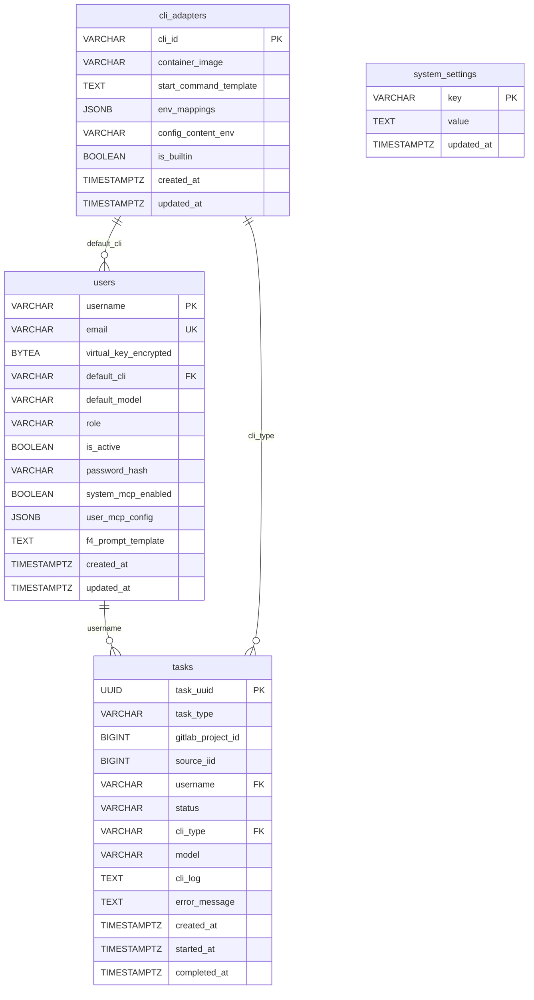

### 3.7 データ保持・削除方針

- タスク（tasks）: 作成から1年後に削除（バッチ or DB TTL管理）
- アプリケーションログ: 90日後に削除
- CLIログ（cli_log）: tasksレコードと同期して削除（90日）

---

## 4. アーキテクチャ設計

### 4.1 外部設計（UI）

#### 4.1.1 画面一覧

| 画面ID | パス | タイトル | アクセス権 | 主な要素 |
|---|---|---|---|---|
| SC-01 | `/login` | ログイン | 全員（未認証） | ユーザー名・パスワード入力フォーム、ログインボタン |
| SC-02 | `/users` | ユーザー一覧 | admin のみ | ユーザー名・メール・ロール・ステータス一覧、検索ボックス、新規作成ボタン |
| SC-03 | `/users/:username` | ユーザー詳細 | admin: 全員 / user: 自分のみ | ユーザー名・メール・ロール・ステータス・デフォルトCLI・モデル表示、編集ボタン、削除ボタン（admin のみ） |
| SC-04 | `/users/new` | ユーザー作成 | admin のみ | ユーザー名・メール・パスワード・Virtual Key・ロール・デフォルトCLI・モデル入力フォーム |
| SC-05 | `/users/:username/edit` | ユーザー編集 | admin: 全項目 / user: 自分の一部項目のみ | メール・パスワード・Virtual Key（admin）・ロール（admin）・ステータス（admin）・デフォルトCLI・モデル・F-4テンプレート・MCP設定 |
| SC-06 | `/tasks` | タスク実行履歴 | admin: 全タスク / user: 自分のみ | タスクUUID・ユーザー名・種別・ステータス・CLI・モデル・作成日時・完了日時の一覧、ユーザー名/ステータス/種別フィルタ |
| SC-07 | `/settings` | システム設定 | admin のみ | F-3テンプレート・F-4テンプレート・システムMCP設定・CLIアダプタ設定一覧 |

#### 4.1.2 画面遷移図

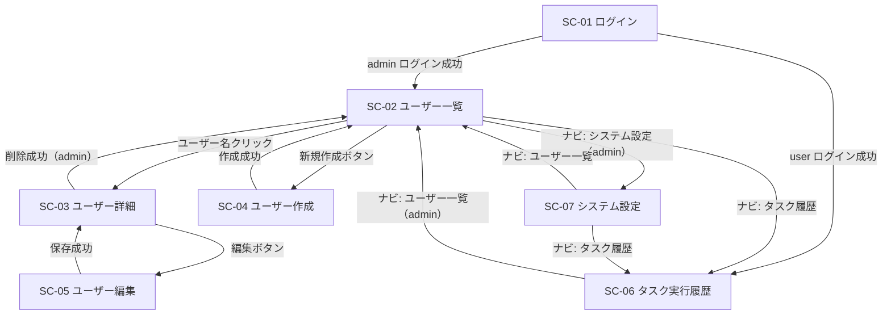

#### 4.1.3 画面モックアップ（AA）

**SC-01 ログイン画面**

```
+---------------------------------------------+
|        GitLab自律コーディングエージェント        |
+---------------------------------------------+
|                                             |
|   ユーザー名: [________________________]    |
|   パスワード: [________________________]    |
|                                             |
|              [  ログイン  ]                 |
|                                             |
+---------------------------------------------+
```

**SC-02 ユーザー一覧（admin）**

```
+------------------------------------------------------+
| [≡] GitLab Coding Agent                [ログアウト] |
+------------------------------------------------------+
| ユーザー一覧       [+ 新規作成]                       |
| 検索: [_______________] [🔍]                         |
+------------------------------------------------------+
| ユーザー名    | メール         | ロール | 状態   |    |
|--------------|----------------|--------|--------|    |
| alice        | a@example.com  | admin  | 有効   | [>]|
| bob          | b@example.com  | user   | 有効   | [>]|
| carol        | c@example.com  | user   | 停止中 | [>]|
+------------------------------------------------------+
```

**SC-03 ユーザー詳細**

```
+------------------------------------------------------+
| [≡] GitLab Coding Agent                [ログアウト] |
+------------------------------------------------------+
| ユーザー詳細: alice                                  |
+------------------------------------------------------+
| ユーザー名: alice                                    |
| メール: alice@example.com                            |
| ロール: admin                                        |
| ステータス: 有効                                     |
| デフォルトCLI: claude                               |
| デフォルトモデル: claude-opus-4-5                   |
| 作成日: 2024-01-01 10:00                            |
|                                                      |
|       [編集]  [削除（admin のみ）]                  |
+------------------------------------------------------+
```

**SC-04 ユーザー作成（admin）**

```
+------------------------------------------------------+
| ユーザー作成                                         |
+------------------------------------------------------+
| ユーザー名*:    [_______________________]           |
| メール*:        [_______________________]           |
| パスワード*:    [_______________________]           |
| Virtual Key*:  [_______________________]           |
| ロール*:        [admin / user ▼]                   |
| デフォルトCLI*: [claude / opencode ▼]              |
| デフォルトモデル*:[___________________]             |
|                                                      |
|          [キャンセル]  [作成]                        |
+------------------------------------------------------+
```

**SC-05 ユーザー編集**

```
+------------------------------------------------------+
| ユーザー編集: alice                                  |
+------------------------------------------------------+
| メール:         [_______________________]           |
| パスワード変更: [_______________________]           |
| Virtual Key（admin）: [________________]            |
| ロール（admin）:      [admin / user ▼]              |
| ステータス（admin）:  [有効 / 停止中 ▼]             |
| デフォルトCLI:  [claude / opencode ▼]              |
| デフォルトモデル:[___________________]              |
| F-4テンプレート:[___________________] [クリア]      |
| MCP設定（JSON）: [___________________]              |
| システムMCP適用: [ON / OFF ▼]                       |
|                                                      |
|          [キャンセル]  [保存]                        |
+------------------------------------------------------+
```

**SC-06 タスク実行履歴**

```
+------------------------------------------------------+
| タスク実行履歴                                       |
+------------------------------------------------------+
| ユーザー: [______▼]  状態: [全て▼]  種別: [全て▼]  |
+------------------------------------------------------+
| UUID         | ユーザー | 種別 | CLI   | 状態 | 日時 |
|--------------|---------|------|-------|------|------|
| abc123...    | alice   | MR   | claude|完了  | ...  |
| def456...    | bob     | Issue| open..|失敗  | ...  |
+------------------------------------------------------+
```

**SC-07 システム設定（admin）**

```
+------------------------------------------------------+
| システム設定                                         |
+------------------------------------------------------+
| [F-3テンプレート] [F-4テンプレート] [CLIアダプタ] [MCP設定]
+------------------------------------------------------+
| F-3（Issue→MR変換）プロンプトテンプレート:           |
| [_______________________________________________]   |
| [_______________________________________________]   |
|                                     [保存]          |
+------------------------------------------------------+
| CLIアダプタ設定一覧:  [+ 新規追加]                   |
| cli_id  | container_image | 組み込み |              |
|---------|-----------------|----------|              |
| claude  | ...             | ○        | [編集]       |
| opencode| ...             | ○        | [編集]       |
+------------------------------------------------------+
```

### 4.2 外部システム連携設計

#### 4.2.1 連携外部システム一覧

| 外部システム | 連携方法 | 目的 |
|---|---|---|
| GitLab REST API | HTTPS REST API (PAT認証) | Issue/MR取得・作成・更新・ラベル管理・コメント投稿・Webhook登録 |
| GitLab Webhook | HTTP POST受信 | リアルタイムIssue/MRイベント受信 |
| LiteLLM Proxy | HTTPS REST API (Virtual Key) | CLIエージェントのLLM呼び出し中継 |

#### 4.2.2 GitLab API連携フロー

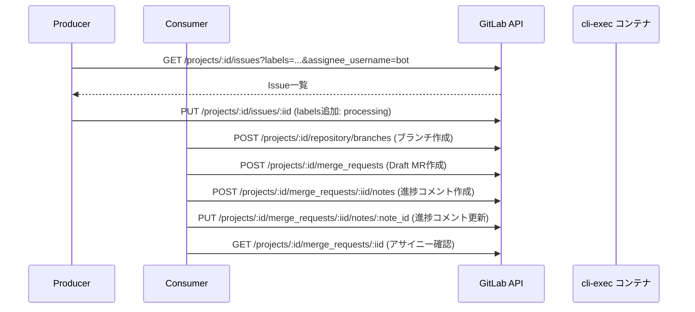

**GitLab API エラーハンドリング方針**（AutomataCodex `gitlab_client.py` 準拠）:

| HTTPステータス | 対処方針 |
|---|---|
| 401 | 処理を中断・アラート |
| 403 | 処理を中断・アラート |
| 404 | GitLabにエラーコメント投稿後スキップ |
| 409 | リトライ（最大3回） |
| 429 | 指数バックオフでリトライ |
| 500/502/503/504 | 最大3回リトライ後中断 |

#### 4.2.3 LiteLLM Proxy連携フロー

cli-execコンテナ内のCLIエージェントが直接LiteLLM ProxyのエンドポイントにAPIリクエストを送信する。ConsumerはVirtual Keyをコンテナ環境変数にセットするのみで、直接LiteLLM APIを呼び出さない。

### 4.3 内部設計（処理フロー）

#### 4.3.1 F-1 Webhook受信フロー

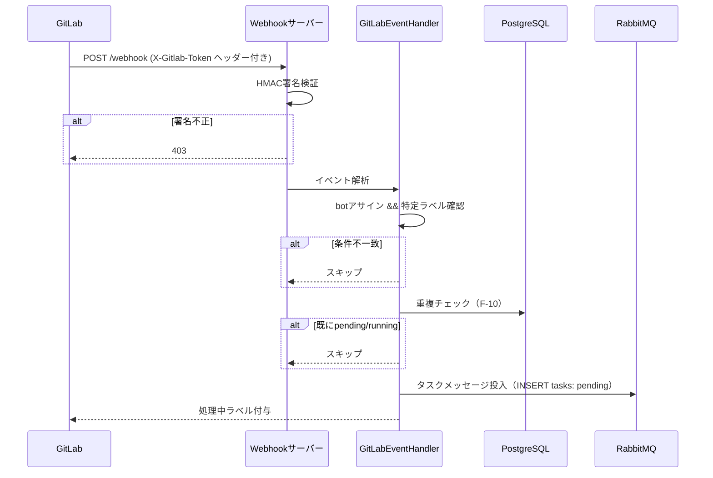

#### 4.3.2 F-2 ポーリングフロー

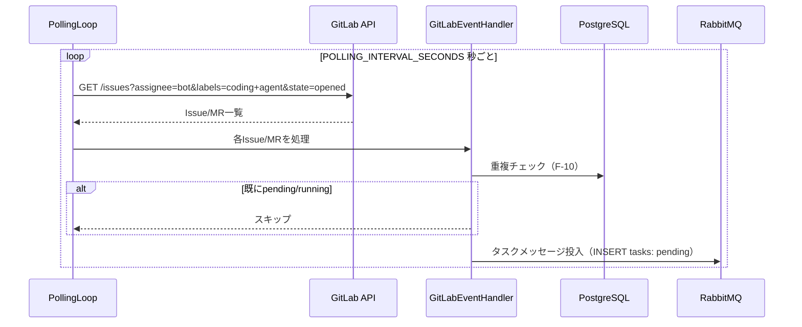

#### 4.3.3 F-3 Issue→MR変換処理フロー

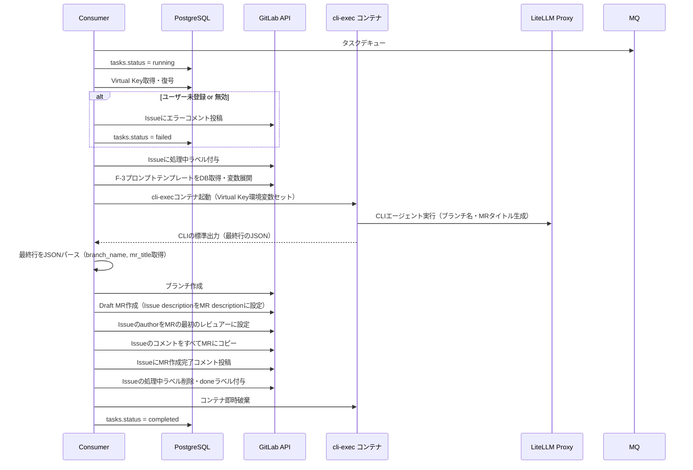

#### 4.3.4 F-4 MR処理フロー

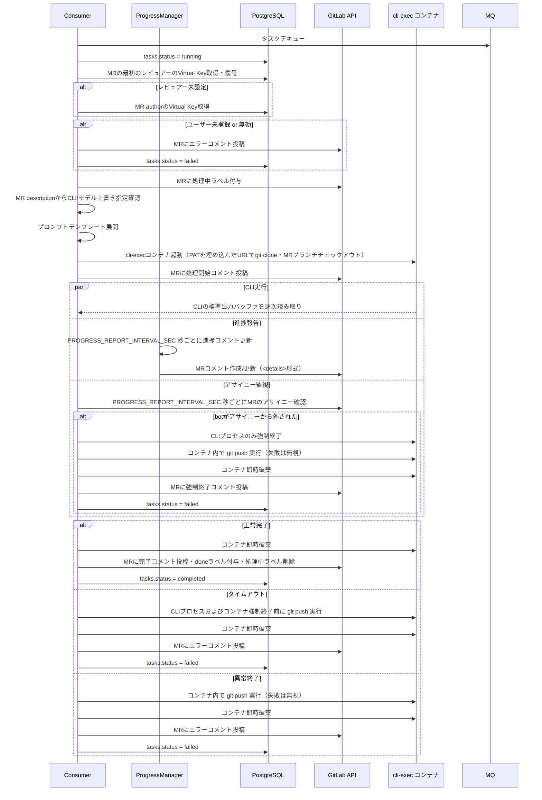

#### 4.3.5 F-8 進捗報告フロー

ConsumerはCLI実行中に別スレッドまたは非同期タスクで `PROGRESS_REPORT_INTERVAL_SEC` 秒ごとにCLI標準出力バッファを読み取り、MRの**1つのコメント**を作成または更新し続ける。CLIが `PROGRESS_REPORT_INTERVAL_SEC` 秒以内に終了した場合は進捗コメントを作成せず、完了コメントのみ投稿する。

進捗コメントの形式:

```
<details>
<summary>進捗状況（最終更新: {更新日時}）

{CLI標準出力の直近PROGRESS_REPORT_SUMMARY_LINES行}
</summary>

{CLI標準出力の全体（最大PROGRESS_REPORT_BUFFER_MAX_LINES行）}
</details>
```

---

## 5. クラス設計

### 5.1 クラス一覧

| クラス名 | 役割 | SRP | OCP | LSP | ISP | DIP |
|---|---|---|---|---|---|---|
| GitLabClient | GitLab API操作のラッパー（AutomataCodex再利用） | ○ | ○ | ○ | ○ | ○ |
| RabbitMQClient | RabbitMQ接続・メッセージ操作（AutomataCodex再利用） | ○ | ○ | ○ | ○ | ○ |
| DatabaseManager | DB接続・セッション管理 | ○ | ○ | ○ | ○ | ○ |
| ConfigLoader | 環境変数・設定読み込み | ○ | ○ | ○ | ○ | ○ |
| GitLabEventHandler | Webhook/ポーリングイベント解析・タスク投入判定 | ○ | ○ | ○ | ○ | ○ |
| ProducerService | Producer全体制御（Webhook/ポーリング起動管理） | ○ | ○ | ○ | ○ | ○ |
| WebhookServer | Webhookリクエスト受信・HMAC署名検証 | ○ | ○ | ○ | ○ | ○ |
| PollingLoop | ポーリング間隔制御・GitLab API問い合わせ | ○ | ○ | ○ | ○ | ○ |
| ConsumerWorker | RabbitMQからのタスクデキュー・TaskProcessorへのディスパッチ | ○ | ○ | ○ | ○ | ○ |
| TaskProcessor | タスク種別に応じたF-3/F-4処理の実行 | ○ | ○ | ○ | ○ | ○ |
| IssueToMRConverter | F-3（Issue→MR変換）の処理実装 | ○ | ○ | ○ | ○ | ○ |
| MRProcessor | F-4（MR処理）の処理実装 | ○ | ○ | ○ | ○ | ○ |
| CLIContainerManager | cli-execコンテナの起動・監視・破棄 | ○ | ○ | ○ | ○ | ○ |
| CLIAdapterResolver | CLIアダプタ設定の解決・起動コマンド・環境変数構築 | ○ | ○ | ○ | ○ | ○ |
| ProgressManager | CLI標準出力バッファ管理・GitLabコメント作成/更新 | ○ | ○ | ○ | ○ | ○ |
| PromptBuilder | F-3/F-4プロンプトテンプレートの変数展開 | ○ | ○ | ○ | ○ | ○ |
| VirtualKeyService | Virtual KeyのAES-256-GCM暗号化・復号 | ○ | ○ | ○ | ○ | ○ |
| DuplicateCheckService | タスク重複チェック（DB照会） | ○ | ○ | ○ | ○ | ○ |
| UserRepository | usersテーブルのCRUD操作 | ○ | ○ | ○ | ○ | ○ |
| TaskRepository | tasksテーブルのCRUD操作 | ○ | ○ | ○ | ○ | ○ |
| CLIAdapterRepository | cli_adaptersテーブルのCRUD操作 | ○ | ○ | ○ | ○ | ○ |
| SystemSettingsRepository | system_settingsテーブルのCRUD操作 | ○ | ○ | ○ | ○ | ○ |
| AuthService | JWT発行・検証・bcryptパスワード照合 | ○ | ○ | ○ | ○ | ○ |
| UserService | ユーザー管理ビジネスロジック | ○ | ○ | ○ | ○ | ○ |
| TaskService | タスク履歴閲覧・フィルタリング | ○ | ○ | ○ | ○ | ○ |
| CLIAdapterService | CLIアダプタCRUDビジネスロジック | ○ | ○ | ○ | ○ | ○ |
| SystemSettingsService | システム設定管理ビジネスロジック | ○ | ○ | ○ | ○ | ○ |
| UserRouter | FastAPI: ユーザーCRUDルーター | ○ | ○ | ○ | ○ | ○ |
| TaskRouter | FastAPI: タスク履歴ルーター | ○ | ○ | ○ | ○ | ○ |
| AuthRouter | FastAPI: 認証ルーター | ○ | ○ | ○ | ○ | ○ |
| CLIAdapterRouter | FastAPI: CLIアダプタCRUDルーター | ○ | ○ | ○ | ○ | ○ |
| SystemSettingsRouter | FastAPI: システム設定ルーター | ○ | ○ | ○ | ○ | ○ |
| CLILogMasker | CLIログのGitLab PATマスク処理 | ○ | ○ | ○ | ○ | ○ |

### 5.2 主要クラス詳細

#### GitLabClient（shared/gitlab_client/gitlab_client.py - AutomataCodex再利用）
- **属性**: `_gl` (python-gitlabインスタンス)、`_project_cache` (プロジェクトキャッシュ)
- **メソッド**: `get_issue`, `create_issue_note`, `update_issue_labels`, `list_merge_requests`, `get_merge_request`, `create_merge_request`, `update_merge_request_labels`, `create_merge_request_note`, `update_merge_request_note`, `get_merge_request_notes`, `create_branch`, `branch_exists`, `get_project_info`, `get_issue_notes`, `update_merge_request`
- **再利用元**: `https://github.com/notfolder/AutomataCodex/blob/main/shared/gitlab_client/gitlab_client.py`

#### RabbitMQClient（shared/messaging/ - AutomataCodex再利用）
- **属性**: `_connection`, `_channel`, `_queue_name`
- **メソッド**: `connect`, `publish`, `consume`, `close`
- **再利用元**: `https://github.com/notfolder/AutomataCodex/tree/main/shared/messaging`

#### CLIContainerManager
- **属性**: `_docker_client` (Docker SDK)
- **メソッド**: `start_container(container_name, image, env_vars, command)` → コンテナ起動・ID返却、`exec_command(container_id, command)` → コンテナ内コマンド実行、`stop_container(container_id)` → コンテナ停止・破棄、`get_stdout_stream(container_id)` → 標準出力ストリーム取得、`kill_process(container_id, pid)` → CLIプロセスのみ強制終了

#### CLIAdapterResolver
- **属性**: なし（`CLIAdapterRepository` を依存注入）
- **メソッド**: `resolve(cli_id)` → CLIアダプタ設定取得、`build_env_vars(adapter, info)` → 環境変数辞書構築、`build_start_command(adapter, info)` → 起動コマンド文字列構築

#### ProgressManager
- **属性**: `_gitlab_client`, `_project_id`, `_mr_iid`, `_note_id`, `_buffer` (最大PROGRESS_REPORT_BUFFER_MAX_LINES行), `_interval_sec`, `_summary_lines`
- **メソッド**: `start(stdout_stream)` → 非同期で進捗更新ループ開始、`stop()` → 更新ループ停止、`flush()` → 最後の進捗コメントをGitLabに更新

#### VirtualKeyService
- **属性**: `_encryption_key` (ENCRYPTION_KEY環境変数から取得)
- **メソッド**: `encrypt(plain_text)` → AES-256-GCM暗号化バイト列、`decrypt(cipher_bytes)` → 平文Virtual Key文字列

#### CLILogMasker
- **メソッド**: `mask(log_text)` → GitLab PATパターン（`https://oauth2:[token]@`等）を `****` でマスクした文字列を返す

### 5.3 クラス関係図

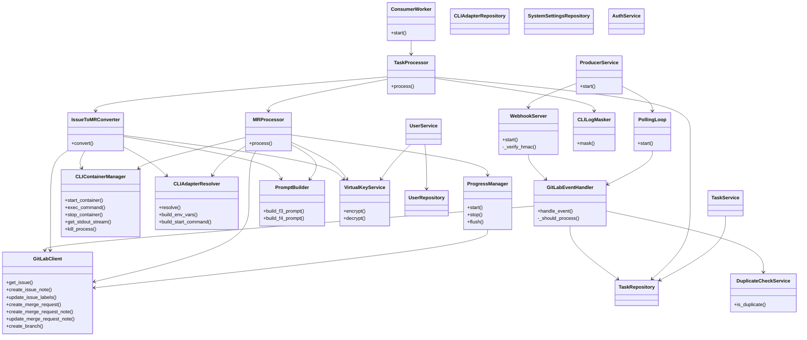

### 5.4 メッセージ一覧

| メッセージ名 | 送信元 | 受信先 | 内容 |
|---|---|---|---|
| TaskMessage | Producer | Consumer (RabbitMQ) | task_type, gitlab_project_id, source_iid, username |
| WebhookEvent | GitLab | WebhookServer | GitLab Webhookペイロード（JSON） |
| ProgressUpdate | ProgressManager | GitLab API | MRコメント本文（Markdown/HTML） |
| ContainerStartCommand | CLIContainerManager | Docker daemon | コンテナ名・イメージ・環境変数辞書・起動コマンド |

#### TaskMessageフロー

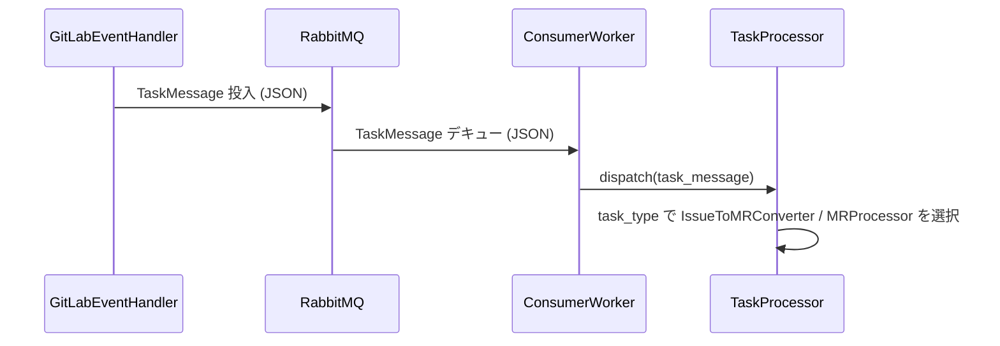

---

## 6. その他設計

### 6.1 エラーハンドリング

| エラー種別 | 発生箇所 | 対処方法 |
|---|---|---|
| GitLab API 401/403 | GitLabClient | 処理中断・ERRORログ |
| GitLab API 404 | GitLabClient | GitLabにエラーコメント投稿・タスク失敗 |
| GitLab API 429 | GitLabClient | 指数バックオフでリトライ |
| GitLab API 5xx | GitLabClient | 3回リトライ後に処理中断 |
| RabbitMQ接続失敗 | RabbitMQClient | 指数バックオフでリトライ・プロセス終了 |
| DB接続失敗 | DatabaseManager | リトライ後アラート |
| Virtual Key未登録 or 無効ユーザー | VirtualKeyService | GitLabにエラーコメント投稿・タスク失敗 |
| CLIコンテナ起動失敗 | CLIContainerManager | GitLabにエラーコメント投稿・タスク失敗 |
| git clone失敗 | CLIContainerManager | GitLabにエラーコメント投稿・タスク失敗 |
| CLIプロセス異常終了 | TaskProcessor | git push実行（F-4のみ）・コンテナ破棄・GitLabにエラーコメント・タスク失敗 |
| CLIタイムアウト | TaskProcessor | CLIプロセス/コンテナ強制終了・git push（F-4のみ）・GitLabにエラーコメント・タスク失敗 |
| HMAC署名不正 | WebhookServer | 403返却・WARNログ |
| F-3 CLIの標準出力JSONパース失敗 | IssueToMRConverter | GitLabにエラーコメント投稿・タスク失敗 |
| CLIアダプタ設定未登録 | CLIAdapterResolver | GitLabにエラーコメント投稿・タスク失敗 |
| JWT認証失敗 | AuthService | 401返却 |
| 認可失敗 | APIルーター | 403返却 |
| バリデーションエラー | APIルーター | 422返却・エラー詳細JSON |
| 組み込みアダプタ削除試行 | CLIAdapterService | 400返却・エラーメッセージ |
| 参照中アダプタ削除試行 | CLIAdapterService | 400返却・エラーメッセージ |
| メールアドレス重複 | UserService | 409返却・エラーメッセージ |

### 6.2 セキュリティ設計

| 項目 | 設計内容 |
|---|---|
| Virtual Key暗号化 | AES-256-GCMでDBに暗号化保存。復号はタスク実行直前のみ。ENCRYPTION_KEY環境変数で鍵管理 |
| パスワードハッシュ | bcrypt（コストファクタ12）でハッシュ化。平文保存禁止 |
| JWT認証 | HS256、有効期限24時間のBearerトークン。JWT_SECRET_KEY環境変数で署名鍵管理 |
| Webhook署名検証 | GITLAB_WEBHOOK_SECRETによるHMAC-SHA256署名検証。不正リクエストは403で即時拒否 |
| GitLab PAT管理 | 環境変数のみ。DBには保存しない。cli-execコンテナには渡さない。F-4のgit clone時にURLに一時的に埋め込み |
| CLIログのPATマスク | CLIの標準出力をPostgreSQLに保存する前にCLILogMaskerでPATパターンをマスク |
| cli-execコンテナ隔離 | コンテナ破棄によりVirtual Key・PATを確実に消去。DinD構成は信頼ユーザーのみ許可 |
| ロールベースアクセス制御 | admin: 全機能・全ユーザーデータ / user: 自分のユーザー情報・自分のタスク履歴のみ。他ユーザーデータへのアクセスは403 |
| SQLインジェクション対策 | SQLAlchemy ORMのパラメータバインドを使用。生SQLは使用しない |
| XSS対策 | Vue側でv-htmlを使用しない。テキストは常にテキストノードとしてレンダリング |

---

## 7. コード設計

### 7.1 ソースコード構成

```
coding-agent/
├── docker-compose.yml
├── docker-compose.override.yml      （開発用設定）
├── .env.example
├── README.md
├── e2e/                             （E2Eテストコード）
│   ├── package.json
│   └── tests/
│       └── *.spec.ts
├── scripts/
│   ├── setup.sh                     （システムセットアップスクリプト）
│   └── test_setup.sh                （テスト用セットアップスクリプト）
├── shared/                          （AutomataCodex再利用モジュール）
│   ├── gitlab_client/
│   │   └── gitlab_client.py         （GitLab APIクライアント）
│   ├── messaging/
│   │   └── rabbitmq_client.py       （RabbitMQクライアント）
│   ├── database/
│   │   └── database.py              （DB接続・セッション管理）
│   ├── config/
│   │   └── config.py                （環境変数・設定読み込み）
│   └── models/
│       ├── gitlab.py                （GitLab APIレスポンスモデル）
│       ├── task.py                  （タスクメッセージモデル）
│       └── db.py                   （DBモデル（SQLAlchemy））
├── producer/
│   ├── Dockerfile
│   ├── producer.py                  （エントリーポイント）
│   ├── webhook_server.py            （WebhookServer）
│   ├── polling_loop.py              （PollingLoop）
│   └── gitlab_event_handler.py     （GitLabEventHandler, DuplicateCheckService）
├── consumer/
│   ├── Dockerfile
│   ├── consumer.py                  （エントリーポイント・ConsumerWorker）
│   ├── task_processor.py           （TaskProcessor）
│   ├── issue_to_mr_converter.py    （IssueToMRConverter）
│   ├── mr_processor.py             （MRProcessor）
│   ├── cli_container_manager.py    （CLIContainerManager）
│   ├── cli_adapter_resolver.py     （CLIAdapterResolver）
│   ├── progress_manager.py         （ProgressManager）
│   ├── prompt_builder.py           （PromptBuilder）
│   ├── virtual_key_service.py      （VirtualKeyService）
│   └── cli_log_masker.py           （CLILogMasker）
├── backend/
│   ├── Dockerfile
│   ├── main.py                      （FastAPIエントリーポイント）
│   ├── routers/
│   │   ├── auth.py                  （AuthRouter）
│   │   ├── users.py                 （UserRouter）
│   │   ├── tasks.py                 （TaskRouter）
│   │   ├── cli_adapters.py          （CLIAdapterRouter）
│   │   └── settings.py              （SystemSettingsRouter）
│   ├── services/
│   │   ├── auth_service.py          （AuthService）
│   │   ├── user_service.py          （UserService）
│   │   ├── task_service.py          （TaskService）
│   │   ├── cli_adapter_service.py   （CLIAdapterService）
│   │   └── system_settings_service.py（SystemSettingsService）
│   ├── repositories/
│   │   ├── user_repository.py       （UserRepository）
│   │   ├── task_repository.py       （TaskRepository）
│   │   ├── cli_adapter_repository.py（CLIAdapterRepository）
│   │   └── system_settings_repository.py（SystemSettingsRepository）
│   └── schemas/
│       ├── user.py                  （ユーザーPydanticスキーマ）
│       ├── task.py                  （タスクPydanticスキーマ）
│       ├── cli_adapter.py           （CLIアダプタPydanticスキーマ）
│       └── settings.py              （システム設定Pydanticスキーマ）
├── frontend/
│   ├── Dockerfile                   （マルチステージビルド: npm build → nginx）
│   ├── nginx.conf                   （/api/ リバースプロキシ設定）
│   ├── package.json
│   ├── vite.config.ts
│   └── src/
│       ├── main.ts
│       ├── router/
│       │   └── index.ts             （Vue Routerルーティング設定）
│       ├── stores/
│       │   └── auth.ts              （Piniaストア: 認証状態管理）
│       ├── api/
│       │   └── client.ts            （axiosラッパー: /api/ ベースURL）
│       └── views/
│           ├── LoginView.vue        （SC-01）
│           ├── UserListView.vue     （SC-02）
│           ├── UserDetailView.vue   （SC-03）
│           ├── UserCreateView.vue   （SC-04）
│           ├── UserEditView.vue     （SC-05）
│           ├── TaskListView.vue     （SC-06）
│           └── SettingsView.vue     （SC-07）
└── cli-exec/
    ├── claude/
    │   └── Dockerfile               （Claude Codeコンテナイメージ）
    └── opencode/
        └── Dockerfile               （opencodeコンテナイメージ）
```

### 7.2 ファイル・クラス対応表

| ファイル | 格納クラス | 役割 |
|---|---|---|
| shared/gitlab_client/gitlab_client.py | GitLabClient | GitLab API全操作（AutomataCodex再利用） |
| shared/messaging/rabbitmq_client.py | RabbitMQClient | RabbitMQ接続・メッセージ操作（AutomataCodex再利用） |
| shared/database/database.py | DatabaseManager | DB接続・セッション管理 |
| shared/config/config.py | ConfigLoader | 環境変数読み込み |
| shared/models/db.py | User, Task, CLIAdapter, SystemSetting | SQLAlchemy DBモデル |
| producer/webhook_server.py | WebhookServer | Webhook受信・HMAC検証 |
| producer/polling_loop.py | PollingLoop | ポーリング間隔制御 |
| producer/gitlab_event_handler.py | GitLabEventHandler, DuplicateCheckService | イベント解析・重複チェック・タスク投入 |
| consumer/task_processor.py | TaskProcessor | タスク種別ディスパッチ |
| consumer/issue_to_mr_converter.py | IssueToMRConverter | F-3処理 |
| consumer/mr_processor.py | MRProcessor | F-4処理 |
| consumer/cli_container_manager.py | CLIContainerManager | Dockerコンテナ制御 |
| consumer/cli_adapter_resolver.py | CLIAdapterResolver | CLIアダプタ設定解決 |
| consumer/progress_manager.py | ProgressManager | 進捗コメント管理 |
| consumer/prompt_builder.py | PromptBuilder | プロンプトテンプレート展開 |
| consumer/virtual_key_service.py | VirtualKeyService | AES-256-GCM暗号化・復号 |
| consumer/cli_log_masker.py | CLILogMasker | PATマスク処理 |
| backend/routers/auth.py | AuthRouter | POST /api/auth/login |
| backend/routers/users.py | UserRouter | /api/users CRUD |
| backend/routers/tasks.py | TaskRouter | GET /api/tasks |
| backend/routers/cli_adapters.py | CLIAdapterRouter | /api/cli-adapters CRUD |
| backend/routers/settings.py | SystemSettingsRouter | GET/PUT /api/settings |
| backend/services/auth_service.py | AuthService | JWT・bcrypt認証処理 |
| backend/services/user_service.py | UserService | ユーザー管理ビジネスロジック |
| backend/services/task_service.py | TaskService | タスク履歴閲覧・フィルタリング |
| backend/services/cli_adapter_service.py | CLIAdapterService | CLIアダプタCRUDビジネスロジック |
| backend/services/system_settings_service.py | SystemSettingsService | システム設定管理 |
| backend/repositories/*.py | *Repository | 各テーブルのCRUD操作 |

### 7.3 APIエンドポイント一覧

| メソッド | パス | 認証 | 権限 | 説明 |
|---|---|---|---|---|
| POST | /api/auth/login | 不要 | 全員 | ログイン・JWTトークン発行 |
| GET | /api/users | 必要 | admin | ユーザー一覧取得（検索対応） |
| POST | /api/users | 必要 | admin | ユーザー作成 |
| GET | /api/users/{username} | 必要 | admin: 全員 / user: 自分のみ | ユーザー詳細取得 |
| PUT | /api/users/{username} | 必要 | admin: 全員 / user: 自分の制限項目のみ | ユーザー更新 |
| DELETE | /api/users/{username} | 必要 | admin | ユーザー削除 |
| GET | /api/tasks | 必要 | admin: 全タスク / user: 自分のみ | タスク一覧取得（フィルタ対応） |
| GET | /api/cli-adapters | 必要 | admin | CLIアダプタ一覧取得 |
| POST | /api/cli-adapters | 必要 | admin | CLIアダプタ作成 |
| PUT | /api/cli-adapters/{cli_id} | 必要 | admin | CLIアダプタ更新 |
| DELETE | /api/cli-adapters/{cli_id} | 必要 | admin | CLIアダプタ削除（is_builtin=trueは拒否） |
| GET | /api/settings | 必要 | admin | システム設定取得 |
| PUT | /api/settings | 必要 | admin | システム設定更新 |

### 7.4 コーディング規約

| 項目 | 規約 |
|---|---|
| Python バージョン | 3.12 |
| コーディングスタイル | PEP 8 準拠 |
| 型ヒント | 全関数・メソッドに必須 |
| docstring | Google スタイルで全クラス・全メソッドに必須 |
| フォーマッタ | black、isort |
| リンタ | flake8、mypy |
| 変数名 | snake_case（Python）、camelCase（TypeScript/Vue） |
| 定数 | UPPER_SNAKE_CASE |
| テスト | pytestを使用。テストファイルは `tests/` ディレクトリに配置 |
| TypeScript | strict mode 有効 |
| Vue | Composition API + `<script setup>` |

### 7.5 トランザクション境界

| 処理 | トランザクション境界 | ロールバック条件 |
|---|---|---|
| タスク投入（Producer） | tasks INSERT + DB確認が1トランザクション | INSERT失敗時ロールバック |
| タスク状態更新（Consumer） | tasks UPDATE（status, cli_log等）が1トランザクション | UPDATE失敗時ロールバック・リトライ |
| ユーザー作成（Backend） | users INSERT が1トランザクション | INSERT失敗時ロールバック |
| ユーザー更新（Backend） | users UPDATE が1トランザクション | UPDATE失敗時ロールバック |
| ユーザー削除（Backend） | users DELETE が1トランザクション | DELETE失敗時ロールバック |
| CLIアダプタ操作（Backend） | cli_adapters CRUD が1トランザクション | 失敗時ロールバック |

### 7.6 排他制御

| 対象 | 制御方式 | 内容 |
|---|---|---|
| タスク重複防止（F-10） | DBユニーク制約（部分インデックス） | `(gitlab_project_id, source_iid, task_type)` が `pending/running` 状態で重複不可 |
| ユーザーメールアドレス重複 | DBユニーク制約 | emailカラムのUNIQUE制約 |
| CLIアダプタID重複 | DBプライマリキー制約 | cli_idカラムのPRIMARY KEY |
| タスク状態更新の競合 | 楽観ロック不要（単一Consumer処理）| Consumerはタスクを1件ずつ処理し、同一タスクを複数Consumerが同時更新することはない |

---

## 8. テスト設計

### 8.1 テスト種類一覧

| テスト種別 | 対象 | 目的 | ツール |
|---|---|---|---|
| 単体テスト | 全モジュール | 各クラス・メソッドの単独動作確認 | pytest, unittest.mock |
| 結合テスト | コンポーネント間連携 | Producer↔RabbitMQ↔Consumer、Backend↔DB連携の確認 | pytest, testcontainers |
| E2Eテスト | システム全体 | ユーザー視点での全シナリオ確認（T-01〜T-30） | Playwright |

### 8.2 単体テストケース一覧

| テスト対象 | テストケース | 正常/異常 |
|---|---|---|
| GitLabClient | Issue取得成功 | 正常 |
| GitLabClient | Issue取得404エラー時のハンドリング | 異常 |
| GitLabClient | MRコメント作成成功 | 正常 |
| GitLabClient | APIレート制限（429）時の指数バックオフリトライ | 異常 |
| WebhookServer | 正当なHMAC署名のWebhookを受理 | 正常 |
| WebhookServer | 不正なHMAC署名のWebhookを拒否（403） | 異常 |
| GitLabEventHandler | botアサイン＋特定ラベルのIssueをタスク投入 | 正常 |
| GitLabEventHandler | ラベルのみ（botアサインなし）はスキップ | 異常 |
| GitLabEventHandler | botアサインのみ（ラベルなし）はスキップ | 異常 |
| DuplicateCheckService | 既存pending/runningタスクがある場合は重複として返す | 正常 |
| DuplicateCheckService | 完了/失敗タスクは重複チェック対象外 | 正常 |
| VirtualKeyService | 暗号化→復号が元の値と一致 | 正常 |
| CLIAdapterResolver | claude アダプタの環境変数・起動コマンド構築 | 正常 |
| CLIAdapterResolver | opencode アダプタの環境変数・起動コマンド構築（config_content_env） | 正常 |
| PromptBuilder | F-3テンプレートの変数展開 | 正常 |
| PromptBuilder | F-4テンプレートの変数展開（ユーザー個別テンプレート優先） | 正常 |
| PromptBuilder | F-4ユーザー個別テンプレートがNULLの場合はシステムテンプレートを使用 | 正常 |
| MRProcessor | MR descriptionの `agent:` 行からCLI/モデル上書き解析 | 正常 |
| MRProcessor | `agent:` 行がない場合はユーザーデフォルトを使用 | 正常 |
| ProgressManager | PROGRESS_REPORT_INTERVAL_SEC秒ごとにGitLabコメントを更新 | 正常 |
| ProgressManager | バッファが上限を超えたら古い行を破棄 | 正常 |
| CLILogMasker | GitLab PAT（oauth2:@形式）をマスク | 正常 |
| AuthService | 正しいパスワードでJWT発行 | 正常 |
| AuthService | 誤ったパスワードで認証失敗 | 異常 |
| AuthService | 有効期限切れJWTを拒否 | 異常 |
| UserService | admin以外はユーザー一覧取得不可 | 異常 |
| UserService | userロールは他ユーザーの詳細取得不可（403） | 異常 |
| UserService | メールアドレス重複時は409返却 | 異常 |
| CLIAdapterService | is_builtin=trueのアダプタ削除試行は400 | 異常 |
| CLIAdapterService | default_cliに設定中のアダプタ削除試行は400 | 異常 |

### 8.3 結合テストケース一覧

| テストケース | 正常/異常 |
|---|---|
| Producer → RabbitMQ → Consumer のタスクメッセージ疎通 | 正常 |
| Consumer がDB からユーザー情報・Virtual Keyを正しく取得・復号 | 正常 |
| Backend API → PostgreSQL ユーザーCRUD | 正常 |
| Backend API 認証ミドルウェアがJWT検証を正しく実施 | 正常 |
| タスク重複チェック（ユニーク制約）が同時INSERT時に機能する | 正常 |

---

## 9. 運用設計

### 9.1 起動方法

**本番起動**:

```
docker compose up -d
```

GitLab・LiteLLM Proxyを含まず、本システムコンポーネント（producer, consumer, backend, frontend, postgresql, rabbitmq）のみが起動する。

**テスト環境起動**:

```
docker compose --profile test up -d
```

GitLab CE・LiteLLM Proxyを含む全コンポーネントが起動する。

**cli-execコンテナイメージビルド**:

```
docker compose --profile build-only build
```

**システムセットアップ（初回のみ）**:

```
./scripts/setup.sh
```

初期管理者ユーザー作成・F-3/F-4初期プロンプトテンプレート投入・組み込みCLIアダプタ登録を実行する。

**テスト用セットアップ（テスト環境のみ）**:

```
./scripts/test_setup.sh
```

GitLab botアカウント・PAT発行・Webhook設定・テストユーザー作成・LiteLLM Virtual Key発行を実行する。

### 9.2 DBマイグレーション

Alembicを使用。`docker compose up` 時にbackendコンテナがAlembicマイグレーションを自動実行してからFastAPIを起動する。

### 9.3 環境変数（.env）

`.env.example` に必須・オプション環境変数の一覧と説明を記載する。

### 9.4 README.md

`README.md` に以下を記載する:

- システム概要
- 前提条件（Docker, docker-compose）
- 起動方法（本番・テスト環境）
- システムセットアップ手順
- 環境変数の説明
- E2Eテスト実行方法

---

## 10. ログ・監視・アラート設計

### 10.1 ログ設計

| ログ種別 | 出力先 | 保存期間 | 内容 |
|---|---|---|---|
| アプリケーションログ（INFO/WARN/ERROR） | コンテナ標準出力 → Docker logging driver | 90日 | 通常動作・警告・エラー |
| GitLab API呼び出しログ | アプリケーションログに含める | 90日 | 呼び出し成功・失敗・レートリミット発生の事実と対象Issue/MR番号 |
| Virtual Key解決ログ | アプリケーションログに含める | 90日 | 対象GitLabユーザー名・Virtual Key取得成否・失敗理由 |
| CLI実行環境ライフサイクルログ | アプリケーションログに含める | 90日 | cli-execコンテナ起動・ブランチチェックアウト完了・コンテナ破棄のタイムスタンプとタスクUUID |
| CLIログ（標準出力・エラー出力） | PostgreSQL（tasks.cli_log） | 90日 | CLIエージェントの全出力（PATマスク済み） |

**ログフォーマット**: JSON Lines形式（timestamp, level, component, message, context）

### 10.2 監視・アラート設計

| 監視対象 | 監視方法 | 障害対応 |
|---|---|---|
| Producer | プロセス死活監視（docker-composeのrestart: always） | コンテナ自動再起動 |
| Consumer（全インスタンス） | プロセス死活監視（docker-composeのrestart: always） | コンテナ自動再起動 |
| Webhookサーバー | HTTPヘルスチェック（GET /health） | コンテナ自動再起動 |
| PostgreSQL | TCP接続確認（port 5432） | コンテナ自動再起動 |
| RabbitMQ | TCP接続確認（port 5672） | コンテナ自動再起動 |

各コンポーネントは `docker-compose.yml` の `restart: always` により自動再起動する。

---

## 11. E2Eテスト設計

### 11.1 E2Eテスト環境設定

- テストコードはプロジェクトルートの `e2e/` ディレクトリに配置し、`e2e/package.json` を作成する
- `docker-compose.yml` の `test` プロファイルに `mcr.microsoft.com/playwright:v1.59.0` イメージを使用した `test_playwright` サービスを定義する
- `test_playwright` サービスは `e2e/` ディレクトリをコンテナにマウントし、テストコードの変更が即座に反映される
- `test_playwright` サービスの `--profile test` を指定することで通常起動では起動しない
- E2Eテストのベースログイン対象はdocker-compose内のfrontendサービス名を使用する（例: `http://frontend:80`）
- E2Eテストの実行コマンド:

```
docker compose run --rm test_playwright sh -c "npm install && npx playwright test"
```

- E2Eテストの実行結果を確認し、問題があれば修正してE2Eテストが全て成功するまで実装を繰り返す

### 11.2 E2Eテストシナリオ一覧（T-01〜T-30）

| シナリオID | テスト目的 | 前提条件 | Playwright操作手順 | 期待結果 |
|---|---|---|---|---|
| T-01 | 管理者が新規ユーザーを登録できる | 管理者アカウントでSC-01からログイン済み | SC-04の `/users/new` を開く → ユーザー名・Virtual Key・デフォルトCLI・モデル・パスワードを入力 → 「作成」ボタンをクリック | SC-02にリダイレクトされ、作成したユーザーがユーザー一覧に表示される |
| T-02 | 管理者がユーザーのVirtual Keyを更新できる | T-01完了 | SC-05の `/users/:username/edit` を開く → Virtual Keyフィールドを新しい値に変更 → 「保存」ボタンをクリック | 保存成功のフラッシュメッセージが表示される |
| T-03 | 管理者がデフォルトCLI・モデルを変更できる | T-01完了 | SC-05を開く → デフォルトCLIセレクトを別のcli_idに変更、モデル名を変更 → 「保存」ボタンをクリック | 保存成功のフラッシュメッセージが表示される。SC-03詳細画面で変更が反映されている |
| T-04 | IssueをWebhookで検出してMR変換できる | T-01完了、GitLabにIssue存在、Webhook設定済み | GitLab WebUIでIssueにbotをアサイン＋特定ラベルを付与する | Webhook受信後、GitLabに作業ブランチとDraft MRが作成される。IssueにMR作成完了コメントが投稿され、doneラベルが付与される。Issueはクローズされない |
| T-05 | IssueをポーリングでMR変換できる | T-01完了、GitLabにIssue存在 | GitLab WebUIでIssueにbotアサイン＋特定ラベルを付与し、30秒待機する | T-04と同様の結果 |
| T-06 | MR変換後にbotアサイン・ラベルが引き継がれる | T-04またはT-05完了 | T-04/T-05で作成されたMRをGitLab WebUIで開く | MRにbotアサインと特定ラベルが付与されている |
| T-07 | MRのCLI処理がdescriptionの指示通りに実行される | T-06完了、MR descriptionに作業指示あり | GitLab WebUIでT-06のMRが検出されるまで待つ | cli-execコンテナが起動しCLIが実行される。コード変更がコミット・プッシュされる。MRに完了コメントが投稿され、doneラベルが付与される |
| T-08 | MR descriptionのCLI指定でデフォルトを上書きできる | T-01完了（デフォルトCLIがcli_id A） | MR descriptionに `agent: cli=<cli_id B> model=<モデル名>` を記述してMRにbotアサイン＋特定ラベル付与 | ユーザーデフォルトCLI（A）を無視して指定CLI（B）・モデルで処理が実行される。SC-06で確認 |
| T-09 | MRレビュアーが未設定の場合はMR作成者のVirtual Keyが使われる | T-01完了、レビュアー未設定のMRが存在 | レビュアーなしのMRにbotアサイン＋特定ラベルを付与する | MR authorのVirtual Keyで処理が実行される。SC-06でtaskのusernameがMR authorになっている |
| T-10 | 未登録ユーザーのIssueは処理されない | GitLabに本システム未登録ユーザーが作成したIssueが存在 | 未登録ユーザーのIssueにbotアサイン＋特定ラベルを付与する | GitLabのIssueにユーザーなしエラーコメントが投稿される。タスクがfailedになる |
| T-11 | botアサインのみでは処理されない（ラベルなし） | GitLabにIssueが存在 | Issueにbotをアサインするが特定ラベルは付与しない | GitLab Issueに変化なし。SC-06にタスクが作成されない |
| T-12 | ラベルのみでは処理されない（botアサインなし） | GitLabにIssueが存在 | Issueに特定ラベルを付与するがbotはアサインしない | GitLab Issueに変化なし。SC-06にタスクが作成されない |
| T-13 | 無効化ユーザーのIssueは処理されない | SC-05でユーザーを「停止中」に変更済み | 停止中ユーザーが作成したIssueにbotアサイン＋特定ラベルを付与する | GitLabのIssueにエラーコメントが投稿される |
| T-14 | タスク実行履歴を確認できる | T-07完了、管理者でログイン済み | SC-06（/tasks）を開く → ステータスフィルタを「completed」に設定 | 完了タスクの一覧（タスクUUID・ユーザー名・CLI種別・完了日時）が表示される |
| T-15 | ユーザーを削除できる | T-01完了、管理者でログイン済み | SC-03の `/users/:username` を開く → 「削除」ボタンをクリック → 確認ダイアログで実行 | SC-02にリダイレクトされ、削除したユーザーが一覧に表示されない |
| T-16 | cli-execコンテナでdocker-composeによるe2eテストが実行できる | T-07と同様の前提 | MR descriptionにdocker-composeを使ったe2eテスト実行指示を記述してT-07と同手順で実行 | CLIがdocker-composeでサービス起動後e2eテストを実行した結果がコミットに含まれMRにプッシュされる |
| T-17 | 一般ユーザーが自分のユーザー詳細を閲覧できる | T-01完了、一般ユーザーでSC-01からログイン済み | SC-03の自分のユーザー詳細ページ（/users/:own_username）を開く | 自分のユーザー名・メールアドレス・デフォルトCLI等の情報が表示される |
| T-18 | 一般ユーザーが自分のメールアドレス・デフォルトCLI・モデルを編集できる | T-01完了、一般ユーザーでログイン済み | SC-05（/users/:own_username/edit）を開く → メールアドレス・デフォルトCLI・モデルを変更 → 「保存」 | 変更がDBに反映される。Virtual Key・ロール・ステータスの入力欄が表示されない |
| T-19 | 一般ユーザーが他ユーザーの詳細を閲覧できない | T-01完了、一般ユーザーでログイン済み | `/users/other_user` のURLを直接入力して開く | 403エラーページが表示される |
| T-20 | 一般ユーザーが他ユーザーを編集できない | T-01完了、一般ユーザーでログイン済み | `/users/other_user/edit` のURLを直接入力して開く | 403エラーページが表示される |
| T-21 | 一般ユーザーがSC-02（ユーザー一覧）にアクセスできない | T-01完了、一般ユーザーでログイン済み | `/users` のURLを直接入力して開く | 403エラーページが表示される |
| T-22 | 同一メールアドレスでユーザーを登録できない | T-01完了、管理者でログイン済み | SC-04で既存ユーザーと同じメールアドレスを入力して「作成」 | メールアドレス重複エラーメッセージがフォーム内に表示される。ユーザーが登録されない |
| T-23 | 一般ユーザーが自分のタスク実行履歴を閲覧できる | T-07完了、一般ユーザーでログイン済み | SC-06（/tasks）を開く | 自分のタスクのみが表示される。ユーザー名フィルタが自分のユーザー名で固定され変更できない |
| T-24 | WebhookとポーリングがIssue/MRを同時検出しても重複処理されない | T-01完了、Webhook・ポーリング両方有効 | Issueにbotアサインとラベルをほぼ同時に付与する | SC-06でタスクが1件のみ作成され、GitLabにDraft MRが1件のみ作成される |
| T-25 | 管理者がSC-07でF-3用プロンプトテンプレートを変更できる | T-01完了、管理者でログイン済み | SC-07（/settings）を開く → F-3テンプレートを編集 → 「保存」 | 保存成功のフラッシュメッセージが表示される |
| T-26 | 一般ユーザーがF-4テンプレートをクリアするとシステムデフォルトに戻る | 一般ユーザーのF-4テンプレートが設定済み | SC-05を開く → F-4テンプレートの「クリア」ボタンをクリック → 確認ダイアログで実行 | テンプレートが空欄になる。次回F-4処理でシステムデフォルトプロンプトが使用される |
| T-27 | 一般ユーザーがSC-07にアクセスできない | T-01完了、一般ユーザーでログイン済み | `/settings` のURLを直接入力して開く | 403エラーページが表示される |
| T-28 | MR処理中にCLI出力が1つの進捗コメントに定期更新される | T-01完了、処理時間60秒以上のMRが存在 | T-07と同様の手順でMR処理を開始し、GitLabのMRコメントを確認する | 進捗コメントが1件作成され、60秒ごとにCLIの直近20行出力（`<details>`形式）に上書き更新される。処理完了後に完了コメントが別途投稿される |
| T-29 | 環境変数で進捗コメント更新間隔と表示行数を変更できる | `PROGRESS_REPORT_INTERVAL_SEC=120`・`PROGRESS_REPORT_SUMMARY_LINES=30` を設定して起動済み | T-07と同様の手順でMR処理を開始し、GitLabのMRコメントを確認する | 120秒ごとに直近30行で進捗コメントが更新される |
| T-30 | MR処理中にbotのアサインが解除されたらCLIが強制終了し、git pushとコメントが実行される | T-07と同様（MR処理が開始している状態） | CLI実行中にGitLab WebUIでMRのアサイニーからbotを削除する | ConsumerがbotのアサインなしをGitLab APIで検知し、CLIプロセスを強制終了。git pushが実行される。コンテナが破棄され、MRに強制終了コメントが投稿される。SC-06でタスクがfailedになる |

---

## 設計レビュー結果

### 矛盾チェック

| チェック項目 | 結果 |
|---|---|
| F-3ではgit cloneを行わない点がコンテナライフサイクル設計と一致しているか | ✅ 一致。F-3フローにgit cloneなし、コンテナ起動後CLIのみ実行と記載 |
| タスク重複防止のユニーク制約がF-10の要件と一致しているか | ✅ 一致。部分ユニーク制約（pending/runningのみ）として設計 |
| Virtual Keyの暗号化・復号タイミングが要件と一致しているか | ✅ 一致。タスク実行直前のみ復号、コンテナ破棄で消去 |
| GitLab PATのcli-execコンテナへの非渡しが設計に反映されているか | ✅ 一致。F-4のgit clone URLにPATを埋め込む方式として設計 |
| CLIログのPATマスク処理がPostgreSQL保存前に行われるか | ✅ 一致。CLILogMaskerをTaskProcessorで保存前に呼び出す設計 |
| 一般ユーザーが自分のVirtual Key・ロール・ステータスを変更できない制御が設計されているか | ✅ 一致。UserServiceでロール確認後、user権限では対象フィールドの更新を拒否 |
| F-3の初期テンプレートがJSONのみを標準出力の最終行に出力する指示を含む旨が設計に反映されているか | ✅ 一致。IssueToMRConverterで最終行JSONパースとして設計 |

### 冗長チェック

| チェック項目 | 結果 |
|---|---|
| GitLabClientがProducerとConsumerで共通化されているか | ✅ shared/gitlab_client/ に一元化 |
| Virtual Key暗号化・復号がConsumerのみに閉じているか | ✅ VirtualKeyServiceはconsumer/に配置（BackendはVirtual Keyを暗号化して保存するため共通化） |
| プロンプトテンプレート展開がPromptBuilderに一元化されているか | ✅ PromptBuilderのみがテンプレート展開を実施 |
| CLIアダプタの環境変数・起動コマンド構築がCLIAdapterResolverに一元化されているか | ✅ CLIAdapterResolverのみが構築を担当 |

### 削除した要素

| 削除要素 | 理由 |
|---|---|
| SC-02のダッシュボード表示 | 要件定義書§7.3に削除済みと明記されており、SC-06（タスク履歴）で代替可能 |
| SC-06のタスク詳細表示（モーダル等） | 要件定義書§7.3に削除済みと明記されており、一覧表示項目で十分 |
