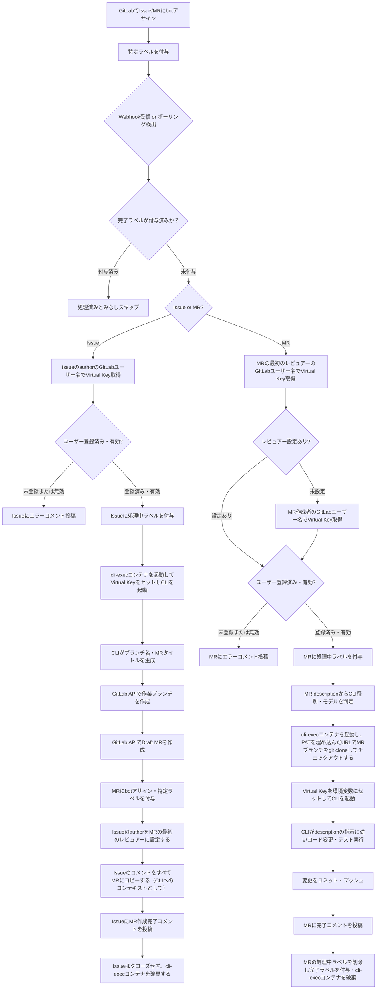
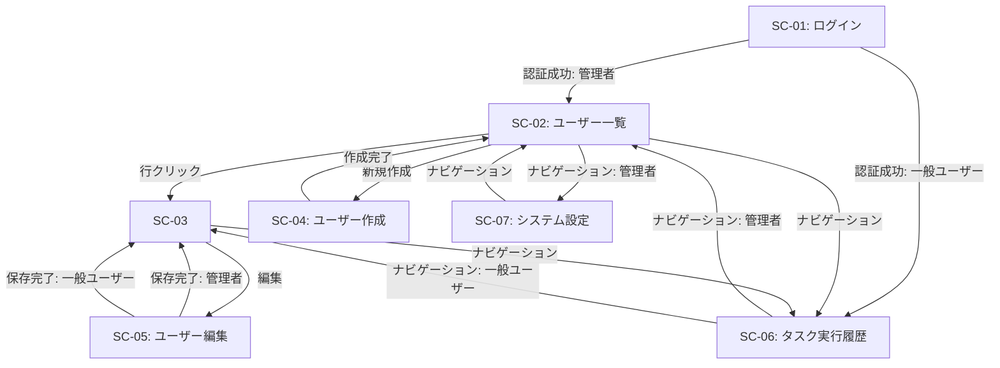
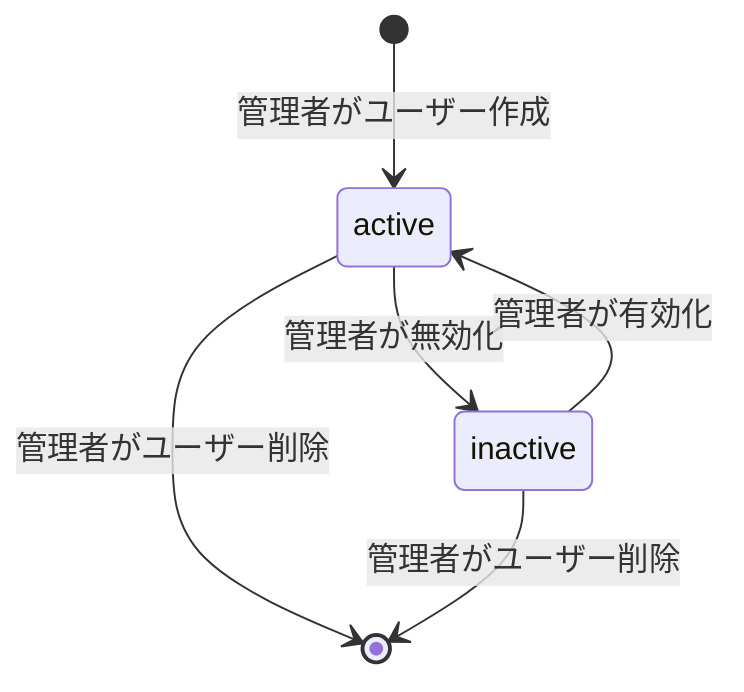
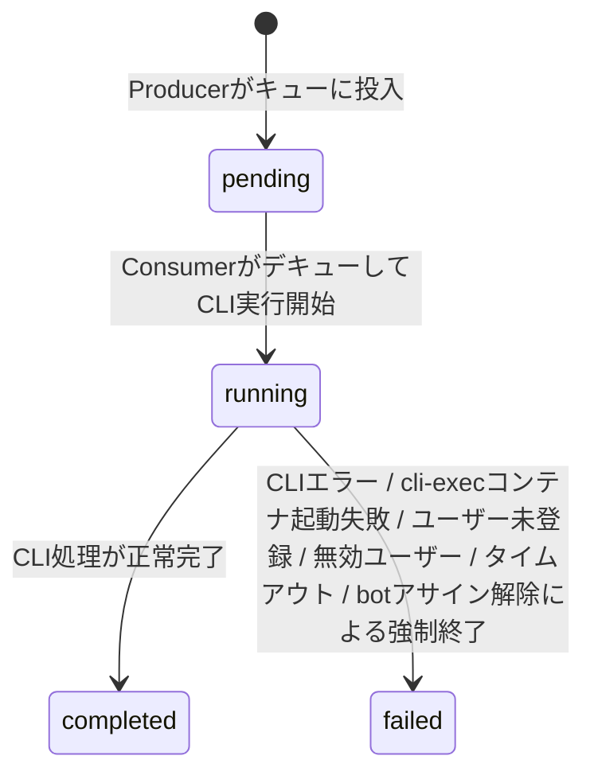

# CodingAgentAutomata 要件定義書

**システム名**: CodingAgentAutomata

---

## 1. 目的・前提

### 1.1 システム目的

GitLabのIssueおよびMerge Request（以下、MR）に対して、botアカウントのアサインと特定ラベルの付与を契機に、CLIコーディングエージェント（以下、CLIエージェント）をコンテナ内で自動起動し、コード実装・テスト・コミットを自動実行するシステムを構築する。使用するCLIエージェントはCLIアダプタ設定によって切り替え可能とし、特定のCLIエージェント実装に依存しない設計とする。各処理に使用するLLMの費用はLiteLLM Virtual Keyでユーザーごとに按分管理する。

### 1.2 用語集

| 用語 | 説明 |
| --- | --- |
| bot | 本システムが操作に使用するGitLabアカウント。Personal Access Tokenで認証する |
| botアサイン | GitLabのIssue/MRのアサイニーとしてbotを指定する操作 |
| 特定ラベル | botの処理対象を示すGitLabラベル。デフォルト値は `coding agent` |
| 処理中ラベル | 処理中状態を示すGitLabラベル。デフォルト値は `coding agent processing` |
| 完了ラベル | 処理完了状態を示すGitLabラベル。デフォルト値は `coding agent done` |
| Issue処理 | 特定ラベル付きIssueを検出し、作業ブランチとDraft MRを自動作成する処理 |
| MR処理 | 特定ラベル付きMRを検出し、descriptionの指示に従ってCLIでコード作業を自動実行する処理 |
| LiteLLM Proxy | Azure OpenAI・AWS Bedrockなど複数のLLMバックエンドを統一エンドポイントで提供するプロキシサーバー |
| Virtual Key | LiteLLM Proxyが発行するユーザー別APIキー。費用追跡と按分に使用する |
| CLIエージェント | 本システムが使用するCLIコーディングエージェントの総称。Claude Code・opencodeなど複数の実装が存在する |
| CLIエージェントID | 本システム内でCLIエージェントを一意に識別する任意の文字列。管理者がシステム設定で定義する |
| CLIアダプタ設定 | CLIエージェントIDごとに定義される設定。コンテナイメージ・起動コマンドテンプレート・CLIへの情報の渡し方（環境変数マッピング等）を含む |
| Claude Code | AnthropicのCLIコーディングエージェント。CLIエージェントIDは `claude` |
| opencode | OSSのCLIコーディングエージェント。CLIエージェントIDは `opencode` |
| cli-execコンテナ | ConsumerがDockerを使って起動するCLI専用の隔離実行コンテナ。F-3（Issue→MR変換）・F-4（MR処理）でCLIを実行する環境として使用し、処理完了後に破棄する。内部でDockerデーモンを使用可能とし、docker-composeによるe2eテストもサポートする |
| Producer | GitLabのIssue/MRを検出し、タスクキューに投入するコンポーネント |
| Consumer | タスクキューからタスクを取得し、cli-execコンテナを起動してIssue処理またはMR処理を実行するコンポーネント |
| Webhook | GitLabがイベント発生時にHTTPリクエストを本システムへ送信する仕組み |
| ポーリング | 本システムがGitLab APIを定期的に呼び出してIssue/MRを検出する仕組み |
| username | GitLabユーザー名。本システムのユーザー識別子として同一値を使用する |

### 1.3 インターフェース形式

- 管理者向けユーザー管理・タスク実行履歴閲覧: GUI（Webブラウザ）
- GitLab連携（Webhook受信・ポーリング）: CUI（バックグラウンドプロセス）
- 初期管理者作成: CUI（コマンドライン）

---

## 2. 業務

### 2.1 対象業務一覧

| No. | 業務名 | 説明 |
| --- | --- | --- |
| B-1 | Issue→MR変換処理 | botアサイン・特定ラベル付きIssueを検出し、作業ブランチとDraft MRを自動作成する |
| B-2 | MRコード実装処理 | botアサイン・特定ラベル付きMRを検出し、descriptionの指示に従ってCLIでコード作業を実行する |
| B-3 | ユーザー・Virtual Key管理 | 開発者ごとのGitLabユーザー名・Virtual Key・CLI設定をWeb管理画面で管理する |

### 2.2 業務フロー



### 2.3 業務の範囲・担当者

| 担当者 | 役割 |
| --- | --- |
| GitLab開発者 | IssueおよびMRを作成し、botアサインと特定ラベルを付与する |
| システム管理者 | Web管理画面でユーザー登録・Virtual Key設定・タスク履歴確認を行う |
| botアカウント | Issue/MR検出・ブランチ作成・CLI実行・進捗コメント投稿を自動実行する |

### 2.4 業務課題・KPI

| 課題ID | 業務課題 | この課題がないと何が困るか | KPI |
| --- | --- | --- | --- |
| P-1 | コード実装タスクの手作業工数が大きく、リードタイムが長い | 開発者がコード実装に専念できず、タスク完了までの時間が長くなる | MR処理の自動完了率 70%以上 |
| P-2 | 複数開発者が同一LLM APIを共用すると費用の帰属が不明 | 誰がどれだけLLMを使ったか把握できず、コスト管理ができない | Virtual Key別の費用追跡率 100% |
| P-3 | Issue発生からブランチ・MR作成までの手作業コストがある | ブランチ命名・MR作成工数が発生し、実装着手までのタイムラグが生じる | Issue→MR自動変換率 100% |

### 2.5 解決すべき課題と対応方針

| 課題ID | 対応方針 |
| --- | --- |
| P-1 | botアサイン＋特定ラベルを検出したら、MR descriptionを指示としてCLIを自動起動してコード変更・テスト・プッシュを実行する |
| P-2 | ユーザーごとにLiteLLM Virtual Keyを登録し、CLI実行時に対象ユーザーのVirtual Keyを環境変数として渡す。LiteLLM ProxyがVirtual Key別に使用量を記録する |
| P-3 | 特定ラベル付きIssueを検出したら、CLIでブランチ名・MRタイトルを生成し、ブランチとMRを自動作成する |

### 2.6 システム化による見込み経営効果

| 効果種別 | 内容 |
| --- | --- |
| Soft Saving（人件費削減） | Issue発生後のブランチ作成・コード実装・テスト実行・コミットの手作業工数を削減 |
| Cost Avoidance | Virtual Keyによるユーザー別コスト追跡で、LLM費用超過の早期検知・予算超過防止が可能 |
| TCO Savings | 開発者がコードレビューや設計に専念でき、開発全体の生産性向上が見込まれる |

---

## 3. 機能要件

### 3.1 機能一覧

| 機能ID | 機能名 | 対応業務課題 | この機能がないと何が困るか |
| --- | --- | --- | --- |
| F-1 | Webhook受信 | P-1, P-3 | GitLabイベントをリアルタイムに検出できず処理が遅延する |
| F-2 | ポーリング | P-1, P-3 | Webhook受信失敗時やWebhook未設定環境で処理対象を検出できない |
| F-3 | Issue→MR変換 | P-3 | IssueからブランチとMRを手動で作成する工数が発生し続ける |
| F-4 | MR処理（CLI実行） | P-1 | MR descriptionの指示を自動実行できず手動実装が必要になる |
| F-5 | CLI実行環境管理 | P-1, P-3 | CLIが本システムのdocker-compose環境から隔離されて実行できず、ホスト環境に影響が及ぶ |
| F-6 | ユーザー管理 | P-2 | GitLabユーザーとVirtual Keyを紐付けできず費用按分ができない |
| F-7 | Virtual Key管理 | P-2 | ユーザー別のLLM費用を追跡できずコスト管理が不可能になる |
| F-8 | 進捗報告（GitLabコメント） | P-1 | CLIの実行状況が開発者に見えず処理の成否が確認できない |
| F-9 | Web管理画面 | P-2 | ユーザー・Virtual Key設定・タスク実行履歴確認・プロンプトテンプレート管理をGUIで管理できない |
| F-10 | 重複処理防止 | P-1, P-3 | WebhookとポーリングがいずれもIssue/MRを同時検出した場合に同一タスクが2重に実行される |

### 3.2 入力データ

| データ | 種別 | 説明 |
| --- | --- | --- |
| Webhookペイロード | 外部（GitLab） | Issue/MR作成・更新イベントのJSONデータ |
| GitLab APIレスポンス | 外部（GitLab） | ポーリング時のIssue/MR一覧・詳細データ |
| MR description | 外部（GitLab開発者） | CLIへの作業指示内容。CLI種別・モデル上書き指定を含む場合がある |
| 管理者入力（Web画面） | 人手 | ユーザー登録情報・Virtual Key・デフォルトCLI・デフォルトモデル |

### 3.3 出力データ

| データ | 出力先 | 説明 |
| --- | --- | --- |
| 作業ブランチ | GitLab | Issue処理時にCLIが生成したブランチ名で自動作成 |
| Draft MR | GitLab | Issue処理時にCLIが生成したタイトルで自動作成。Issueのauthorを最初のレビュアーに設定し、IssueのコメントをすべてCLIへのコンテキストとしてMRにコピーする |
| GitLabコメント | GitLab | 処理進捗・完了・エラーの報告コメント |
| コミット・プッシュ | GitLab | MR処理時にCLIが実行したコード変更の結果 |
| GitLabラベル更新 | GitLab | 処理状態に応じたラベルの付与・変更 |

### 3.4 外部連携

| 連携先 | 連携方式 | 用途 |
| --- | --- | --- |
| GitLab | REST API | Issue/MR操作・ブランチ・コミット・コメント・ラベル管理 |
| GitLab | Webhook（受信） | Issue/MR更新イベントのリアルタイム受信 |
| LiteLLM Proxy | HTTP（OpenAI互換API・Anthropic互換API） | Issue→MR変換時のCLI起動およびMR処理時のCLI起動。Virtual Keyで認証。Claude Codeは`ANTHROPIC_BASE_URL`経由でAnthropic互換エンドポイント（`/v1/messages`）に接続する |
| RabbitMQ | AMQP | Producer/Consumer間の非同期タスクキュー |

### 3.5 Web管理画面 一覧・仕様

| 画面ID | 画面名 | パス | アクセス権 |
| --- | --- | --- | --- |
| SC-01 | ログイン画面 | /login | なし（認証不要） |
| SC-02 | ユーザー一覧 | /users | 管理者のみ |
| SC-03 | ユーザー詳細 | /users/:username | 管理者、または本人のみ |
| SC-04 | ユーザー作成 | /users/new | 管理者のみ |
| SC-05 | ユーザー編集 | /users/:username/edit | 管理者（全ユーザー）、または本人（自分のみ） |
| SC-06 | タスク実行履歴 | /tasks | 管理者（全ユーザー）、一般ユーザー（自分のデータのみ） |
| SC-07 | システム設定 | /settings | 管理者のみ |

---

### SC-01 ログイン画面

- 入力項目: ユーザー名（GitLabユーザー名）、パスワード
- 操作: ログインボタン
- 認証成功時（管理者）: SC-02（ユーザー一覧）へ遷移
- 認証成功時（一般ユーザー）: SC-06（タスク実行履歴）へ遷移
- 認証失敗時: エラーメッセージを表示し同画面に留まる

---

### SC-02 ユーザー一覧

- 表示項目: ユーザー名、デフォルトCLI、デフォルトモデル、ステータス（有効/無効）、登録日時
- 検索: ユーザー名での前方一致絞り込み
- ページネーション: あり
- 操作: 新規作成ボタン（SC-04へ）、行クリックでユーザー詳細（SC-03へ）

---

### SC-03 ユーザー詳細

- 表示項目: ユーザー名、メールアドレス、Virtual Key（マスク表示。末尾4文字のみ表示）、デフォルトCLI、デフォルトモデル、ロール、ステータス、登録日時、最終更新日時、システムMCP設定の適用（オン/オフ）、ユーザー個別MCP設定（JSON表示）、ユーザー個別F-4テンプレート（設定済みの場合のみ表示）
- アクセス制御: 管理者は全ユーザーの詳細を閲覧可能。一般ユーザーは自分のユーザー詳細のみ閲覧可能。他ユーザーのURLへアクセスした場合はSC-06（タスク実行履歴）へリダイレクトする
- 操作: 編集ボタン（SC-05へ）、削除ボタン（管理者のみ。確認ダイアログ後にユーザーを削除しSC-02へ遷移）

---

### SC-04 ユーザー作成

- 入力項目（全て必須）:
  - ユーザー名（GitLabユーザー名）
  - メールアドレス
  - Virtual Key（LiteLLM Virtual Key）
  - デフォルトCLI（登録済みのCLIエージェントIDのいずれかを選択）
  - デフォルトモデル（モデル名を文字列で入力）
  - ロール（admin / user のいずれかを選択）
  - パスワード（8文字以上、英字大小・数字・記号を含む）
- バリデーション: ユーザー名重複チェック、メールアドレス重複チェック、メールアドレス形式検証、パスワード強度検証、登録済みのCLIエージェントIDであることの検証
- 操作: 作成ボタン（成功時SC-02へ）、キャンセルボタン（SC-02へ）

---

### SC-05 ユーザー編集

- 変更不可項目: ユーザー名（表示のみ）
- 変更可能項目（管理者が全ユーザーを編集する場合）:
  - メールアドレス
  - Virtual Key（新しい値を入力した場合のみ更新。空欄の場合は変更なし）
  - デフォルトCLI
  - デフォルトモデル
  - ロール（admin / user）
  - ステータス（有効 / 無効）
  - システムMCP設定のオン/オフ（チェックボックス）
  - ユーザー個別MCP設定（JSON形式で自由に入力可能）
  - ユーザー個別F-4テンプレート（テキストエリア。設定するとSC-07のシステム設定より優先される。空欄の場合はSC-07のシステムデフォルトプロンプトが使用される。クリアボタンでテンプレートを空欄に戻せる（確認ダイアログ後に実行）。使用可能な変数の一覧をヘルプテキストとして表示する）
- 変更可能項目（一般ユーザーが自分を編集する場合）:
  - メールアドレス
  - デフォルトCLI
  - デフォルトモデル
  - パスワード（現在のパスワードを入力してから新しいパスワードを設定する）
  - システムMCP設定のオン/オフ（チェックボックス）
  - ユーザー個別MCP設定（JSON形式で自由に入力可能。CLI実行時にシステムMCP設定にマージして渡す）
  - ユーザー個別F-4テンプレート（テキストエリア。設定するとSC-07のシステム設定より優先される。空欄の場合はSC-07のシステムデフォルトプロンプトが使用される。クリアボタンでテンプレートを空欄に戻せる（確認ダイアログ後に実行）。使用可能な変数の一覧をヘルプテキストとして表示する）
  - Virtual Key・ロール・ステータスは表示しない（一般ユーザーは変更不可）
- アクセス制御: 一般ユーザーが他ユーザーの編集URLへアクセスした場合はSC-06（タスク実行履歴）へリダイレクトする
- 操作: 保存ボタン（成功時SC-03へ）、キャンセルボタン（SC-03へ）

---

### SC-06 タスク実行履歴

- フィルタ:
  - ステータス（pending / running / completed / failed）
  - ユーザー名（管理者: 全体または特定ユーザーを選択可 / 一般ユーザー: 自分のみ固定、変更不可）
  - タスク種別（issue / merge_request）
- 表示項目: タスクUUID、ユーザー名、タスク種別、ステータス、使用CLI、使用モデル、開始日時、完了日時
- ページネーション: あり（1ページ20件）

---

### SC-07 システム設定

- アクセス制御: 管理者のみアクセス可能
- 設定項目:
  - F-3用プロンプトテンプレート（テキストエリア。初期値はシステムセットアップスクリプトでDB投入済み）
  - F-4用プロンプトテンプレート（テキストエリア。初期値はシステムセットアップスクリプトでDB投入済み）
  - CLIアダプタ設定一覧（CLIエージェントIDごとにコンテナイメージ・起動コマンドテンプレート・情報渡し方のマッピングを管理する。組み込みアダプタは編集のみ可能で削除不可。新規アダプタの追加・編集・削除が可能）
    - **CLIアダプタ追加・編集フォームの入力項目**:
      - CLIエージェントID（半角英数字・ハイフン・アンダースコアのみ。新規追加時は必須・重複不可。編集時は変更不可で表示のみ）
      - コンテナイメージ名・タグ（必須。例: `coding-agent-cli-exec-claude:latest`）
      - 起動コマンドテンプレート（必須。`{prompt}` および `{model}` 変数を使用可能であることをヘルプテキストとして表示する）
      - 環境変数マッピング（JSON形式。`llm_api_key`・`llm_base_url` などの情報名と環境変数名の対応を記述する。ヘルプテキストとして使用可能なキー一覧を表示する）
      - 設定内容環境変数名（省略可。CLIが設定をJSON形式で受け取る環境変数名）
    - バリデーション: CLIエージェントID重複チェック、必須項目の入力チェック、環境変数マッピングのJSON形式チェック
    - 削除時に当該CLIエージェントIDを `default_cli` として持つユーザーが存在する場合はエラーを表示し削除を拒否する
  - システムMCP設定（CLIに渡すMCPサーバー設定。JSON形式で管理者が登録する。全ユーザーに適用される）
- 各テンプレートには使用可能な変数の一覧をヘルプテキストとして表示する
- 操作: 保存ボタン（プロンプトテンプレート・システムMCP設定を一括保存する。F-3用テンプレートが空欄の場合はバリデーションエラーを表示し保存を拒否する。成功時に同画面でフラッシュメッセージを表示。CLIアダプタ設定は個別の追加・編集フォームで保存する）

---

### 3.6 画面遷移



### 3.7 CUI 引数仕様（環境変数一覧）

本システムはdocker-composeで構成し、Producer・Consumer（複数台並列起動可能）・Webhookサーバー・PostgreSQL・RabbitMQを同一docker-compose環境で動作させる。ConsumerはタスクをRabbitMQから受け取るたびに、CLI専用のcli-execコンテナを起動してCLIに処理させ、完了後にコンテナを破棄する。ConsumerコンテナにCLIのインストールは不要で、代わりにDockerデーモンへのアクセス権が必要。すべての設定は環境変数で受け取る。

### コアコンポーネント共通（必須）

| 環境変数名 | 説明 |
| --- | --- |
| GITLAB_PAT | GitLab bot用Personal Access Token |
| GITLAB_URL | GitLab APIのベースURL |
| GITLAB_BOT_NAME | botアカウントのGitLabユーザー名 |
| GITLAB_BOT_LABEL | 処理対象ラベル名（デフォルト: `coding agent`） |
| GITLAB_PROCESSING_LABEL | 処理中状態ラベル名（デフォルト: `coding agent processing`） |
| GITLAB_DONE_LABEL | 完了状態ラベル名（デフォルト: `coding agent done`） |
| LITELLM_PROXY_URL | LiteLLM ProxyのベースURL |
| DATABASE_URL | PostgreSQL接続文字列 |
| RABBITMQ_URL | RabbitMQ接続文字列 |
| ENCRYPTION_KEY | Virtual Key暗号化キー（AES-256-GCM） |
| JWT_SECRET_KEY | Web管理画面JWT署名キー |

### Webhookサーバー（追加）

| 環境変数名 | 説明 |
| --- | --- |
| GITLAB_WEBHOOK_SECRET | X-Gitlab-Token ヘッダーの直接比較に使用する検証トークン |
| WEBHOOK_PORT | Webhookリッスンポート（デフォルト: 8080） |

### ポーリング設定（オプション）

| 環境変数名 | 説明 |
| --- | --- |
| POLLING_INTERVAL_SECONDS | ポーリング間隔（秒）。デフォルト: 30 |

### 進捗報告設定（オプション）

| 環境変数名 | 説明 |
| --- | --- |
| PROGRESS_REPORT_INTERVAL_SEC | 進捗コメントを更新する間隔（秒）。デフォルト: 60 |
| PROGRESS_REPORT_SUMMARY_LINES | `<summary>` に表示するCLI出力の末尾行数。デフォルト: 20 |

### タイムアウト設定（オプション）

| 環境変数名 | 説明 |
| --- | --- |
| CLI_EXEC_TIMEOUT_SEC | CLI処理タイムアウト上限（秒）。デフォルト: 10800（3時間） |

#### cli-execコンテナ詳細仕様

### コンテナイメージ

Dockerデーモンを内包した本システム専用のカスタムイメージを使用する。以下のテスト実行環境を標準でサポートする。

| 言語 / FW | 標準サポート内容 |
| --- | --- |
| Python | Python・`uv`パッケージマネージャ |
| Node.js / npm | Node.js・`npm` |
| Playwright | Playwright（ブラウザテスト実行環境含む） |

Rust・Go・Rubyなどその他の言語・ツールは、イメージビルド時に渡す環境変数で環境構築コマンドを埋め込むことで追加できる構造とする。CLIエージェントごとに独立したイメージを維持する。

### CLIエージェントの抽象化

コア処理（タスク受信・cli-execコンテナ起動・完了/失敗検知）はCLIエージェントに依存しない共通インターフェースとして設計する。CLIエージェントの追加は、専用コンテナイメージを用意してCLIアダプタ設定を定義するだけで対応できる構造とする。

### ライフサイクルと後処理

| フェーズ | 仕様 |
| --- | --- |
| 起動 | Consumerがタスク取得直後にcli-execコンテナを起動する。コンテナ名は `cli-exec-{cli_id}-{task_uuid}` とする。Virtual Keyを環境変数でセットする。F-4（MR処理）の場合のみ、ConsumerがPATを埋め込んだURL形式でcli-execコンテナ内のリポジトリをgit cloneしてMRブランチをチェックアウトする。F-3（Issue→MR変換）ではgit cloneは行わない。GITLAB_PATはcli-execコンテナの環境変数には渡さない |
| タイムアウト | CLI処理開始から `CLI_EXEC_TIMEOUT_SEC` 環境変数で指定した秒数（デフォルト: 10800秒 = 3時間）を上限とし、超過した場合はCLIプロセスおよびコンテナを強制終了する |
| botアサイン解除 | ConsumerはF-4処理中、進捗更新と同じ間隔でMRのアサイニー一覧をGitLab APIで確認する。botアカウントがアサイニーから外された場合はCLIプロセスのみを強制終了する（コンテナは停止しない）。その後、コンテナ内で git push を実行し（エラーの場合も無視）、コンテナを即時破棄する。MRに強制終了コメントを投稿する（F-3には適用しない） |
| 正常完了後 | コンテナを即時破棄する |
| 異常終了・タイムアウト後 | F-4の場合はコンテナ内で git push を実行し（エラーの場合も無視）、その後コンテナを即時破棄する。F-3の場合はgit cloneを行わないため git push は不要で、コンテナを即時破棄する。Virtual Keyはコンテナ内の環境変数にのみ存在するため、コンテナ破棄によって確実に消去される |

### CLIエージェントへの情報渡し方

CLIエージェントへの情報の渡し方は「渡す情報の抽象定義（CLI非依存）」と「各CLIへの渡し方（CLIアダプタ設定）」に分離して管理する。

### 渡す情報の一覧（CLI非依存の抽象定義）

ConsumerがCLI実行コンテナ起動・CLI実行時に渡す情報を以下の通り定義する。

| 情報名 | 内容 |
| --- | --- |
| llm_api_key | LLM APIキー（タスク対象ユーザーのVirtual Key） |
| llm_base_url | LLM APIベースURL（LiteLLM Proxy URL） |
| prompt | CLIへの作業指示文（テンプレートから生成） |
| model | 使用するモデル名 |
| mcp_config | CLIに渡すMCP設定（システムMCP設定とユーザー個別MCP設定をマージしたJSON形式） |

### CLIアダプタ設定の形式

CLIエージェントへの各情報の渡し方はCLIエージェントIDごとにアダプタ設定として定義する。アダプタ設定は以下の要素を持つ。

| 項目 | 説明 |
| --- | --- |
| cli_id | CLIエージェントの識別子（任意の文字列） |
| container_image | 使用するcli-execコンテナイメージ名・タグ |
| start_command_template | 起動コマンドテンプレート（`{model}`・`{mcp_config}`などの変数を含む。プロンプトはコンテナ内ファイル経由で渡すため `{prompt}` 変数は使用しない） |
| env_mappings | 情報名→環境変数名のマッピング（環境変数として渡す情報の対応表） |
| config_content_env | CLIが設定内容を環境変数経由で受け取る場合の、JSON形式の設定を渡す環境変数名（プロバイダー設定・MCPサーバー設定のマージも含む。不要な場合は省略） |

`start_command_template` で使用できる変数は以下の通りである。

| 変数 | 内容 |
| --- | --- |
| `{model}` | 使用するLLMモデル名 |
| `{mcp_config}` | MCP設定をCLIフラグで直接受け渡すCLI向けのMCP設定JSON文字列 |

プロンプトはコンテナ内の `/tmp/prompt.txt` にファイルとして書き込み、`start_command_template` 内の `cat /tmp/prompt.txt` で読み取る。

### 組み込みアダプタ設定

本システムはClaude Code・opencodeのアダプタ設定を組み込みで提供する。将来のCLIエージェント追加時も同形式のアダプタ設定を定義することで対応する。

| 項目 | Claude Code | opencode |
| --- | --- | --- |
| cli_id | `claude` | `opencode` |
| container_image | `coding-agent-cli-exec-claude:latest` | `coding-agent-cli-exec-opencode:latest` |
| 起動コマンドテンプレート | `cat /tmp/prompt.txt \| claude -p --dangerously-skip-permissions --model {model} --mcp-config '{mcp_config}'` | `cat /tmp/prompt.txt \| opencode run - --model {model}` |
| llm_api_key の渡し方 | 環境変数 `ANTHROPIC_API_KEY` | OpenAIプロバイダー使用時は環境変数 `OPENAI_API_KEY`、Anthropicプロバイダー使用時は環境変数 `ANTHROPIC_API_KEY`（プロバイダーに応じてアダプタ設定の `env_mappings` で切り替える） |
| llm_base_url の渡し方 | 環境変数 `ANTHROPIC_BASE_URL` | `config_content_env` のJSON内 `provider.options.baseURL` に設定 |
| MCP設定の渡し方 | `start_command_template` の `{mcp_config}` 変数に展開（`--mcp-config` フラグ経由） | `config_content_env`（`OPENCODE_CONFIG_CONTENT`）のJSON内にプロバイダー設定とともにMCPサーバー設定（`mcp` キー）をマージして渡す |
| config_content_env | （不使用） | `OPENCODE_CONFIG_CONTENT` |

ConsumerはCLIアダプタ設定の `env_mappings`・`config_content_env`・`start_command_template` の定義に従って環境変数および起動コマンドを構築する。コア処理はCLIエージェントの種別を直接参照しない。

cli-execコンテナ起動時にセットする環境変数はアダプタ設定によって決まるため、新CLIエージェントを追加する際にコア処理の変更は不要である。

### git認証（PAT埋め込みURL方式）

この認証方式はF-4（MR処理）のみに適用される。F-3（Issue→MR変換）ではgit cloneは行わない。cli-execコンテナには `GITLAB_PAT` を環境変数として渡さない。代わりに、ConsumerがF-4のcli-execコンテナ内でリポジトリをgit cloneする際に、GITLAB_PATをURLに埋め込んだ形式（`プロトコル://oauth2:PAT@ホスト/プロジェクトパス.git`）を使用する。cloneされたリモートURLにPATが含まれるため、コンテナ内でのgit pushも追加の認証設定なしに実行できる。PATはコンテナの環境変数には存在しないため、コンテナ破棄後に残存しない。

### プロンプトテンプレート

ConsumerはCLI起動時に渡す指示文をテンプレートから生成する。テンプレートはF-3・F-4で独立してDBに保存し、初期値はシステムセットアップスクリプトで投入する。管理者はSC-07（システム設定）でシステムテンプレートを変更できる。F-4については一般ユーザーもSC-05（ユーザー編集）でユーザー個別テンプレートを設定でき、システムテンプレートより優先される。ユーザー個別F-4テンプレートが空欄の場合はシステムデフォルトプロンプトが使用される。F-3用テンプレートは管理者のみが変更可能であり、空欄にした場合はF-3処理が失敗するため管理者は常に設定を維持すること。

### F-3用テンプレート（Issue→MR変換時のCLIへの指示文）

| 変数名 | 内容 |
| --- | --- |
| `{issue_title}` | Issueのタイトル |
| `{issue_description}` | Issueのdescription本文 |
| `{issue_comments}` | Issueのコメント一覧（投稿日時・投稿者・本文をまとめたテキスト） |
| `{project_name}` | GitLabプロジェクト名 |
| `{repository_url}` | GitLabリポジトリのHTTPS URL |

### F-4用テンプレート（MR処理時のCLIへの指示文）

| 変数名 | 内容 |
| --- | --- |
| `{mr_description}` | MRのdescription本文（CLIへの作業指示の本体として展開） |
| `{mr_comments}` | MRのコメント一覧（投稿日時・投稿者・本文をまとめたテキスト。CLIへのコンテキストとして渡す） |
| `{branch_name}` | 作業ブランチ名 |
| `{repository_url}` | GitLabリポジトリのHTTPS URL |

初期テンプレートでは、F-3はIssueの内容からブランチ名とMRタイトルの生成のみを行う最小限の指示とし、F-4はMR descriptionを指示の本体としてそのまま渡す構成とする。F-3の初期テンプレートは、CLIに対して標準出力の最終行にブランチ名とMRタイトルのJSONのみを出力するよう指示する構造とし、ConsumerはCLIの標準出力の最終行をJSONとしてパースしてブランチ名とMRタイトルを取得する。F-3でGitLab APIを使ってDraft MRを作成する際は、IssueのdescriptionをMR descriptionにそのまま設定する。これによりF-4（MR処理）が当該MRを検出した際に、元のIssue descriptionがCLIへの作業指示として引き継がれる。

F-4の初期テンプレートでは、変更が完了したら適切な区切りでコミットし、すべての処理が完了したら最終コミットとプッシュを実行するよう指示を含める。

F-4処理時、ConsumerはMRのdescription（必須）とMRのコメント一覧をCLIへの作業コンテキストとしてプロンプトに埋め込む。コメント一覧はCLIが処理内容を把握するためのコンテキストであることをプロンプト内に明記する。MRのコメント総量が各CLIの入力上限を超える場合は、descriptionを必ず含めた上で古いコメントから順に削除し、上限内に収める。

MR descriptionにCLI種別・モデルの上書き指定が含まれる場合は、ユーザー設定のデフォルトより優先する（F-4のみ）。上書き指定はMR descriptionの任意の行に `agent:` で始まる行として記述し、 `cli=<CLIエージェントID>` および `model=<モデル名>` をスペース区切りで指定する。各キーは省略可能で、指定されたキーのみが上書き対象となる。`agent:` 行はdescription中に可視状態で存在するため、ユーザーは設定内容を直接確認・編集できる。

### 3.8 ユーザー利用フロー（全機能）

```mermaid
flowchart TD
    A[管理者がSC-04でユーザーを新規登録する] --> B[GitLabユーザー名・Virtual Key・デフォルトCLI・モデルを入力して作成]
    B --> C[GitLab開発者がIssueを作成する]
    C --> D[IssueにbotをアサインしてGitLabラベルを付与する]
    D --> E{F-1 Webhook受信 または F-2 ポーリング検出}
    E --> F[F-3 Issue→MR変換処理を開始する]
    F --> G[F-7 IssueのauthorのVirtual Keyを取得する]
    G --> G2[Issueに処理中ラベルを付与する]
    G2 --> H[F-5 cli-execコンテナを起動してVirtual Keyをセットし、CLIを起動してブランチ名・MRタイトルを生成する]
    H --> I[GitLab APIで作業ブランチとDraft MRを作成する]
    I --> I2[IssueのauthorをMRの最初のレビュアーに設定する]
    I2 --> I3[IssueのコメントをすべてMRにコピーする（CLIへのコンテキストとして引き継ぐ）]
    I3 --> J[F-8 IssueにMR作成完了コメントを投稿する]
    J --> J2[Issueはクローズしない]
    J2 --> K[次のWebhook/ポーリングでMRを検出する]
    K --> L[F-4 MR処理を開始する]
    L --> M[F-7 最初のレビュアーのVirtual Keyを取得する]
    M --> M2[MRに処理中ラベルを付与する]
    M2 --> N[MR descriptionからCLI種別・モデルを決定する]
    N --> O[F-5 cli-execコンテナを起動し、PATを埋め込んだURLでMRブランチをgit cloneしてチェックアウトする]
    O --> P[Virtual Keyを環境変数にセットしてCLIを起動する]
    P --> P2[F-8 MRに処理開始コメントを投稿する]
    P2 --> Q[CLIがdescriptionの指示に従いコード変更・テストを実行する]
    Q --> Q2[F-8 CLIの標準出力を定期的にMRへ進捗コメントとして投稿する]
    Q2 --> R[変更をコミット・プッシュする]
    R --> S[F-8 MRの処理中ラベルを削除し完了コメントを投稿しdoneラベルを付与する]
```



### 3.9 業務フローと機能の対応関係

| 業務 | 使用機能 |
| --- | --- |
| B-1（Issue→MR変換） | F-1, F-2（検出）/ F-3（変換処理）/ **F-5（cli-execコンテナ起動）**/ F-7（Virtual Key取得）/ F-8（進捗報告）/ **F-10（重複処理防止）** |
| B-2（MRコード実装） | F-1, F-2（検出）/ F-4（MR処理）/ F-5（cli-execコンテナ起動）/ F-7（Virtual Key取得）/ F-8（進捗報告）/ **F-10（重複処理防止）** |
| B-3（ユーザー管理） | F-6（ユーザーCRUD）/ F-7（Virtual Key暗号化保存）/ F-9（Web管理画面） |

### 3.10 ログ

**アプリケーション動作ログ（INFO / WARN / ERROR）**: 運用方針に従って保存する

**タスク実行ログ（CLIの標準出力・エラー出力）**: タスクレコードに紐付けてPostgreSQLに保存し、保持方針は運用で定める

一般的な動作ログ・エラーログ以外に記録が必要な業務固有ログ:

| ログ種別 | 記録内容 |
| --- | --- |
| GitLab API呼び出しログ | 呼び出し成功・失敗・レートリミット発生の事実と対象Issue/MR番号 |
| Virtual Key解決ログ | 対象GitLabユーザー名・Virtual Key取得成否・失敗理由（未登録・無効等） |
| CLI実行環境ライフサイクルログ | cli-execコンテナ起動・ブランチチェックアウト完了・コンテナ破棄のタイムスタンプとタスクUUID |

### 3.11 監視・アラート

各コンポーネントの死活監視のみを行う。

| 監視対象 | 監視方法 |
| --- | --- |
| Producer | HTTPヘルスチェックエンドポイント（`/health`）への定期リクエストで監視する |
| Consumer（全インスタンス） | プロセスの起動・停止を監視する |
| Webhookサーバー | HTTPヘルスチェックエンドポイント（`/health`）への定期リクエストで監視する |
| PostgreSQL | TCP接続確認で監視する |
| RabbitMQ | TCP接続確認で監視する |

いずれかのコンポーネントがダウンした場合はコンテナオーケストレーションの自動再起動機能により復旧する。

### 3.12 進捗報告仕様（F-8）

ConsumerはCLI実行中にCLIの標準出力を定期的にGitLab MRの**1つのコメント**に更新し続ける。

#### コメント種別と投稿タイミング

| コメント種別 | 投稿タイミング | 内容 |
| --- | --- | --- |
| 処理開始コメント | cli-execコンテナ起動・CLI実行直前 | 使用するCLI種別・モデル名・タスクUUID |
| 進捗コメント（初回作成） | CLI実行開始から最初の更新間隔（デフォルト60秒）経過時 | `<summary>` に直近N行（デフォルト20行）、`<details>` 本体に全体（最大20,000行）を収録した`<details>`形式のコメントを新規作成 |
| 進捗コメント（更新） | その後の更新間隔ごと | 同一コメントをGitLab APIのコメント編集エンドポイントで同じ`<details>`形式のまま内容を上書き |
| 完了コメント | CLI正常終了後 | 完了メッセージ・タスクUUID |
| エラーコメント | CLI異常終了・タイムアウト発生時 | エラー内容・タスクUUID |
| 強制終了コメント | botアカウントがMRのアサイニーから外されたことを検知した時（F-4のみ） | botアサイン解除を機にCLIを強制終了した旨・git push結果（成功/失敗）・タスクUUID |

#### 進捗コメントの仕様

- **1タスクにつき進捗コメントは1件のみ作成し**、更新のたびにGitLab APIのコメント編集エンドポイントで内容を上書きする
- Consumerは別スレッドまたは非同期タスクとして、CLI実行中に一定間隔でCLIの標準出力バッファを読み取る
- 進捗コメントの本文形式は以下の通りとする

  ```text
  <details>
  <summary>進捗状況（最終更新: {更新日時}）

  {CLI標準出力の直近20行}
  </summary>

  {CLI標準出力の全体（最大20,000行）}

  </details>
  ```

- `<summary>` 内にはCLI標準出力の**直近20行**を表示し、折りたたんだ状態でも最新の出力が確認できるようにする
- `<details>` 本体にはCLI標準出力の**全体（最大20,000行）**を収録する
- CLI標準出力の全体バッファが20,000行を超えた場合は、直近20,000行のみを保持し古い行を破棄する（メモリ節約のため）
- summary行数（デフォルト20行）と更新間隔（デフォルト60秒）は環境変数で設定する（§3.7「進捗報告設定」参照）
- CLIが60秒以内に終了した場合は進捗コメントを作成せず、完了コメントのみ投稿する

### 3.13 重複処理防止（F-10）

Webhookとポーリングは独立したプロセスとして同時動作するため、同一Issue/MRを両方が検出した場合に同じタスクが2重に実行される可能性がある。以下の仕組みで重複を防止する。

- Producerはタスクをキューへ投入する前に、同一のGitLabプロジェクト・Issue/MR IID・タスク種別の組み合わせで既に待機中または実行中のタスクが存在するかをDBで確認する
- 同一組み合わせの待機中または実行中タスクが存在する場合は、キューへの投入をスキップする
- 複数のProducerインスタンスが同時に「既存タスクなし」と判断して二重投入するレースコンディションを防ぐため、`gitlab_project_id`・`source_iid`・`task_type` の組み合わせに対してステータスが `pending` または `running` のタスクが1件のみ存在できるようDBユニーク制約で排他制御する
- タスクが完了または失敗した後は重複チェックの対象外となるため、同一Issue/MRに再度ラベルが付与された場合は新規タスクとして処理できる

### 重複チェックの適用範囲

| チェック対象 | チェック対象外 |
| --- | --- |
| 待機中または実行中のタスク | 完了済みまたは失敗済みのタスク |

---

## 4. データ

### 4.1 業務エンティティ一覧

| エンティティ | 説明 | 種別 |
| --- | --- | --- |
| ユーザー | GitLabユーザー名・Virtual Key・CLI設定を管理する。マスタデータ | 内部 |
| CLIアダプタ設定 | CLIエージェントIDごとのコンテナイメージ・起動コマンド・情報渡し方のマッピングを管理する。マスタデータ | 内部 |
| タスク | Issue/MR処理の実行単位 | 内部 |
| system_settings | F-3/F-4プロンプトテンプレートおよびシステムMCP設定を管理する。マスタデータ | 内部 |

### 4.2 エンティティCRUD表

| エンティティ | C | R | U | D | 一覧 | 詳細 | 検索 | 状態管理 |
| --- | --- | --- | --- | --- | --- | --- | --- | --- |
| ユーザー | ○（管理者） | ○（管理者: 全件 / 一般ユーザー: 自分のみ） | ○（管理者: 全件 / 一般ユーザー: 自分のみ・制限あり） | ○（管理者） | ○（管理者のみ） | ○ | ○（ユーザー名） | active / inactive |
| CLIアダプタ設定 | ○（管理者） | ○（管理者） | ○（管理者） | ○（管理者。組み込みアダプタは削除不可） | ○（管理者のみ） | ○ | × | なし |
| タスク | ○（自動） | ○ | ○（自動） | × | ○ | ×（専用詳細APIなし） | ○（ユーザー名・ステータス・種別） | pending → running → completed / failed |
| system_settings | ○（初期化時投入） | ○（管理者） | ○（管理者） | × | × | ×（一括取得のみ） | キー単位 | なし |

### 4.3 ユーザーエンティティ属性

| 属性 | 説明 | 必須 |
| --- | --- | --- |
| username | GitLabユーザー名（= 本システムユーザー名）。主キー | ○ |
| email | メールアドレス。ユニーク制約あり | ○ |
| virtual_key | LiteLLM Virtual Key（AES-256-GCM暗号化保存） | ○ |
| default_cli | デフォルトCLIエージェントID（システムに登録済みのCLIエージェントIDのいずれか） | ○ |
| default_model | デフォルトで使用するLLMモデル名 | ○ |
| role | 権限ロール（admin / user） | ○ |
| is_active | 有効/無効フラグ（デフォルト: true） | ○ |
| password_hash | bcryptハッシュ化パスワード（Web管理画面ログイン用） | ○ |
| system_mcp_enabled | システムMCP設定の適用オン/オフ（デフォルト: true） | ○ |
| user_mcp_config | ユーザー個別のMCP設定（JSON形式。NULLの場合は適用なし） | |
| f4_prompt_template | ユーザー個別のF-4用プロンプトテンプレート（設定時はSC-07のシステム設定より優先される。NULLの場合はシステム設定を使用） | |
| created_at | 登録日時 | ○ |
| updated_at | 最終更新日時 | ○ |

### 4.4 タスクエンティティ属性

| 属性 | 説明 | 必須 |
| --- | --- | --- |
| task_uuid | タスク一意識別子 | ○ |
| task_type | タスク種別（issue / merge_request） | ○ |
| gitlab_project_id | GitLabプロジェクトID | ○ |
| source_iid | Issue IIDまたはMR IID | ○ |
| username | 実行対象ユーザー名（Virtual Key取得元） | ○ |
| status | ステータス（pending / running / completed / failed） | ○ |
| cli_type | 使用したCLIエージェントID | |
| model | 使用したモデル名 | |
| cli_log | CLIの実行ログ（標準出力・エラー出力） | |
| error_message | エラー内容（失敗時のみ） | |
| created_at | タスク作成日時 | ○ |
| started_at | 処理開始日時 | |
| completed_at | 処理完了日時 | |

> **重複処理防止（F-10）**: GitLabプロジェクトID・Issue/MR IID・タスク種別の3項目が同一で、かつ待機中または実行中のタスクが存在する場合は、新規タスクを投入しない。完了・失敗済みのタスクは対象外とする。

### 4.5 CLIアダプタ設定エンティティ属性

| 属性 | 説明 | 必須 |
| --- | --- | --- |
| cli_id | CLIエージェント識別子。主キー（任意の文字列。例: `claude`、`opencode`） | ○ |
| container_image | 使用するcli-execコンテナイメージ名・タグ | ○ |
| start_command_template | 起動コマンドテンプレート。`{model}` などの変数を含む。プロンプトはコンテナ内ファイル経由で渡すため `{prompt}` 変数は不使用 | ○ |
| env_mappings | 情報名→環境変数名のマッピング（JSON形式）。`llm_api_key`・`llm_base_url` などを各CLIの環境変数名に対応付ける | ○ |
| config_content_env | CLIが設定内容を環境変数経由でJSON形式で受け取る場合の環境変数名（プロバイダー設定・MCPサーバー設定のマージも含む）。不要な場合はNULL | |
| is_builtin | 組み込みアダプタフラグ。`true` の場合は削除不可（デフォルト: false） | ○ |
| created_at | 登録日時 | ○ |
| updated_at | 最終更新日時 | ○ |

組み込みアダプタ（`claude`・`opencode`）はシステム初期化時にDBへ初期データとして投入される。

### 4.6 system_settings エンティティ属性

| 属性 | 説明 | 必須 |
| --- | --- | --- |
| key | 設定キー（`f3_prompt_template`、`f4_prompt_template`、`system_mcp_config`） | ○ |
| value | 設定値（文字列またはJSON文字列） | ○ |
| updated_at | 最終更新日時 | ○ |

### 4.7 データ保持期間

| データ | 保持期間 |
| --- | --- |
| ユーザー | 削除操作まで無期限 |
| CLIアダプタ設定 | 削除操作まで無期限 |
| タスク | 1年 |
| アプリケーションログ | 運用方針に従う |
| CLIログ（cli_log） | 運用方針に従う |

### 4.8 外部DB接続先

外部DB接続は不要とする。PostgreSQL は本システム内の永続化コンポーネントとして扱う。

### 4.9 DBの必要性

- **PostgreSQL**: 必要。ユーザー情報・Virtual Key（暗号化）・CLIアダプタ設定・タスク実行履歴・CLIログの永続管理に使用する。
- **RabbitMQ**: 必要。ProducerとConsumer間の非同期・分散タスクキューとして使用する。複数のConsumerによる並列処理のために必要。

---

## 5. 非機能要件

### 5.1 性能（応答時間）

| 処理 | 目標 |
| --- | --- |
| Webhook受信からキュー投入まで | 3秒以内 |
| Web管理画面の画面遷移 | 2秒以内 |
| ポーリング間隔 | 30秒（環境変数で変更可） |
| Issue→MR変換処理（全体） | 5分以内 |
| cli-execコンテナ起動・CLIが処理開始できる状態になるまで | 3分以内 |
| CLI処理タイムアウト上限 | 3時間（環境変数 `CLI_EXEC_TIMEOUT_SEC` で変更可） |

### 5.2 利用人数（同時接続）

| 対象 | 想定規模 |
| --- | --- |
| 同時処理タスク数 | 5〜10並列（Consumer数で設定） |
| Web管理画面同時接続 | 10ユーザー以下 |

### 5.3 セキュリティ

| 項目 | 対策 |
| --- | --- |
| Virtual Key保存 | AES-256-GCMで暗号化保存。復号はタスク実行直前のみ実施 |
| Webhook受信 | GITLAB_WEBHOOK_SECRET と X-Gitlab-Token ヘッダーの直接比較。検証失敗時は即時拒否 |
| Web管理画面認証 | JWT（HS256、有効期限24時間）によるBearerトークン認証 |
| パスワード保存 | bcrypt（コストファクタ12）でハッシュ化 |
| cli-exec環境のVirtual Key | タスク完了・失敗後にコンテナを即時破棄し、Virtual Keyを環境から消去 |
| GitLab PAT | 環境変数のみで管理し、DBには保存しない。cli-execコンテナには環境変数として渡さない。F-4（MR処理）のみgit clone URLにPATを埋め込んだ形式で使用する。F-3ではgit cloneは行わない。コンテナ破棄後にPATが残存しない。CLIの標準出力にPATが混入する可能性があるため、CLIログをPostgreSQLに保存する前にPATパターンをマスク処理する |
| cli-execコンテナのDinD構成 | docker-composeによるe2eテストサポートのためcli-execコンテナは`--privileged`フラグが必要なDocker-in-Docker構成をとる。CLIが実行するコードはコンテナ内で隔離されるが、`--privileged`フラグの性質上ホスト環境への影響が生じうるため、信頼できるGitLabユーザーのみに本システムの使用を許可すること |

### 5.4 テスト環境構成要件

`.env` ファイルに OpenAI APIキーを記述するだけで、GitLab・LiteLLM Proxy を含む全コンポーネントをローカルで起動し、§6 のe2eテストシナリオを実行できる構成とする。

#### テスト実行に必要な外部サービスの提供方法

| サービス | 提供方法 |
| --- | --- |
| GitLab | docker composeのテスト用profile（`test`）に GitLab Community Edition コンテナを含める。本番環境では当該profileを指定せず起動しない構成とする |
| LiteLLM Proxy | docker composeのテスト用profile（`test`）に LiteLLM Proxy コンテナを含める。本番環境では当該profileを指定せず起動しない構成とする。`OPENAI_API_KEY` を `.env` から受け取り、OpenAI モデルへの転送設定を初期状態で含む |
| Claude Code / opencode コンテナイメージ | `coding-agent-cli-exec-claude` および `coding-agent-cli-exec-opencode` の各Dockerイメージは、docker composeのビルド専用profile（`build-only`）にダミーサービスとして定義し、`docker compose --profile build-only build` を実行することでビルドできる。当該サービスは起動されないため、実行時コンポーネントには影響しない |

#### `.env` の必須定義項目（テスト実行最小構成）

| 変数名 | 内容 |
| --- | --- |
| `OPENAI_API_KEY` | OpenAI の APIキー。LiteLLM Proxy が OpenAI モデルへの転送に使用する |
| `ANTHROPIC_API_KEY` | Anthropic の APIキー。LiteLLM Proxy が Claude モデルへの転送に使用する（`claude` アダプタのシナリオを実施する場合に必須） |

上記項目を `.env` に設定した状態で `docker compose --profile test up` を実行すると、GitLab・LiteLLM Proxy・本システム全コンポーネントが起動し、§6 のe2eテストシナリオを実施できる状態になることを設計上の制約とする。

本番デプロイ時は `docker compose up`（profile指定なし）を実行することで、GitLab・LiteLLM Proxyを含めずに本システムコンポーネントのみが起動する。

#### システムセットアップスクリプト

`docker compose up` 実行後に手動で呼び出す。本番・テスト環境共通で必要な以下を自動実行する。

- **本システムDBセットアップ**: 初期管理者ユーザー作成・F-3/F-4初期プロンプトテンプレートのDB投入・組み込みCLIアダプタ設定の登録を行う

#### テスト用セットアップスクリプト

システムセットアップスクリプトとは別に、検証環境専用のテスト用セットアップスクリプトを用意する。当該スクリプトは `docker compose --profile test up` およびシステムセットアップスクリプト実行後に手動またはCI/CDから呼び出し、以下を自動実行する。

- **GitLabセットアップ**: GitLab API経由でbotアカウント作成・PAT発行を行い、対象プロジェクトへのWebhook設定を登録する。さらにテスト用プロジェクト作成・テストユーザーアカウント作成・テストプロジェクトへのWebhook設定を行う
- **LiteLLMセットアップ**: LiteLLM Proxy API経由でテスト用Virtual Keyを発行し、テスト用モデル転送設定を登録する

## 6. テスト用利用シナリオ

### 6.1 現在実装に対応するシナリオ

| シナリオID | テスト目的 | 前提条件 | テスト手順 | 期待される結果 |
| --- | --- | --- | --- | --- |
| TS-01 | 認証と認可を確認する | frontend、backend が起動している | ログイン、未認証アクセス、権限不足アクセスを実行する | ログイン成功、未認証時は /login へ遷移、一般ユーザーは管理者画面で /tasks へ遷移する |
| TS-02 | ユーザー管理機能を確認する | 管理者でログイン済み | ユーザー作成、編集、削除、重複入力を実行する | CRUD が成功し、重複時はバリデーションエラーとなる |
| TS-03 | タスク一覧機能を確認する | 認証済みでタスクが存在する | ステータス・種別フィルタとページ遷移を実行する | 条件に応じた一覧表示と遷移が行える |
| TS-04 | GitLab連携の主要フローを確認する | GitLab、producer、consumer、rabbitmq が起動している | Webhook検出、ポーリング検出、MR処理、重複防止を実行する | タスク投入と処理が実行され、重複処理は抑止される |

### 6.2 現状のテスト構成

- 自動テストの中心は Playwright E2E である
- Python の単体テストおよび結合テストは不要とする
- 実行方式は docker compose 上の test_playwright または test_playwright_real を使用する

---

## 7. 要件網羅性チェック

### 7.1 機能カテゴリ網羅性

| カテゴリ | 対応機能 |
| --- | --- |
| 業務機能 | F-1（Webhook受信）、F-2（ポーリング）、F-3（Issue→MR変換）、F-4（MR処理）、F-5（CLI実行環境管理）、F-8（進捗報告）、F-10（重複処理防止） |
| マスタ管理 | F-6（ユーザーCRUD管理）、F-7（Virtual Key暗号化管理）、CLIアダプタ設定CRUD管理（SC-07） |
| 共通（認証・認可・ログ） | JWT認証（SC-01）、ロールベースアクセス制御（admin: 全機能・全ユーザーデータ閲覧可 / user: 自分のユーザー情報・自分のタスク履歴のみ）、アクセス制御違反時は機能ごとに403返却またはSC-06（/tasks）へのリダイレクトを適用、アプリケーションログ（3.10節） |
| 運用 | F-9（Web管理画面：ユーザー管理・タスク履歴・プロンプトテンプレート管理・CLIアダプタ設定管理） |
| 外部連携 | F-1（GitLab Webhook受信）、F-2（GitLab ポーリング）、LiteLLM Proxy連携（F-3, F-4） |

### 7.2 エンティティ状態遷移

### ユーザーの状態遷移



### タスクの状態遷移



### CLIアダプタ設定の状態遷移

CLIアダプタ設定にはステータス管理はない。以下のライフサイクルルールが適用される。

| 操作 | 内容 |
| --- | --- |
| 初期データ投入 | システム初期化時に組み込みアダプタ（`claude`・`opencode`）が自動登録される |
| 管理者による追加 | SC-07にて新規CLIアダプタを登録できる |
| 管理者による編集 | SC-07にて既存アダプタの各属性を変更できる |
| 管理者による削除 | `is_builtin = false` のアダプタのみ削除可能。削除時にそのCLIエージェントIDを`default_cli`に持つユーザーが存在する場合はエラーを返し削除を拒否する |

### 7.3 削除可能な要件の検討と判定

| 要件 | 削除の可否 | 判定理由 |
| --- | --- | --- |
| SC-02のダッシュボード表示 | **削除済み** | SC-06（タスク履歴）で業務課題P-1に対応でき、一般ユーザーのログイン後遷移をSC-06に統一することでMVPを達成できる |
| SC-06のタスク詳細表示（モーダル等） | **削除済み** | タスク一覧の表示項目で十分。詳細ドリルダウンはMVPに不要 |
| CLIログの全件保存 | **維持** | エラー発生時の調査に必要。削除するとシステム障害時の原因特定ができなくなる |
| 処理中ラベルの管理 | **維持** | GitLab上で処理状態を視覚的に確認するために必要。二重処理防止はF-10（重複処理防止）が担う |
