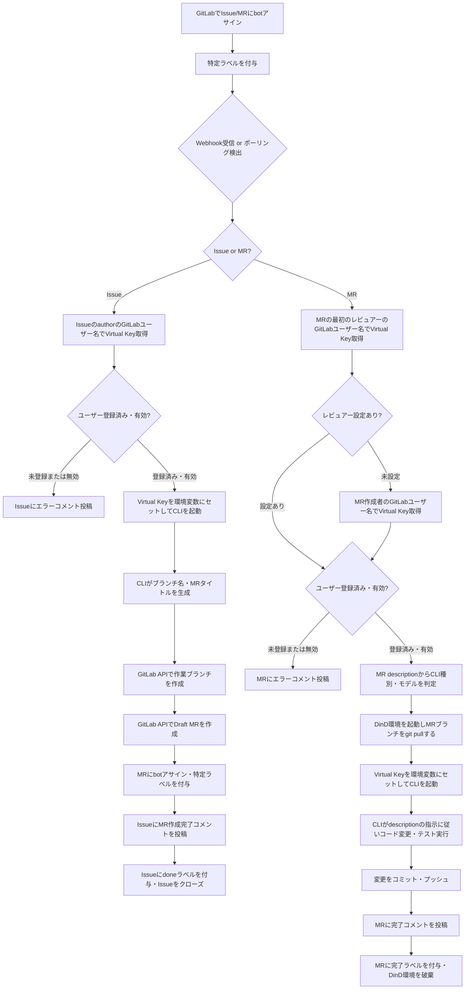
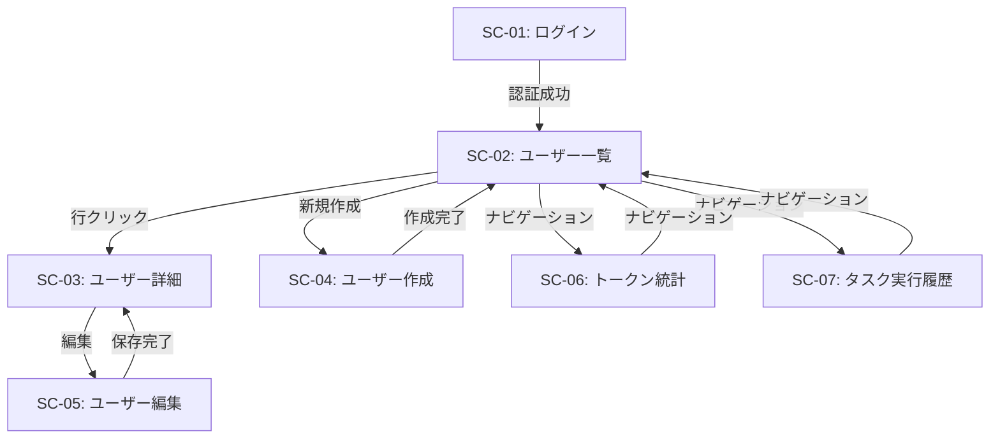
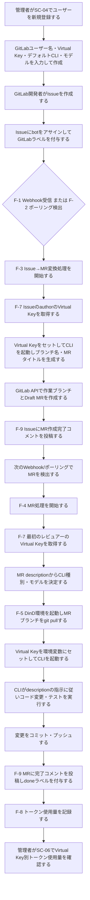
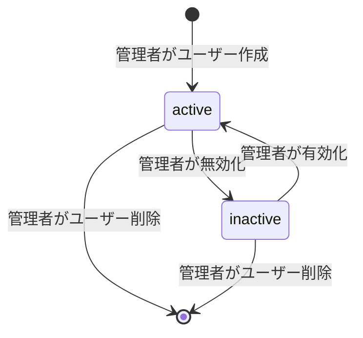
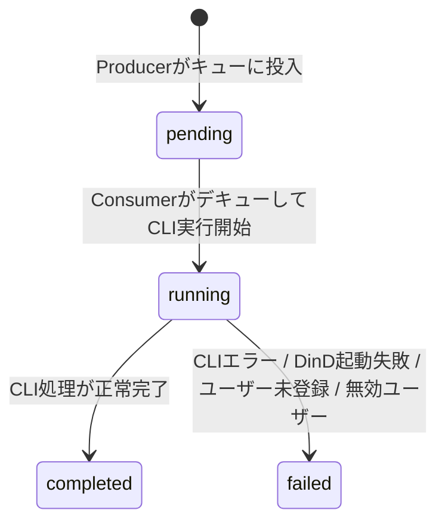

# GitLab自律コーディングエージェントシステム 要件定義書

---

## 1. 目的・前提

### 1.1 システム目的

GitLabのIssueおよびMerge Request（以下、MR）に対して、botアカウントのアサインと特定ラベルの付与を契機に、Claude CodeまたはopenCodeのCLIをコンテナ内で自動起動し、コード実装・テスト・コミットを自動実行するシステムを構築する。各処理に使用するLLMの費用はLiteLLM Virtual Keyでユーザーごとに按分管理する。

### 1.2 用語集

| 用語 | 説明 |
|---|---|
| bot | 本システムが操作に使用するGitLabアカウント。Personal Access Tokenで認証する |
| botアサイン | GitLabのIssue/MRのアサイニーとしてbotを指定する操作 |
| 特定ラベル | botの処理対象を示すGitLabラベル。デフォルト値は `coding agent` |
| 処理中ラベル | 処理中状態を示すGitLabラベル。デフォルト値は `coding agent processing` |
| 完了ラベル | 処理完了状態を示すGitLabラベル。デフォルト値は `coding agent done` |
| Issue処理 | 特定ラベル付きIssueを検出し、作業ブランチとDraft MRを自動作成する処理 |
| MR処理 | 特定ラベル付きMRを検出し、descriptionの指示に従ってCLIでコード作業を自動実行する処理 |
| LiteLLM Proxy | Azure OpenAI・AWS Bedrockなど複数のLLMバックエンドを統一エンドポイントで提供するプロキシサーバー |
| Virtual Key | LiteLLM Proxyが発行するユーザー別APIキー。費用追跡と按分に使用する |
| Claude Code | AnthropicのCLIコーディングエージェント |
| opencode | OSSのCLIコーディングエージェント |
| DinD（Docker-in-Docker） | コンテナ内でDockerデーモンを実行できる環境。CLIの作業環境として使用する |
| Producer | GitLabのIssue/MRを検出し、タスクキューに投入するコンポーネント |
| Consumer | タスクキューからタスクを取得してIssue処理またはMR処理を実行するコンポーネント |
| Webhook | GitLabがイベント発生時にHTTPリクエストを本システムへ送信する仕組み |
| ポーリング | 本システムがGitLab APIを定期的に呼び出してIssue/MRを検出する仕組み |
| username | GitLabユーザー名。本システムのユーザー識別子として同一値を使用する |

### 1.3 インターフェース形式

- 管理者向けユーザー管理・統計閲覧: GUI（Webブラウザ）
- GitLab連携（Webhook受信・ポーリング）: CUI（バックグラウンドプロセス）
- 初期管理者作成: CUI（コマンドライン）

---

## 2. 業務

### 2.1 対象業務一覧

| No. | 業務名 | 説明 |
|---|---|---|
| B-1 | Issue→MR変換処理 | botアサイン・特定ラベル付きIssueを検出し、作業ブランチとDraft MRを自動作成する |
| B-2 | MRコード実装処理 | botアサイン・特定ラベル付きMRを検出し、descriptionの指示に従ってCLIでコード作業を実行する |
| B-3 | ユーザー・Virtual Key管理 | 開発者ごとのGitLabユーザー名・Virtual Key・CLI設定をWeb管理画面で管理する |
| B-4 | 費用按分集計 | Virtual Key別のトークン使用量を記録・集計し、ユーザーごとのLLMコストを可視化する |

### 2.2 業務フロー

### 2.3 業務の範囲・担当者

| 担当者 | 役割 |
|---|---|
| GitLab開発者 | IssueおよびMRを作成し、botアサインと特定ラベルを付与する |
| システム管理者 | Web管理画面でユーザー登録・Virtual Key設定・統計確認を行う |
| botアカウント | Issue/MR検出・ブランチ作成・CLI実行・進捗コメント投稿を自動実行する |

### 2.4 業務課題・KPI

| 課題ID | 業務課題 | この課題がないと何が困るか | KPI |
|---|---|---|---|
| P-1 | コード実装タスクの手作業工数が大きく、リードタイムが長い | 開発者がコード実装に専念できず、タスク完了までの時間が長くなる | MR処理の自動完了率 70%以上 |
| P-2 | 複数開発者が同一LLM APIを共用すると費用の帰属が不明 | 誰がどれだけLLMを使ったか把握できず、コスト管理ができない | Virtual Key別の費用追跡率 100% |
| P-3 | Issue発生からブランチ・MR作成までの手作業コストがある | ブランチ命名・MR作成工数が発生し、実装着手までのタイムラグが生じる | Issue→MR自動変換率 100% |

### 2.5 解決すべき課題と対応方針

| 課題ID | 対応方針 |
|---|---|
| P-1 | botアサイン＋特定ラベルを検出したら、MR descriptionを指示としてCLIを自動起動してコード変更・テスト・プッシュを実行する |
| P-2 | ユーザーごとにLiteLLM Virtual Keyを登録し、CLI実行時に対象ユーザーのVirtual Keyを環境変数として渡す。LiteLLM ProxyがVirtual Key別に使用量を記録する |
| P-3 | 特定ラベル付きIssueを検出したら、CLIでブランチ名・MRタイトルを生成し、ブランチとMRを自動作成する |

### 2.6 システム化による見込み経営効果

| 効果種別 | 内容 |
|---|---|
| Soft Saving（人件費削減） | Issue発生後のブランチ作成・コード実装・テスト実行・コミットの手作業工数を削減 |
| Cost Avoidance | Virtual Keyによるユーザー別コスト追跡で、LLM費用超過の早期検知・予算超過防止が可能 |
| TCO Savings | 開発者がコードレビューや設計に専念でき、開発全体の生産性向上が見込まれる |

---

## 3. 機能要件

### 3.1 機能一覧

| 機能ID | 機能名 | 対応業務課題 | この機能がないと何が困るか |
|---|---|---|---|
| F-1 | Webhook受信 | P-1, P-3 | GitLabイベントをリアルタイムに検出できず処理が遅延する |
| F-2 | ポーリング | P-1, P-3 | Webhook受信失敗時やWebhook未設定環境で処理対象を検出できない |
| F-3 | Issue→MR変換 | P-3 | IssueからブランチとMRを手動で作成する工数が発生し続ける |
| F-4 | MR処理（CLI実行） | P-1 | MR descriptionの指示を自動実行できず手動実装が必要になる |
| F-5 | DinD実行環境管理 | P-1 | CLIがコード変更・テスト実行を行う隔離環境がなく、ホスト環境に影響が及ぶ |
| F-6 | ユーザー管理 | P-2 | GitLabユーザーとVirtual Keyを紐付けできず費用按分ができない |
| F-7 | Virtual Key管理 | P-2 | ユーザー別のLLM費用を追跡できずコスト管理が不可能になる |
| F-8 | トークン使用量記録・集計 | P-2 | LLM費用のユーザー別按分計算ができない |
| F-9 | 進捗報告（GitLabコメント） | P-1 | CLIの実行状況が開発者に見えず処理の成否が確認できない |
| F-10 | Web管理画面 | P-2 | ユーザー・Virtual Key設定とトークン使用量統計をGUIで管理できない |

### 3.2 入力データ

| データ | 種別 | 説明 |
|---|---|---|
| Webhookペイロード | 外部（GitLab） | Issue/MR作成・更新イベントのJSONデータ |
| GitLab APIレスポンス | 外部（GitLab） | ポーリング時のIssue/MR一覧・詳細データ |
| MR description | 外部（GitLab開発者） | CLIへの作業指示内容。CLI種別・モデル上書き指定を含む場合がある |
| 管理者入力（Web画面） | 人手 | ユーザー登録情報・Virtual Key・デフォルトCLI・デフォルトモデル |

### 3.3 出力データ

| データ | 出力先 | 説明 |
|---|---|---|
| 作業ブランチ | GitLab | Issue処理時にCLIが生成したブランチ名で自動作成 |
| Draft MR | GitLab | Issue処理時にCLIが生成したタイトルで自動作成 |
| GitLabコメント | GitLab | 処理進捗・完了・エラーの報告コメント |
| コミット・プッシュ | GitLab | MR処理時にCLIが実行したコード変更の結果 |
| GitLabラベル更新 | GitLab | 処理状態に応じたラベルの付与・変更 |
| トークン使用量レコード | PostgreSQL | タスクごとのVirtual Key別トークン使用量 |

### 3.4 外部連携

| 連携先 | 連携方式 | 用途 |
|---|---|---|
| GitLab | REST API | Issue/MR操作・ブランチ・コミット・コメント・ラベル管理 |
| GitLab | Webhook（受信） | Issue/MR更新イベントのリアルタイム受信 |
| LiteLLM Proxy | HTTP（OpenAI互換API） | Issue→MR変換時のCLI起動およびMR処理時のCLI起動。Virtual Keyで認証 |
| RabbitMQ | AMQP | Producer/Consumer間の非同期タスクキュー |

### 3.5 Web管理画面 一覧・仕様

| 画面ID | 画面名 | パス | アクセス権 |
|---|---|---|---|
| SC-01 | ログイン画面 | /login | なし（認証不要） |
| SC-02 | ユーザー一覧 | /users | 管理者のみ |
| SC-03 | ユーザー詳細 | /users/:username | 管理者のみ |
| SC-04 | ユーザー作成 | /users/new | 管理者のみ |
| SC-05 | ユーザー編集 | /users/:username/edit | 管理者のみ |
| SC-06 | トークン使用量統計 | /statistics/tokens | 管理者のみ |
| SC-07 | タスク実行履歴 | /tasks | 管理者のみ |

---

**SC-01 ログイン画面**

- 入力項目: ユーザー名（GitLabユーザー名）、パスワード
- 操作: ログインボタン
- 認証成功時: SC-02（ユーザー一覧）へ遷移
- 認証失敗時: エラーメッセージを表示し同画面に留まる

---

**SC-02 ユーザー一覧**

- 表示項目: ユーザー名、デフォルトCLI、デフォルトモデル、ステータス（有効/無効）、登録日時
- 検索: ユーザー名での前方一致絞り込み
- ページネーション: あり
- 操作: 新規作成ボタン（SC-04へ）、行クリックでユーザー詳細（SC-03へ）

---

**SC-03 ユーザー詳細**

- 表示項目: ユーザー名、Virtual Key（マスク表示。末尾4文字のみ表示）、デフォルトCLI、デフォルトモデル、ロール、ステータス、登録日時、最終更新日時、今月のトークン使用量合計
- 操作: 編集ボタン（SC-05へ）

---

**SC-04 ユーザー作成**

- 入力項目（全て必須）:
  - ユーザー名（GitLabユーザー名）
  - Virtual Key（LiteLLM Virtual Key）
  - デフォルトCLI（claude / opencode のいずれかを選択）
  - デフォルトモデル（モデル名を文字列で入力）
  - ロール（admin / user のいずれかを選択）
  - パスワード（8文字以上、英字大小・数字・記号を含む）
- バリデーション: ユーザー名重複チェック、パスワード強度検証
- 操作: 作成ボタン（成功時SC-02へ）、キャンセルボタン（SC-02へ）

---

**SC-05 ユーザー編集**

- 変更不可項目: ユーザー名（表示のみ）
- 変更可能項目:
  - Virtual Key（新しい値を入力した場合のみ更新。空欄の場合は変更なし）
  - デフォルトCLI
  - デフォルトモデル
  - ロール（admin / user）
  - ステータス（有効 / 無効）
- 操作: 保存ボタン（成功時SC-03へ）、キャンセルボタン（SC-03へ）

---

**SC-06 トークン使用量統計**

- フィルタ: 集計期間（日次 / 月次）、ユーザー名（全体または特定ユーザー）
- 表示項目: ユーザー別のpromptトークン数・completionトークン数・totalトークン数、モデル別内訳
- 操作: フィルタ適用ボタン

---

**SC-07 タスク実行履歴**

- フィルタ: ステータス（pending / running / completed / failed）、ユーザー名、タスク種別（issue / merge_request）
- 表示項目: タスクUUID、ユーザー名、タスク種別、ステータス、使用CLI、使用モデル、開始日時、完了日時、トークン使用量合計
- ページネーション: あり（1ページ20件）

---

### 3.6 画面遷移

### 3.7 CUI 引数仕様（環境変数一覧）

本システムはDockerコンテナとして起動し、すべての設定を環境変数で受け取る。

**コアコンポーネント共通（必須）**

| 環境変数名 | 説明 |
|---|---|
| GITLAB_PAT | GitLab bot用Personal Access Token |
| GITLAB_API_URL | GitLab APIのベースURL |
| GITLAB_BOT_NAME | botアカウントのGitLabユーザー名 |
| GITLAB_BOT_LABEL | 処理対象ラベル名（デフォルト: `coding agent`） |
| GITLAB_PROCESSING_LABEL | 処理中状態ラベル名（デフォルト: `coding agent processing`） |
| GITLAB_DONE_LABEL | 完了状態ラベル名（デフォルト: `coding agent done`） |
| LITELLM_PROXY_URL | LiteLLM ProxyのベースURL |
| DATABASE_URL | PostgreSQL接続文字列 |
| RABBITMQ_URL | RabbitMQ接続文字列 |
| ENCRYPTION_KEY | Virtual Key暗号化キー（AES-256-GCM） |
| JWT_SECRET_KEY | Web管理画面JWT署名キー |

**Webhookサーバー（追加）**

| 環境変数名 | 説明 |
|---|---|
| GITLAB_WEBHOOK_SECRET | GitLab Webhookペイロードの署名検証トークン |
| WEBHOOK_PORT | Webhookリッスンポート（デフォルト: 8000） |

**ポーリング設定（オプション）**

| 環境変数名 | 説明 |
|---|---|
| POLLING_INTERVAL_SECONDS | ポーリング間隔（秒）。デフォルト: 30 |

**初期管理者作成コマンド（CUI）**

初期管理者作成コマンドを以下のパラメータで実行する。パラメータは対話入力またはコマンドライン引数のどちらでも受け付ける。

| パラメータ名 | 説明 | 必須 |
|---|---|---|
| ユーザー名 | GitLabユーザー名。本システムの管理者ユーザー名として登録する | ○ |
| パスワード | 8文字以上、英字大小・数字・記号を含む | ○ |
| Virtual Key | LiteLLM Virtual Key | ○ |
| デフォルトCLI | claude または opencode | ○ |
| デフォルトモデル | 使用するLLMモデル名 | ○ |

### 3.8 ユーザー利用フロー（全機能）

### 3.9 業務フローと機能の対応関係

| 業務 | 使用機能 |
|---|---|
| B-1（Issue→MR変換） | F-1, F-2（検出）/ F-3（変換処理）/ F-7（Virtual Key取得）/ F-9（進捗報告） |
| B-2（MRコード実装） | F-1, F-2（検出）/ F-4（MR処理）/ F-5（DinD環境）/ F-7（Virtual Key取得）/ F-8（トークン記録）/ F-9（進捗報告） |
| B-3（ユーザー管理） | F-6（ユーザーCRUD）/ F-7（Virtual Key暗号化保存）/ F-10（Web管理画面） |
| B-4（費用按分） | F-8（トークン記録・集計）/ F-10（Web管理画面） |

### 3.10 ログ

**アプリケーション動作ログ（INFO / WARN / ERROR）**: 保存期間 90日

**タスク実行ログ（CLIの標準出力・エラー出力）**: タスクレコードに紐付けてPostgreSQLに保存。保存期間 90日

一般的な動作ログ・エラーログ以外に記録が必要な業務固有ログ:

| ログ種別 | 記録内容 |
|---|---|
| GitLab API呼び出しログ | 呼び出し成功・失敗・レートリミット発生の事実と対象Issue/MR番号 |
| Virtual Key解決ログ | 対象GitLabユーザー名・Virtual Key取得成否・失敗理由（未登録・無効等） |
| DinD環境ライフサイクルログ | 環境起動・ブランチチェックアウト完了・環境破棄のタイムスタンプとタスクUUID |

### 3.11 監視・アラート

| 監視対象 | 閾値 | アラート方法 |
|---|---|---|
| タスク失敗率 | 10%超過 | GitLabのIssueを自動作成して管理者へ通知 |
| タスクキュー長 | 100件超過 | GitLabのIssueを自動作成して管理者へ通知 |
| DinDコンテナのディスク使用率 | 80%超過 | GitLabのIssueを自動作成して管理者へ通知 |

---

## 4. データ

### 4.1 業務エンティティ一覧

| エンティティ | 説明 | 種別 |
|---|---|---|
| ユーザー | GitLabユーザー名・Virtual Key・CLI設定を管理する。マスタデータ | 内部 |
| タスク | Issue/MR処理の実行単位 | 内部 |
| トークン使用量 | Virtual Key別・タスク別のLLMトークン消費量 | 内部 |

### 4.2 エンティティCRUD表

| エンティティ | C | R | U | D | 一覧 | 詳細 | 検索 | 状態管理 |
|---|---|---|---|---|---|---|---|---|
| ユーザー | ○（管理者） | ○ | ○（管理者） | ○（管理者） | ○ | ○ | ○（ユーザー名） | active / inactive |
| タスク | ○（自動） | ○ | ○（自動） | × | ○ | ○ | ○（ユーザー名・ステータス・種別） | pending → running → completed / failed |
| トークン使用量 | ○（自動） | ○ | × | × | ○ | × | ○（ユーザー名・期間） | なし |

### 4.3 ユーザーエンティティ属性

| 属性 | 説明 | 必須 |
|---|---|---|
| username | GitLabユーザー名（= 本システムユーザー名）。主キー | ○ |
| virtual_key | LiteLLM Virtual Key（AES-256-GCM暗号化保存） | ○ |
| default_cli | デフォルトCLI（claude / opencode） | ○ |
| default_model | デフォルトで使用するLLMモデル名 | ○ |
| role | 権限ロール（admin / user） | ○ |
| is_active | 有効/無効フラグ（デフォルト: true） | ○ |
| password_hash | bcryptハッシュ化パスワード（Web管理画面ログイン用） | ○ |
| created_at | 登録日時 | ○ |
| updated_at | 最終更新日時 | ○ |

### 4.4 タスクエンティティ属性

| 属性 | 説明 | 必須 |
|---|---|---|
| task_uuid | タスク一意識別子 | ○ |
| task_type | タスク種別（issue / merge_request） | ○ |
| gitlab_project_id | GitLabプロジェクトID | ○ |
| source_iid | Issue IIDまたはMR IID | ○ |
| username | 実行対象ユーザー名（Virtual Key取得元） | ○ |
| status | ステータス（pending / running / completed / failed） | ○ |
| cli_type | 使用したCLI種別（claude / opencode） | |
| model | 使用したモデル名 | |
| cli_log | CLIの実行ログ（標準出力・エラー出力） | |
| error_message | エラー内容（失敗時のみ） | |
| created_at | タスク作成日時 | ○ |
| started_at | 処理開始日時 | |
| completed_at | 処理完了日時 | |

### 4.5 トークン使用量エンティティ属性

| 属性 | 説明 | 必須 |
|---|---|---|
| id | 主キー（自動採番） | ○ |
| task_uuid | 対応タスクUUID | ○ |
| username | ユーザー名 | ○ |
| prompt_tokens | 入力トークン数 | ○ |
| completion_tokens | 出力トークン数 | ○ |
| total_tokens | 合計トークン数 | ○ |
| model | 使用モデル名 | ○ |
| created_at | 記録日時 | ○ |

### 4.6 データ保持期間

| データ | 保持期間 |
|---|---|
| ユーザー | 削除操作まで無期限 |
| タスク | 1年 |
| トークン使用量 | 1年 |
| アプリケーションログ | 90日 |
| CLIログ（cli_log） | 90日（タスクレコードと同期して削除） |

### 4.7 外部DB接続先

| 接続先 | 種別 | 接続方式 |
|---|---|---|
| PostgreSQL | リレーショナルDB | DATABASE_URL環境変数による接続文字列 |
| RabbitMQ | メッセージキュー | RABBITMQ_URL環境変数によるAMQP接続 |

### 4.8 DBの必要性

- **PostgreSQL**: 必要。ユーザー情報・Virtual Key（暗号化）・タスク実行履歴・CLIログ・トークン使用量の永続管理に使用する。
- **RabbitMQ**: 必要。ProducerとConsumer間の非同期・分散タスクキューとして使用する。複数のConsumerによる並列処理のために必要。

---

## 5. 非機能要件

### 5.1 性能（応答時間）

| 処理 | 目標 |
|---|---|
| Webhook受信からキュー投入まで | 3秒以内 |
| Web管理画面の画面遷移 | 2秒以内 |
| ポーリング間隔 | 30秒（環境変数で変更可） |
| Issue→MR変換処理（全体） | 2分以内 |
| DinD環境起動・MRブランチチェックアウト完了まで | 3分以内 |

### 5.2 利用人数（同時接続）

| 対象 | 想定規模 |
|---|---|
| 同時処理タスク数 | 5〜10並列（Consumer数で設定） |
| Web管理画面同時接続 | 10ユーザー以下 |

### 5.3 セキュリティ

| 項目 | 対策 |
|---|---|
| Virtual Key保存 | AES-256-GCMで暗号化保存。復号はタスク実行直前のみ実施 |
| Webhook受信 | GITLAB_WEBHOOK_SECRETによるHMAC署名検証。不正リクエストは即時拒否 |
| Web管理画面認証 | JWT（HS256、有効期限24時間）によるBearerトークン認証 |
| パスワード保存 | bcrypt（コストファクタ12）でハッシュ化 |
| DinD環境のVirtual Key | タスク完了・失敗後にコンテナを即時破棄し、Virtual Keyを環境から消去 |
| GitLab PAT | 環境変数のみで管理し、DBには保存しない |

---

## 6. テスト用利用シナリオ

### 6.1 シナリオ一覧（全機能フロー網羅）

| シナリオID | テスト目的 | 前提条件 | テスト手順 | 期待される結果 |
|---|---|---|---|---|
| T-01 | 管理者が新規ユーザーを登録できる | 管理者アカウントでSC-01からログイン済み | SC-04でユーザー名・Virtual Key・デフォルトCLI（claude）・デフォルトモデル・パスワードを入力し「作成」を押す | ユーザーが登録され、SC-02（ユーザー一覧）に表示される |
| T-02 | 管理者がユーザーのVirtual Keyを更新できる | T-01完了 | SC-05でVirtual Keyを新しい値に変更して「保存」を押す | 変更がDBに反映される。次回タスク実行時に新しいVirtual Keyが使用される |
| T-03 | 管理者がデフォルトCLI・モデルを変更できる | T-01完了 | SC-05でデフォルトCLIをopencodeに、デフォルトモデルを変更して「保存」を押す | 変更がDBに反映される |
| T-04 | IssueをWebhookで検出してMR変換できる | T-01完了、GitLabにIssue存在、Webhook設定済み | GitLabでIssueにbotをアサイン＋特定ラベルを付与する | Webhookイベント受信後、Issue→MR変換処理が実行される。GitLabに作業ブランチとDraft MRが作成される。IssueにMR作成完了コメントが投稿され、Issueにdoneラベルが付与されクローズされる |
| T-05 | IssueをポーリングでMR変換できる | T-01完了、GitLabにIssue存在 | GitLabでIssueにbotをアサイン＋特定ラベルを付与する。ポーリング間隔（30秒）後に確認する | T-04と同様の結果が得られる |
| T-06 | MR変換後にbotアサイン・ラベルが引き継がれる | T-04またはT-05完了 | T-04/T-05で作成されたMRをGitLabで確認する | MRにbotアサインと特定ラベルが付与されている |
| T-07 | MRのCLI処理がdescriptionの指示通りに実行される | T-06完了、MR descriptionに作業指示あり | T-06のMRが次のWebhook/ポーリングで検出されるまで待つ | DinD環境が起動しMRブランチがチェックアウトされ、CLIが実行される。コード変更がコミット・プッシュされる。MRに完了コメントが投稿される。完了ラベルが付与される |
| T-08 | MR descriptionのCLI指定でデフォルトを上書きできる | T-01完了（デフォルトCLI: claude）、MRにbotアサイン・特定ラベルあり | MR descriptionの先頭にCLI種別（opencode）とモデルの上書き指定を記述する。Webhook/ポーリングを待つ | ユーザーのデフォルトCLI（claude）を無視して、descriptionで指定したCLI・モデルで処理が実行される |
| T-09 | MRレビュアーが未設定の場合はMR作成者のVirtual Keyが使われる | T-01完了、レビュアー未設定のMRが存在 | レビュアーを設定せずにMRにbotアサイン・特定ラベルを付与する | MR作成者（author）のVirtual Keyが使用されてCLIが実行される |
| T-10 | 未登録ユーザーのIssueは処理されない | GitLabに本システム未登録ユーザーが作成したIssueが存在 | 未登録ユーザーが作成したIssueにbotアサイン＋特定ラベルを付与する | 処理がスキップされ、IssueにユーザーなしエラーコメントがGitLabに投稿される |
| T-11 | botアサインのみでは処理されない（ラベルなし） | GitLabにIssueが存在 | Issueにbotをアサインするが特定ラベルは付与しない | 処理がスキップされる |
| T-12 | ラベルのみでは処理されない（botアサインなし） | GitLabにIssueが存在 | Issueに特定ラベルを付与するがbotはアサインしない | 処理がスキップされる |
| T-13 | 無効化ユーザーのIssueは処理されない | T-01完了後、SC-05でユーザーを「停止中」に変更済み | 停止中ユーザーが作成したIssueにbotアサイン＋特定ラベルを付与する | 処理がスキップされ、GitLabにエラーコメントが投稿される |
| T-14 | トークン使用量がユーザー別に記録される | T-07完了 | SC-06でT-07を実行したユーザー名でフィルタして確認する | そのユーザーのprompt/completion/totalトークン使用量が表示される |
| T-15 | 期間・ユーザーでトークン使用量を絞り込める | T-14完了 | SC-06で期間フィルタと特定ユーザーを選択して更新ボタンを押す | フィルタ条件に一致するトークン使用量のみが表示される |
| T-16 | タスク実行履歴を確認できる | T-07完了 | SC-07でステータスフィルタを「completed」に設定する | 完了タスクの一覧（タスクUUID・ユーザー名・CLI種別・完了日時）が表示される |
| T-17 | ユーザーを削除できる | T-01完了 | SC-03のユーザー詳細画面から削除操作を行う | ユーザーがDBから削除され、SC-02の一覧に表示されなくなる |
| T-18 | DinD環境でdocker-composeによるe2eテストが実行できる | T-07と同様の前提 | MR descriptionにdocker-composeを使ったe2eテスト実行を指示として記述する | CLIがdocker-composeでサービスを起動し、e2eテストを実行した結果がコミットに含まれ、MRにプッシュされる |

---

## 7. 要件網羅性チェック

### 7.1 機能カテゴリ網羅性

| カテゴリ | 対応機能 |
|---|---|
| 業務機能 | F-1（Webhook受信）、F-2（ポーリング）、F-3（Issue→MR変換）、F-4（MR処理）、F-5（DinD環境管理）、F-9（進捗報告） |
| マスタ管理 | F-6（ユーザーCRUD管理）、F-7（Virtual Key暗号化管理） |
| 共通（認証・認可・ログ） | JWT認証（SC-01）、ロールベースアクセス制御（admin / user）、アプリケーションログ（3.10節） |
| 運用 | F-8（トークン記録・集計）、F-10（Web管理画面） |
| 外部連携 | F-1（GitLab Webhook受信）、F-2（GitLab ポーリング）、LiteLLM Proxy連携（F-3, F-4） |

### 7.2 エンティティ状態遷移

**ユーザーの状態遷移**

**タスクの状態遷移**

### 7.3 削除可能な要件の検討と判定

| 要件 | 削除の可否 | 判定理由 |
|---|---|---|
| SC-02のダッシュボード表示 | **削除済み** | SC-06（トークン統計）とSC-07（タスク履歴）で業務課題P-1/P-2に対応できる。ログイン後の遷移先をSC-02（ユーザー一覧）に変更することでMVPを達成できる |
| SC-06のCSVエクスポート | **削除済み** | LiteLLM Proxy側の管理画面でも確認可能。P-2の最小達成はWeb画面での集計表示で十分 |
| SC-07のタスク詳細表示（モーダル等） | **削除済み** | タスク一覧の表示項目で十分。詳細ドリルダウンはMVPに不要 |
| CLIログの全件保存 | **維持** | エラー発生時の調査に必要。削除するとシステム障害時の原因特定ができなくなる |
| 処理中ラベルの管理 | **維持** | 二重処理防止に必須。削除すると同一Issue/MRが複数回処理される |
